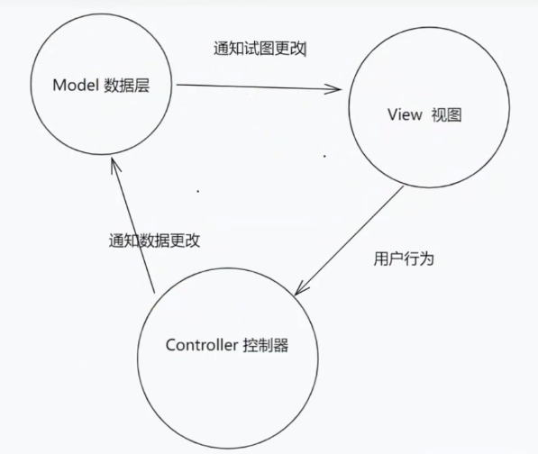

# 11-SPA 单页面应用

SPA 单页面应用

SPA：整个项目只有一个 html 文件，路由切换进行页面切换
优点

1. 用户体验及交互比较流畅
2. 提取组件开发，易于后期维护
3. 减轻服务器压力

缺点

1. 不利于 SEO 优化（搜索引擎优化知道 TDK title / description / keywords） 搜索引擎爬虫只会爬取 html.不会爬取 js
2. 第一次进入比较慢(已有按需加载策略)

### MVC

View 接受用户行为通知 Controller， Controller 通知 Model 进行数据更新
Model 通知 View 进行页面更新，
Model 和 View 进行了交互

缺点  前端 不够独立，没有自己的数据中心，必须等controller 创建好才能开发

## MVVM

前后端分离

参考 vue 的 MVVM 架构
[MVVM（Model-View-ViewModel）架构](../../vue/vue3/00-学习Vue3-介绍.md#MVVM（Model-View-ViewModel）架构)
