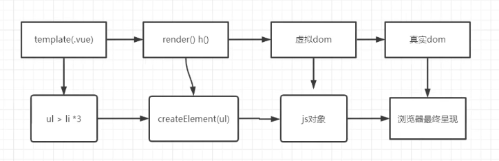

# 22-虚拟 DOM 详解

1. 虚拟 dom 是什么？
   1. vue2.x 才有虚拟 dom
   2. 本质 js 对象 => 跨平台
2. 虚拟 dom 在 vue 中做了什么？
   1. 将真实 dom 转化虚拟 dom (js 对象）
   2. 更新的时候做对比
3. 虚拟 dom 是如何提升 vue 的渲染效率的？
   1. 局部更新（节点数据）
   2. 将直接操作 dom 的地方拿到两个 js 对象之中去做比较

## vue 的两大核心

1. 组件化
2. 数据驱动

## vue 渲染

vue 渲染有两条线，上面是第一次渲染，下面一条是更新的路线



### 虚拟 dom 转向真实 dom

1.  初始化 patch(container, vnode)
2.  更新 update(vnode, newVnode)

```js
// 1. 初始化 patch(container, vnode)
function createElement(vnode) {
  let tag = vnode.tag; // 目标元素 ul
  let attrs = vnode.attrs || {}; //属性
  let children = vnode.children || {}; // 子节点

  if (!tag) {
    return null;
  }
  // 1. 创建对应的dom
  let elem = document.createElement(tag);
  let attrName;
  // 2. 给dom添加属性
  for (attrName in attrs) {
    if (attrs.hasOwnProperty(attName)) {
      elem.setAttribute(attrName, attrs[attrName]);
    }
  }
  // 3. 将子元素添加到目标之上
  children.forEach(function (childVnode) {
    elem.appendChild(createElement(childVnode));
  });
  return elem;
}

// 2. 更新 update(vnode, newVnode)
function updateChildren(vnode, newVnode) {
  let children = vnode.children || [];
  let newChildren = newVnode.children || [];
  children.forEach(function (childrenVnode, index) {
    // 循环的每一项
    let newChildrenVnode = newChildren[index];
    // 第一层没有变化
    if (childrenVnode.tag === newChildrenVnode.tag) {
      //深层次对比 => 递归
      updateChildren(childrenVnode, newChildrenVnode);
    } else {
      //两个tag不一样
      replaceNode(childrenVnode, newChildrenVnode);
    }
  });
}
function replaceNode(childrenVnode, newChildrenVnode) {
  //移除原来的元素
  childrenVnode = newChildrenVnode;
  createElement(childrenVnode);
}

```

## diff 算法

diff 算法详见 [vue3 diff 中最长递增子系列（对应索引）](../../vue/vue3/04-Vue核心虚拟Dom和diff算法.md#vue3%20diff%20中最长递增子系列（对应索引）)
