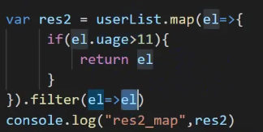

# 3-数组常用方法

## 数组常用方法 1

1. join
2. split
3. push 向数组的末尾添加一个或更多元素，并返回新的长度。
4. pop 删除数组的最后一个元素并返回删除的元素。
5. unshift 方法可向数组的开头添加一个或更多元素，并返回新的长度。
   1. 改变数组的数目。
6. shift 删除并返回数组的第一个元素。
7. reverse
8. sort
9. concat 方法用于连接两个或多个数组。该方法不会改变现有的数组，而是返回一个新的数组。
10. splice 用于添加或删除数组中的元素。
    1. 会改变原数组
    2. 删除元素，则返回一个元素的数组。 如果未删除任何元素，则返回空数组。第 1 个参数指定起始位置，第 2 个参数指定长度
    3. 要添加到数组的新元素 第 3 个参数
11. slice 可从已有的数组中返回选定的元素
    1. slice() 方法不会改变原始数组。
    2. 第 1 个参数起始，第 2 个参数结束位置

## 遍历数组

都是接受一个 箭头函数 作为参数 ，数组中的每个元素都会执行这个函数

函数参数:
参数 描述
currentValue 必须。当前元素的值
index 可选。当前元素的索引值
arr 可选。当前元素属于的数组对象

1. forEach 为数组里面每一项进行操作
   1. 没有返回值并不会被打破，
2. map 对数组的每一项进行操作，并返回一个新数组， 新数组为 map 的 return 结果
   1. 没有 return 的元素，会返回 undefined
3. filter 循环过滤符合条件的数组，返回一个新数组
   1. return 为 true 的时候该元素被返回
4. find 查找符合条件的元素返回，只会返回符合条件的第一个
5. findIndex 查找符合条件的元素返回，只会返回符合条件的第一个元素的下标
6. some 有真则真 返回布尔
7. every 有假则假 返回布尔
8. reduce 遍历

### map 和 filter 结合



### reduce()

reduce() 方法接收一个函数作为累加器，数组中的每个值（从左到右）开始缩减，最终计算为一个值。

```js
// reduce 累加
var arr = [1,2,3,4,5,6]
var res = arr.reduce((p,n)=>p+n) //21
```

1.  reduce() 可以作为一个高阶函数，用于函数的 compose
2.  **注意:** reduce() 对于空数组是不会执行回调函数的。
