# Mybatis-9.28.2019

 [B 站视频](https://www.bilibili.com/video/BV1NE411Q7Nx)

环境：

- JDK1.8
- Mysql 5.7
- maven 3.6.1
- IDEA

回顾：

- JDBC
- Mysql
- Java 基础
- Maven
- Junit

框架：配置文件的。最好的方式：看官网文档；

# 1、简介

### 1.1、什么是 MyBatis？


- MyBatis 是一款优秀的**持久层框架**
- 它支持自定义 SQL、存储过程以及高级映射。
- MyBatis 免除了几乎所有的 JDBC 代码以及设置参数和获取结果集的工作。
- MyBatis 可以通过简单的 XML 或注解来配置和映射原始类型、接口和 Java POJO（Plain Old Java Objects，普通老式 Java 对象）为数据库中的记录。
- MyBatis 本是 apache 的一个 [开源项目](https://baike.baidu.com/item/开源项目/3406069) iBatis,
  2010 年这个 [项目](https://baike.baidu.com/item/项目/477803) 由 apache software foundation
  迁移到了 [google code](https://baike.baidu.com/item/google%20code/2346604)，并且改名为 MyBatis 。
- 2013 年 11 月迁移到 [Github](https://baike.baidu.com/item/Github/10145341) 。

如何获得 Mybatis？

- maven 仓库

  ```java
  <!-- https://mvnrepository.com/artifact/org.mybatis/mybatis -->
  <dependency>
      <groupId>org.mybatis</groupId>
      <artifactId>mybatis</artifactId>
      <version>3.5.2</version>
  </dependency>
  ```

- GitHub：https://github.com/mybatis/mybatis-3/releases

- 中文文档： https://mybatis.org/mybatis-3/zh/index.html

### 1.2、持久化

数据持久化

- 持久化就是将程序的数据在持久状态和瞬时状态转化的过程
- 内存：**断电即失**
- 数据库 (jdbc)，io 文件持久化。
- 生活：冷藏。罐头。

**为什么需要需要持久化？**

- 有一些对象，不能让他丢掉。
- 内存太贵了

### 1.3、持久层

Dao 层，Service 层，Controller 层。…

- 完成持久化工作的代码块
- 层界限十分明显。

### 1.4 为什么需要 Mybatis？

- 帮助程序猿将数据存入到数据库中。
- 方便
- 传统 JDBC 代码太复杂了。简化。框架。自动化。
- 不用 Mybatis 也可以。更容易上手。技术没有高低之分
- 优点：
    - 简单易学
    - 灵活
    - sql 和代码的分离，提高了可维护性。
    - 提供映射标签，支持对象与数据库的 orm 字段关系映射
    - 提供对象关系映射标签，支持对象关系组建维护
    - 提供 xml 标签，支持编写动态 sql。

**最重要的一点：使用的人多！**

# 2、第一个 Mybatis 程序

### 2.1、搭建环境

```mysql
CREATE DATABASE `mybatis`;

USE `mybatis`;

CREATE TABLE `user`
(
    `id`   INT(20) NOT NULL PRIMARY KEY,
    `name` VARCHAR(30) DEFAULT NULL,
    `pwd`  VARCHAR(30) DEFAULT NULL
) ENGINE = INNODB
  DEFAULT CHARSET = utf8;

INSERT INTO `user` (`id`, `name`, `pwd`)
VALUES (1, '狂神', '123456'),
       (2, '张三', '123456'),
       (3, '李四', '123486')
;
```

### 2.2、创建一个模块

- 编写 mybatis 的核心配置文件，mybatis-config.xml

```xml
<?xml version="1.0" encoding="UTF-8" ?>
<!DOCTYPE configuration
        PUBLIC "-//mybatis.org//DTD Config 3.0//EN"
        "http://mybatis.org/dtd/mybatis-3-config.dtd">
<configuration>
    <environments default="development">
        <environment id="development">
            <transactionManager type="JDBC"/>
            <dataSource type="POOLED">
                <property name="driver" value="${driver}"/>
                <property name="url" value="${url}"/>
                <property name="username" value="${username}"/>
                <property name="password" value="${password}"/>
            </dataSource>
        </environment>
    </environments>
    <mappers>
        <mapper resource="org/mybatis/example/BlogMapper.xml"/>
    </mappers>
</configuration>
```

- 编写 mybatis 工具类

```java
//工具类 sqlSessionFactory --> sqlSession
public class MybatisUtils {
    private static SqlSessionFactory sqlSessionFactory;

    static {
        try {
            //使用 Mybatis 第一步：获取 sqlSessionFactory 对象
            String resource = "mybatis-config.xml";
            InputStream inputStream = Resources.getResourceAsStream(resource);
            sqlSessionFactory = new SqlSessionFactoryBuilder().build(inputStream);
        } catch (IOException e) {
            e.printStackTrace();
        }
    }

    //既然有了 SqlSessionFactory，顾名思义，我们可以从中获得 SqlSession 的实例。
    // SqlSession 提供了在数据库执行 SQL 命令所需的所有方法。你可以通过 SqlSession 实例来直接执行已映射的 SQL 语句。例如：
    public static SqlSession getSqlSession() {
        return sqlSessionFactory.openSession();
    }
}
```

### 2.3、编写代码

- 实体类

  ```java
  public class User {
      private int id;
      private String name;
      private String pwd;
      
      public User(){
      }
      public User(int id, String name, String pwd) {
          this.id = id;
          this.name = name;
          this.pwd = pwd;
      }
  
      public int getId() {
          return id;
      }
  
      public void setId(int id) {
          this.id = id;
      }
  
      public String getName() {
          return name;
      }
  
      public void setName(String name) {
          this.name = name;
      }
  
      public String getPwd() {
          return pwd;
      }
  
      public void setPwd(String pwd) {
          this.pwd = pwd;
      }
  
      @Override
      public String toString() {
          return "User{" +
                  "id=" + id +
                  ", name='" + name + '\'' +
                  ", pwd='" + pwd + '\'' +
                  '}';
      }
  }
  ```

- Dao 接口

  ```java
  public interface UserDao {
      List<User> getUserList();
  }
  ```

- 接口实现类由原来的 UserDaoImpl 转变为一个 Mapper 配置文件

  ```xml
  <?xml version="1.0" encoding="UTF-8" ?>
  <!DOCTYPE mapper
          PUBLIC "-//mybatis.org//DTD Mapper 3.0//EN"
          "http://mybatis.org/dtd/mybatis-3-mapper.dtd">
  <!--namespace=绑定一个对应的 Dao/Mapper 接口-->
  <mapper namespace="com.kuang.dao.UserDao">
      <!--select 查询语句，resultType 写全名-->
      <select id="getUserList" resultType="com.kuang.pojo.User">
          select * from mybatis.user
      </select>
  </mapper>
  ```

### 2.4、测试

注意点：

org.apache.ibatis.binding.BindingException: Type interface com.kuang.dao.UserDao is not known to the MapperRegistry.

MapperRegistry 未注册

Could not find resource com/kaung/dao/UserMapper.xml

在 build 中配置 resources，来防止我们资源导出失败的问题

```xml
<build>
    <resources>
        <resource>
            <directory>src/main/resources</directory>
            <includes>
                <include>**/*.properties</include>
                <include>**/*.xml</include>
            </includes>
        </resource>
        <resource>
            <directory>src/main/java</directory>
            <includes>
                <include>**/*.properties</include>
                <include>**/*.xml</include>
            </includes>
            <filtering>true</filtering>
        </resource>
    </resources>
</build>
```

**MapperRegistry 是什么？**

核心配置文件中注册 mappers

- Junit 测试

  ```java
  @Test
  public void test() {
      //第一步：获取 SqlSession 对象
      SqlSession sqlSession = MybatisUtils.getSqlSession();
      //执行 SQL
      UserDao userDao = sqlSession.getMapper(UserDao.class);
      List<User> userList = userDao.getUserList();
  
      for (User user : userList) {
          System.out.println(user);
      }
      //关闭 SqlSession
      sqlSession.close();
  }
  ```

你们可以能会遇到的问题：

1.  配置文件没有注册
2.  绑定接口错误。
3.  方法名不对
4.  返回类型不对
5.  Maven 导出资源问题

# 3、CURD

### 3.1、namespace

命名空间

namespace 中的包名要和 Dao/mapper 接口的包名一致！

### 3.2、select

选择，查询语句；

- id：就是对应的 namespace 中的方法名；
- resultType：Sql 语句执行的返回值！
- parameterType：参数类型！

1.  编写接口

   ```java
   //根据 ID 查询用户
   User getUserById(int id);
   ```

2.  编写对应的 mapper 中的 sql 语句

   ```xml
   <select id="getUserById" parameterType="int" resultType="com.kuang.pojo.User">
           select * from mybatis.user where id = #{id}
   </select>
   ```

3.  测试

   ```java
   @Test
   public void getUserById() {
       SqlSession sqlSession = MybatisUtils.getSqlSession();
       UserMapper userMapper = sqlSession.getMapper(UserMapper.class);
       User userById = userMapper.getUserById(1);
       System.out.println(userById);
       sqlSession.close();
   }
   ```

### 3.3、Insert

```xml
<!--对象中的属性，可以直接取出来-->
<insert id="addUser" parameterType="com.kuang.pojo.User">
    insert into mybatis.user (id, name, pwd)
    values (#{id}, #{name}, #{pwd})
</insert>
```

### 3.4、Update

```xml
<update id="updateUser" parameterType="com.kuang.pojo.User">
    update mybatis.user
    set name=#{name },
    pwd=#{pwd}
    where id = #{id};
</update>
```

### 3.5、Delete

```xml
<delete id="deleteUser" parameterType="int">
    delete
    from mybatis.user
    where id = #{id};
</delete>
```

注意点：

- 增删改查需要提交事务

### 3.6、分析错误

- 标签不要匹配错
- resource 绑定 mapper，需要使用路径
- 程序配置文件必须符合规范！
- NullPointerException，没有注册到资源
- 输出的 xml 文件中存在中文乱码问题！
- maven 资源没有导出问题

### 3.7、万能 Map

假设，我们的实体类，或者数据库中的表，字段或者参数过多，我们应当考虑使用 Map！

```java
//万能的 Map
int addUser2(Map<String, Object> map);
```

```xml
<!--对象中的属性，可以直接取出来  传递 map 的 key-->
<insert id="addUser2" parameterType="map">
    insert into mybatis.user (id, name, pwd)
    values (#{userId}, #{userName}, #{passWord});
</insert>
```

```java
@Test
public void addUser2() {
    SqlSession sqlSession = MybatisUtils.getSqlSession();
    UserMapper mapper = sqlSession.getMapper(UserMapper.class);

    HashMap<String, Object> map = new HashMap<>();
    map.put("userId", 6);
    map.put("userName", "Hello");
    map.put("passWord", "222333");

    int res = mapper.addUser2(map);
    if (res > 0) {
        System.out.println("插入成功！");
    }

    sqlSession.commit();
    sqlSession.close();
}
```

Map 传递参数，直接在 sql 中取出 key 即可！【parameterType="map"】

对象传递参数，直接在 sql 中取对象的属性即可！【parameterType="Object"】

只有一个基本类型参数的情况下，可以直接在 sql 中取到！【直接省略】

```xml
<select id="getUserById" resultType="com.kuang.pojo.User">
    select * from mybatis.user where id = #{id};
</select>
```

多个参数用 Map，**或者注解！**

### 3.8、思考题

模糊查询怎么写？

1.  Java 代码执行的时候，传递通配符%%

   ```java
   List<User> updateUserLike = userMapper.getUserLike("%李%");
   ```

2.  在 sql 拼接中使用通配符！

    ```sql
    select * from mybatis.user where name like "%"#{value}"%";
    ```

# 4、配置解析

### 4.1、核心配置文件（configuration）

mybatis-config.xml

MyBatis 的配置文件包含了会深深影响 MyBatis 行为的设置和属性信息。

    ```xml
    configuration（配置）
    properties（属性）
    settings（设置）
    typeAliases（类型别名）
    typeHandlers（类型处理器）
    objectFactory（对象工厂）
    plugins（插件）
    environments（环境配置）
    environment（环境变量）
    transactionManager（事务管理器）
    dataSource（数据源）
    databaseIdProvider（数据库厂商标识）
    mappers（映射器）
    ```

### 4.2、环境配置（environments）

MyBatis 可以配置成适应多种环境，**不过要记住：尽管可以配置多个环境，但每个 SqlSessionFactory 实例只能选择一种环境。**

**事务管理器（transactionManager）**

在 MyBatis 中有两种类型的事务管理器（也就是 type="[JDBC|MANAGED]"）

只要知道事务管理器不是只有一种就行

>  如果你正在使用 Spring + MyBatis，则没有必要配置事务管理器，因为 Spring 模块会使用自带的管理器来覆盖前面的配置。

**数据源（dataSource）**

> 连接数据库 dbcp    c3p0    druid

dataSource 元素使用标准的 JDBC 数据源接口来配置 JDBC 连接对象的资源。

- 大多数 MyBatis 应用程序会按示例中的例子来配置数据源。虽然数据源配置是可选的，但如果要启用延迟加载特性，就必须配置数据源。

有三种内建的数据源类型（也就是 type="[UNPOOLED|POOLED|JNDI]"）：

> pooled 池：用完可以回收。不用池可以降低 数据库连接可用性要求

> JNDI 即 Java Naming and Directory Interface（JAVA 命名和目录接口），那么 java 命名目的就是为了记录一些不方便记录的内容，就像人的名字或 DNS 中的域名与 IP 的关系。

### 4.3、属性（properties）

我们可以通过 properties 属性来实现引用配置文件

这些属性可以在外部进行配置，并可以进行动态替换。你既可以在典型的 Java 属性文件中配置这些属性，也可以在 properties 元素的子元素中设置。【db.properties】

> 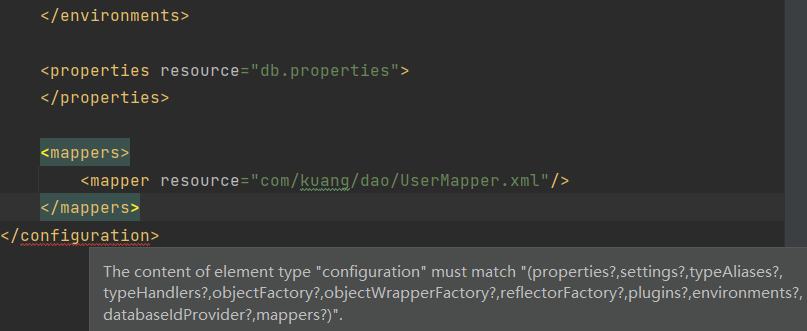
在 xml 中，所有的标签都可以规定其顺序

编写一个配置文件

db.properties

```properties
driver=com.mysql.jdbc.Driver
url=jdbc:mysql://localhost:3306/mybatis?usessL=true&useUnicode=true&characterEncoding=UTF-8
username=root
password=123456
```
在核心配置文件中引入
```xml
<!--引入外部配置文件-->
<properties resource="db.properties">
    <property name="username" value="hu_remote"/>
    <property name="pwd" value="123456"/>
</properties>
```

- 可以直接引入外部文件
- 可以在其中增加一些属性配置
- 如果两个文件有同一个字段，优先使用外部配置文件的！

### 4.4、类型别名（typeAliases）

- 类型别名可为 Java 类型设置一个缩写名字。
- 它仅用于 XML 配置，意在降低冗余的全限定类名书写。

```xml
<!--可以实体取别名-->
<typeAliases>
    <typeAlias type="com.kuang.pojo.User" alias="User"/>
</typeAliases>
```

也可以指定一个包名，MyBatis 会在包名下面搜索需要的 Java Bean，比如：

扫描实体类的包吗，默认会使用 Bean 的**首字母小写**的非限定类名来作为它的别名，

```xml
<!--可以实体取别名-->
<typeAliases>
    <package name="com.kuang.pojo"/>
</typeAliases>
```

若有注解，则别名为其注解值。

```java
@Alias("author")
public class Author {
    ...
}
```

在实体类比较少的时候，使用第一种方式。

如果实体类十分多，建议使用第二种。

第一种可以 DIY 别名，第二种则·不行，如果非要改，需要在实体上增加注解

下面是一些为常见的 Java 类型内建的类型别名：

| 别名  | 映射的类型 |
| ----- | ---------- |
| _byte | byte       |
| _int  | int        |
| int   | Integer    |
| map   | Map        |

基本类型前面加 _int 表示基本类型，int 表示包装类型

### 4.5、设置（settings）

这是 MyBatis 中极为重要的调整设置，它们会改变 MyBatis 的运行时行为。 下表描述了设置中各项设置的含义、默认值等。

| 设置名                   | 描述                                                                                                                                                  | 有效值                                                                                                             | 默认值 |
| :----------------------- | :---------------------------------------------------------------------------------------------------------------------------------------------------- | :----------------------------------------------------------------------------------------------------------------- | :----- |
| cacheEnabled             | 全局性地开启或关闭所有映射器配置文件中已配置的任何缓存。                                                                                              | true \| false                                                                                                      | true   |
| lazyLoadingEnabled       | 延迟加载的全局开关。当开启时，所有关联对象都会延迟加载。 特定关联关系中可通过设置 `fetchType` 属性来覆盖该项的开关状态。                              | true \| false                                                                                                      | false  |
| useGeneratedKeys         | 允许 JDBC 支持自动生成主键，需要数据库驱动支持。如果设置为 true，将强制使用自动生成主键。尽管一些数据库驱动不支持此特性，但仍可正常工作（如 Derby）。 | true \| false                                                                                                      | False  |
| logImpl                  | 指定 MyBatis 所用日志的具体实现，未指定时将自动查找。                                                                                                 | SLF4J \| LOG4J(deprecated since 3.5.9) \| LOG4J2 \| JDK_LOGGING \| COMMONS_LOGGING \| STDOUT_LOGGING \| NO_LOGGING | 未设置 |
| mapUnderscoreToCamelCase | 是否开启驼峰命名自动映射，即从经典数据库列名 A_COLUMN 映射到经典 Java 属性名 aColumn。                                                                | true \| false                                                                                                      | False  |

> 2021 年 12 月初 爆发 log4j2 Jndi RCE CVE-2021-44228 漏洞，阿里云发现阿帕奇（Apache）Log4j2 组件严重安全漏洞隐患后，未及时向电信主管部门报告，未有效支撑工信部开展网络安全威胁和漏洞管理，经研究，工信部网络安全管理局决定暂停阿里云作为工信部网络安全威胁信息共享平台合作单位 6 个月。

### 4.6、其他配置

- [typeHandlers（类型处理器）](https://mybatis.org/mybatis-3/zh/configuration.html#typeHandlers)
- [objectFactory（对象工厂）](https://mybatis.org/mybatis-3/zh/configuration.html#objectFactory)
- [plugins（插件）](https://mybatis.org/mybatis-3/zh/configuration.html#plugins)
  - mybatis-generator-core
  - mybatis-plus
  - 通用 mapper

### 4.7、映射器（mappers）

MapperRegistry：注册绑定我们的 Mapper 文件；

方式一：【推荐使用】

```xml
<!--每一个 Mapper.XML 都需要在 Mybatis 核心配置文件中注册！-->
<mappers>
    <mapper resource="com/kuang/dao/UserMapper.xml"/>
</mappers>
```

方式二：使用 class 文件绑定注册

```xml
<!--每一个 Mapper.XML 都需要在 Mybatis 核心配置文件中注册！-->
<mappers>
    <mapper class="com.kuang.dao.UserMapper"/>
</mappers>
```

注意点：

- 接口和他的 Mapper 配置文件必须同名！
- 接口和他的 Mapper 配置文件必须在同一个包下！

方式三：使用扫描包进行注入绑定

```xml
<mappers>
    <package name="com.kuang.dao"/>
</mappers>
```

注意点：

- 接口和他的 Mapper 配置文件必须同名！
- 接口和他的 Mapper 配置文件必须在同一个包下！

练习时间：

- 将数据库配置文件外部引入
- 实体类别名
- 保证 UserMapper 接口和 UserMapper.xml 改为一致！并且放在同一个包下！

### 4.8、作用域（Scope）和生命周期

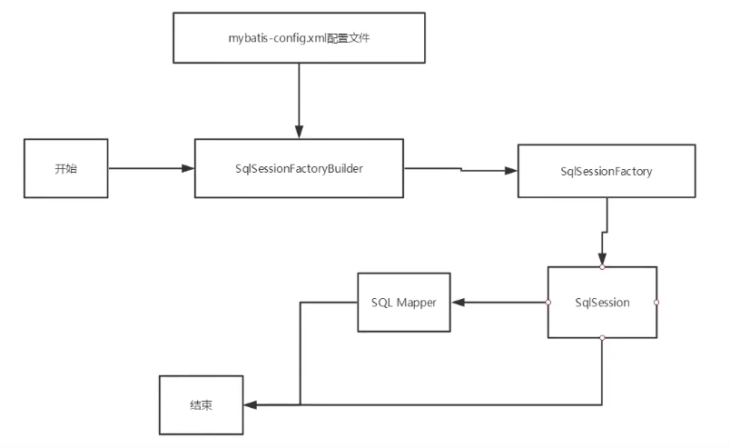

生命周期，和作用域，是至关重要的，因为错误的使用会导致非常严重的**并发问题**。

**SqlSessionFactoryBuilder：**

- 一旦创建了 SqlSessionFactory ，就不再需要它了
- 局部变量

**SqlSessionFactory：**

- 说白了就是可以想象为：数据库连接池
- SqlSessionFactory 一旦被创建就应该在应用的运行期间一直存在，**没有任何理由丢弃它或重新创建另一个实例。**
- SqlSessionFactory 的最佳作用域是应用作用域。
- 最简单的就是使用单例模式或者静态单例模式。

**SqlSession：**

- 连接到连接池的一个请求！每个每个线程都应该有它自己的 SqlSession 实例。
- SqlSession 的实例不是线程安全的，因此是不能被共享的，所以它的最佳的作用域是请求或方法作用域。
- 用完之后需要赶紧关闭，否则资源被占用！

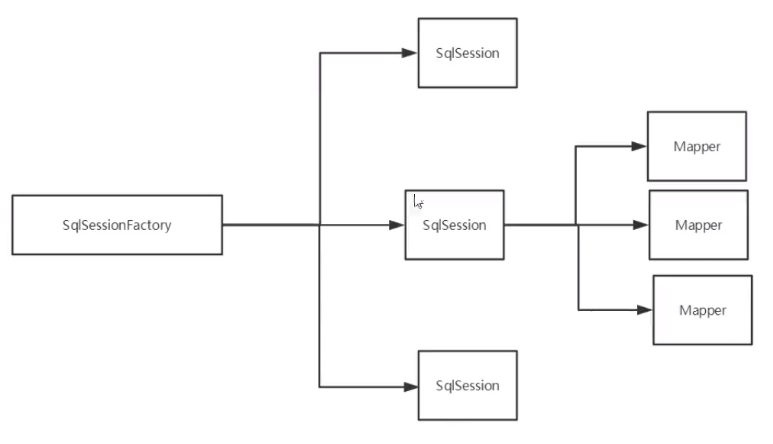

这里的每一个 Mapper，就代表一个具体的业务

# 5、解决属性名和字段名不一致的问题

### 5.1、问题

数据库中的字段

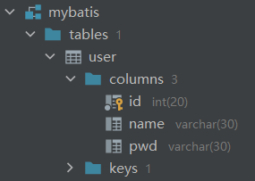

新建一个项目，拷贝之前的，测试实体类字段不一致的情况

```java
public class User {
    
    private int id;
    private String name;
    private String password;
}
```

测试出现问题

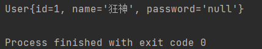

```java
//    select * from mybatis.user where id = #{id};
//类型处理器
//    select id,name,pwd  from mybatis.user where id = #{id};
```

解决方法：

- 起别名
    ```java
    //    select * from mybatis.user where id = #{id};
    //类型处理器
    //    select id,name,pwd as password from mybatis.user where id = #{id};
    ```

### 5.2、resultMap

结果集映射

```java
id    name    pwd
id    name    password
```

```xml
<!--结果集映射-->
<resultMap id="UserMap" type="User">
    <!--column 数据库中的字段，property 实体类中的属性-->
    <result column="id" property="id"/>
    <result column="name" property="name"/>
    <result column="pwd" property="password"/>
</resultMap>

<select id="getUserById" parameterType="int" resultMap="UserMap">
    select *
    from mybatis.user
    where id = #{id};
</select>
```

- `resultMap` 元素是 MyBatis 中最重要最强大的元素。
- ResultMap 的设计思想是，对简单的语句做到零配置，对于复杂一点的语句，只需要描述语句之间的关系就行了。
- `ResultMap` 的优秀之处——你完全可以不用显式地配置它们
- 如果这个世界总是这么简单就好了。

# 6、日志

### 6.1、日志工厂

如果一个数据库操作，出现了异常，我们需要排错。日志就是最好的助手！

曾经：sout、debug

现在：日志工厂！

| logImpl | 指定 MyBatis 所用日志的具体实现，未指定时将自动查找。 | SLF4J \| LOG4J(deprecated since 3.5.9) \| LOG4J2 \| JDK_LOGGING \| COMMONS_LOGGING \| STDOUT_LOGGING \| NO_LOGGING |
| ------- | ----------------------------------------------------- | ------------------------------------------------------------------------------------------------------------------ |

- SLF4J
- LOG4J  【掌握】
- LOG4J2
- JDK_LOGGING
- COMMONS_LOGGING
- STDOUT_LOGGING  【掌握】
- NO_LOGGING

在 Mybatis 中具体使用哪个日志实现，在设置中设定！

**STDOUT_LOGGING 标准日志输出**

在 `mybatis-config.xml` 核心配置文件中，配置我们的日志！

```xml
<settings>
    <!--标准的日志工厂实现-->
    <setting name="logImpl" value="STDOUT_LOGGING"/>
</settings>
```

日志输出样例：

```shell
Opening JDBC Connection
Created connection 733943822.
Setting autocommit to false on JDBC Connection [com.mysql.cj.jdbc.ConnectionImpl@2bbf180e]
==>  Preparing: select * from mybatis.user where id = ?;
==> Parameters: 1(Integer)
<==    Columns: id, name, pwd
<==        Row: 1, 狂神，123456
<==      Total: 1
User{id=1, name='狂神', password='123456'}
Resetting autocommit to true on JDBC Connection [com.mysql.cj.jdbc.ConnectionImpl@2bbf180e]
Closing JDBC Connection [com.mysql.cj.jdbc.ConnectionImpl@2bbf180e]
Returned connection 733943822 to pool.
```

### 6.2、Log4j

什么是 Log4j？

- Log4j 是 Apache 的一个开源项目，通过使用 Log4j，我们可以控制日志信息输送的目的地是控制台、文件、GUI 组件
- 可以控制每一条日志的输出格式
- 通过定义每一条日志信息的级别，我们能够更加细致地控制日志的生成过程
- 通过一个 [配置文件](https://baike.baidu.com/item/配置文件/286550) 来灵活地进行配置，而不需要修改应用的代码。

1.  先导入 log4j 的包

   ```xml
   <!-- https://mvnrepository.com/artifact/log4j/log4j -->
   <dependency>
       <groupId>log4j</groupId>
       <artifactId>log4j</artifactId>
       <version>1.2.17</version>
   </dependency>
   ```

2.  log4j.properties

   ```properties
   #将等级为 DEBUG 的日志信息输出到 console 和 file 这两个目的地，console 和 file 的定义在下面的代码
   log4j.rootLogger=DEBUG,console,file
   #控制台输出的相关设置
   log4j.appender.console=org.apache.log4j.ConsoleAppender
   log4j.appender.console.Target=System.out
   log4j.appender.console.Threshold=DEBUG
   log4j.appender.console.layout=org.apache.log4j.PatternLayout
   log4j.appender.console.layout.ConversionPattern=[%c]-%m%n
   #文件输出的相关设置
   log4j.appender.file=org.apache.log4j.RollingFileAppender
   log4j.appender.file.File=./log/kuang.log
   log4j.appender.file.MaxFileSize=10mb
   log4j.appender.file.Threshold=DEBUG
   log4j.appender.file.layout=org.apache.log4j.PatternLayout
   log4j.appender.file.layout.ConversionPattern=[%p][%d{yy-MM-dd}][%c]%m%n
   #日志输出级别
   log4j.logger.org.mybatis=DEBUG
   log4j.logger.java.sql=DEBUG
   log4j.logger.java.sql.Statement=DEBUG
   log4j.logger.java.sql.ResultSet=DEBUG
   log4j.logger.java.sql.PreparedStatement=DEBUG
   ```

3.  配置 log4j 为日志实现

   ```xml
   <settings>
       <setting name="logImpl" value="LOG4J"/>
   </settings>
   ```

4.  Log4j 的使用！，直接测试运行刚才的查询

   ```shell
   [org.apache.ibatis.logging.LogFactory]-Logging initialized using 'class org.apache.ibatis.logging.log4j.Log4jImpl' adapter.
   
   [org.apache.ibatis.transaction.jdbc.JdbcTransaction]-Opening JDBC Connection
   [org.apache.ibatis.datasource.pooled.PooledDataSource]-Created connection 2114684409.
   [org.apache.ibatis.transaction.jdbc.JdbcTransaction]-Setting autocommit to false on JDBC Connection [com.mysql.cj.jdbc.ConnectionImpl@7e0b85f9]
   [com.kuang.dao.UserMapper.getUserById]-==>  Preparing: select * from mybatis.user where id = ?;
   [com.kuang.dao.UserMapper.getUserById]-==> Parameters: 1(Integer)
   [com.kuang.dao.UserMapper.getUserById]-<==      Total: 1
   User{id=1, name='狂神', password='123456'}
   [org.apache.ibatis.transaction.jdbc.JdbcTransaction]-Resetting autocommit to true on JDBC Connection [com.mysql.cj.jdbc.ConnectionImpl@7e0b85f9]
   [org.apache.ibatis.transaction.jdbc.JdbcTransaction]-Closing JDBC Connection [com.mysql.cj.jdbc.ConnectionImpl@7e0b85f9]
   [org.apache.ibatis.datasource.pooled.PooledDataSource]-Returned connection 2114684409 to pool.
   ```

**简单使用**

1.  在要使用 Log4j 的类中，导入包 `import org.apache.log4j.Logger;`

2.  日志对象，参数为当前类的 class
    ```java
    static Logger logger = Logger.getLogger(UserDaoTest.class);
    ```

3.  日志级别

    ```java
    logger.info("info: 进入了 testLog4j");
    logger.debug("debug: 进入了 testLog4j");
    logger.error("error: 进入了 testLog4j");
    ```

# 7、分页

**思考：为什么要分页？**

- 减少数据的处理量

### 7.1、使用 Limit 分页

```sql
语法：select * from user limit startIndex,pagesSize;
select * from user limit 2,2; #[0,n]
```

使用 Mybaits 实现分页，核心 SQL

1.  接口

   ```java
   //分页
   List<User> getUserByLimit(Map<String, Integer> map);
   ```

2.  Mapper.xml

   ```xml
   <!--分页-->
   <select id="getUserByLimit" parameterType="map" resultType="user">
       select *
       from mybatis.user limit #{startIndex},#{pageSize}
   </select>
   ```

3.  测试

   ```java
   @Test
   public void getUserByLimit() {
       SqlSession sqlSession = MybatisUtils.getSqlSession();
       UserMapper mapper = sqlSession.getMapper(UserMapper.class);
   
       HashMap<String, Integer> map = new HashMap<>();
       map.put("startIndex", 0);
       map.put("pageSize", 2);
   
       List<User> userList = mapper.getUserByLimit(map);
       for (User user :
               userList) {
           System.out.println(user);
       }
   
       sqlSession.close();
   }
   ```

### 7.2、RowBounds 分页

不再使用 SQL 实现分页

1.  接口

   ```java
   //分页 2
   List<User> getUserByRowBounds(Map<String, Integer> map);
   ```

2.  Mapper.xml

   ```xml
   <!--分页 2-->
   <select id="getUserByRowBounds" parameterType="map" resultType="user">
       select * from mybatis.user;
   </select>
   ```

3.  测试

   ```java
   @Test
   public void getUserByRowBounds() {
       SqlSession sqlSession = MybatisUtils.getSqlSession();
   
       //RowBounds 实现
       RowBounds rowBounds = new RowBounds(1, 2);
   
       //通过 Java 代码层面而实现分页
       List<User> userList = sqlSession.selectList("com.kuang.dao.UserMapper.getUserByRowBounds", null, rowBounds);
       for (User user : userList) {
           System.out.println(user);
       }
       sqlSession.close();
   }
   ```

### 7.3、分页插件

 [MyBatis 分页插件 PageHelper](https://pagehelper.github.io)

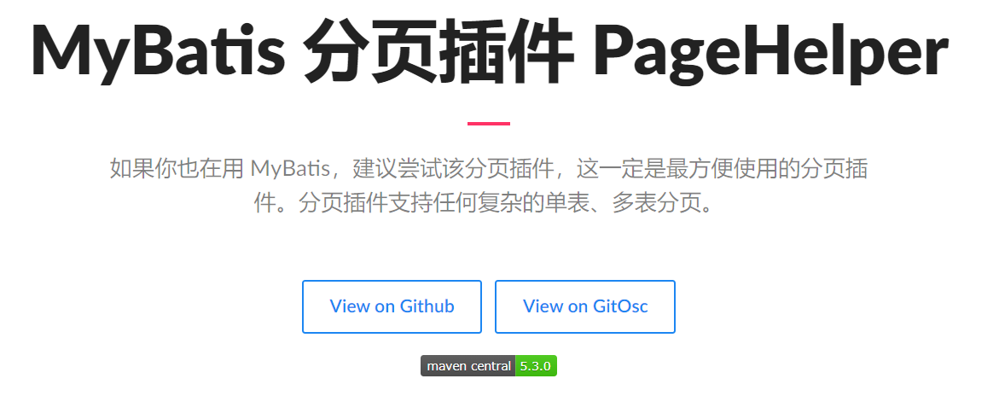

了解即可，万一以后公司的架构师，说要使用，你需要知道它是什么东西！

# 8、使用注解开发

### 8.1、面向接口编程

- 大家之前都学过面向对象编程，也学习过接口，但在真正的开发中，很多时候我们会选择面向接口编程
- **根本原因：==解耦==，可拓展，提高复用，分层开发中，上层不用管具体的实现，大家都遵守共同的标准，使得开发变得容易，规范性更好**
- 在一个面向对象的系统中，系统的各种功能是由许许多多的不同对象协作完成的。在这种情况下，各个对象内部是如何实现自己的，对系统设计人员来讲就不那么重要了；
- 而各个对象之间的协作关系则成为系统设计的关键。小到不同类之间的通信，大到各模块之间的交互，在系统设计之初都是要着重考虑的，这也是系统设计的主要工作内容。面向接口编程就是指按照这种思想来编程。

**关于接口的理解**

- 接口从更深层次的理解，应是定义（规范，约束）与实现（名实分离的原则）的分离。

- 接口的本身反映了系统设计人员对系统的抽象理解。
  接口应有两类：

  - 第一类是对一个个体的抽象，它可对应为一个抽象体（abstract class）；
  - 第二类是对一个个体某一方面的抽象，即形成一个抽象面（interface）；

- 一个体有可能有多个抽象面。抽象体与抽象面是有区别的。

  **三个面向区别**

- 面向对象是指，我们考虑问题时，以对象为单位，考虑它的属性及方法。

- 面向过程是指，我们考虑问题时，以一个具体的流程（事务过程）为单位，考虑它的实现，

- 接口设计与非接口设计是针对复用技术而言的，与面向对象（过程）不是一个问题，更多的体现就是对系统整体的架构

### 8.2、使用注解开发

对于像 BlogMapper 这样的映射器类来说，还有另一种方法来完成语句映射。 它们映射的语句可以不用 XML 来配置，而可以使用 Java 注解来配置。比如，上面的 XML 示例可以被替换成如下的配置：

```java
package org.mybatis.example;
public interface BlogMapper {
  @Select("SELECT * FROM blog WHERE id = #{id}")
  Blog selectBlog(int id);
}
```

1.  注解在接口上实现

   ```java
   @Select("select * from user")
   List<User> getUsers();
   ```

2.  需要在核心配置文件中绑定接口！

   ```xml
   <mappers>
       <mapper class="com.kuang.dao.UserMapper"/>
   </mappers>
   ```

3.  测试

   ```java
   @Test
   public void test() {
       SqlSession sqlSession = MybatisUtils.getSqlSession();
       
       //通过反射获取注解值
       UserMapper mapper = sqlSession.getMapper(UserMapper.class);
       List<User> users = mapper.getUsers();
       for (User user :
               users) {
           System.out.println(user);
       }
       sqlSession.close();
   }
   ```

本质：反射机制实现

底层：动态代理！

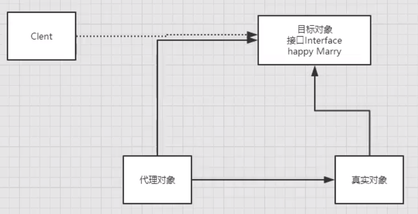

**Mybatis 详细的执行流程！**

```mermaid
graph TB
%%渲染错误，需要插件支持，前往 https://github.com/BackMarket/github-mermaid-extension 下载插件
    Resources 获取加载全局配置文件 -->
    实例化 SqlSessionFactoryBuilder 构造器 -->
    解析配置文件流 XMLConfigBuilder -->
    Configuration 所有的配置信息 -->
    SqlSessionFactory 实例化 -->
    transactional 事务管理器 --> 
    创建 executor 执行器 -->
    创建 sqlSession -->
    实现 CRUD --> transactional 事务管理器
    实现 CRUD --> A
    A{查看是否执行成功} --> transactional 事务管理器
    A --> 提交事务 -->
    关闭
```

在 Mybatis 中只有以下两步可见，其他都被底层隐藏了

- 实例化 SqlSessionFactoryBuilder 构造器
- SqlSessionFactory 实例化

### 8.3、CRUD

我们可以在工具类创建的时候实现自动提交事务！

```java
public static SqlSession getSqlSession() {
    return sqlSessionFactory.openSession(true);
}
```

编写接口，增加注解

```java
@Select("select * from user")
List<User> getUsers();

//方法存在多个参数，所有的参数前面必须加上 @Param("id") 注解
@Select("select * from user where id = #{id}")
User getUserByID(@Param("id") int id);

@Insert("insert into user(id,name,pwd) values (#{id},#{name},#{password})")
int addUser(User user);

@Update("update user set name=#{name},pwd=#{password} where id =#{id}")
int updateUser(User user);

@Delete("delete from user where id = #{uid}")
int deleteUser(@Param("uid") int id);
```

测试类

```java
@Test
public void getUserByID() {
    SqlSession sqlSession = MybatisUtils.getSqlSession();

    //通过反射获取注解值
    UserMapper mapper = sqlSession.getMapper(UserMapper.class);
    
    User user = mapper.getUserByID(1);
    int row = mapper.addUser(new User(6, "xiaoming", "123456"));
    int row = mapper.updateUser(new User(6, "to", "123456"));
    int row = mapper.deleteUser(6);

    sqlSession.close();
}

```

【注意：我们必须要讲接口注册绑定到我们的核心配置文件中！】

**关于 `@Param()` 注解**

- 基本类型的参数或者 String 类型，需要加上
- 引用类型不需要加
- 如果只有一个基本类型的话，可以忽略，但是建议大家都加上！
- 我们在 SQL 中引用的就是我们这里的 `@Param()` 中设定的属性名！

**#{}. ${}区别**

> 1）#{}是预编译处理，\${} 是字符串替换。
> 2）MyBatis 在处理#{}时，会将 SQL 中的#{}替换为？号，使用 PreparedStatement 的 set 方法来赋值；MyBatis 在处理 ${ } 时，就是把 ${ } 替换成变量的值。
> 3）使用 #{} 可以有效的防止 SQL 注入，提高系统安全性。

> 要理解记忆这个题目，我觉得要抓住两点：
>
> 1）\$ 符号一般用来当作占位符，常使用 Linux 脚本的同学应该对此有更深的体会吧。既然是占位符，当然就是被用来替换的。知道了这点就能很容易区分$和#，从而不容易记错了。
>
> 2）预编译的机制。预编译是提前对 SQL 语句进行预编译，而其后注入的参数将不会再进行 SQL 编译。我们知道，SQL 注入是发生在编译的过程中，因为恶意注入了某些特殊字符，最后被编译成了恶意的执行操作。而预编译机制则可以很好的防止 SQL 注入。在某些特殊场合下只能用、${}，不能用#{}。例如：在使用排序时 ORDER BY \${id}，如果使用#{id}，则会被解析成 ORDER BY “id”, 这显然是一种错误的写法。

# 9、Lombok

> Project Lombok is a java library that automatically plugs into your editor and build tools, spicing up your java.
> Never write another getter or equals method again, with one annotation your class has a fully featured builder, Automate your logging variables, and much more.

- java library
- plugs
- build tools
- with one annotation your class

### 9.1、使用步骤

1.  在 IDEA 中安装 Lombok 插件！

2.  在项目中导入 Lombok 的 jar 包

   ```xml
   <dependencies>
       <dependency>
           <groupId>org.projectlombok</groupId>
           <artifactId>lombok</artifactId>
           <version>1.18.22</version>
           <scope>provided</scope>
       </dependency>
   </dependencies>
   ```

3.  在实体类上加注解即可！

    ```java
    @Data //get、set、toString、hashcode、equals
    @AllArgsConstructor //有参构造
    @NoArgsConstructor //无参构造
    public class User {
        private int id;
        private String name;
        private String password;
    }
    ```
    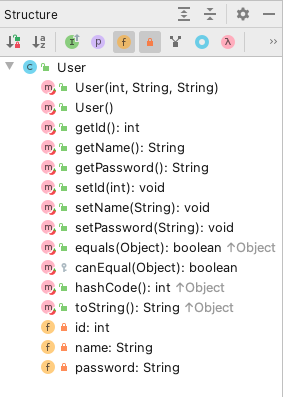

4.  其他类型的注解：

    ```java
    @NonNull
    @Getter/@Setter
    @ToString
    @EqualsAndHashCode
    @NoArgsConstructor/@RequiredArgsConstructor /@AllArgsConstructor
    @Data
    @ValueL
    @Log
    ```

### 9.2、Lombok 的优缺点

优点：

1.  能通过注解的形式自动生成构造器、getter/setter, equals, hashcode, toString 等方法，提高了一定的开发效率
2.  让代码变得简洁，不用过多的去关注相应的方法
3.  属性做修改时，也简化了维护为这些属性所生成的 getter/setter 方法等

缺点：

1.  不支持多种参数构造器的重载
2.  虽然省去了手动创建 getter/setter 方法的麻烦，但大大降低了源代码的可读性和完整性，降低了阅读源代码的舒适度

> 知乎上有位大神发表过对 Lombok 的一些看法：
>
> 这是一种低级趣味的插件，不建议使用。JAVA 发展到今天，各种插件层出不穷，如何甄别各种插件的优劣？能从架构上优化你的设计的，能提高应用程序性能的，实现高度封装可扩展的…，像 Lombok 这种，像这种插件，已经不仅仅是插件了，改变了你如何编写源码，事实上，少去了的代码你写上去又如何？如果 JAVA 家族到处充斥这样的东西，那只不过是一坨披着金属颜色的屎，迟早会被其它的语言取代。

虽然话糙但理确实不糙，试想一个项目有非常多类似 Lombok 这样的插件，个人觉得真的会极大的降低阅读源代码的舒适度。虽然非常不建议在属性的 getter/setter 写一些业务代码，但在多年项目的实战中，有时通过给 getter/setter 加一点点业务代码，能极大的简化某些业务场景的代码。所谓取舍，也许就是这时的舍弃一定的规范，取得极大的方便。

我现在非常坚信一条理念，任何编程语言或插件，都仅仅只是工具而已，即使工具再强大也在于用的人，就如同小米加步枪照样能赢飞机大炮的道理一样。结合具体业务场景和项目实际情况，无需一味追求高大上的技术，适合的才是王道。

Lombok 有它的得天独厚的优点，也有它避之不及的缺点，熟知其优缺点，在实战中灵活运用才是王道。

# 10、 多对一处理

多对一：

- 多个学生，对应一个老师
- 对于学生这边而言，**关联** .. 多个学生，关联一个老师 【多对一】
- 对于老师而言，**集合**，一个老师，有很多学生 【一对多】

SQL:

```sql
CREATE TABLE `teacher` (
  `id` INT(10) NOT NULL,
  `name` VARCHAR(30) DEFAULT NULL,
  PRIMARY KEY (`id`)
) ENGINE=INNODB DEFAULT CHARSET=utf8;

INSERT INTO teacher(`id`, `name`) VALUES (1, '秦老师'); 

CREATE TABLE `student` (
  `id` INT(10) NOT NULL,
  `name` VARCHAR(30) DEFAULT NULL,
  `tid` INT(10) DEFAULT NULL,
  PRIMARY KEY (`id`),
  KEY `fktid` (`tid`),
  CONSTRAINT `fktid` FOREIGN KEY (`tid`) REFERENCES `teacher` (`id`)
) ENGINE=INNODB DEFAULT CHARSET=utf8;

INSERT INTO `student` (`id`, `name`, `tid`) VALUES ('1', '小明', '1'); 
INSERT INTO `student` (`id`, `name`, `tid`) VALUES ('2', '小红', '1'); 
INSERT INTO `student` (`id`, `name`, `tid`) VALUES ('3', '小张', '1'); 
INSERT INTO `student` (`id`, `name`, `tid`) VALUES ('4', '小李', '1'); 
INSERT INTO `student` (`id`, `name`, `tid`) VALUES ('5', '小王', '1');
```

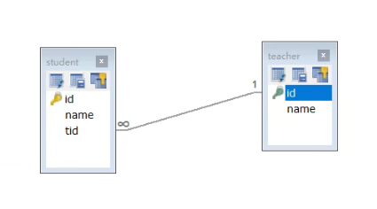

### 10.1、测试环境搭建

1.  导入 lombok
2.  新建实体类 Teacher，Student
3.  建立 Mapper 接口
4.  建立 Mapper.xml 文件
5.  在核心配置文件中绑定注册我们的 Mapper 接口或者文件！【方式很多，随心选】
6.  测试查询是否能成功！

### 10.2、按照查询嵌套处理

```Xml
<!--
思路：
    1. 查询所有的学生信息
    2. 根据查询出来的学生的 tid，寻找对应的老师，子查询
-->
<select id="getStudent" resultMap="StudentTeacher">
    select *
    from student;
</select>
<resultMap id="StudentTeacher" type="Student">
    <result property="id" column="id"/>
    <result property="name" column="name"/>
    <!--复杂的属性，我们需要单独处理 对象：association 集合：collection -->
    <association property="teacher" column="tid" javaType="Teacher" select="getTeacher"/>
</resultMap>

<select id="getTeacher" resultType="Teacher">
    select *
    from teacher
    where id = #{id}
</select>
```

### 10.3、按照结果嵌套处理

```xml
<!--按照结果嵌套处理-->
<select id="getStudent2" resultMap="StudentTeacher2">
    select s.id sid, s.name sname, t.name tname
    from student s,
         teacher t
    where s.tid = t.id;
</select>
<resultMap id="StudentTeacher2" type="Student">
    <result property="id" column="sid"/>
    <result property="name" column="sname"/>
    <association property="teacher" javaType="Teacher">
        <result property="name" column="tname"/>
    </association>
</resultMap>
```

回顾 Mysql 多对一查询方式：

- 子查询
- 联表查询

# 11、一对多处理

比如：一个老师拥有多个学生！

对于老师而言，就是一对多的关系！

### 10.1、环境搭建，和刚才一样

   **实体类**

   ```java
   @Data
   public class Student {
       private int id;
       private String name;
       private int tid;
   }
   ```

   ```java
   @Data
   public class Teacher {
       private int id;
       private String name;
   
       //老师拥有多个学生
       private List<Student> students;
   }
   ```

### 10.2、按照结果嵌套处理

```xml
<!--    按结果嵌套查询-->
<select id="getTeacher" resultMap="TeacherStudent">
    select s.id sid, s.name sname, t.name tname, t.id tid
    from student s,
         teacher t
    where s.tid = t.id
      and t.id = #{tid};
</select>

<resultMap id="TeacherStudent" type="Teacher">
    <result property="id" column="tid"/>
    <result property="name" column="tname"/>
    <!--复杂的属性，我们需要单独处理 对象：association 集合：collection
     javaType="" 指定属性的类型！
     集合中的泛型信息，我们使用 ofType 获取
     -->
    <collection property="students" ofType="Student">
        <result property="id" column="sid"/>
        <result property="name" column="sname"/>
        <result property="tid" column="tid"/>
    </collection>
</resultMap>
```

### 10.2、按照查询嵌套处理

```xml
<select id="getTeacher2" resultMap="TeacherStudent2">
    select *
    from teacher
    where id = #{tid};
</select>

<resultMap id="TeacherStudent2" type="Teacher">
    <!--  变量名和字段名同名，可以省略
          <result property="id" column="id"/>
          <result property="name" column="name"/>-->
    <collection property="students" javaType="ArrayList" ofType="Student" select="getStudentByTeacherId"
                column="id"/>
</resultMap>

<select id="getStudentByTeacherId" resultType="Student">
    select *
    from student
    where tid = #{tid}
</select>
```

### 10.4、小结

1.  关联 - association 【多对一】
2.  集合 - collection 【一对多】
3.  javaType  &  ofType
 1.  JavaType 用来指定实体类中属性的类型
 2.  ofType 用来指定映射到 List 或者集合中的 pojo 类型，泛型中的约束类型！

注意点：

- 保证 SQL 的可读性，尽量保证通俗易懂
- 注意一对多和多对一中，属性名和字段的问题！
- 如果问题不好排查，可以使用日志，建议使用 Log4j

**慢 SQL    1s    1000s**

面试高频

- Mysql 引擎
- InnoDB 底层原理
- 索引
- 索引优化！

# 12、动态 SQL

==**什么是动态 SQL：动态 SQL 就是指根据不同的条件生成不同的 SQL 语句**==

利用动态 SQL，可以彻底摆脱这种痛苦。

> 如果你之前用过 JSTL 或任何基于类 XML 语言的文本处理器，你对动态 SQL 元素可能会感觉似曾相识。在 MyBatis 之前的版本中，需要花时间了解大量的元素。借助功能强大的基于 OGNL 的表达式，MyBatis 3 替换了之前的大部分元素，大大精简了元素种类，现在要学习的元素种类比原来的一半还要少。
>
> - if
> - choose (when, otherwise)
> - trim (where, set)
> - foreach

### 12.1、搭建环境

```sql
CREATE TABLE `blog`(
  `id` VARCHAR(50) NOT NULL COMMENT '博客 id',
  `title` VARCHAR(100) NOT NULL COMMENT '博客标题',
  `author` VARCHAR(30) NOT NULL COMMENT '博客作者',
  `create_time` DATETIME NOT NULL COMMENT '创建时间',
  `views` INT(30) NOT NULL COMMENT '浏览量'
)ENGINE=INNODB DEFAULT CHARSET=utf8;
```

创建一个基础工程

1.  导包

2.  编写配置文件

3.  编写实体类

   ```java
   @Data
   public class Blog {
       private String id;
       private String title;
       private String author;
       private Date createTime;    //属性名和字段名不一致，
       private int views;
   }
   ```

 > 在核心配置文件中，配置 `<setting name="mapUnderscoreToCamelCase" value="true"/>` 是否开启驼峰命名自动映射，即从经典数据库列名 A_COLUMN 映射到经典 Java 属性名 aColumn。

4.  编写实体类对应 Mapper 接口和 Mapper.XML 文件

### 12.2、if

```xml
<select id="queryBlogIF" parameterType="map" resultType="Blog">
    select * from mybatis.blog where 1=1
    <if test="title != null">
        and title = #{title}
    </if>
    <if test="author != null">
        and author = #{author}
    </if>
</select>
```

### 12.3、choose、when、otherwise

有时候，我们不想使用所有的条件，而只是想从多个条件中选择一个使用。针对这种情况，MyBatis 提供了 choose 元素，它有点像 Java 中的 switch 语句。

还是上面的例子，但是策略变为：传入了 “title” 就按 “title” 查找，传入了 “author” 就按 “author” 查找的情形。若两者都没有传入，就返回标记为 featured 的 BLOG（这可能是管理员认为，与其返回大量的无意义随机 Blog，还不如返回一些由管理员精选的 Blog）。

```xml
<select id="queryBlogChoose" parameterType="map" resultType="Blog">
    select * from mybatis.blog
    <where>
        <choose>
            <when test="title !=null">
                title=#{title}
            </when>
            <when test="author != null">
                and author=#{author}
            </when>
            <otherwise>
                and views=#{views}
            </otherwise>
        </choose>
    </where>
</select>
```

 只要满足第一个条件，就不管其他条件了

### 12.4、trim、where、set

```xml
<select id="queryBlogChoose" parameterType="map" resultType="Blog">
    select *
    from mybatis.blog
    <where>
        <if test="title != null">
            title = #{title}
        </if>
        <if test="author != null">
            and author = #{author}
        </if>
    </where>
</select>
```

*where* 元素只会在子元素返回任何内容的情况下才插入 “WHERE” 子句。而且，若子句的开头为 “AND” 或 “OR”，*where* 元素也会将它们去除。

用于动态更新语句的类似解决方案叫做 *set*。*set* 元素可以用于动态包含需要更新的列，忽略其它不更新的列。比如：

```xml
<update id="updateBlog" parameterType="map">
    update mybatis.blog
    <set>
        <if test="title !=null">
            title=#{title},
        </if>
        <if test="author !=null">
            author=#{author},
        </if>
    </set>
    where id=#{id}
</update>
```

这个例子中，*set* 元素会动态地在行首插入 SET 关键字，并会删掉额外的逗号（这些逗号是在使用条件语句给列赋值时引入的）。

如果 *where* 元素与你期望的不太一样，你也可以通过自定义 trim 元素来定制 *where* 元素的功能。比如，和 *where* 元素等价的自定义 trim 元素为：

```xml
<trim prefix="WHERE" prefixOverrides="AND |OR ">
  ...
</trim>
```

*prefixOverrides* 属性会忽略通过管道符分隔的文本序列（注意此例中的空格是必要的）。上述例子会移除所有 *prefixOverrides* 属性中指定的内容，并且插入 *prefix* 属性中指定的内容。

==**所谓的动态 SQL, 本质还是 SQL 语句，只是我们可以在 SQL 层面，去执行一个逻辑代码**==

### 12.5、SQL 片段

有的时候，我们可能会将一些功能的部分抽取出来，方便复用！

1.  使用 SQL 标签抽取公共部分

   ```xml
   <sql id="if-title-author">
       <if test="title != null">
           title = #{title}
       </if>
       <if test="author != null">
           and author = #{author}
       </if>
   </sql>
   ```

2.  在需要使用的地方使用 Include 标签引用即可

   ```xml
   <select id="queryBlogIF" parameterType="map" resultType="Blog">
       select * from mybatis.blog
       <where>
           <include refid="if-title-author"></include>
       </where>
   </select>
   ```

注意事项：

- 最好基于单表来定义 SQL 片段
- **不要存在 where 标签**

### 12.6、foreach

- 用 or 来进行分割

```xml
<!--
    select * from blog where 1=1 and (id=1 or id =2 or id =3)

    我们现在传递一个万能的 Map，这 map 中可以存在一个集合！
-->
<select id="queryBlogForeach" parameterType="map" resultType="blog">
        select * from blog
        <where>
            <foreach collection="ids" item="id" open="and (" close=")" separator="or">
                id=#{id}
            </foreach>
        </where>
    </select>
```

- 构建 IN 条件语句

> 动态 SQL 的另一个常见使用场景是对集合进行遍历（尤其是在构建 IN 条件语句的时候）。比如：
>
> ```xml
> <select id="selectPostIn" resultType="domain.blog.Post">
>   SELECT *
>   FROM POST P
>   <where>
>     <foreach item="item" index="index" collection="list"
>         open="ID in (" separator="," close=")" nullable="true">
>           #{item}
>     </foreach>
>   </where>
> </select>
> ```
>
> *foreach* 元素的功能非常强大，它允许你指定一个集合，声明可以在元素体内使用的集合项（item）和索引（index）变量。它也允许你指定开头与结尾的字符串以及集合项迭代之间的分隔符。这个元素也不会错误地添加多余的分隔符，看它多智能！
>
> **提示** 你可以将任何可迭代对象（如 List、Set 等）、Map 对象或者数组对象作为集合参数传递给 *foreach*。当使用可迭代对象或者数组时，index 是当前迭代的序号，item 的值是本次迭代获取到的元素。当使用 Map 对象（或者 Map.Entry 对象的集合）时，index 是键，item 是值。

数据库内容

| id  | title            | author | create_time         | views |
| --- | ---------------- | ------ | ------------------- | ----- |
| 1   | Mybatis 如此简单 | 狂神说 | 2022-01-04 06:16:19 | 9999  |
| 2   | Java 如此简单 01 | 狂神说 | 2022-01-04 06:16:19 | 1000  |
| 3   | Spring 如此简单  | 狂神说 | 2022-01-04 06:16:19 | 9999  |
| 4   | 微服务如此简单   | 狂神说 | 2022-01-04 06:16:19 | 9999  |

==动态 SQL 就是在拼接 SQL 语句，我们只要保证 SQL 的正确性，按照 SQL 的格式，去排列组合就可以了==

建议：

- 先在 Mysql 中写出完整的 SQL, 再对应的去修改成为我们的动态 SQL 实现通用即可！

# 13、缓存（了解）

### 13.1、简介

```
查询：连接数据库，耗资源！
        一次查询的结果，给他暂存在一个可以直接取到的地方！-->内存：缓存
        
我们再次查询相同数据的时候，直接走缓存，就不用走数据库了
```

1.  什么是缓存 [Cache] ?
   - 存在内存中的临时数据。
   - 将用户经常查询的数据放在缓存（内存）中，用户去查询数据就不用从磁盘上（关系型数据库数据文件查
     询，从缓存中查询，从而提高查询效率，解决了高并发系统的性能问题。
   - 读写问题（并发），读写分离，主从复制
   - 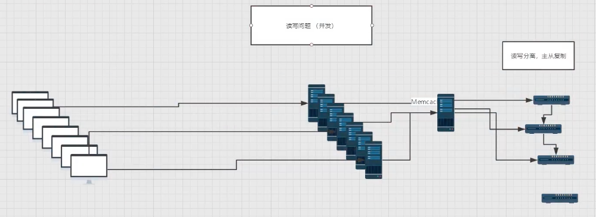
2.  为什么使用缓存？
   - 减少和数据库的交互次数，减少系统开销，提高系统效率。
3.  什么样的数据能使用缓存？
   - 经常查询并且不经常改变的数据。

### 13.2、Mybatis 缓存

- MyBatis 包含一个非常强大的查询缓存特性，它可以非常方便地定制和配置缓存。缓存可以极大的提升查询效率。
- MyBatis 系统中默认定义了两级缓存：**一级缓存**和**二级缓存**
  - 默认情况下，只有一级缓存开启。(SqlISession 级别的缓存，也称为本地缓存）
  - 二级缓存需要手动开启和配置，他是基于 namespace 级别的缓存。（对应 mapper）
  - 为了提高扩展性，MyBatis 定义了缓存接口 Cache, 我们可以通过实现 Cache 接口来自定义二级缓存

### 13.3、一级缓存

- 一级缓存也叫本地缓存：SqlSession

  - 与数据库同一次会话期间查询到的数据会放在本地缓存中。

  - 以后如果需要获取相同的数据，直接从缓存中拿，没必须再去查询数据库；

测试步骤：

1.  开启日志！

2.  测试在一个 Sesion 中查询两次相同记录

3.  查看日志输出

   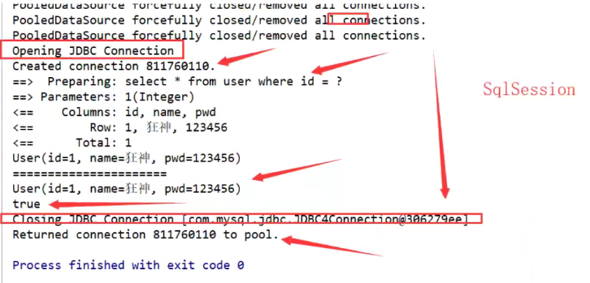

缓存失效情况：

1.  查询不同的东西

2.  增删改操作，可能会改变原来的数据，所以必定会刷新缓存！

   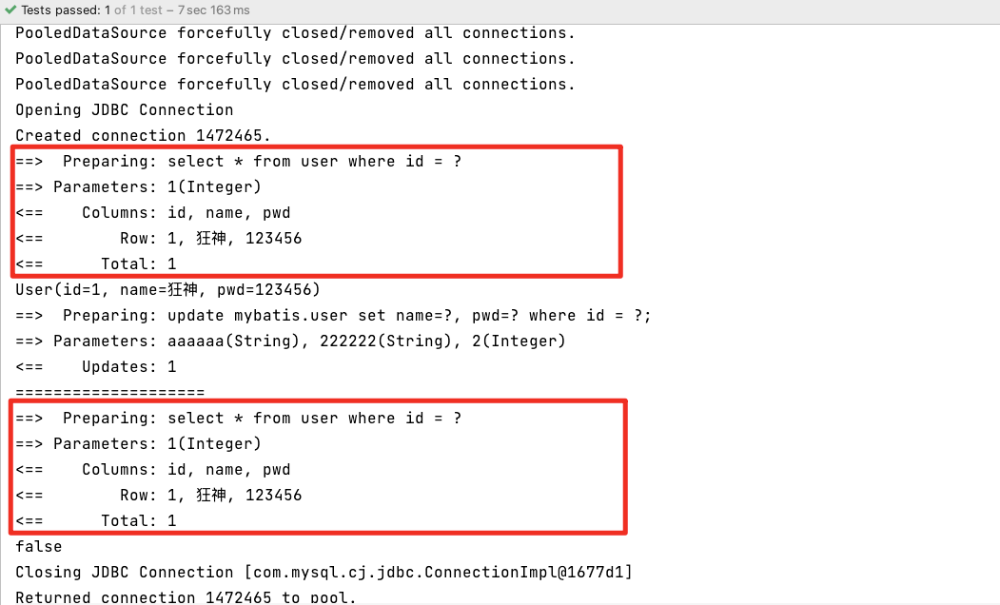

3.  查询不同的 Mapper.xml

4.  手动清理缓存！

   ```java
   @Test
   public void test() {
     SqlSession sqlSession = MybatisUtils.getSqlSession();
     UserMapper mapper = sqlSession.getMapper(UserMapper.class);
     User user = mapper.queryUsersById(1);
   
     System.out.println(user);
   
     //mapper.updateUser(new User(2, "aaaaaa", "222222"));
     sqlSession.clearCache();//手动清理缓存
   
     System.out.println("====================");
     User user2 = mapper.queryUsersById(1);
   
     System.out.println(user == user2);
     sqlSession.close();
   }
   ```

小结：一级缓存默认是开启的，只在一次 SqlSession 中有效，也就是拿到连接到关闭连接这个区间段！

一级缓存就是一个 Map

### 13.4、二级缓存

- 二级缓存也叫全局缓存，一级缓存作用域太低了，所以诞生了二级缓存
- 基于 namespace 级别的缓存，一个名称空间，对应一个二级缓存；
- 工作机制
  - 一个会话查询一条数据，这个数据就会被放在当前会话的一级缓存中；
  - 如果当前会话关闭了，这个会话对应的一级缓存就没了；但是我们想要的是，会话关闭了，一级缓存中的
    数据被保存到二级缓存中；
  - 新的会话查询信息，就可以从二级缓存中获取内容；
  - 不同的 mapper 查出的数据会放在自己对应的缓存 (map) 中；

步骤：

1.  开启全局缓存

   ```xml
   <!--显示的开启全局缓存-->
   <setting name="cacheEnabled" value="true"/>
   ```

2.  在要使用二级缓存的 Mapper 中开启

   ```xml
   <!--在当前 Mapper.xml 中使用二级缓存-->
   <cache/>
   ```

   也可以自定参数

   ```xml
   <!--在当前 Mapper.xml 中使用二级缓存-->
   <cache eviction="FIFO"
          flushInterval="60000"
          size="512"
          readOnly="true"/>
   ```

3.  测试

   1.  使用默认参数 `<cache/>`

      问题：我们需要将实体类序列化

      `Caused by: java.io.NotSerializableException: com.kuang.pojo.User`

      二级缓存缺陷，说明存到内存的缓存也需要序列化

      ```java
      public class User implements Serializable {
          private int id;
          private String name;
          private String pwd;
      }
      ```

      两个对象不相等了

      ```java
      user == user2 //false
      ```

   2.  使用自定义参数 `<cache readOnly="true"/>`，开启只读

      没有要求序列化

        ```java
      public class User {
          private int id;
          private String name;
          private String pwd;
      }
        ```

      两个对象相等

       ```java
       user == user2 //true
       ```

小结：

- 只要开启了二级缓存，在同一个 Mapper 下就有效
- 所有的数据都会先放在一级缓存中；
- 只有当会话提交，或者关闭的时候，才会提交到二级缓存中！

### 13.5、缓存原理

缓存顺序

1.  先看二级缓存中有没有
2.  再看一级缓存中有没有
3.  查询数据库

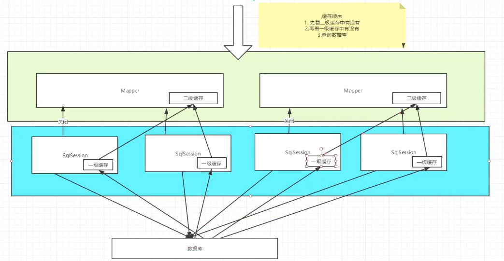

### 13.6、自定义缓存-ehcache

> Ehcache 是一种广泛使用的开源 Java 分布式缓存。主要面向通用缓存

要在程序中使用 ehcache，先要导包！

```xml
<!-- https://mvnrepository.com/artifact/org.mybatis.caches/mybatis-ehcache -->
<dependency>
    <groupId>org.mybatis.caches</groupId>
    <artifactId>mybatis-ehcache</artifactId>
    <version>1.1.0</version>
</dependency>
```

 在 mapper 中指定使用我们的 ehcache 缓存实现！

```xml
<!--在当前 Mapper.xml 中使用二级缓存-->
<cache type="org.mybatis.caches.ehcache.EhcacheCache"/>
```

ehcache.xml

```xml
<?xml version="1.0" encoding="UTF-8" ?>
<ehcache xmlns:xsi="http://www.w3.org/2001/XMLSchema-instance"
         xsi:noNamespaceSchemaLocation="http://ehcache.org/ehcache.xsd"
         updateCheck="false">
       <!--
        diskStore: 为缓存路径，ehcache 分为内存和磁盘两级，此属性定义磁盘的缓存位置。参数解释如下：
        user.home - 用户主月录
        user.dir - 用户当前工作目录
        java.io.tmpdir - 默认临时文件路径
    -->
    <diskStore path="./tmpdir/Tmp_EhCache"/>

    <defaultCache
            eternal="false"
            maxElementsInMemory="10000"
            overflowToDisk="false"
            diskPersistent="false"
            timeToIdleSeconds="1800"
            timeToLiveSeconds="259200"
            memoryStoreEvictionPolicy="LRU"/>

    <cache
            name="cloud_user"
            eternal="false"
            maxElementsInMemory="5000"
            overflowToDisk="false"
            diskPersistent="false"
            timeToIdleSeconds="1800"
            timeToLiveSeconds="1800"
            memoryStoreEvictionPolicy="LRU"/>
  
    <!--
    defaultCache: 默认缓存策略，当 ehcache 找不到定义的缓存时，则使用这个缓存策略。只能定义一个。
    -->
    <!--
    name: 缓存名称。
    maxElementsInMemory: 缓存最大数目
    maxElementsOnDisk: 硬盘最大缓存个数。
    eternal: 对象是否永久有效，一但设置了，timeout 将不起作用。
    overflowToDisk: 是否保存到磁盘，当系统当机时
    timeToIdleSeconds: 设置对象在失效前的允许闲置时间（单位：秒）。仅当 eternal=false 对象不是永久有效时使用，可选属性，默认值是 0, 也就是可闲置时间无穷大。
    timeToLiveSeconds: 设置对象在失效前允许存活时间（单位：秒） 。最大时间介于创建时间和失效时间之间。仅当 eternal=false 对象不是永久有效时使用，默认是 0., 也就是对象存活时间无穷大。
    diskPersistent: 是否缓存虚拟机重启期数据 whether the disk store persists between restarts of the virtual Machine. The default value is false
    diskSpoolBufferSizeMB: 这个参数设置 DiskStore （磁盘缓存）的缓存区大小。默认是 30MB, 每个 cache 都应该有自己的一个缓冲区
    diskExpiryThreadIntervalSeconds: 磁盘失效线程运行时间间隔，默认是 120 秒。
    memoryStoreEvictionPolicy: 当达到 maxElementsInMemory 限制时，Ehcache 将会根据指定的策略去清理内存。默认策略是 LRU （最近最少使用）。你可以设置为 FIFO （先进先出）或是 LFU （较少使用）。
    clearOnFTush: 内在数量最大时是否清除。
    memoryStoreEvictionPolicy: 可选策略有：LRU （最近最少使用，默认策略） 、FIFO （先进先出）、LFU （最少访问次数）。
    FIFO, first in first out, 这个是大家最熟的，先进先出。
    LFU, Less Frequently used, 就是上面例子中使用的策略，直白一点就是讲一直以来最少被使用的。如上面所讲，缓存的元索有一个 hit 属性，hit 值最小的将会被清出缓存。
    LRU, Least Recently used, 最近最少使用的，缓存的元素有一个时间戳，当缓存容量满了，而又需要腾出地方来缓存新的元素的时候，那么现有缓存元素中时间戳离当前时间最远的元素将被清出缓存。
    -->
  
</ehcache>
```

Redis 数据库来做缓存！K-V

## 练习：29 道练习题实战！

完结撒花🎉🎉🎉

# 14、下一步：
 [Java Spring](https://docs.spring.io/spring-framework/docs/current/reference/html/overview.html#overview)
- 笔记： [SpringBoot2 课堂笔记](SpringBoot2课堂笔记.md)
