# SpringBoot2 课堂笔记

- B 站视频： [尚硅谷雷神 SpringBoot2 零基础入门 springboot 全套完整版（spring boot2）](https://www.bilibili.com/video/BV19K4y1L7MT)
- 语雀： [SpringBoot2 核心技术与响应式编程](https://www.yuque.com/atguigu/springboot)

# 05、Web 开发

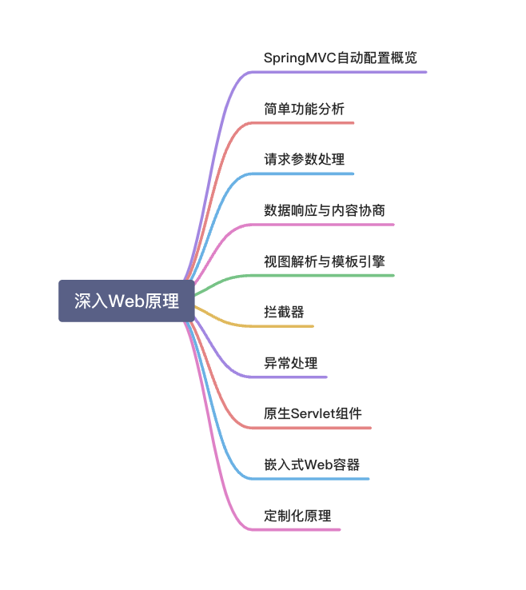

## 1、SpringMVC 自动配置概览

Spring Boot provides auto-configuration for Spring MVC that **works well with most applications.(大多场景我们都无需自定义配置)**

The auto-configuration adds the following features on top of Spring’s defaults:

- Inclusion of `ContentNegotiatingViewResolver` and `BeanNameViewResolver` beans.

- - 内容协商视图解析器和 BeanName 视图解析器

- Support for serving static resources, including support for WebJars (covered [later in this document](https://docs.spring.io/spring-boot/docs/current/reference/html/spring-boot-features.html#boot-features-spring-mvc-static-content) )).

- - 静态资源（包括 webjars）

- Automatic registration of `Converter`, `GenericConverter`, and `Formatter` beans.

- - 自动注册 `Converter，GenericConverter，Formatter `

- Support for `HttpMessageConverters` (covered [later in this document](https://docs.spring.io/spring-boot/docs/current/reference/html/spring-boot-features.html#boot-features-spring-mvc-message-converters) ).

- - 支持 `HttpMessageConverters` （后来我们配合内容协商理解原理）

- Automatic registration of `MessageCodesResolver` (covered [later in this document](https://docs.spring.io/spring-boot/docs/current/reference/html/spring-boot-features.html#boot-features-spring-message-codes) ).

- - 自动注册 `MessageCodesResolver` （国际化用）

- Static `index.html` support.

- - 静态 index.html 页支持

- Custom `Favicon` support (covered [later in this document](https://docs.spring.io/spring-boot/docs/current/reference/html/spring-boot-features.html#boot-features-spring-mvc-favicon) ).

- - 自定义 `Favicon`

- Automatic use of a `ConfigurableWebBindingInitializer` bean (covered [later in this document](https://docs.spring.io/spring-boot/docs/current/reference/html/spring-boot-features.html#boot-features-spring-mvc-web-binding-initializer) ).

- - 自动使用 `ConfigurableWebBindingInitializer` ，（DataBinder 负责将请求数据绑定到 JavaBean 上）

## 2、简单功能分析

### 1、静态资源访问

- 静态资源路径下  index.html

```yaml
resources:
    static-locations: [classpath:/haha/]
```

- favicon 默认为 icon 的图标

## 3、请求参数处理

### Rest 风格

#### 开启 REST 功能

页面表单的 REST 功能，HiddenHttpMethodFilter

```yaml
 spring:  
  mvc:  
    hiddenmethod:  
      filter:  
        enabled: true  #开启页面表单的REST功能
```

#### 测试 REST 风格

测试 REST 风格.html
```xml
<form action="/user" method="get">
    <input value="REST-GET 提交" type="submit"/>
</form>
<form action="/user" method="post">
    <input value="REST-POST 提交" type="submit"/>
</form>
<form action="/user" method="post">
    <input name="_method" type="hidden" value="delete"/>
    <input name="_m" type="hidden" value="delete"/>
    <input value="REST-DELETE 提交" type="submit"/>
</form>
<form action="/user" method="post">
    <input name="_method" type="hidden" value="PUT"/>
    <input value="REST-PUT 提交" type="submit"/>
</form>
```

HelloController.java

```java
@RestController  
public class HelloController {  
    //    @RequestMapping(value = "/user",method = RequestMethod.GET)  
 @GetMapping("/user")  
    public String getUser() {  
        return "GET-张三";  
    }  
  
    //    @RequestMapping(value = "/user",method = RequestMethod.POST)  
 @PostMapping("/user")  
    public String saveUser() {  
        return "POST-张三";  
    }  
  
    //    @RequestMapping(value = "/user",method = RequestMethod.PUT)  
 @PutMapping("/user")  
    public String putUser() {  
        return "PUT-张三";  
    }  
  
    //    @RequestMapping(value = "/user",method = RequestMethod.DELETE)  
 @DeleteMapping("/user")  
    public String deleteUser() {  
        return "DELETE-张三";  
    }
```

#### REST 原理

（表单提交要使用 REST 的时候）
- 浏览器
    - 只提供 `GET` 和 `POST` 方法，需要用包装类，重写 `getMethod` 方法，调用的是 `requestWrapper`
- 使用客户端工具
    - 如 PostMan 直接发送 `PUT`，、`DELETE` 等方式请求，无需 filter。

#### 拓展点：修改方法名

修改 `<input name="_method" >` 中的方法名为 `<input name="_m" >`

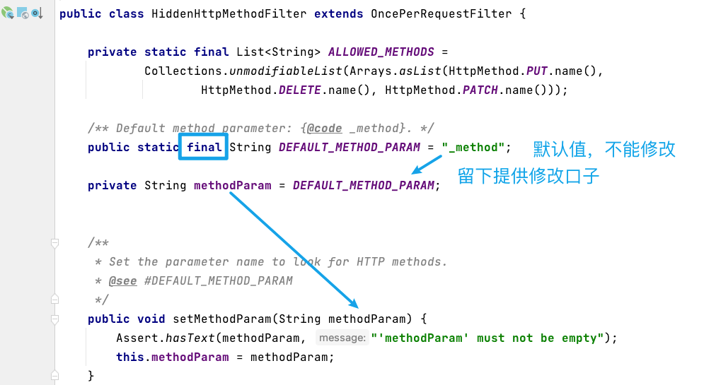

修改方式

```java
@Configuration(proxyBeanMethods = false)  
public class WebConfig {  
    @Bean  
 public HiddenHttpMethodFilter hiddenHttpMethodFilter() {  
        HiddenHttpMethodFilter methodFilter = new HiddenHttpMethodFilter();  
        methodFilter.setMethodParam("_m");  
        return methodFilter;  
    }  
}
```

### 普通参数与基本注解

### 注解

- @PathVariable、获取路径变量
- @RequestHeader、获取请求头
- @ModelAttribute、？？？获取模式属性
- @RequestParam、获取请求参数
- @MatrixVariable、获取矩阵变量，见下方
- @CookieValue、获取 cookie
- @RequestBody、获取请求体

> 矩阵变量

在 cookie 被禁用的情况下使用，一般用来携带 jsessionid

- /cars/{path}?xxx=xxx&aaa=ccc queryString 查询字符串。@RequestParam；
- /cars/sell;low=34;brand=byd,audi,yd ；矩阵变量

页面开发，cookie 禁用了，session 里面的内容怎么使用；

- session.set(a,b)---> jsessionid ---> cookie ----> 每次发请求携带。

url 重写：/abc;jsesssionid=xxxx 把 cookie 的值使用矩阵变量的方式进行传递.

- /boss/1/2
- /boss/1;age=20/2;age=20

#### 自定义对象参数：

可以自动类型转换与格式化，可以级联封装。

SpringBoot 定义了许多参数解析器，数据类型转换类，和绑定类，将参数内容转换成需要的 JavaBean。

### POJO 封装过程

- **ServletModelAttributeMethodProcessor**

添加自定义的内容转化，利用自定义的 `convert` 类

```java
//1、WebMvcConfigurer定制化SpringMVC的功能
@Bean
public WebMvcConfigurer webMvcConfigurer() {
return new WebMvcConfigurer() {
  @Override
  public void addFormatters(FormatterRegistry registry) {
      registry.addConverter(new Converter<String, Pet>() {

          @Override
          public Pet convert(String source) {
              // 啊猫,3
              if (!StringUtils.isEmpty(source)) {
                  Pet pet = new Pet();
                  String[] split = source.split(",");
                  pet.setName(split[0]);
                  pet.setAge(Integer.parseInt(split[1]));
                  return pet;
              }
              return null;
          }
      });
  }
}
```

converter 的 `canWrite` 和 `canRead` 进行判断 mediaType 类型，再分别对应处理

## 4、数据响应与内容协商

### 1、响应 JSON

#### 1.1、jackson.jar+@ResponseBody

```xml
web场景自动引入了json场景
<dependency>
  <groupId>org.springframework.boot</groupId>
  <artifactId>spring-boot-starter-json</artifactId>
  <version>2.3.4.RELEASE</version>
  <scope>compile</scope>
</dependency>
```

**handleReturnValue**：处理解析器

根据返回值类型选择对应的**返回值解析器**

```java
 publuc void ServletInvocableHandlerMethod{
   try {
            this.returnValueHandlers.handleReturnValue(
                    returnValue, getReturnValueType(returnValue), mavContainer, webRequest);
        }
 }
```

#### 1.2、HTTPMessageConverter 原理

**消息转换器(HTTPMessageConverter)**

  1.  **内容协商**：（浏览器默认会以请求头的方式告诉服务器他能接受什么样的内容类型）
  2.  服务器最终根据自己自身的能力，决定服务器能生产出什么样内容类型的数据

最终 MappingJackson2HttpMessageConverter  把对象转为 JSON（利用底层的 jackson 的 objectMapper 转换的）

### 2、内容协商

- postman 分别测试返回 json 和 xml
   - 只需要改变请求头中 Accept 字段。Http 协议中规定的，告诉服务器本客户端可以接收的数据类型。
   - Accept: application/xml

进行内容协商的 最佳匹配媒体类型 ，for 循环遍历

用 支持 将对象转为最佳匹配媒体类型的 converter,调用它进行转化。

### 3、自定义 MessageConverter

  **`contentNegotiationManager ` 内容协商管理器 默认使用基于请求头的策略**
  **`HeaderContentNegotiationStrategy` 确定客户端可以接收的内容类型**

开启浏览器参数方式内容协商功能

  为了方便内容协商，开启基于请求参数的内容协商功能

```yaml
spring:
    contentnegotiation:
      favor-parameter: true  #开启请求参数内容协商模式
```

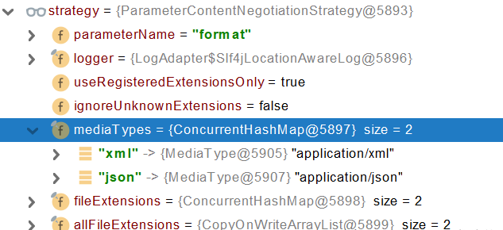

发请求：
 [http://localhost:8080/test/person?format=json](http://localhost:8080/test/person?format=json)

 [http://localhost:8080/test/person?format=xml](http://localhost:8080/test/person?format=xml)

**优缺点：**

  - 优点：不受浏览器约束
  - 缺点：需要额外的传递 format 参数，URL 变得冗余繁琐，缺少了 REST 的简洁风范。还有个缺点便是：还需手动显示开启。

响应数据

SpringMVC 的什么功能。一个入口给容器中添加一个 WebMvcConfigurer
```
1、浏览器发请求直接返回xml [application/xmL]       jacksonXmlconverter
2、如果是ajax请求返回 json [application/json] jacksonJsonconverter 
3、如果硅谷app发请求，返回自定义协议数据[appliaction/x-guigu] xxxxConverter

步骤：
1、添加自定义的MessageConverter进系统底层
2、系统底层就会统计出所有MessageConverter能操作哪些类型
3、客户端内容协商[guigu--->guigu] * * @return  
```

代码
WebMvcConfigurer
```java
@Override  
public void extendMessageConverters(List<HttpMessageConverter<?>> converters) {  
    converters.add(new GuiguMessageConverter());  
}
```

GuiguMessageConverter
```java
/**  
 * 自定义的Converter
 */
public class GuiguMessageConverter implements HttpMessageConverter<Person> {  
  
    @Override  
    public boolean canRead(Class<?> clazz, MediaType mediaType) {  
        return false;  
    }  
  
    @Override  
    public boolean canWrite(Class<?> clazz, MediaType mediaType) {  
        return clazz.isAssignableFrom(Person.class);  
    }  
  
    /**  
     * 服务器要统计所有MessageConverter都能写出哪些内容类型
     * application/x-guigu
     * @return  
     */  
    @Override  
    public List<MediaType> getSupportedMediaTypes() {  
        return MediaType.parseMediaTypes("application/x-guigu");  
    }  
      
    @Override  
    public Person read(Class<? extends Person> clazz, HttpInputMessage inputMessage) throws IOException, HttpMessageNotReadableException {  
            return null;  
        }  
      
    @Override  
    public void write(Person person, MediaType contentType, HttpOutputMessage outputMessage) throws IOException, HttpMessageNotWritableException {  
        //自定义协议数据的写出  
        String data = person.getUserName() + ";" + person.getAge() + ";" + person.getBirth();  
      
        //写出去  
        OutputStream body = outputMessage.getBody();  
            body.write(data.getBytes());  
        }  
    }
```

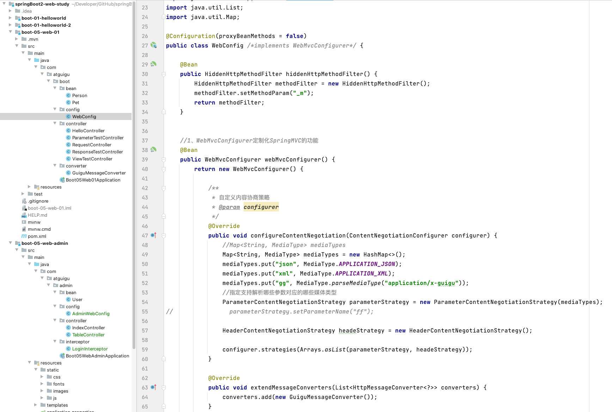

作业：以参数确定返回的媒体类型

```java
/**  
 * 自定义内容协商策略
 * @param configurer  
 */  
 @Override  
public void configureContentNegotiation(ContentNegotiationConfigurer configurer) {  
    //Map<String, MediaType> mediaTypes  
    Map<String, MediaType> mediaTypes = new HashMap<>();  
    mediaTypes.put("json", MediaType.APPLICATION_JSON);  
    mediaTypes.put("xml", MediaType.APPLICATION_XML);  
    mediaTypes.put("gg", MediaType.parseMediaType("application/x-guigu"));  
    //指定支持解析哪些参数对应的哪些媒体类型  
    ParameterContentNegotiationStrategy parameterStrategy = new ParameterContentNegotiationStrategy(mediaTypes);  
    //parameterStrategy.setParameterName("ff");  
    
    //基于请求头的内容协商策略
    HeaderContentNegotiationStrategy headeStrategy = new HeaderContentNegotiationStrategy();  
  
    configurer.strategies(Arrays.asList(parameterStrategy, headeStrategy));  
}
```

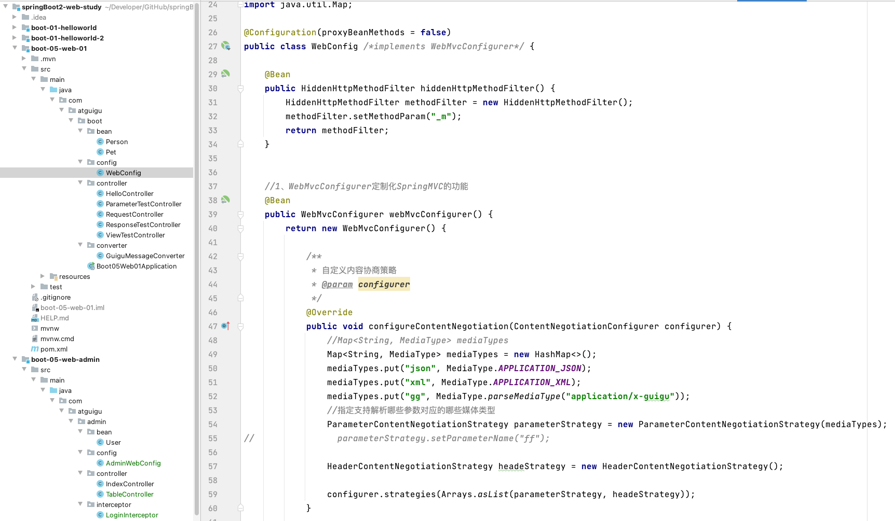

该自定义会导致 解析请求头的内容协商出现 `*/*`，因为这是直接覆盖内容协商管理器导致的，无论请求头是什么，都会默认匹配 json

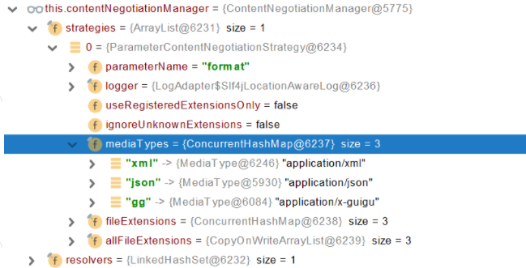

**有可能我们添加的自定义的功能会覆盖默认很多功能，导致一些默认的功能失效。**
 需要自己看源代码进行补充了

## 5、视图解析与模版引擎

视图解析：**SpringBoot 默认不支持 JSP，需要引入第三方模板引擎技术实现页面渲染。**

从 `DispatcherServlet` 开始

### 1、视图解析原理流程

1.  **==目标方法处理的过程中，所有数据都会被放在 ModelAndViewContainer 里面==。包括数据和视图地址**
2.  **方法的参数是一个自定义类型对象（从请求参数中确定的），把他重新放在 `ModelAndViewContainer`**
3.  **任何目标方法执行完成以后都会返回 `ModelAndView`（数据和视图地址）。**
4.  **`processDispatchResult`  处理派发结果（页面改如何响应）**

- 1、`render(mv, request, response)`; 进行页面渲染逻辑
  - 1、根据方法的 String 返回值得到 View 对象【定义了页面的渲染逻辑】
    - 1、所有的视图解析器尝试是否能根据当前返回值得到 View 对象
    - 2、得到了  redirect:/main.html --> Thymeleaf new **RedirectView()**
    - 3、ContentNegotiationViewResolver 里面包含了下面所有的视图解析器，内部还是利用下面所有视图解析器得到视图对象。
    - 4、view.render(mv.getModelInternal(), request, response);   视图对象调用自定义的 render 进行页面渲染工作
      - **RedirectView 如何渲染【重定向到一个页面】**
      - **1、获取目标 url 地址**
      - **2、response.sendRedirect(encodedURL);**

**视图解析：**

  - 返回值以 forward: 开始： new InternalResourceView(forwardUrl); -->  转发 request.getRequestDispatcher(path).forward(request, response);
  - 返回值以 redirect: 开始： new RedirectView() --》 render 就是重定向
  - 返回值是普通字符串： new ThymeleafView（）--->

后续：自定义视图解析器+自定义视图

## 6、拦截器

```java
/**  
 * 1、编写一个拦截器实现HandlerInterceptor接口
 * 2、拦截器注册到容器中（实现webMvcConfigurer的addInterceptors)
 * 3、指定拦截规则【如果是拦截所有，静态资源也会被拦截】 
 */
@Configuration  
public class AdminWebConfig implements WebMvcConfigurer {  
    @Override  
 public void addInterceptors(InterceptorRegistry registry) {  
        registry.addInterceptor(new LoginInterceptor())  
                .addPathPatterns("/**")//所有请求都被拦截，包括静态资源  
                .excludePathPatterns("/", "/login", "/css/**",  "/fonts/**", "/image/**", "/js/**");//放行的请求  
 }  
}
```

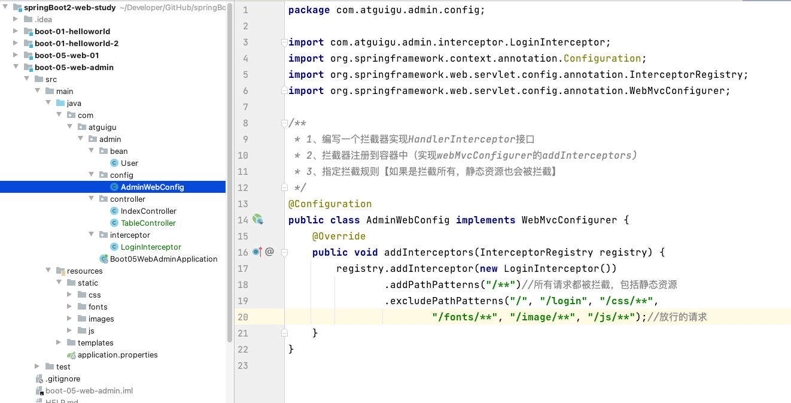

## 7、文件上传

```java
/**
 * 文件上传测试
 */
@Slf4j
@Controller
public class FormTestController {
    @GetMapping("/form_layouts")
    public String forem_layouts() {
        return "form/form_layouts";
    }

    /**
     * MultipartFile 自动封装上传过来的文件
     *
     * @param email
     * @param username
     * @param headerImg
     * @param photos
     * @return
     */
    @PostMapping("/upload")
    public String upload(@RequestParam("email") String email,//从请求参数中获取值
                         @RequestParam("username") String username,
                         @RequestParam("headerImg") MultipartFile headerImg,
                         @RequestParam("photos") MultipartFile[] photos) throws IOException {
        if (!headerImg.isEmpty()) {
            //保存到文件服务器，OSS服务器，然后异步更新
            String originalFilename = headerImg.getOriginalFilename();
            //可以再拼接一个UUID防止文件名重复
            headerImg.transferTo(new File("D:\\cache\\" + originalFilename));
        }
        if (photos.length > 0) {
            for (MultipartFile photo : photos) {
                if (!headerImg.isEmpty()) {
                    String originalFilename = headerImg.getOriginalFilename();
                    headerImg.transferTo(new File("D:\\cache\\" + originalFilename));
                }
            }
        }
        
        return "main";
    }
}
```

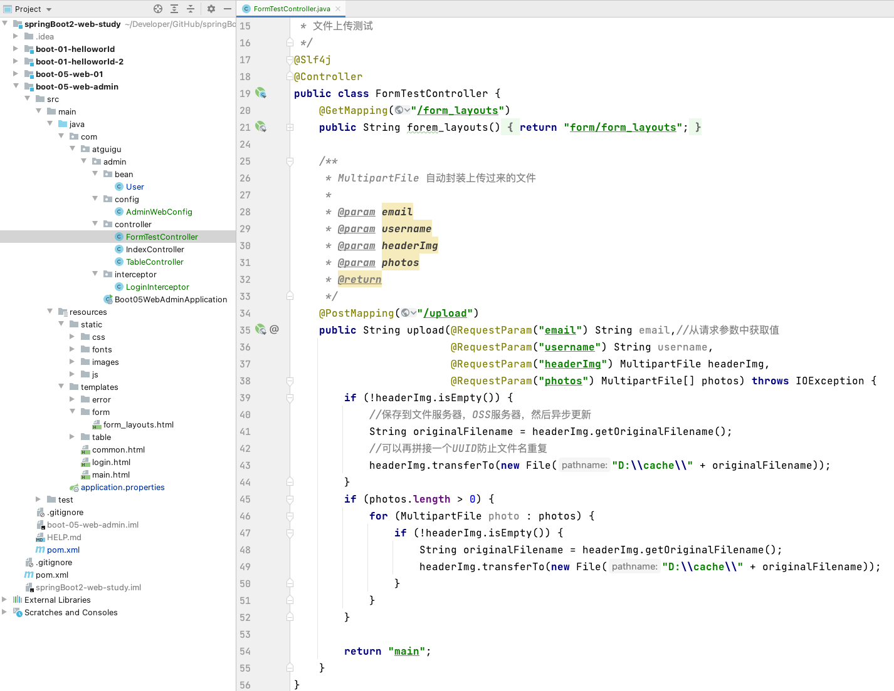

`application.properties` 设置文件传输的大小，每次请求多个文件总大小

```properties
spring.servlet.multipart.max-file-size=10MB  
spring.servlet.multipart.max-request-size=100MB
```

`form_layouts.html`

```xml
<form role="form" th:action="@{/upload}" method="post" enctype="multipart/form-data">  
    <div class="form-group">  
        <label for="exampleInputEmail1">邮箱</label>  
        <input type="email" name="email" class="form-control" id="exampleInputEmail1" placeholder="Enter email">  
    </div>  
    <div class="form-group">  
        <label for="exampleInputPassword1">名字</label>  
        <input type="text" name="username" class="form-control" id="exampleInputPassword1" placeholder="Password">  
    </div>  
    <div class="form-group">  
        <label for="exampleInputFile">头像</label>  
        <input type="file" name="headerImg" id="exampleInputFile">  
    </div>  
    <div class="form-group">  
        <label for="exampleInputFile">生活照</label>  
        <input type="file" name="photos" multiple>  
    </div>  
    <div class="checkbox">  
        <label>  
            <input type="checkbox"> Check me out  
        </label>  
    </div>  
    <button type="submit" class="btn btn-primary">提交</button>  
</form>
```

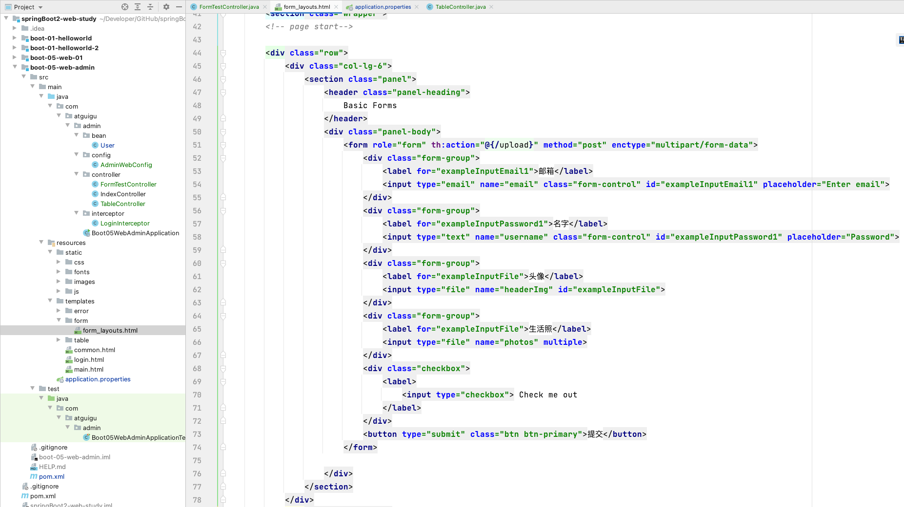

**3、自动配置原理**

**文件上传自动配置类-MultipartAutoConfiguration-MultipartProperties**

- 自动配置好了 **StandardServletMultipartResolver 【文件上传解析器】**
- **原理步骤**
    - **1、请求进来使用文件上传解析器判断（`isMultipart`）并封装（`resolveMultipart`，返回 `MultipartHttpServletRequest`）文件上传请求**
    - **2、参数解析器来解析请求中的文件内容封装成 MultipartFile**
    - **3、将 request 中文件信息封装为一个 Map**；`MultiValueMap<String, MultipartFile>`

工具类 FileCopyUtils。实现文件流的拷贝

## 8、异常处理

### 1、错误处理

1.  默认规则

    - 默认情况下，Spring Boot 提供 `/error` 处理所有错误的映射
    - 对于机器客户端，它将生成 JSON 响应，其中包含错误，HTTP 状态和异常消息的详细信息。对于浏览器客户端，响应一个“ whitelabel”错误视图，以 HTML 格式呈现相同的数据

    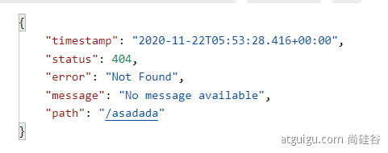

    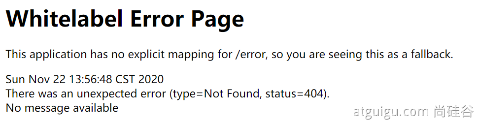

    **要对其进行自定义，添加**`View` **解析为**`error`

    要完全替换默认行为，可以实现 `ErrorController` 并注册该类型的 Bean 定义，或添加 `ErrorAttributes 类型的组件 ` 以使用现有机制但替换其内容。

     error/下的 4xx，5xx 页面会被自动解析；

### 2、定制错误处理逻辑

- 自定义错误页
    - error/404.html error/5xx.html；有精确的错误状态码页面就匹配精确，没有就找 4xx.html；如果都没有就触发白页

- 3 种自定义设置异常

    - `@ControllerAdvice`+`@ExceptionHandler` 处理全局异常；底层是 `ExceptionHandlerExceptionResolver` 支持的

      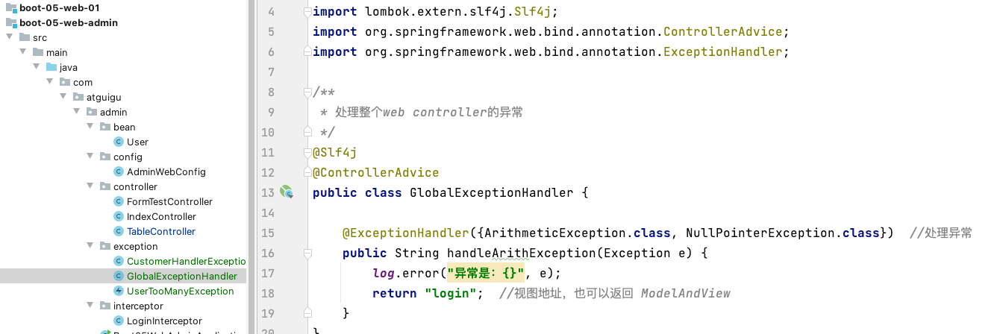

      ```java
      /**
       * 处理整个web controller的异常
       */
      @Slf4j
      @ControllerAdvice
      public class GlobalExceptionHandler {
      
          @ExceptionHandler({ArithmeticException.class, NullPointerException.class})  //处理异常
          public String handleArithException(Exception e) {
              log.error("异常是：{}", e);
              return "login";  //视图地址，也可以返回 ModelAndView
          }
      }
      ```

    - **ErrorViewResolver** 实现自定义处理异常；

      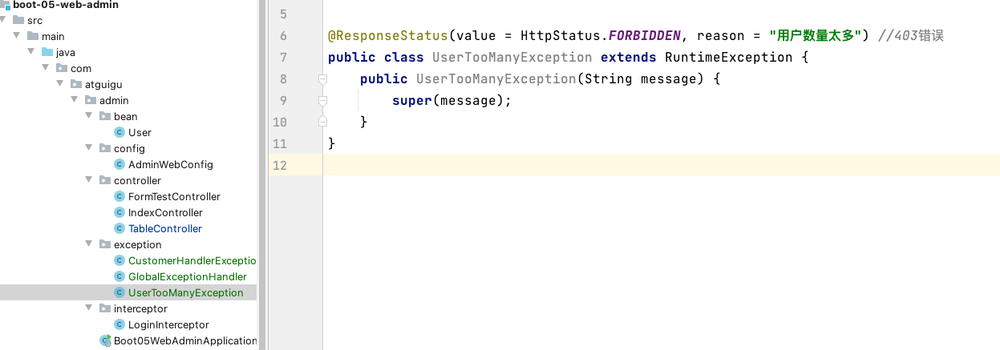

      ```java
      @ResponseStatus(value = HttpStatus.FORBIDDEN, reason = "用户数量太多") //403错误
      public class UserTooManyException extends RuntimeException {
          public UserTooManyException(String message) {
              super(message);
          }
      }
      ```

    - 自定义实现 HandlerExceptionResolver 处理异常；可以作为默认的全局异常处理规则

      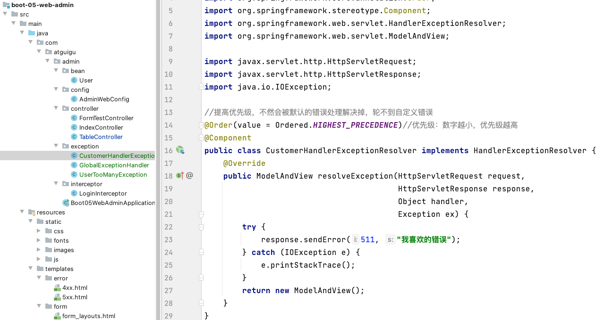

      ```java
      //提高优先级，不然会被默认的错误处理解决掉，轮不到自定义错误
      @Order(value = Ordered.HIGHEST_PRECEDENCE)//优先级：数字越小，优先级越高
      @Component
      public class CustomerHandlerExceptionResolver implements HandlerExceptionResolver {
          @Override
          public ModelAndView resolveException(HttpServletRequest request,
                                               HttpServletResponse response,
                                               Object handler,
                                               Exception ex) {
              try {
                  response.sendError(511, "我喜欢的错误");
              } catch (IOException e) {
                  e.printStackTrace();
              }
              return new ModelAndView();
          }
      }
      ```

    

### 3、异常处理步骤流程

1.  执行目标方法，目标方法运行期间有任何异常都会被 catch、而且标志当前请求结束；并且用 dispatchException

2.  进入视图解析流程（页面渲染？）
    processDispatchResult(processedRequest, response, mappedHandler, mv, dispatchException);

3.  mv = processHandlerException；处理 handler 发生的异常，处理完成返回 ModelAndView；
4.  遍历所有的 handlerExceptionResolvers，看谁能处理当前异常【HandlerExceptionResolver 处理器异常解析器】
    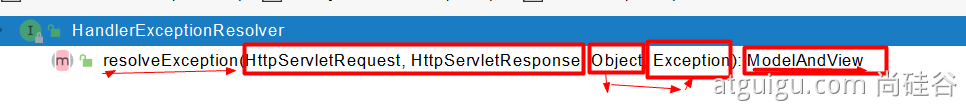
5.  **系统默认的 异常解析器；**
    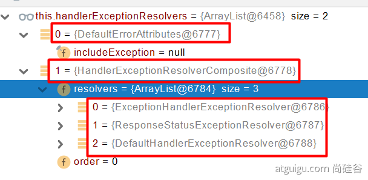

  `DefaultErrorAttributes` 先来处理异常。把异常信息保存到 `request` 域，并且返回 `null`；
6.  **默认没有任何人能处理异常，所以异常会被抛出**

    1.  如果没有任何人能处理最终底层就会发送 `/error` 请求。会被底层的 `BasicErrorController` 处理
    2.  解析错误视图；**遍历所有的 ErrorViewResolver 看谁能解析。**
        
    3.  默认的 `DefaultErrorViewResolver` ,作用是把响应状态码作为错误页的地址，`error/500.html`
    4.  模板引擎最终响应这个页面 `error/500.html`

## 9、Web 原生组件注入（Servlet、Filter、Listener）

### 1、使用 Servlet API（使用下面一种方式更方便）

- `@ServletComponentScan(basePackages = "com.atguigu.admin")`:指定原生 Servlet 组件都放在那里

- `@WebServlet(urlPatterns = "/my")`：效果：直接响应，**没有经过 Spring 的拦截器？**
  - 1、`MyServlet` -->`/my`
  - 2、`DispatcherServlet` -->`/`
  - 多个 Servlet 都能处理到同一层路径精确优先原则

- `@WebFilter(urlPatterns=({"/css/*","/images/*"})`

- `@WebListener`

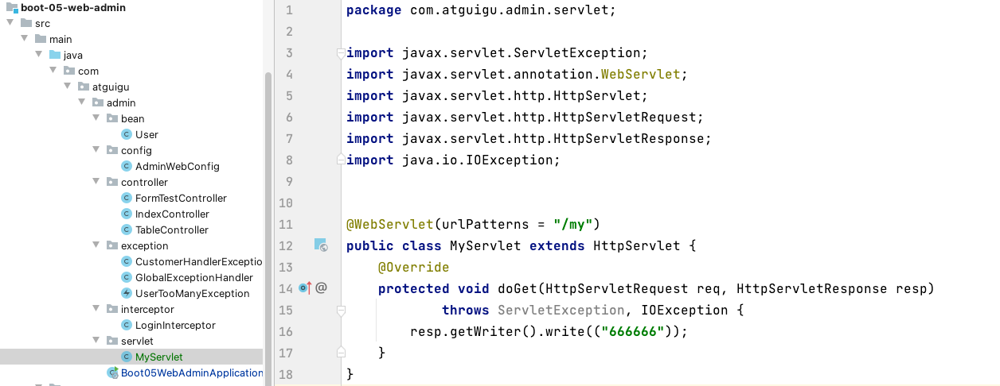

在 `Boot05WebAdminApplication` 中添加包扫描

```java
@ServletComponentScan(basePackages = "com.atguigu.admin")
@SpringBootApplication
public class Boot05WebAdminApplication {

    public static void main(String[] args) {
        SpringApplication.run(Boot05WebAdminApplication.class, args);
    }

}
```

在 `package com.atguigu.admin.servlet;` 包下面创建三个文件

- `MyServlet`

  ```java
  @WebServlet(urlPatterns = "/my")
  public class MyServlet extends HttpServlet {
      @Override
      protected void doGet(HttpServletRequest req, HttpServletResponse resp)
              throws ServletException, IOException {
          resp.getWriter().write(("666666"));
      }
  }
  ```

- `MyFilter`

  ```java
  @Slf4j
  @WebFilter(urlPatterns = {"/css/*", "/images/*"})
  public class MyFilter implements Filter {
      @Override
      public void init(FilterConfig filterConfig) throws ServletException {
          Filter.super.init(filterConfig);
          log.info("MyFilter初始化完成");
      }

      @Override
      public void doFilter(ServletRequest servletRequest, ServletResponse servletResponse, FilterChain filterChain) throws IOException, ServletException {
          log.info("MyFilter工作");
          filterChain.doFilter(servletRequest, servletResponse);
      }

      @Override
      public void destroy() {
          Filter.super.destroy();
          log.info("MyFilter销毁");
      }
  }
  ```

- `MySwervletContextListener`

  ```java
  @Slf4j
  @WebListener
  public class MySwervletContextListener implements ServletContextListener {
      @Override
      public void contextInitialized(ServletContextEvent sce) {
          ServletContextListener.super.contextInitialized(sce);
          log.info("MySwervletContextListener监听到项目初始化完成");
      }
  
      @Override
      public void contextDestroyed(ServletContextEvent sce) {
          ServletContextListener.super.contextDestroyed(sce);
          log.info("MySwervletContextListener监听到项目销毁");
      }
  }
  ```

### 2、使用 RegistrationBean

与上面的方法效果一样，也是注入原生 Servlet

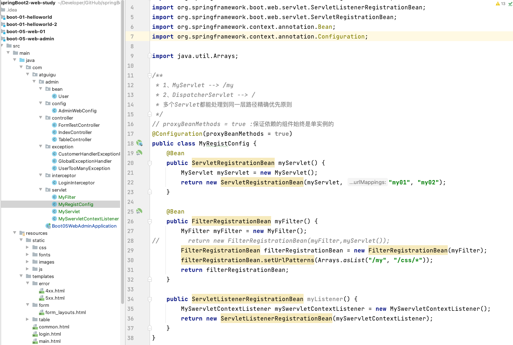

MyRegistConfig

```java
// proxyBeanMethods = true :保证依赖的组件始终是单实例的
@Configuration(proxyBeanMethods = true)
public class MyRegistConfig {
    @Bean
    public ServletRegistrationBean myServlet() {
        MyServlet myServlet = new MyServlet();
        return new ServletRegistrationBean(myServlet, "my01", "my02");
    }

    @Bean
    public FilterRegistrationBean myFilter() {
        MyFilter myFilter = new MyFilter();
//        return new FilterRegistrationBean(myFilter,myServlet());
        FilterRegistrationBean filterRegistrationBean = new FilterRegistrationBean(myFilter);
        filterRegistrationBean.setUrlPatterns(Arrays.asList("/my", "/css/*"));
        return filterRegistrationBean;
    }

    public ServletListenerRegistrationBean myListener() {
        MySwervletContextListener mySwervletContextListener = new MySwervletContextListener();
        return new ServletListenerRegistrationBean(mySwervletContextListener);
    }
}
```

## 10、嵌入式 Servlet 容器

### 1、切换嵌入式 Servlet 容器

- 默认支持的 webServer

- - `Tomcat`, `Jetty`, or `Undertow`
  - `ServletWebServerApplicationContext 容器启动寻找 ServletWebServerFactory 并引导创建服务器 `

- 切换服务器

  

  ```xml
  <dependency>
      <groupId>org.springframework.boot</groupId>
      <artifactId>spring-boot-starter-web</artifactId>
      <exclusions>
          <exclusion>
              <groupId>org.springframework.boot</groupId>
              <artifactId>spring-boot-starter-tomcat</artifactId>
          </exclusion>
      </exclusions>
  </dependency>
  ```

### 2、定制 Servlet 容器

3 种实现方式

- 实现  `WebServerFactoryCustomizer <ConfigurableServletWebServerFactory>`
   - 把配置文件的值和**`ServletWebServerFactory` 进行绑定**
- 修改配置文件 **`server.xxx`**
- 直接自定义 **`ConfigurableServletWebServerFactory`**

`xxxxxCustomizer****`：定制化器，可以改变 xxxx 的默认规则******

## 11、定制化原理

### 1、定制化的常见方式

- 修改配置文件；

- **xxxxxCustomizer；**

- **编写自定义的配置类   xxxConfiguration；+@Bean 替换、增加容器中默认组件；视图解析器**

- ==**Web 应用 编写一个配置类实现** WebMvcConfigurer 即可定制化 web 功能==；+ @Bean 给容器中再扩展一些组件。（非常常用的一种方式）

    ```java
    //@EnableWebMvc :全面接管，所有内容需要自己配置
    @Configuration
    public class AdminWebConfig implements WebMvcConfigurer
      //通过重写方法来达到定制化目的
      @Override
      public void addInterceptors(InterceptorRegistry registry) 
    }
    ```

- @EnableWebMvc + WebMvcConfigurer —— @Bean  可以全面接管 SpringMVC，所有规则全部自己重新配置； 实现定制和扩展功能。举例：

    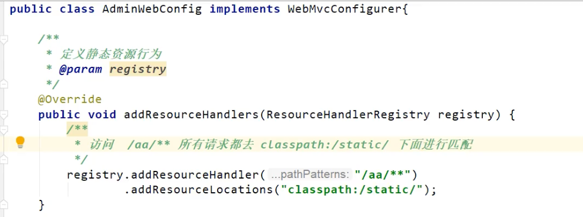

- 原理
    - 1、`WebMvcAutoConfiguration`  默认的 SpringMVC 的自动配置功能类。静态资源、欢迎页.....
    - 2、一旦使用 `@EnableWebMvc` 、。会 `@Import(DelegatingWebMvcConfiguration.class)`
    - 3、**DelegatingWebMvcConfiguration** 的 作用，只保证 SpringMVC 最基本的使用
        - 把所有系统中的 `WebMvcConfigurer` 拿过来。所有功能的定制都是这些 `WebMvcConfigurer`  合起来一起生效
        - 自动配置了一些非常底层的组件。**RequestMappingHandlerMapping**、这些组件依赖的组件都是从容器中获取
        - **public class** DelegatingWebMvcConfiguration **extends** **WebMvcConfigurationSupport**
    - 4、**WebMvcAutoConfiguration** 里面的配置要能生效 必须  `@ConditionalOnMissingBean(WebMvcConfigurationSupport.class)`
    - 5、`@EnableWebMvc`  导致了 **WebMvcAutoConfiguration  没有生效。**

- ... ...

### 2、原理分析套路

==**场景 starter**== **- xxxxAutoConfiguration - 导入 xxx 组件 - 绑定 xxxProperties --** **==绑定配置文件项==**

# 06、数据访问

## 1、SQL

### 1、数据源的自动配置-**HikariDataSource**

####  1、导入 JDBC 场景

```xml
<dependency>
    <groupId>org.springframework.boot</groupId>
    <artifactId>spring-boot-starter-data-jdbc</artifactId>
</dependency>
```


数据库驱动？

为什么导入 JDBC 场景，官方不导入驱动？官方不知道我们接下要操作什么数据库。

数据库版本和驱动版本对应

默认版本：<mysql.version>8.0.22</mysql.version>

```xml
<dependency>
  <groupId>mysql</groupId>
  <artifactId>mysql-connector-java</artifactId>
  <!--<version>5.1.49</version>-->
</dependency>
想要修改版本
1、直接依赖引入具体版本（maven的就近依赖原则）
2、重新声明版本（maven的属性的就近优先原则）
  <properties>
    <java.version>1.8</java.version>
    <mysql.version>5.1.49</mysql.version>
  </properties>
```

#### 2、分析自动配置（过时，有 Spring-boot-star 的配置场景）

1、自动配置的类

- DataSourceAutoConfiguration ： 数据源的自动配置

- - 修改数据源相关的配置：**spring.datasource**
  - **数据库连接池的配置，是自己容器中没有 DataSource 才自动配置的**

- - 底层配置好的连接池是：**HikariDataSource**

- DataSourceTransactionManagerAutoConfiguration： 事务管理器的自动配置
- JdbcTemplateAutoConfiguration： **JdbcTemplate 的自动配置，可以来对数据库进行 crud**

- - 可以修改这个配置项@ConfigurationProperties(prefix = **"spring.jdbc"**) 来修改 JdbcTemplate
  - @Bean@Primary    JdbcTemplate；容器中有这个组件

- JndiDataSourceAutoConfiguration： jndi 的自动配置
- XADataSourceAutoConfiguration： 分布式事务相关的

2、修改配置项

`@ConfigurationProperties ("spring.datasource")` 从配置文件中，获取绑定数据源

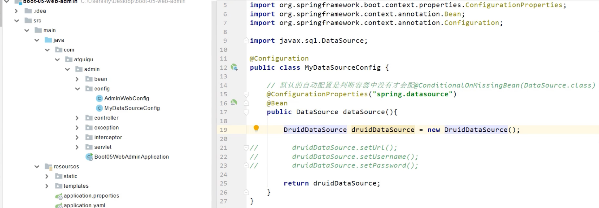

```yaml
spring:
  datasource:
    url: jdbc:mysql://localhost:3306/db_account
    username: root
    password: 123456
    driver-class-name: com.mysql.jdbc.Driver
```

### 2、使用 Druid 数据源

1、druid 官方 github 地址

https://github.com/alibaba/druid

整合第三方技术的两种方式

- 自定义（略过）
- 找 starter（推荐）

#### 1、引入 druid-starter

```xml
<dependency>
    <groupId>com.alibaba</groupId>
    <artifactId>druid-spring-boot-starter</artifactId>
    <version>1.1.17</version>
</dependency>
```

#### 3、配置示例

```yaml
spring:
  datasource:
    url: jdbc:mysql://localhost:3306/db_account
    username: root
    password: 123456
    driver-class-name: com.mysql.jdbc.Driver

    druid:
      aop-patterns: com.atguigu.admin.*  #监控SpringBean
      filters: stat,wall     # 底层开启功能，stat（sql监控），wall（防火墙）

      stat-view-servlet:   # 配置监控页功能
        enabled: true
        login-username: admin
        login-password: admin
        resetEnable: false

      web-stat-filter:  # 监控web
        enabled: true
        urlPattern: '/*'
        exclusions: '*.js,*.gif,*.jpg,*.png,*.css,*.ico,/druid/*' #默认开启

      filter:
        stat:    # 对上面filters里面的stat的详细配置
          slow-sql-millis: 1000
          logSlowSql: true
          enabled: true
        wall:
          enabled: true
          config:
            drop-table-allow: false

```

- [SpringBoot 配置示例](https://github.com/alibaba/druid/tree/master/druid-spring-boot-starter)

- [配置项列表](https://github.com/alibaba/druid/wiki/DruidDataSource%E9%85%8D%E7%BD%AE%E5%B1%9E%E6%80%A7%E5%88%97%E8%A1%A8)

### 3、整合 MyBatis 操作

 [https://github.com/mybatis](https://github.com/mybatis)

导入 starter，第三方的： *-spring-boot-starter

```xml
<dependency>
    <groupId>org.mybatis.spring.boot</groupId>
    <artifactId>mybatis-spring-boot-starter</artifactId>
    <version>2.1.4</version>
</dependency>
```

#### 1、配置模式

`application.yaml` 中配置

```yaml
# 配置mybatis规则
mybatis:
  # config-location: classpath:mybatis/mybatis-config.xml  #全局配置文件位置
  mapper-locations: classpath:mybatis/mapper/*.xml  #sql映射文件位置
  configuration: # 指定mybatis全局配置文件中的相关配置项
    map-underscore-to-camel-case: true
    
  可以不写全局；配置文件，所有全局配置文件的配置都放在configuration配置项中即可
```

`mybatis-config.xml`：全局配置文件

`mapper` 文件夹下面，sql 映射文件位置

Mapper 接口--->绑定 xml

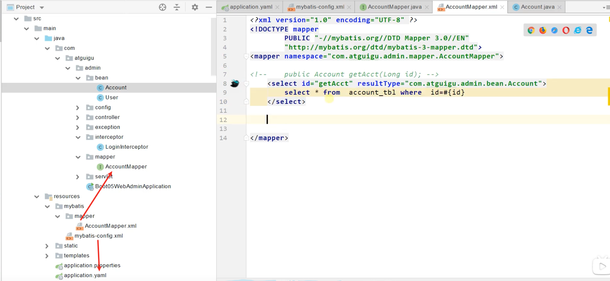

```xml
<?xml version="1.0" encoding="UTF-8" ?>
<!DOCTYPE mapper
        PUBLIC "-//mybatis.org//DTD Mapper 3.0//EN"
        "http://mybatis.org/dtd/mybatis-3-mapper.dtd">
<mapper namespace="com.atguigu.admin.mapper.AccountMapper">
<!--    public Account getAcct(Long id); -->
    <select id="getAcct" resultType="com.atguigu.admin.bean.Account">
        select * from  account_tbl where  id=#{id}
    </select>
</mapper>
```

实践步骤

- 导入 mybatis 官方 starter
- 编写 mapper 接口。标注@Mapper 注解，也可以在启动类上加上@MapperScan 替换@Mapper

- 编写 sql 映射文件并绑定 mapper 接口
- 在 application.yaml 中指定 Mapper 配置文件的位置，以及指定全局配置文件的信息 （建议；**配置在 mybatis.configuration**）

#### 2、注解模式

```java
@Mapper
public interface CityMapper {

    @Select("select * from city where id=#{id}")
    public City getById(Long id);

    public void insert(City city);
}
```

#### 3、混合模式

```xml
<!--    public void insert(City city);-->
    <insert id="insert" useGeneratedKeys="true" keyProperty="id">
        insert into  city(`name`,`state`,`country`) values(#{name},#{state},#{country})
    </insert>
```

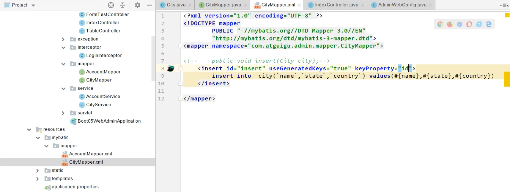

**等价与**

```java
// 使用注解方式获得插入后自增字段
@Insert("insert into  city(`name`,`state`,`country`) values(#{name},#{state},#{country})")
@Options(useGeneratedKeys = true,keyProperty = "id")
public void insert(City city);
```

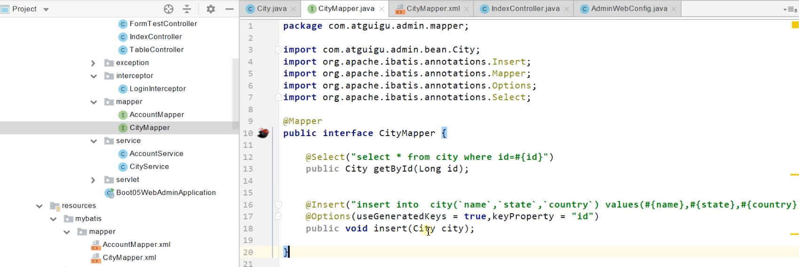

**最佳实战：**

- 引入 mybatis-starter
- **配置 application.yaml 中，指定 mapper-location 位置即可**
- 编写 Mapper 接口并标注 `@Mapper` 注解
- 简单方法直接注解方式
- 复杂方法编写 mapper.xml 进行绑定映射
- `@MapperScan("com.atguigu.admin.mapper")` 简化（加在 `application` 主入口上方），其他的接口就可以不用标注 `@Mapper` 注解

### 4、整合 MyBatis-Plus 完成 CRUD

#### 1、什么是 MyBatis-Plus

 [MyBatis-Plus](https://github.com/baomidou/mybatis-plus) （简称 MP）是一个 [MyBatis](http://www.mybatis.org/mybatis-3/) 的增强工具，在 MyBatis 的基础上只做增强不做改变，为简化开发、提高效率而生。

 [mybatis plus 官网](https://baomidou.com/)

建议安装 **MybatisX** 插件

#### 2、整合 MyBatis-Plus

有了 `MyBatis-Plus` 启动场景之后，不需要 `MyBatis` 启动场景了

```xml
<dependency>
    <groupId>com.baomidou</groupId>
    <artifactId>mybatis-plus-boot-starter</artifactId>
    <version>3.4.1</version>
</dependency>
```

自动配置

- MybatisPlusAutoConfiguration 配置类，MybatisPlusProperties 配置项绑定。**`mybatis-plus：xxx ` 就是对 mybatis-plus 的定制**
- **SqlSessionFactory 自动配置好。底层是容器中默认的数据源**

- **mapperLocations 自动配置好的。有默认值。** `classpath*:/mapper/**/*.xml`；**任意包的类路径下的所有 mapper 文件夹下任意路径下的所有 xml 都是 sql 映射文件。  建议以后 sql 映射文件，放在 mapper 下**
- **容器中也自动配置好了** `SqlSessionTemplate`
- **@Mapper 标注的接口也会被自动扫描；建议直接** `@MapperScan("com.atguigu.admin.mapper")` 批量扫描就行

**优点：**

- 只需要我们的 Mapper 继承 **BaseMapper** 就可以拥有 crud 能力

#### 3、CRUD 功能

```java
    @GetMapping("/user/delete/{id}")
    public String deleteUser(@PathVariable("id") Long id,
                             @RequestParam(value = "pn",defaultValue = "1")Integer pn,
                             RedirectAttributes ra){

        userService.removeById(id);

        ra.addAttribute("pn",pn);
        return "redirect:/dynamic_table";
    }

    @GetMapping("/dynamic_table")
    public String dynamic_table(@RequestParam(value="pn",defaultValue = "1") Integer pn,Model model){
        //表格内容的遍历
//        response.sendError
//     List<User> users = Arrays.asList(new User("zhangsan", "123456"),
//                new User("lisi", "123444"),
//                new User("haha", "aaaaa"),
//                new User("hehe ", "aaddd"));
//        model.addAttribute("users",users);
//
//        if(users.size()>3){
//            throw new UserTooManyException();
//        }
        //从数据库中查出user表中的用户进行展示

        //构造分页参数
        Page<User> page = new Page<>(pn, 2);
        //调用page进行分页
        Page<User> userPage = userService.page(page, null);

//        userPage.getRecords()
//        userPage.getCurrent()
//        userPage.getPages()

        model.addAttribute("users",userPage);

        return "table/dynamic_table";
    }
```

继承 `IService` 和 `ServiceImpl` 会帮我们写一些单表操作

```java
@Service
public class UserServiceImpl extends ServiceImpl<UserMapper,User> implements UserService {
}

public interface UserService extends IService<User> {
}
```

#### 4、定制化

```java
@TableName("user_tb1") //如果表名和类名不同，使用该注解

@TableField(exist = false) //表示该字段在数据库中不存在
```

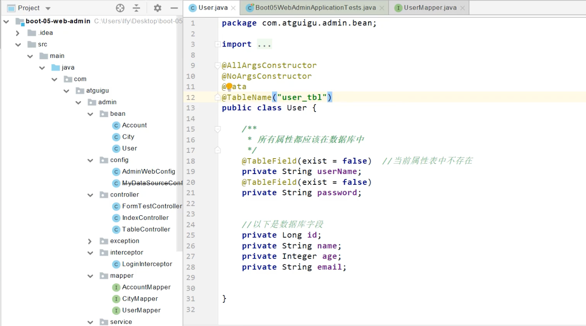
