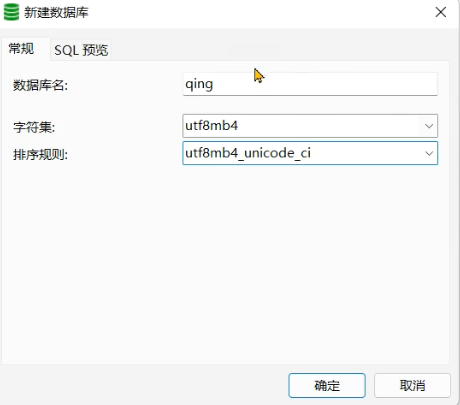
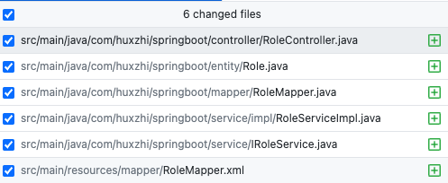
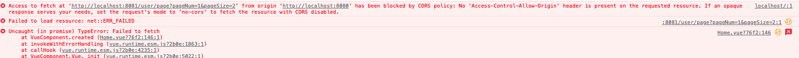

# SpringBoot+Vue 实战教学

 [最适合小白学习的 SpringBoot+Vue 实战教学（2022 年最新版）](https://www.bilibili.com/video/BV1U44y1W77D)

## 技术栈

- 前端
    - Vue2
    - Vue-Router
    - VueX
    - ElementUI
    - Axios
- 后端
    - SpringBoot2
    - Hutool
    - Poi
    - Lombok
    - Mybatis/Mybatis-plus

# Vue2 组件安装

## 软件版本

- jdk 1.8
- mysql 5.7+
- node 14.16.0
- navicat
- idea 2021.3

## vue-cli 安装
`npm install -g @vue/cli`

### 创建 vue 项目

`vue create vue`

Compiles and hot-reloads for development 构建开发版本，具有热重启
```
npm run serve
```
Compiles and minifies for production 构建生产版本
```
npm run build
```

## element 安装
`npm i element-ui -S`

## 封装 axios
vue 安装 axios:
`npm i axios -S`

request.js 封装
```js
import axios from "axios";

const request = axios.create({
    baseURL: "/api", //注意！！ 这里统一加上了'/api '前缀，页面里面写接口的时候就不要加'/api '
    timeout: 5000
})

// request 拦截器
// 可以自请求发送前对请求做一些处理
// 比如统一加token,对请求参数统一加密
request.interceptors.request.use(config => {
    config.headers['Content-Type'] = 'application/json;charset=utf-8';

    // config.headers['token'] = user.token; //设置请求头
    return config
}, error => {
    return Promise.reject(error)
});

// response 拦截器
// 可以在接口响应后统一处理结果
request.interceptors.response.use(
    response => {
        let res = response.data;
        //如果是返回的文件
        if (response.config.responseType === 'blob') {
            return res
        }
        //兼容服务端返回的字符串数据
        if (typeof res === 'string') {
            res = res ? JSON.parse(res) : res
        }
        return res;
    },
    error => {
        console.log('err' + error) // for debug
        return Promise.reject(error)
    }
)

export default request
```

## Vuex
### vuex 安装
`npm i vuex@3 -S`

### 引入 vuex
创建 store.js
```js
import Vue from 'vue'
import Vuex from 'vuex'
import router, {resetRouter} from "@/router";

Vue.use(Vuex)

const store = new Vuex.Store({
    state: {
        currentPathName: ''
    },
    mutations: {
        setPath (state) {
            state.currentPathName = localStorage.getItem("currentPathName")
        },
        logout() {
            // 清空缓存
            localStorage.removeItem("user")
            localStorage.removeItem("menus")
            router.push("/login")

            // 重置路由
            resetRouter()
        }
    }
})

export default store

```

main.js
```js
import store from "@/store";

new Vue({  
    router,  
    store,  
    render: h => h(App)  
}).$mount('#app')
```

router/index.js
```js
router.beforeEach((to, from, next) => {
    localStorage.setItem("currentPathName", to.name)  // 设置当前的路由名称
    store.commit("setPath") //触发store的数据更新

    next() // 其他的情况都放行
})
```

Header.vue
```vue
computed: {  
 currentPathName() {  
 return this.$store.state.currentPathName;　　//需要监听的数据  
 }  
},

//使用
<el-breadcrumb separator="/" style="display: inline-block; margin-left: 10px">  
 <el-breadcrumb-item :to="'/'">首页</el-breadcrumb-item>  
 <el-breadcrumb-item>{{ currentPathName }}</el-breadcrumb-item>  
</el-breadcrumb>
```

## Echarts

官网 https://echarts.apache.org/zh/index.html

安装 `npm i echarts -S`

引入 `import * as echarts from 'echarts';`

# SpringBoot 组件安装

## mysql 设置



## MyBatis-Plus
GitHub： [MyBatis-Plus ](https://github.com/baomidou/mybatis-plus)
官网：https://baomidou.com/

Spring Boot Maven：

```xml
<dependency>
    <groupId>com.baomidou</groupId>
    <artifactId>mybatis-plus-boot-starter</artifactId>
    <version>3.5.1</version>
</dependency>
```

### 注解标识

entity.User
```java
@Data
@NoArgsConstructor
@AllArgsConstructor
@TableName(value = "sys_user") // mybatis-plus 数据库表名
public class User {
    @TableId(value = "id", type = IdType.AUTO) // mybatis-plus 指定主键
    private Integer id;
    private String username;
    @JsonIgnore //忽略某个字段，不展示给前端
    private String password;
    private String nickname;
    private String email;
    private String phone;
    @TableField(value = "address")// mybatis-plus 取别名，指定数据库的字段名称
    private String address;
}
```

### 代码生成器

pom 依赖

```xml
<!-- mybatis-plus 代码生成器-->
<dependency>
    <groupId>com.baomidou</groupId>
    <artifactId>mybatis-plus-generator</artifactId>
    <version>3.5.1</version>
</dependency>
<!-- 代码生成器 的模版引擎
https://mvnrepository.com/artifact/org.apache.velocity/velocity -->
<dependency>
    <groupId>org.apache.velocity</groupId>
    <artifactId>velocity</artifactId>
    <version>1.7</version>
</dependency>
```

将自动创建 6 个文件，包括
- Entity 实体类
- Mapper 类
- Mapper.xml 配置文件
- Service 接口
- ServiceImpl 实现类
- Controller 类




## 集成 Swagger-Ui

```xml
<!-- API接口swagger3-->  
<dependency>  
 <groupId>io.springfox</groupId>  
 <artifactId>springfox-boot-starter</artifactId>  
 <version>3.0.0</version>  
</dependency>
```

`SwaggerConfig.java`

```java
package com.huxzhi.springboot.config;  
  
import org.springframework.context.annotation.Bean;  
import org.springframework.context.annotation.Configuration;  
import springfox.documentation.builders.ApiInfoBuilder;  
import springfox.documentation.builders.PathSelectors;  
import springfox.documentation.builders.RequestHandlerSelectors;  
import springfox.documentation.oas.annotations.EnableOpenApi;  
import springfox.documentation.service.ApiInfo;  
import springfox.documentation.spi.DocumentationType;  
import springfox.documentation.spring.web.plugins.Docket;  
  
@Configuration  
@EnableOpenApi  
public class SwaggerConfig {  
    /**  
 * 创建API应用 * apiInfo() 增加API相关信息 * 通过select()函数返回一个ApiSelectorBuilder实例,用来控制哪些接口暴露给Swagger来展现, * 本例采用指定扫描的包路径来定义指定要建立API的目录。 * * @return  
 */  
 @Bean  
 public Docket restApi() {  
        return new Docket(DocumentationType.SWAGGER_2)  
                .groupName("标准接口")  
                .apiInfo(apiInfo("Spring Boot中使用Swagger2构建REST_ful APIs", "1.0"))  
                .useDefaultResponseMessages(true)  
                .forCodeGeneration(false)  
//                .host("localhost:8080")  
 .select()  
                .apis(RequestHandlerSelectors.basePackage("com.huxzhi.springboot.controller"))//controller路径  
 .paths(PathSelectors.any())  
                .build();  
 }  
  
    /**  
 * 创建该API的基本信息(这些基本信息会展现在文档页面中) * 访问地址: http://ip:port/swagger-ui.html * * @param title  
 * @param version  
 * @return  
 */  
 private ApiInfo apiInfo(String title, String version) {  
        return new ApiInfoBuilder()  
                .title("RestAPI Docs")  
                .termsOfServiceUrl("http://www.github.com/kongchen/swagger-maven-plugin")  
                .version(version)  
                .build();  
  
 }  
}
```

访问地址: http://localhost:8081/swagger-ui/index.html

## hutool 工具
pom
```xml
<!-- hutool  -->
<dependency>
    <groupId>cn.hutool</groupId>
    <artifactId>hutool-all</artifactId>
    <version>5.7.20</version>
</dependency>
<dependency>
    <groupId>org.apache.poi</groupId>
    <artifactId>poi-ooxml</artifactId>
    <version>4.1.2</version>
</dependency>
```

设置浏览器响应的格式
```java
 // 设置浏览器响应的格式，固定写法
response.setContentType("application/vnd.openxmlformats-officedocument.spreadsheetml.sheet;charset=utf-8");
String fileName = URLEncoder.encode("用户信息", "UTF-8");
response.setHeader("Content-Disposition", "attachment;filename=" + fileName + ".xlsx");
```

## 集成 JWT

JWT 的三个部分依次如下。中间用点（`.`）分隔成三个部分
- Header（头部）
- Payload（负载）
- Signature（签名）

pom
```xml
<dependency>
    <groupId>com.auth0</groupId>
    <artifactId>java-jwt</artifactId>
    <version>3.10.3</version>
</dependency>
```

### 拦截器 JwtInterceptor
```java
public class JwtInterceptor implements HandlerInterceptor {

    @Autowired
    private IUserService userService;

    @Override
    public boolean preHandle(HttpServletRequest request, HttpServletResponse response, Object handler) {
        String token = request.getHeader("token");
        // 如果不是映射到方法直接通过
        if (!(handler instanceof HandlerMethod)) {
            return true;
        }
        // 执行认证
        if (StrUtil.isBlank(token)) {
            throw new ServiceException(Constants.CODE_401, "无token，请重新登录");
        }
        // 获取 token 中的 user id
        String userId;
        try {
            userId = JWT.decode(token).getAudience().get(0);
        } catch (JWTDecodeException j) {
            throw new ServiceException(Constants.CODE_401, "token验证失败，请重新登录");
        }
        // 根据token中的userid查询数据库
        User user = userService.getById(userId);
        if (user == null) {
            throw new ServiceException(Constants.CODE_401, "用户不存在，请重新登录");
        }
        // 用户密码加签验证 token
        JWTVerifier jwtVerifier = JWT.require(Algorithm.HMAC256(user.getPassword())).build();
        try {
            jwtVerifier.verify(token); // 验证token
        } catch (JWTVerificationException e) {
            throw new ServiceException(Constants.CODE_401, "token验证失败，请重新登录");
        }
        return true;
    }
}

```

### 工具类 TokenUtils

主要看怎么 生成 token
```java
@Component
public class TokenUtils {

    private static IUserService staticUserService;

    @Resource
    private IUserService userService;

    //静态方法通过这种方式获得数据
    @PostConstruct //在Bean初始化之后（构造方法和@Autowired之后）执行指定操作。经常用在将构造方法中的动作延迟。
    public void setUserService() {
        staticUserService = userService;
    }

    /**
     * 生成token
     *
     * @return
     */
    public static String genToken(String userId, String sign) {
        return JWT.create().withAudience(userId) // 将 user id 保存到 token 里面,作为载荷
                .withExpiresAt(DateUtil.offsetHour(new Date(), 2)) // 2小时后token过期
                .sign(Algorithm.HMAC256(sign)); // 以 password 作为 token 的密钥
    }

    /**
     * 获取当前登录的用户信息
     *
     * @return user对象
     */
    //静态方法
    public static User getCurrentUser() {
        try {
            HttpServletRequest request = ((ServletRequestAttributes) RequestContextHolder.getRequestAttributes()).getRequest();
            String token = request.getHeader("token");
            if (StrUtil.isNotBlank(token)) {
                String userId = JWT.decode(token).getAudience().get(0);
                return staticUserService.getById(Integer.valueOf(userId));
            }
        } catch (Exception e) {
            return null;
        }
        return null;
    }
}
```

# 遇到问题，解决方案
## 前端跨域问题


解决跨域问题， 创建 `CorsConfig.java` 类

```java
/**
 * 解决跨域问题
 */
@Configuration
public class CorsConfig {
    //当前跨域请求最大有效时长。这里默认1天
    public static final long MAX_AGE = 24 * 60 * 60;

    private CorsConfiguration buildConfig() {
        CorsConfiguration corsConfiguration = new CorsConfiguration();
        corsConfiguration.addAllowedOrigin("*");// 1 设置访问源地址
        corsConfiguration.addAllowedHeader("*");// 2 设置访问源请求头
        corsConfiguration.addAllowedMethod("*");// 3 设置访问源请求方法
        corsConfiguration.setMaxAge(MAX_AGE);
        return corsConfiguration;
    }

    @Bean
    public CorsFilter corsFilter() {
        UrlBasedCorsConfigurationSource source = new UrlBasedCorsConfigurationSource();
        source.registerCorsConfiguration("/**", buildConfig()); // 4 对接口配置跨域设置
        return new CorsFilter(source);
    }
}
```
