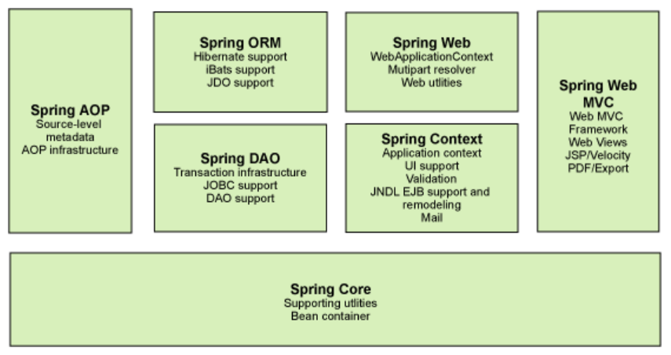
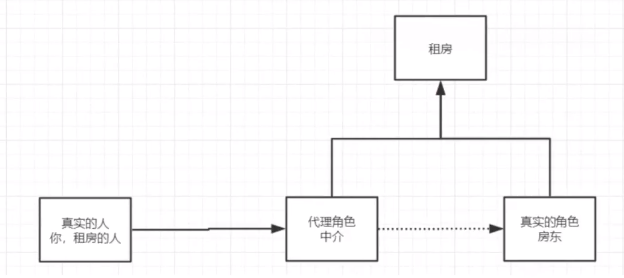
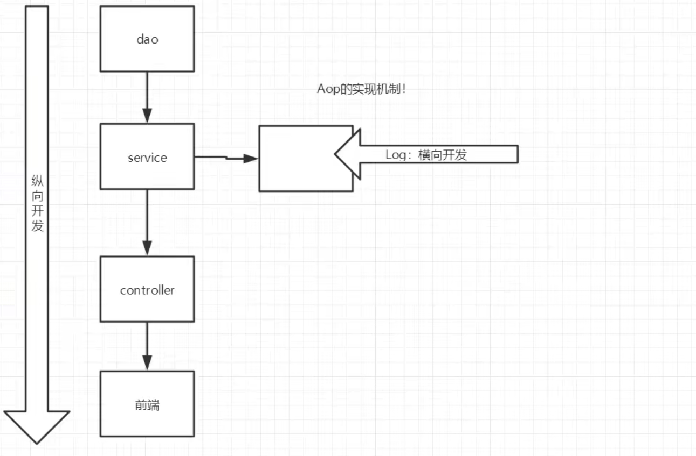
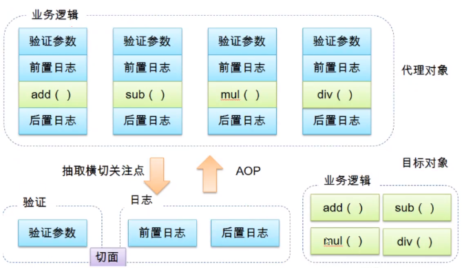
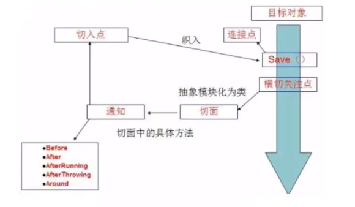
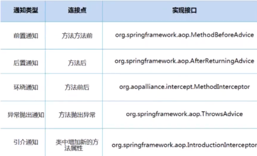

# 1、Spring

### 1.1、简介

官网：<https://spring.io/projects/spring-framework#overview>

官方下载地址：<https://repo.spring.io/ui/native/release/org/springframework/spring>

```xml
<!-- https://mvnrepository.com/artifact/org.springframework/spring-web -->
<dependency>
    <groupId>org.springframework</groupId>
    <artifactId>spring-web</artifactId>
    <version>5.2.0.RELEASE</version>
</dependency>
<!-- https://mvnrepository.com/artifact/org.springframework/spring-web -->
<dependency>
    <groupId>org.springframework</groupId>
    <artifactId>spring-jdbc</artifactId>
    <version>5.2.0.RELEASE</version>
</dependency>

```

### 1.2、优点

- Spring是一个开源的免费的框架（容器）
- Spring是一个轻量级的、非入侵式的框架
- 控制反转（IOC）、面向切面编程（AOP）
- 支持事务的处理，对框架整合的支持

==总结一句话：Spring就是一个轻量级的控制反转（IOC）和面向切面编程（AOP）的框架==

### 1.3、组成



### 1.4、IOC

注入配置

Spring容器还提供了一个更简单的`@PropertySource`来自动读取配置文件。我们只需要在`@Configuration`配置类上再添加一个注解：

```java
@Configuration
@ComponentScan
@PropertySource("app.properties") // 表示读取classpath的app.properties

public class AppConfig {
    @Value("${app.zone:Z}")
    String zoneId;

    @Bean
    ZoneId createZoneId() {
        return ZoneId.of(zoneId);
    }
}
```

如果当前的Profile设置为`test`，则Spring容器会调用`createZoneIdForTest()`创建`ZoneId`，否则，调用`createZoneId()`创建`ZoneId`。注意到`@Profile("!test")`表示非test环境。

在运行程序时，加上JVM参数`-Dspring.profiles.active=test`就可以指定以`test`环境启动。

实际上，Spring允许指定多个Profile，例如：

```
-Dspring.profiles.active=test,master
```

==Spring通过CGLIB创建的代理类，不会初始化代理类自身继承的任何成员变量，包括final类型的成员变量==


```java
private UserDao userDao;

//利用set进行动态实现值的注入
public void setUserDao(UserDao userDao) {
    this.userDao = userDao;
}
```

使用了set注入后，程序不在具有主动性

# 8、使用注解开发

在Spring4之后，要使用注解开发，必须要保证 aop的包导入了

```xml
<?xml version="1.0" encoding="UTF-8"?>
<beans xmlns="http://www.springframework.org/schema/beans"
    xmlns:xsi="http://www.w3.org/2001/XMLSchema-instance"
    xmlns:context="http://www.springframework.org/schema/context"
    xsi:schemaLocation="http://www.springframework.org/schema/beans
        https://www.springframework.org/schema/beans/spring-beans.xsd
        http://www.springframework.org/schema/context
        https://www.springframework.org/schema/context/spring-context.xsd">

    <!--指定要扫描的包,这个包下的注解就会生效-->
    <context:component-scan base-package="com.kuang"/>
    <context:annotation-config/>

</beans>
```

使用注解需要导入context约束，增加注解的支持！

1. bean

2. 属性如何注解
   ```java
   @Component
   public class User {
   
       public String name;
   	
       //相当于<property name="name"value="kuangshen"/>
       @Value("kuangshen")
       public void setName(String name){
           this.name=name;
       }
   }
   ```

3. 衍生的注解
   @Component有几个衍生注解，我们在web开发中，会按照mVc三层架构分层！

   - dao【@Repository】
   - service【@Service】
   - controller【@Controller】

   这四个注解功能都是一样的，都是代表将某个类注册到Spring中，装配Bean

4. 自动装配置

   ```java
   -@Autowired:自动装配通过类型.名字
   	如果Autowired不能唯一自动装配上属性,则需要通过@Qualifier(value="xxx")
   -@Nu11ab1e字段标记了这个注解,说明这个字段可以为nu11;
   -@Resource:自动装配通过名字.类型.
   ```

5. 作用域

   ```java
   @Component
   @Scope("prototype")
   public class User {

       public String name;

       //相当于<property name="name"value="kuangshen"/>
       @Value("kuangshen")
       public void setName(String name){
           this.name=name;
       }
   }
   ```

6. 小结

# 10 代理模式



### 10.1、静态代理

角色分析：

- 抽象角色：一般会使用接口或者抽象类来解决
- 真实角色：被代理的角色
- 代理角色：代理真实角色，代理真实角色后，我们一般会做一些附属操作
- 客户：访问代理对象的人！

代码步骤：

1.接口
2.真实角色
3.代理角色
4.客户端访问代理角色

代理模式的好处：

- 可以使真实角色的操作更加纯粹！不用去关注一些公共的业务
- 公共也就就交给代理角色！实现了业务的分工！
- 公共业务发生扩展的时候，方便集中管理！

缺点：

- 一个真实角色就会产生一个代理角色；代码量会翻倍一开发效率会变低

### 10.2、加深理解

聊聊AOP




### 10.3、动态代理

- 动态代理和静态代理角色一样
- 动态代理的代理类是动态生成的，不是我们直接写好的！
- 动态代理分为两大类：基于接口的动态代理，基于类的动态代理
    - 基于接口--JDK动态代理【我们在这里使用】
    - 基于类：cglib 
    - java字节码实现：javasist


需要了解两个类：Proxy：代理，InvocationHandler：调用处理程序


动态代理的好处：

- 可以使真实角色的操作更加纯粹！不用去关注一些公共的业务
- 公共也就就交给代理角色！实现了业务的分工！
- 公共业务发生扩展的时候，方便集中管理！
- 一个动态代理类代理的是一个接口，一般就是对应的一类业务


# 11、AOP

### 11.1 什么是AOP

AOP（Aspect Oriented Programming）意为：面向切面编程，通过预编译方式和运行期动态代理实现程序功能的统一维护的一种技术。AOP是OOP的延续，是软件开发中的一个热点，也是Spring框架中的一个重要内容，是函数式编程的一种衍生范型。利用AOP可以对业务逻辑的各个部分进行隔离，从而使得业务逻辑各部分之间的耦合度降低，提高程序的可重用性，同时提高了开发的效率。




### 11.2Aop在Spring中的作用

==提供声明式事务；允许用户自定义切面==

- 横切关注点：跨越应用程序多个模块的方法或功能。即是，与我们业务逻辑无关的，但是我们需要关注的部分，就是横切关注点。如日志，安全，缓存，事务等等…
- 切面（ASPECT）：横切关注点被模块化的特殊对象。即，它是一个类。
- 通知（Advice）：切面必须要完成的工作。即，它是类中的一个方法。
- 目标（Target）：被通知对象。
- 代理（Proxy）：向目标对象应用通知之后创建的对象。
- 切入点（PointCut）：切面通知执行的“地点”的定义。
-  连接点（JointPoint）：与切入点匹配的执行点。



SpringAOP中，通过Advice定义横切逻辑，Spring中支持5种类型的Advice：



即Aop在不改变原有代码的情况下，去增加新的功能.

### 11.3使用Spring实现Aop

【重点】使用AOP织入，需要导入一个依赖包！

```xml
<!--https://mvnrepository.com/artifact/org.aspectj/aspectjweaver-->
<dependency>
     <groupId>org.aspectj</groupId>
     <artifactId>aspectjweaver</artifactId>
     <version>1.9.4</version>
</dependency>
```


方式一：使用Spring的APl接口【主要SpringAPl接口实现】

方式二：自定义来实现AOP【主要是切面定义】

方式三：使用注解方式实现AOP


