# Java 基础

# Java 基础班---Day01
2019 年 7 月 2 日 星期二上午 10:09

1-1 常见 dos 命令：

- dir 查看当前目录中包含所有的目录以及文件
- cd 路径
- Cd.. 返回上一级目录
- Cd\ 返回到当前目录的根目录
- D: 切换盘符
- cls 清屏

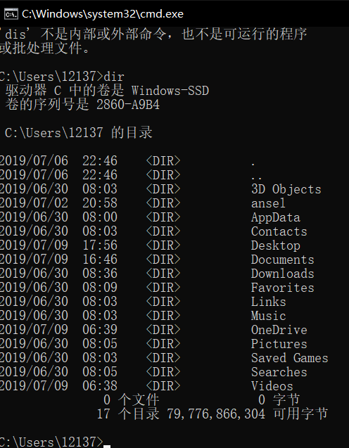

编写程序
```java
class Hello{

public static void main(String[] args){

System.out.print("HolleWord");

}

}
```
argumeets 参数 args

输出语句
```java
System.out.print("编写大小写字母、汉字、数字以及特殊符号，是输出后不换行");

System.out.println("输出内容同上，但是输出后换行");

System.out.println();//表示换一行

System.out.println(1 + 2 + 3);//结果是 6

System.out.println("1 + 2 + 3");//结果是 "1 + 2 + 3"
```
public class 与 class 区别

- 一个类面前 public 是可有可无的
- 如果一个类使用 public 修饰则文件名必须与类名一致
- 如果一个类前面没有使用 public 修饰，则文件名可以与类名不一致，当编译成功后会生成对应类名的字节码文件
- 一个类中的 mian 方法是可有可无的，如果没有编写 main 方法编译成功，但是不能运行
- 在一个源文件中编写任意多个类，当编译成功后自动生成对应类的个数的字节码文件，并可以运行每个字节码文件（必须保证有入口）
- 在一个源文件中最多有一个类前面使用 public 修饰

# Java 基础班---Day02
2019 年 7 月 2 日 15:42

2-1 classpath

- 注意：当在默认情况下，运行某个字节码文件时在当前目录下找，如果找到运行的字节码文件则执行，否则报错
- 配置 classpath
    - 临时配置 classpath
        - 使用 set 命令完成临时配置 classpath

set classpath=C: \Users\Java\Desktop\Javase\day02

set classpath=C: \Users\Java\Desktop\Javase\day02

**;**

**没有分号，只在配置路径找；**

**有分号，先在配置路径找，未找到，去当前目录找**

- 使用 set 命令完成查看是否配置 classpath

set classpath

- 使用 set 命令完成删除 classpath 配置

set classpath=

- 永久配置 classpath

跟配置环境变量类似

2-2 关键字

在 Java 中具有特殊意义的，全部小写

如：class public static void

2-3 标识符

- 也就是名字，对类名、变量名称、方法名称、参数名称等的修饰
- 标识符的命名规则
    - 以字母、下划线_ 或 $ 开头，其后可以是字母、数字、下划线_或 $ ，区分大小写，不能使用关键字
    - 如：Aa  $h  m5  abc69_  $_
    - 如：hello  Hello  HELLO
- 标识符命名规范
    - 建议：见名知意，也就是说最好编写单词，如：name  age
    - 建议：类名的每个单词首字母大写，如：Hello Student
    - 建议：变量名称、方法名称、参数名称采用驼峰命名法，如：age  getInfo print
    - 建议：标识符的长度不要超过 15 个字符，如：HelloWord

args(argumeets)  avg(average)

2-4 字面值

- 整数类型字面值，如：100    9-1      0
- 浮点类型字面值，如：0.1      3.1415-98.999
- 字符串类型字面值，如："你好"   "北京市"    "98"
    - 字符串：表示一次可以存放 0 个、1 个或多个，但是必须使用英文的双引号引起来
- 字符类型字面值，如：'a'     '6'    '男'
    - 字符类型：表示一次只能存放一个，并且使用英文的单引号引起来
- 布尔类型字面值，如：true false
    - 布尔类型：表示只有两个取值，分别是 true、false

2-5 进制以及进制之间转换

- 常用进制：
    - 二进制：在计算机中使用，取值范围 0 和 1，以 0b 或 0B 开头，不区分大小写，如：0b10
    - 八进制：取值范围 0-7，以 0 开头，如：010
    - 十进制：在日常生活中使用，取值范围 0-9
    - 十六进制：取值范围 0-9 和 A-F，以 0x 或 0X 开头，如：0x10
- 二进制和十进制（正整数）之间转换，如：10-->0b1010
    - 十进制转为二进制，称为除 2 取余法
    - 二进制转为十进制，称为乘 2 叠加法

2-6 字符编码

- 字符编码：按某种格式某种规定将数据存在计算机中
- 常用字符编码
    - ASCII：'a'---->97   'b'----->98

     'A'--------->65

     '0'--------->48

 ' '--------->32

- iso8859-1:西欧语言编码，兼容 ASCII
- GBK/GB2312:中文编码
- Unicode:统一全球所有国家的文字
    - 常用的有：utf-8    utf-16  utf-32

注意：Java 源代码采用 unicode 编码

乱码、编码、解码

2-7 变量

- 变量：存放数据的，并且该变量中的数据是可以发生改变的
- 常用的数据类型
    - 整数类型 int       浮点类型 double    字符串类型    string
    - 字符类型 char   布尔类型 boolean
- 变量的操作步骤
    - 第一步：声明变量，也就是确定当前存放数据的类型
        - 语法格式：数据类型、变量名称
        - 如：int a;
    - 第二步：赋值，也就是将=右侧的值赋给等号左边的变量
        - 语法格式：变量名称=值；
        - 如：a = 18;
    - 第三部：使用
        - 注意：暂时使用为输出变量中的值

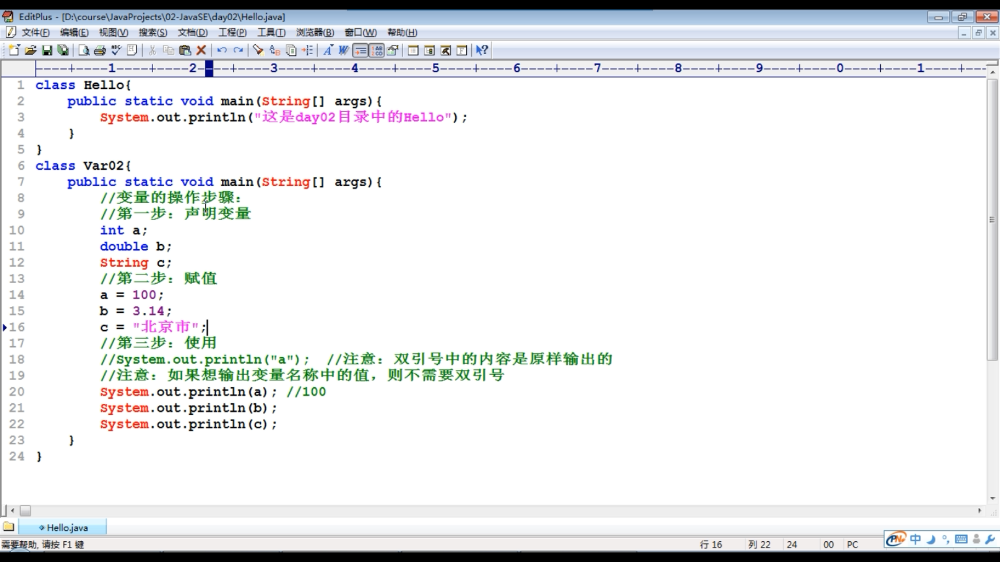

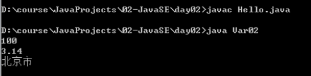

- 优化 Var02 类中的代码
    - 在声明中同时完成赋值，也就是说第一步和第二步合二为一
    - 语法格式：数据类型 变量名称 = 值;
    - 如： int a = 100;
    - //使用
        - System.out.println("a = " + a);    //+表示连接

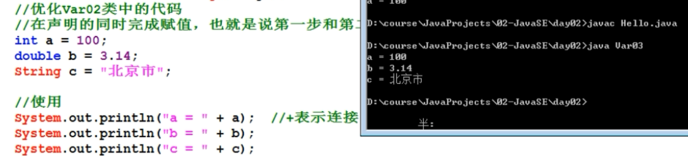

- 优化 Var03 类中的代码
    - 如果有多个变量类型相同时，则可以一次声明多个变量，之间使用英文的逗号隔开
    - 如：double a,b,c;

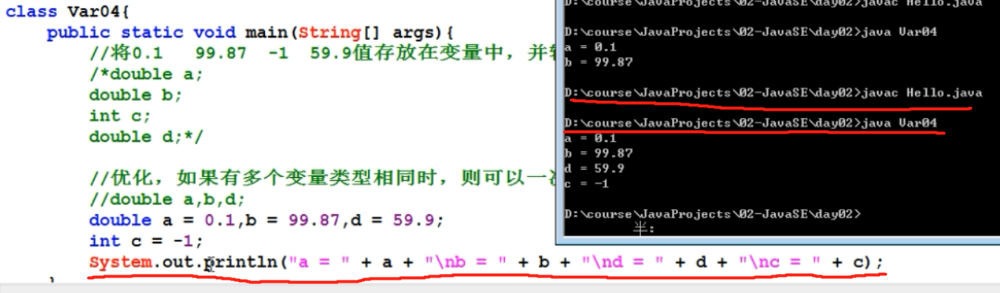

//其中\n 表示换一行

2-8 转义序列符号

- \n  表示换一行
- \t  表示水平制表符
- \\  表示输出一个反斜杠\
- \"  表示输出一个双引号"
- \'   表示输出一个单引号'
- \u0000 后面接四位数字 表示 unicode 转义序列符，输出一个空格

2-9 变量分类

- 变量按声明位置（作用范围）分为：
    - 局部变量：在方法中声明的
    - 成员变量：在类中声明的
- 变量按数据类型分为：
    - 基本数据类型变量：在内存中存放真正的值，比如 int、char、double
    - 引用数据类型变量：在内存中存放地址（引用），如：String
    - 总结：
        1.  当运行程序时，在内存中 JVM 会自动分配空间
        2.  内存中包含：
            1.  栈：存放方法以及方法中的局部变量
            2.  堆：存方法对象
            3.  方法区：代码片段，常量池，静态属性

常量池中存放的是字符串的值

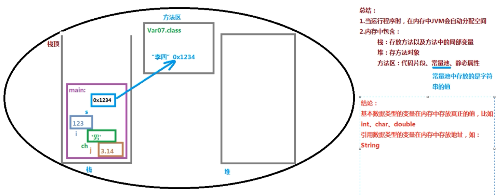

2-10 基本数据类型

又分为 4 大类，共计 8 种

- 整数类型：byte short int long
    - 整数类型中默认为 int
    - 整数类型各自取值范围

| 类型  | 占用存储空间 | 存储范围   |
| ----- | ------------ | ---------- |
| byte  | 1 字节       | -128~127   |
| short | 2 字节       | -215~215-1 |
| int   | 4 字节       | -231~231-1 |
| long  | 8 字节       | -263~263-1 |

- 在 Java 中，当对 byte short char 类型赋值时，如果没有超出该类型取值范围则可以直接赋值
- 在 Java 中，取值范围小的类型可以直接赋给取值范围大的类型，构成自动类型转换
    - long d =6;//构成自动类型转换
    - d = 12345678909；//出现编译错误，因为值默认为 int，超出 int 取值范围
    - 解决办法：将右侧的值后面添加 L 或 l，此时该值就为 long，也就是说该值为 long 类型
    - d = 12345678909L；//没有构成自动类型转换，两边都是 long 类型

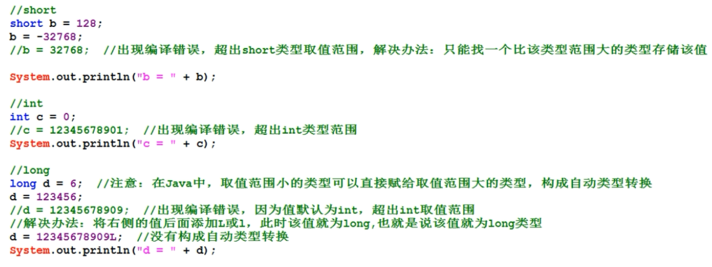

- 浮点类型：float   double
    - 浮点类型默认为 double
    - 浮点类型各自的取值范围：

| 类型   | 占用存储空间 | 存储范围                      |
| ------ | ------------ | ----------------------------- |
| float  | 4 字节       | 3.402823e+38 ~ 1.401298e-45   |
| double | 8 字节       | 1.797693e+308~ 4.9000000e-324 |

- float y = 0.87；//出现编译错误
- 在 Java，取值范围大的类型不能直接给取值范围小的类型赋值
    - 解决办法第一种方法：将 0.87 值变为 float 类型，也就是在该值后面添加 f 或 F，然后再给左侧 float 类型赋值
    - float y = 0.87f；//没有构成类型转换
    - 解决办法第二种方法：当取值范围大的类型赋给取值范围小的类型时，必须进行强制类型转换，也就是说在该值前面添加(目标类型)
    - float y = (float)0.87；//构成强制类型转换

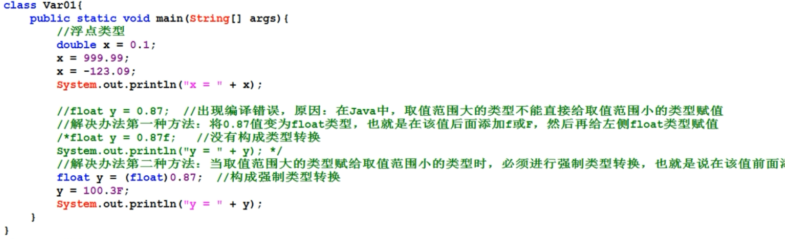

- 字符类型：char
    - 字符类型：一次只能存放一个，并且使用英文的单引号引起来
    - 一个汉字表示一个字符
    - 字符类型取值范围：0-65535，占 2 个字节
    - 整数类型与字符类型之间是可以进行相互转换的
    - 整数值可以给字符类型直接赋值，字符中存放的就是 ASCII 对应的字符
    - 字符也可以直接给 int 类型赋值，int 类型的变量中存放的就是对应字符的 ASCII 值

i ='a'

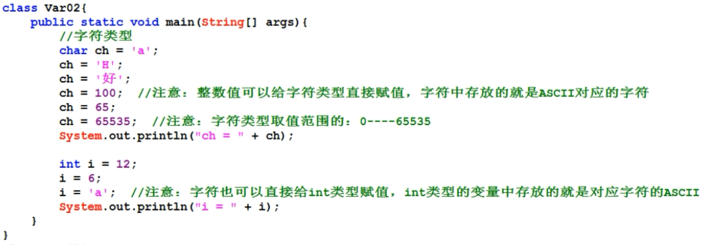

- 布尔类型：boolean
    - 布尔类型只有两种取值，分别是 ture、false
    - 布尔类型占 1 个字节

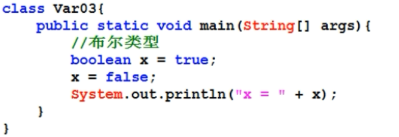

2-11 类型之间转换

- 自动类型转换也叫做隐式类型转换
    - 当取值范围小的类型赋给取值范围大的类型
- 强制类型转换也叫做显式类型转换
    - 当取值范围大的类型赋给取值范围小的类型，则必须进行强制类型转换，但是进行强制类型转换时可能存在精度丢失


# Java 基础班---Day03
2019 年 7 月 6 日 18:51

- 3-1 类型转换 6 条规则
    - 基本数据类型中除了 boolean 类型以外，剩余 7 种类型可以进行相互转换
    - 当取值范围小的类型赋给取值范围大的类型，构成自动类型转换也叫做隐式类型转换
        - byte short char int long float double.
    - 当取值范围大的类型不能直接给取值范围小的类型赋值，则必须进行强制类型转换也叫做显式类型转换，但是可能会存在精度丢
    - 当对 byte short char 类型赋值时，如果没有超出该类型取值范围则可以直接赋值
    - 当对 byte short char 类型进行混合运算时，则先转为 int 类型然后再进行计算
    - 当多种数据类型进行混合运算时，则选转为取值范围大的类型，然后再进行计算

3-2 算术运算符

- <br />
    | +   | -   | *   | /   | %(求余数，取模) | ++  |
    | --- | --- | --- | --- | --------------- | --- |
    |     |     |     |     |                 |     |


- +
    - 当+两边的操作数都是数值类型，则做加法运算
    - 当+两边的操作数中有一个为非数值类型，则做连接，最终连接后的结果为 String

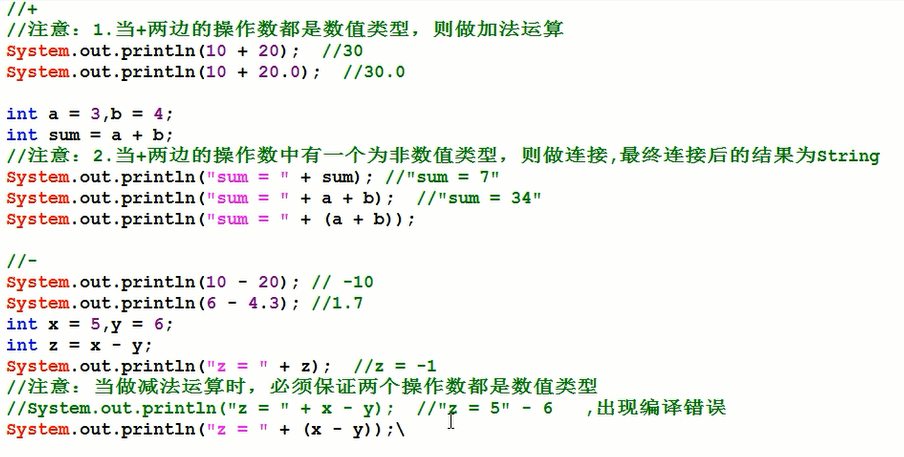

- -
    - 当做减法运算时，必须保证两个操作数都是数值类型。
- *

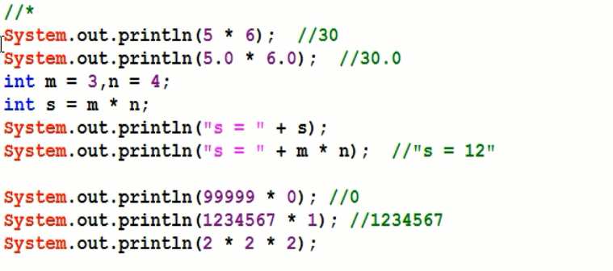

- /
    - 除数不不能为 0

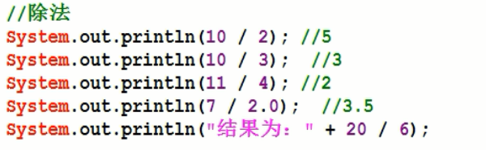

- %

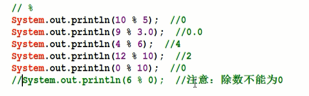

- ++
    - ++表示自身加 1
    - ++又分为：前置++、后置++
        - 前置++：将++编写在变量名称前面，先自身加 1，然后再做其他运算
        - 后置++：将++编写在变量名称后面，先做其他运算，然后再自身加 1

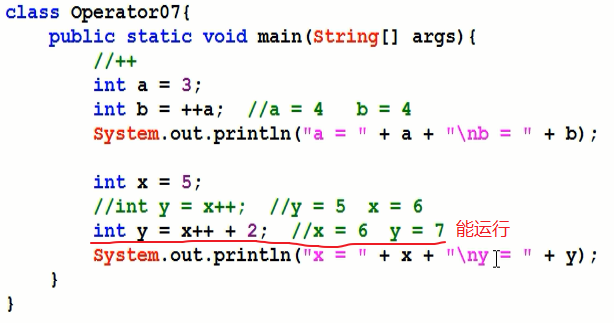

- --
    - 表示自身减 1
    - 又分为：前置、后置
    -

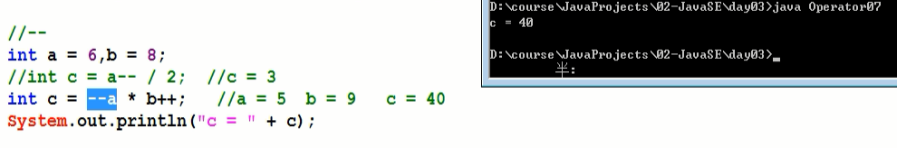

3-3 连接运算符

- +
    - 作用：连接、求和

3-4 赋值运算符

- =
    - 将右侧的值赋给左侧的变量名称
- 扩展赋值运算符
    - <br />
        | +=  | -=  | *=  | /=  | %=  |
        | --- | --- | --- | --- | --- |
        |     |     |     |     |     |


-
    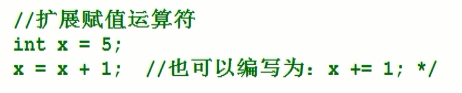
-
    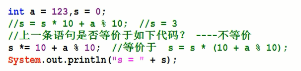
- 当是扩展赋值运算符时，变量最终的数据类型没有发生改变

int x = 10;

//x += 0.5;  //结果 x = 10

 //x = x + 0.5;  //出现编译错误

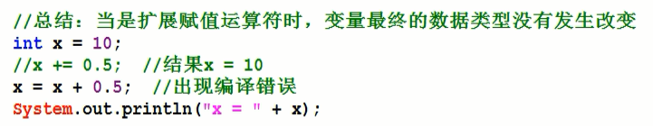

3-5 关系运算符

- > <        >=            <=            ==            !=
    - 关系运算符：最终结果为 boolean 类型的值
    - 优先级别：算术运算符 > 关系运算符 > 赋值运算符

**3-6**

**逻辑运算符**

- 逻辑与&            逻辑或|        逻辑异或^        逻辑非!

短路与&&        短路或||

总结：逻辑运算符:最终结果为 boolean 类型的值

- 逻辑与&，表示并且
    - 当两个条件同时为 true 时，则结果为 true,否则结果为 false
- 逻辑或|，表示或者
    - 当两个条件中有一个为 true 时，则结果为 true,否则为 false
- 逻辑异或
    - 当两个条件的值不同时，则结果为 true,否则为 false

true ^ true ------- > false

true ^ false------- > true

fasle ^ false ------ > false

false ^ true ------ > true

- 逻辑非!
    - 表示对 boolean 类型的值进行取反

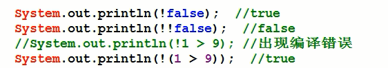

- 短路与&&，类似于逻辑与，都表示并且
    - 短路与、逻辑与运行结果都相同，但是执行过程可能不同，当使用短路与，并且第一个条件为 false 时，则结果直接为 false
    - 建议使用短路与
- 短路或，类似于逻辑或，都表示或者
    - 短路或、逻辑或运行结果都相同，但是执行过程可能不同，当使用短路或，并且第一个条件为 true 时，则结果直接为 true
    - 建议使用短路或

**3-7 =**

**与**

**==**

**、**

**&**

**与**

**&&**

**、**

**|**

**与**

**||**

**区别**

- =与==
    - =属于赋值运算符，将右侧的值赋给左侧的变量名称
    - ==属于关系运算符，判断左右两边的值是否相等，结果为 boolean 类型
- &与&&
    - &是逻辑与， &&是短路与，都属于逻辑运算符，都表示并且，执行结果都相同
    - 当使用短路与，并且第一个条件为 false 时，则结果直接为 false
- |与||
    - |是逻辑或，||是短路或，都属于逻辑运算符，都表示或者，结果都相同
    - 当使用短路或，并且第一个条件为 true 时，则结果直接为 true

**3-8**

**三目运算符**

- 也叫做条件运算符
- 语法格式：   条件 ? 代码 1 : 代码 2

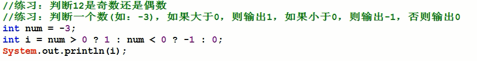

**3-9**

**键盘接收用户输入**

- 第一步：导入包，必须位于 Java 源文件中的第一行
    - import java.util.Scanner;

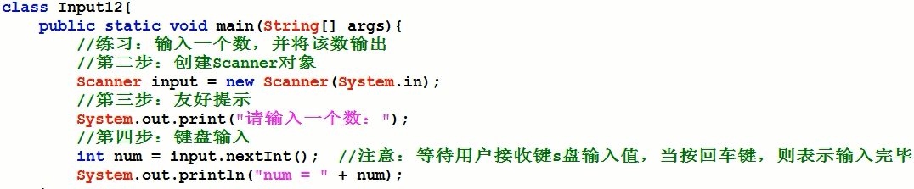

- 第二步：创建 Scanner 对象
    - Scanner input = new Scanner(System.in);
- 第三步：友好提示
    - System.out.print("请输入：");
- 第四步：键盘输入
    - int num = input.nextInt();  //注意：等待用户接收键盘输入值，当按回车键，则表示输入完毕，并将回车之前所输入的内容赋给左侧的变量

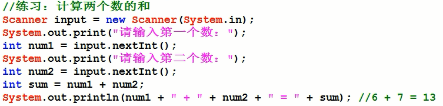

- double score = input.nextDouble();
- String name = input.next();   //注意：在 Java 中，键盘接收字符串类型时没有 nextString(),而使用的是 next()
- boolean isFlag = input.nextBoolean();
- String s = input.next();     //注意：在 Java 中，键盘不能直接接收字符类型，而是先接收字符串类型,然后在字符串中获取第 0 个位置中的值，则使用 charAt(0)
- char sex = s.charAt(0);


|     |
| --- |
|     |

# Java 基础班---Day04
2019 年 7 月 9 日 16:49

**4-1**

**程序流程控制有三大结构**

- 顺序结构：按顺序逐行进行执行
- 选择结构
- 循环结构

**4-2 if**

**选择结构**
语法格式：<br />if(条件){<br />代码块<br />}<br />注意：在 Java 中，当代码块只有一条语句时，则大括号可以省略,建议初学者编写大括号| |

**4-3 if else**
**选择结构**<br />语法格式：<br />if(条件){<br />代码块 1<br />}else{<br />代码块 2<br />}

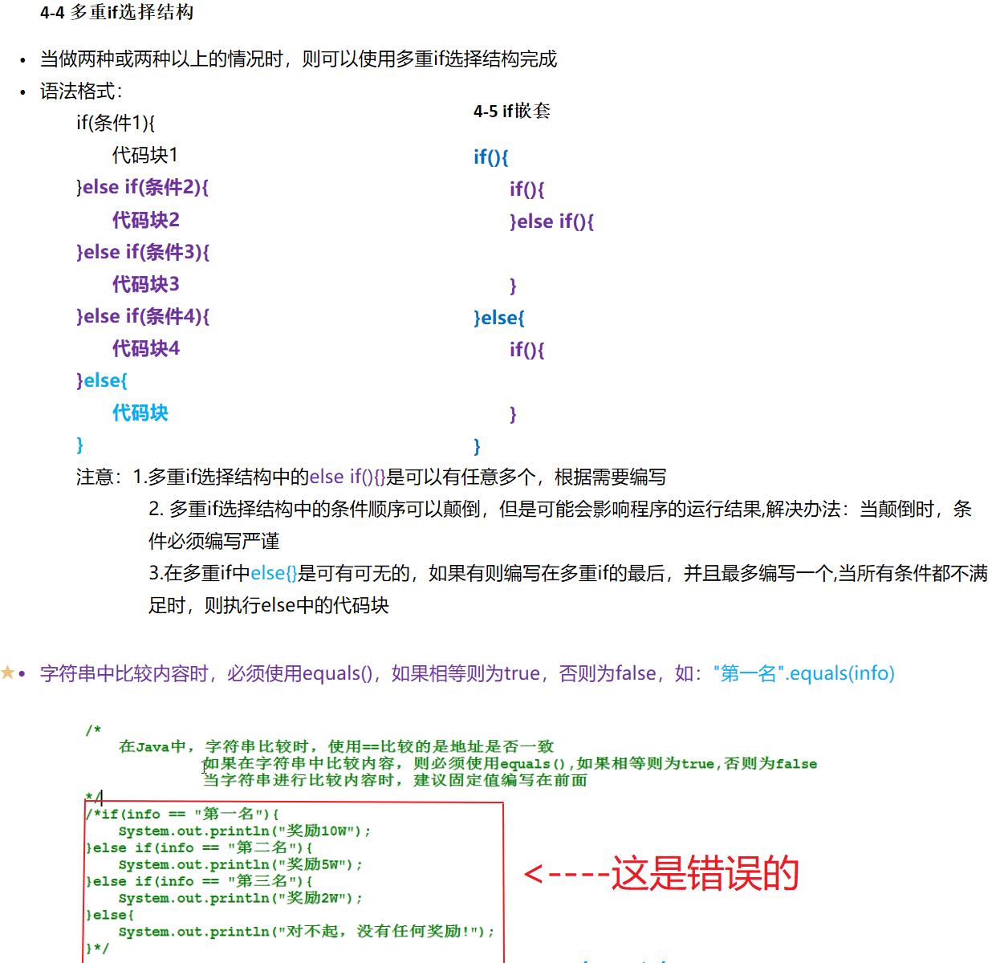
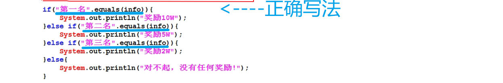
**4-6 switch case**switch(**表达式**){case 常量值 1: break;case 常量值 2: break;**default:****break;**}当所有 case 都不满足时则执行 default 建议 default 编写在所有 case 的后面当没有编写 break，则从当前第一个匹配的 case 一直向下执行(也就是穿透)因此，根据题意适当编写 break
- 当做**等值操作**时，可以使用 switch case
- 语法格式：
- switch case 中表达式可以**byte****、****short****、****int****、****char**，在 JDK7.0 及以后还可以是**String ****类型，枚举**
- 在 switch 中编写任意多个 case
- case 后面常量值的类型必须与表达式的类型一致
- break;  //表示中断，当遇到 break 则执行 switch case 外面的语句
- default 是可有可无的，如果有则一个 switch 中最多编写一个 default,当所有 case 都不满足时则执行 default
- 常见的注意事项：
    - case 后面常量值的顺序可以任意，一般按顺序编写
    - default 顺序也可以编写在 switch 中的任意位置
- break 是可有可无的
- case 也可以合并
-

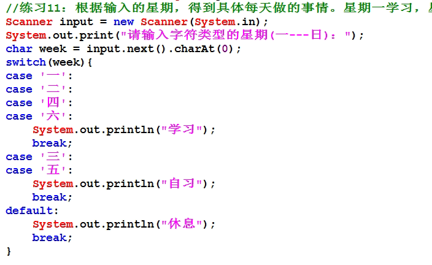

**4-7 多重 if 与 switch case 区别**

- 多重 if：可以做等值操作也可以做区间操作
- switch case：只能做等值操作

# Java 基础班---Day05
2019 年 7 月 9 日 19:09
**5-1**

**循环概念**
- 循环：在 java 中做重复事情，并且重复的只编写一次
- 循环好处：减少代码的冗余性
- 常用的循环：
    - for 循环、while 循环、do while 循环
- 循环特点：
    - 循环条件、循环操作(循环体)

**5-2 for**

**循环****for(****表达式****1****;****表达式****2****;****表达式****3****){****循环体****}**

- 语法格式：
- **在****for ****循环中，表达式****1,****完成变量的初始值，如：****int i = 1****;**
- **在****for ****循环中，表达式****2 ****完成循环条件判断，如果条件满足为****true ****则执行循环体，否则执行循环外面的语句，如：****i<=5**
- **在****for ****循环中，循环体主要做重复事情，并且重复的事情在循环体重只编写一次**
    - **循环体中可以编写****Java ****中任何语句**
    - **如：****System.out.println("HelloWorld!");**
- **在****for ****循环中表达式****3 ****完成变量值的更改，如：****i++**
- **例如：**
-
    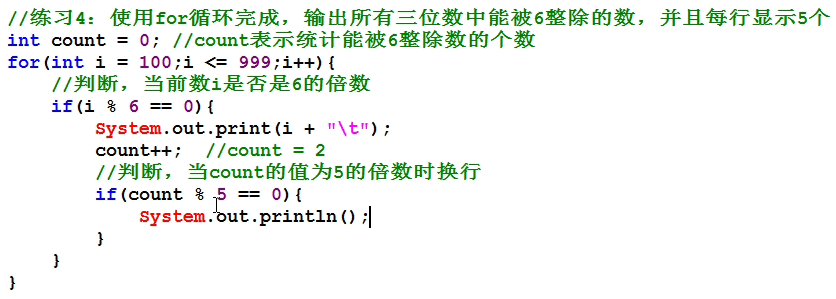

**5-3**

**双重循环****for(;;){**** **** //****称为外层循环****for(;;){**** **** //****称为内层循环****}****}****结论：当外层循环执行一次，则内层循环执行一遍**

- 双重循环也叫做二重循环：在一个完整的循环中又包含另一个完整的循环
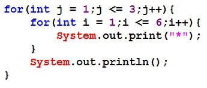
**5-4 for**
**循环注意事项**for(;;){System.out.println("OK");}   int i = 1;for(;i <= 5;i++){System.out.println(i);}for(int i = 1;;i++){System.out.println(i);}for(int i = 1;i <= 5;){System.out.println(i);i++;}int i;for(i = 1;i <= 5;i++){System.out.println(i);}System.out.println(i);  //6
- 注意：1.在 for 循环中，三个表达式都可以省略，但是分号必须编写，则出现死循环也叫做无限循环，解决办法：按 ctrl + c 强行终止程序运行
- 注意：2.在 for 循环中，省略表达式 1，则出现编译错误，解决办法：将表达式 1 编写在 for 循环上面
- 注意：3.在 for 循环中，省略表达式 2，则出现死循环或无限循环，也就是说当省略表达式 2 时，则条件默认为 true
- 注意：4.在 for 循环中，当省略表达式 3，则出现死循环，解决办法：将表达式 3 编写在循环体中最后一条语句
- 注意：5.当 for 循环中表达式 1 变量中的值在循环外进行使用，则出现编译错误，解决办法：将表达式 1 中声明的变量，编写在 for 循环外面进行声明
**5-5 while**
**循环**while(循环条件){循环体}
- 语法格式：
- 执行流程：
    - 首先判断条件，当条件为 true 时，则执行循环体，然后再判断条件………一直到循环条件为 false 时，则循环结束

**5-6 do while**

**循环**do{循环体}while(循环条件)**;**

- 特点：先执行，然后再判断
- 语法格式：
- 执行流程
    - 先执行循环体，然后判断条件，当条件为 true 时，则继续执行循环体，然后再判断条件…….一直到循环条件为 false 时则循环结束
-
    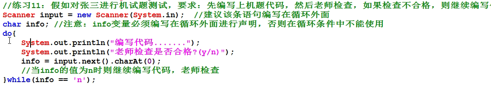

**5-7**

**三种循环异同点**for(表达式 1;表达式 2;表达式 3){循环体} while(循环条件){循环体}  do{循环体}while(循环条件);得出：

- 语法格式
- 执行顺序不同
    - for 循环和 while 循环：先判断当条件为 true 时，然后再执行
    - do while 循环：先执行循环体，然后再判断条件
- 使用情况不同
    - 当循环次数固定时，建议使用 for 循环
    - 当循环次数不固定时，建议使用 while 循环、do while 循环
        - 先判断，再执行，则使用 while 循环
        - 先执行，然后再判断，则使用 do while 循环
- 当循环条件第一次为 false 时，则：
    - for 循环执行 0 次循环体
    - while 循环执行 0 次循环体
    - do while 循环执行 1 次循环体
- for 循环：0 次-----N 次
- while 循环：0 次----N 次
- do while 循环：1 次-----N 次
**5-8**

**在循环中使用**
**break**
**语句**
- break 表示中断，当在循环中遇到 break 则结束当前整个循环，执行循环外面的语句
-
    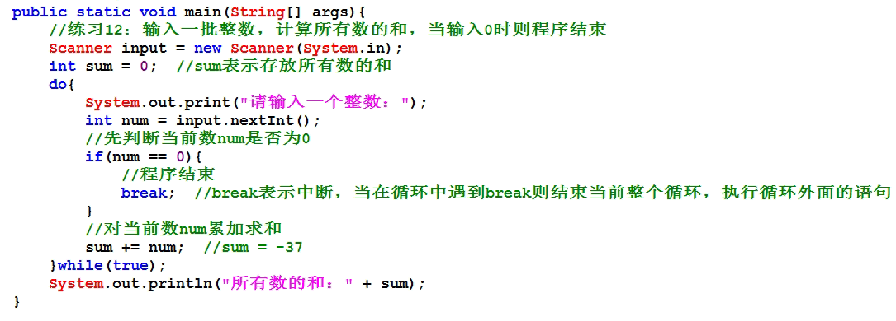

**5-9**

**在循环中使用**

**continue**

**语句**

- continue; //表示继续，当遇到 continue 语句时，则结束当次循环继续执行下一次循环
-
    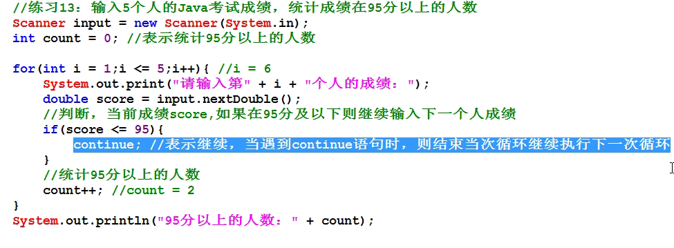

**5-10 break**

**与**

**continue**

**区别**

- 使用场合不同
    - break:可以在 switch case 中使用，也可以在循环中使用
    - continue：只能在循环中使用
- 作用不同
    - break:表示中断，当在 switch case 中或在循环中遇到 break 结束当前整个 switch case 或循环，执行外面的语句
    - continue:表示继续，当在循环中遇到 continue，则结束当次(本次)循环继续执行下一次循环

# Java 基础班---Day06
2019 年 7 月 9 日 20:12

**6-1**

**方法的定义以及分类**

- 方法：也叫做函数，**实现某个功能**
- 方法分类：
    - 系统提供的方法
        - 常用的系统提供的方法
            - 如: nextInt()    next()      nextDouble() print()   println()……..
        - 用户自定义的方法
    **6-2**

**方法的基本语法格式****[****修饰符****]** **返回值类型** **方法名称**(**[**参数列表**]**){**方法体**}

- []中的内容是可有可无的
- 暂时将方法的修饰符编写为**public static**
- 返回值类型有两种情况：
    - 第一种：无返回值类型，也就是编写为**void**
    - 第二种：有返回值类型，**目前可以编写****9 ****种数据类型之一**
- 方法名称，也就是标识符
    - 建议**编写单词**,也就是见名知意
    - 建议采用驼峰命名法，如：age    getAge    print
- 方法体实现具体的功能，根据题意编写
**6-3**

**方法的调用**
- 语法格式：
    - (1)类名.方法名称([参数列表]);//可以调用其他类的方法
    - (2)方法名称([参数列表]); //注意：只能调用本类中的方法

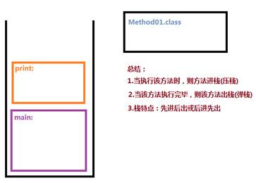

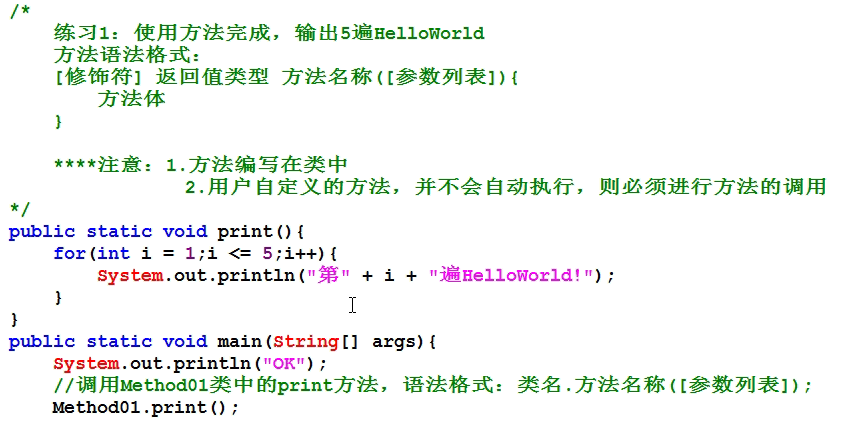

**6-4**

**无参无返回类型方法**

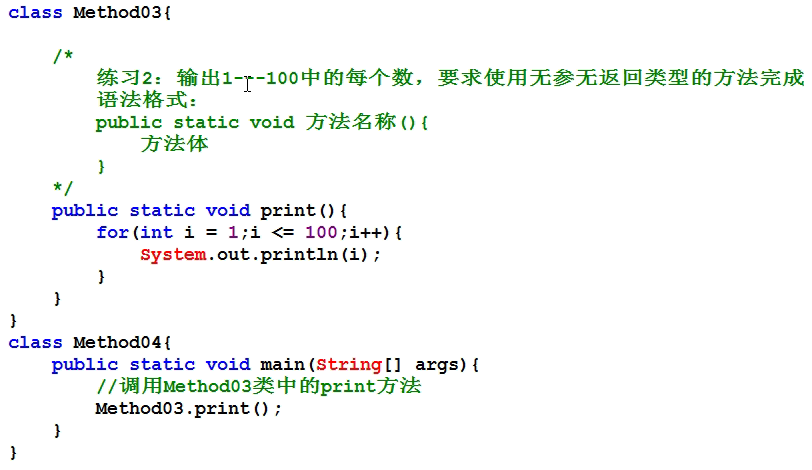

**6-5**

**无参带返回类型方法**int a = Method03.sum(); //先调用方法，然后将方法返回的结果，如：3，再赋给左侧的变量名称 aSystem.out.println(a);

- 该题只有一个结果时，此时就可以编写为带返回类型的方法完成
- 如果方法有返回类型则在方法体中必须编写 return,通过 return 返回结果
- 方法的返回类型必须与 return 后面值的类型一致
- 通过 return 将结果返回到方法的调用处，因此在调用处进行处理
    - 使用变量接收，然后再输出变量中的值，如：
- 可以在一个方法体中编写任意多个 return,但最终只执行一个相匹配的将值返回
-
    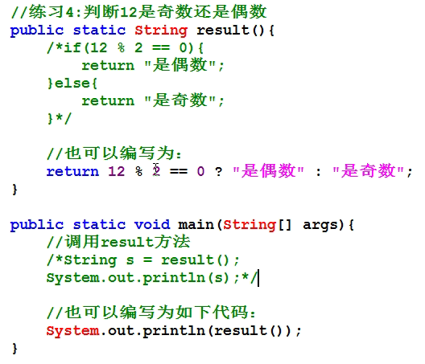
-
    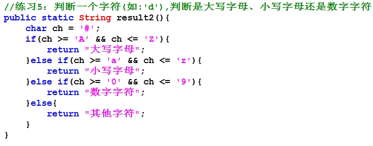

**6-6 break**

**、**

**continue**

**、**

**return**

**之间区别**

- break：表示中断，可以在 switch case 中或循环中使用，当遇到 break 则结束当前整个 switch case 或循环
- continue：表示继续，只能在循环中使用，当遇到 continue 时则结束本次(当次)循环，继续执行下一次循环
- return：表示返回，只能在方法中使用，当遇到 return 则返回到方法的调用处
    - 特殊形式：当方法是无返回类型时，则可以在方法体中编写 return,但是必须编写为**return;**
-
    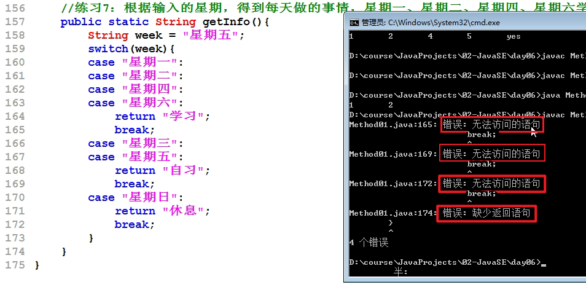
    - break；//出现编译错误，是无法访问的语句，原因：该条语句之上有 return，当遇到 return 就返回到调用处
    - 还有一个错误：缺少返回语句；修改：最后一个 case 改为 default
    -
        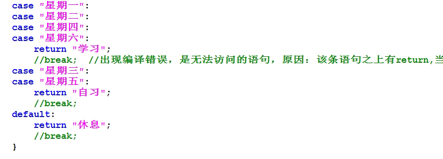
    **6-7**

**带参无返回类型方法**public static void 方法名称(**参数列表**){方法体}多个参数之间使用英文逗号隔开调用方法时参数为已知的称为实际参数，简称实参也就是实参的值赋给形参变量,必须保证实参与形参个数一致、类型一致、顺序一致

- 当该题中有未知的数，因此可以编写为带参数的方法
- 带参方法的语法格式：
- 每个参数语法格式：数据类型 参数名称
- 方法中未知的编写为参数，称为形式参数简称形参，**其中形参也属于局部变量**
-
    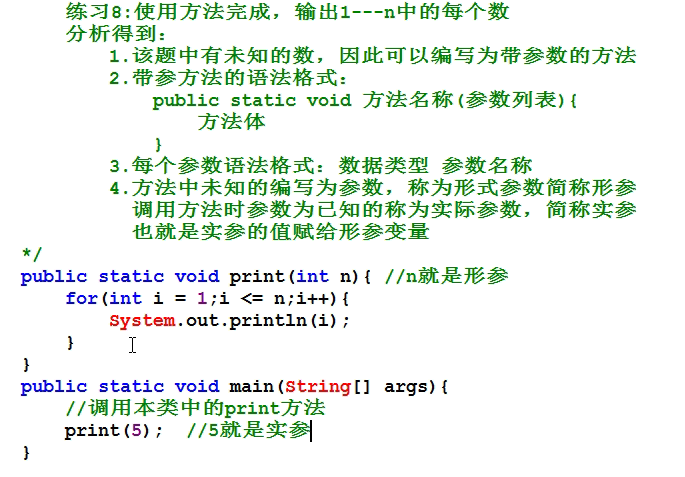

**6-8**

**带参带返回类型方法**

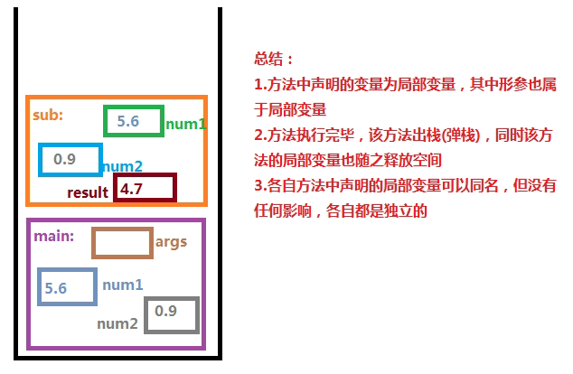

**6-9**

**方法重载**

在同一个类中，方法的名字相同，参数列表必须不同(类型不同、个数不同、顺序不同),与返回类型无关，构成方法的重载

# Java 基础班---Day07
2019 年 7 月 9 日 20:14

**7-1**

**面向对象概念**张三对象属性：名字、性别、年龄、身高、体重、住址……方法：学习、说话、吃饭……..李四对象属性：姓名、年龄、住址、性别………方法：睡觉、学习、发红包、游泳……**将多个对象找到相同的属性和方法组合在一起，形成类**学生类属性 Attributes：姓名、年龄、性别、住址方法 Operations：学习 study

- 面向对象：虚拟世界”模拟现实”生活，必须保证模拟一致
- 面向过程：
- 类：对同一类事物的**抽象的**描述，也就是：**不是具体的**
    - 如：电脑类、水杯类、键盘类、人类………
- 对象：万物皆对象，也就是说：**具体的****实例**
    - 我的电脑、张三的水杯………
- 类与对象之间关系
    - 抽象与具体的关系
- **描述对象的特征，称为属性**，如：颜色、价格、尺寸…….
- **对象所做的事情，称为方法或行为**
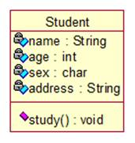
**7-2**

**编写类的操作步骤**第一步：编写类语法格式：[修饰符] class 类名{ }第二步：编写属性也叫做成员变量语法格式：[**修饰符**] 数据类型 属性名称 [**=****值**];第三步：编写方法语法格式：[修饰符] 返回类型 方法名称([参数列表]){方法体}
- 属性编写在类中
- []中的内容是可有可无的
- 属性名称也是标识符，建议采用驼峰命名法，见名知意
- 当属性或成员变量没有赋值时，则是有默认值的，数据类型不同则默认值不同：

| 属性类型       | 默认值 |
| -------------- | ------ |
| 整数类型       | 0      |
| 浮点类型       | 0.0    |
| 字符类型       | \u0000 |
| 布尔类型       | false  |
| 所有引用类型的 | null   |

- 方法必须编写在类中
- 在面向对象中，方法的修饰符暂时编写为 public
**7-3**

**编写测试类**
也就是包含 main 方法的类
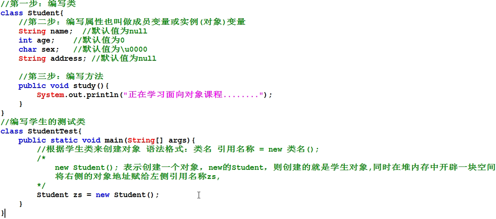

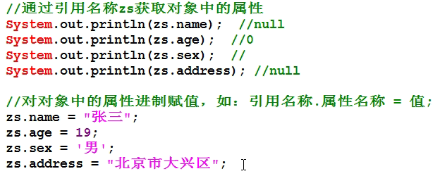
**7-4**

**创建对象，也叫做实例化****类名 引用名称** **= new** **类名****();****（****new ****才是创建对象）****注意：一个可以创建****N ****个对象**
- 语法格式：
**7-5**

**访问对象中的属性和方法**
- 访问对象中的属性：
    - 引用名称.属性名称
- 访问对象中的方法
    - 语法格式：引用名称.方法名称();
    -
        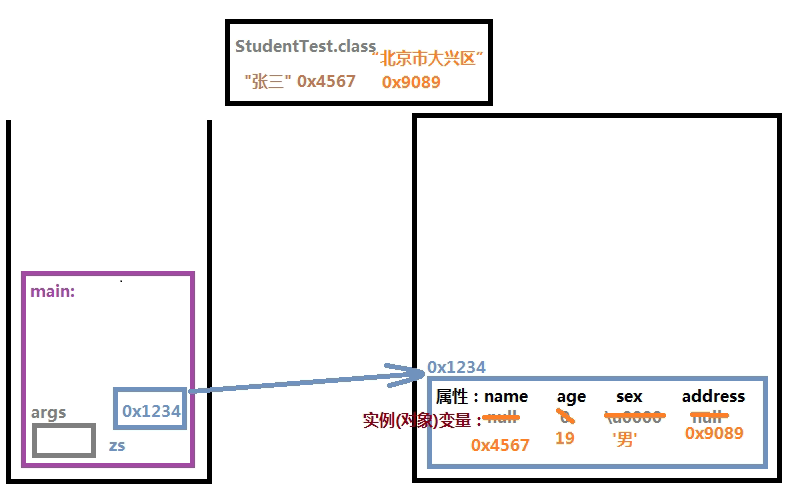
    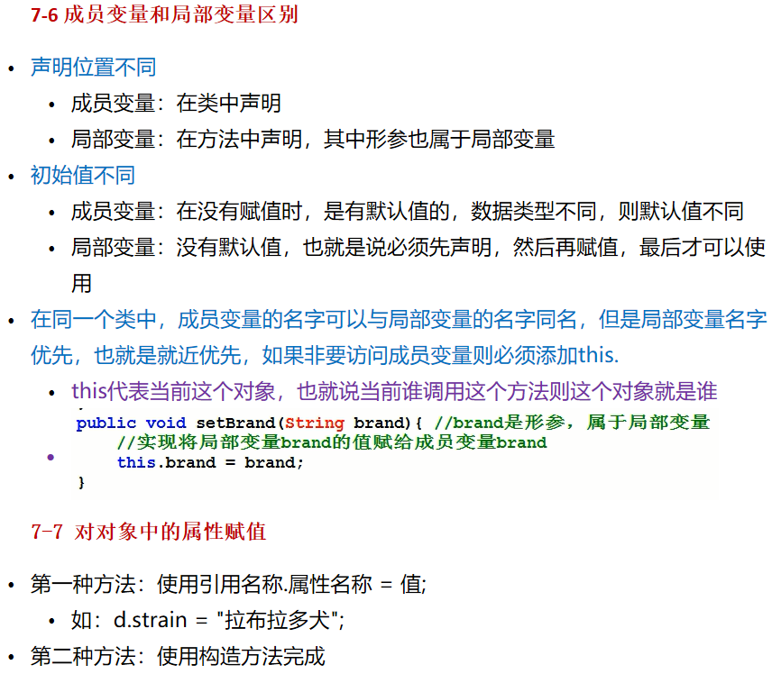
    **7-8**

**构造方法以及重载****public** **方法名称****([****参数列表****]){**** ****}**

- 作用：完成对对象中的属性赋值
- 构造方法
    - 构造方法是一个特殊的方法，构造方法名字必须与类名一致，构造方法必须没有返回类型，也就是不编写返回类型
    - 语法格式：

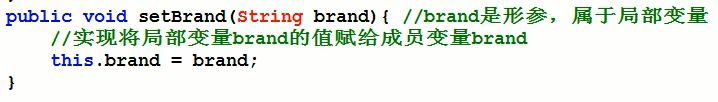

- 构造方法如何执行的？
    - 当创建对象时**自动执行**相匹配的构造方法
- 构造方法分类：
    - 隐式构造方法
        - 当在一个类中，没有手动编写构造方法，则系统会提供一个默认的无参的构造方法
    - 显式构造方法
        - 当在一个类中，手动编写构造方法，则系统不会提供默认的无参的构造方法
        - 建议：当手动编写构造方法时，先编写无参构造方法，然后再编写需要的构造方法
    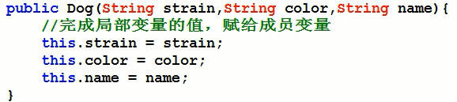
    - 构造方法重载：
        - 在同一个类中，构造方法的名字必须相同，参数列表不同(个数不同、类型不同、顺序不同)


# Java 基础班---Day08
2019 年 7 月 9 日 20:14

**8-1**

**变量按数据类型分为**

- 基本数据类型：在内存中存放的是真正的值
    - 4 大类，共计 8 种
- 引用数据类型：在内存中存放的是地址(引用)
    - String
    - 用户自定义类型，如：Student   Computer……..
- **对引用数据类型赋值的方式：**
    - 第一种：将对象赋给引用名称
        - 如：s = new Student();
    - 第二种：将 null 值赋给引用名称
        - 如：s = null;
    **8-2**

**空指针异常**

-
    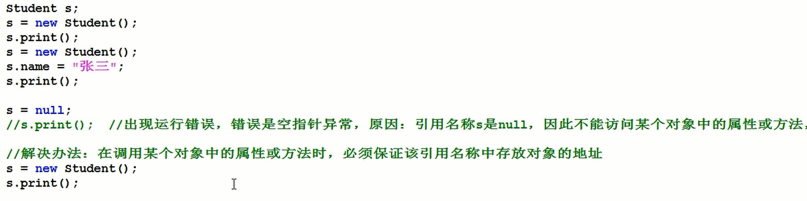
- 属于运行错误，java.lang.NullPointerException
- 原因：当引用名称的值为 null 时，就不能方法某个对象中的属性或方法，如果非要访问则就出现空指针异常
- 解决办法：在访问某个对象中的属性或方法之前必须保证该引用名称中存放的是对象的地址(引用)
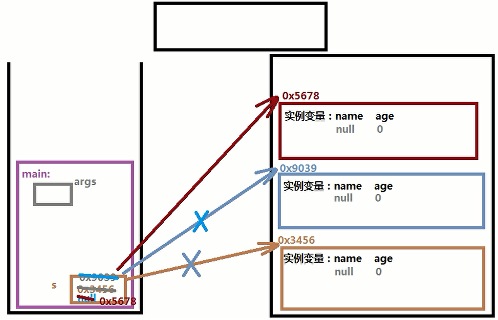
**8-3**

**当一个对象中的属性是引用数据类型**
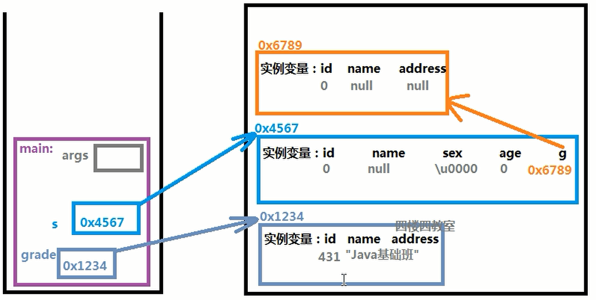
**8-4**

**封装**第一步：将属性设置为私有的 private,只能在本类中使用**private int age;**第二步：编写对应属性的赋值 setXxx 和取值 getXxx 方法**public void setAge(int age){****//****第三步：根据情况编写判断语句****//****将局部变量的值赋给成员变量****,****年龄：****0---100****，否则为****18****if(age >= 0 && age <= 100){****this.age = age;****}else{****this.age = 18;****}****}****public int getAge(){****return age; //****表示返回成员变量****age ****的值****  **** }**
- 面向对象有三大特征：
    - 封装、继承、多态
- 封装
    - 定义：隐藏类的内部信息，不允许外部程序直接访问，而是通过方法进行操作
    - 封装操作步骤
    -
-
    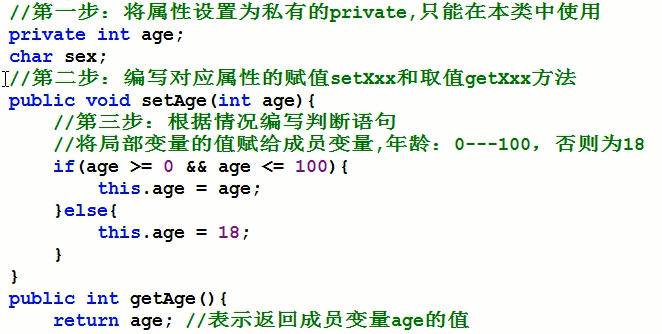

**8-5 this**

**关键字**

- this 表示当前这个对象，也就是说当前谁调用这个方法，则这个对象就是谁
- this 关键字可以**访问本类中**的实例变量
    - 当局部变量和成员变量没有同名时，则编写属性名等价于 this.属性名，如：id  等价于  this.id
    - 当局部变量和成员变量同名时，并且访问成员变量则必须使用 this.

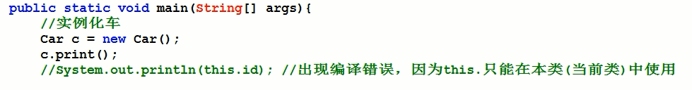

- this 关键字可以**访问本类中的**实例方法
    - 方法名称([参数列表]);  等价于  this.方法名称([参数列表]);
- this 关键字还可以访问本类中的其他构造方法 this([实参列表]);
    - this(); //访问本类无参构造方法
    - 当使用 this 访问本类构造方法时，有要求：则只能编写在构造方法中，并且是第一条语句
        - 否则报错
        -
            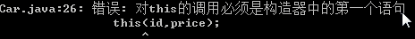
        - 构造方法不能出现递归调用
        -
            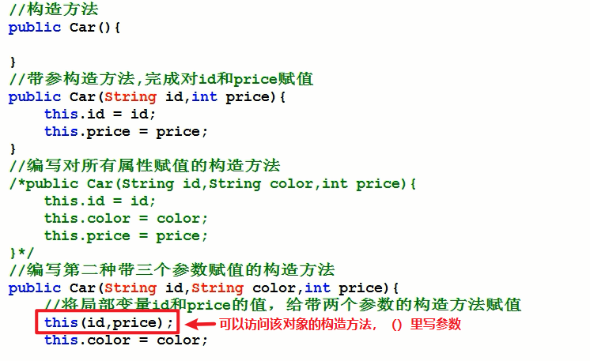


# Java 基础班---Day09
2019 年 7 月 9 日 20:14

**9-1**

**参数传递**

- 基本数据类型作为参数传递
    - 传递的是真正的值，在一个方法中改变变量的值，对另一个方法中变量的值没有任何影响，各自变量是独立的

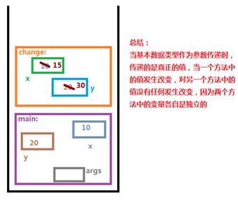

- 引用数据类型作为参数传递
    - 传递的是地址，也就数说多个引用名称共用同一个对象
    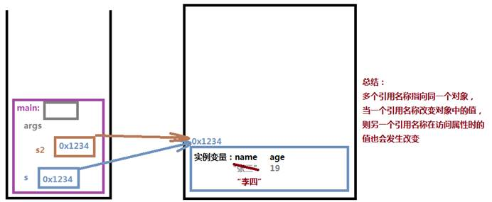

**9-2 static**

**关键字**注意：当引用名称的值为 null 时，也可以访问静态属性，不会出现空指针异常

- **static ****关键字可以修饰属性**
    - 称为静态属性也叫做类的变量
    - 在方法区(共享区)中存储，并且所有对象都可以访问
    - 与类同生死，也就是说类存在时 static 修饰的属性就存在
    - 可以使用类名.属性名称，也可以使用引用名称.属性名称

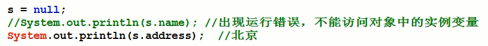

- 类优先于对象，也就是说类的生命周期比较长
-
    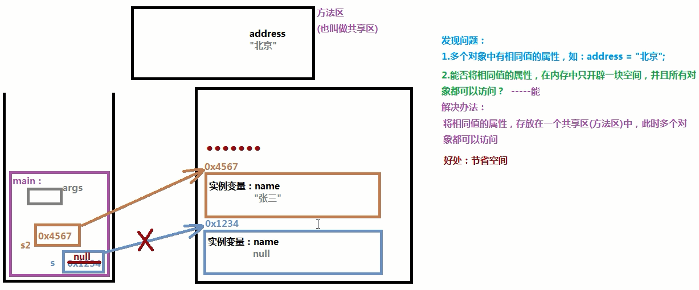
- **static ****关键字可以修饰方法**注意：当引用名称的值为 null 时，也可以访问静态方法，不会出现空指针异常
    - 称为静态方法也叫做类的方法
    - 与类同生死，也就是说类存在时 static 修饰的方法就存在
    - 可以使用类名.方法名称([参数列表]); ，也可以使用引用名称.方法名称([参数列表]);
    - 静态方法中只能访问静态属性、静态方法
    - 当方法体中只访问静态属性、静态方法时，可以编写为静态方法
    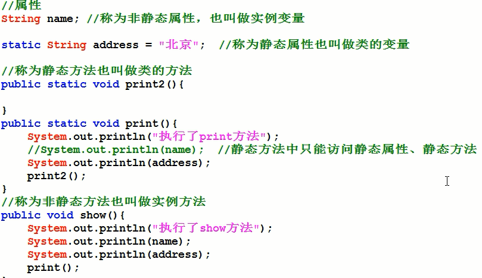
    - static 关键字可以修饰代码块
        - 主要完成对静态属性赋值
        - 静态代码块在类**第一次被载入时**则执行

**9-3**

**什么是继承**

- 如果多个类中有相同属性和方法，能否单独编写一个类？ ----能
- 解决办法：
    - 将多个类中相同的属性和方法编写在单独一个类中，该类称为父类
    - 在子类继承父类，然后在子类中编写独有的属性和方法

**9-4**

**继承好处****9-5** **编写继承代码步骤**第一步：编写父类[修饰符] class 类名{//属性和方法}第二步：编写子类 [修饰符] class 子类类名 extends 父类类名{//编写独有属性和方法 } 注意：1.当一个类没有指名继承具体哪个父类时，则默认继承 Object 类

- 好处：减少代码的冗余性(重复性)

2.Object 类是所有类的父类（超类）class Dog{ }//等价于 class Dog extends Object{ }
**9-6**

**继承中注意事项**class A{//编写 2 个属性，2 个方法}class B extends A{//独有属性 1 个，方法 3 个}class C extends A{//独有属性 1 个}class D extends B{ }
- 子类继承父类，但是不能继承父类的构造方法
- 父类也叫做超类(基类)，子类也叫做派生类
- 继承满足的条件：
    - is a 如：猫 是 动物
- 继承具有两大特性：
    - 一个类只能继承一个直接的父类，也就是类是单根性
    - 类具有**传递性**

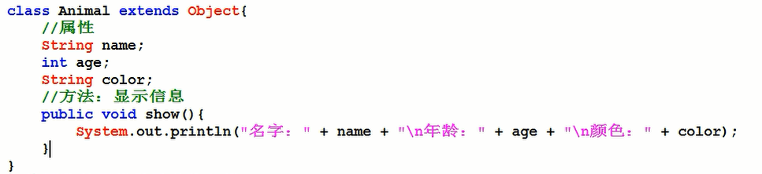

**9-7**

**重写**

- override 也叫做覆盖
    - 子类方法名称必须与父类方法名称一致
    - 参数列表一致
    - 返回类型一致或父类方法返回类型的子类类型（范围大的子类可以赋值给范围小的父类）

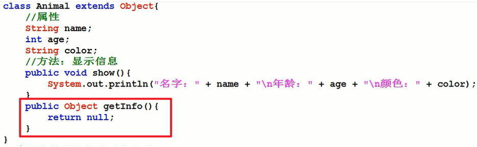

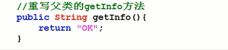

- 修饰符不能缩小范围
-
    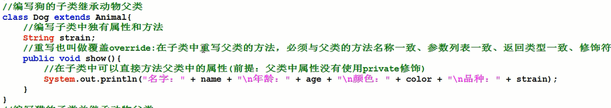
- 子类不能重写：
    - 构造方法不能重写
    - 属性不能重写
    - 静态方法不能重写
    - 私有方法不能重写

# Java 基础班---Day10

**10-1 this**

**关键字和**

**super**

**关键字区别**

- this 关键字
    - 代表当前这个对象
    - this 可以访问本类中的实例变量、实例方法也可以方法本类中的其他构造方法
    - this 还可以访问父类中的实例变量、实例方法
- super 关键字
    - 表示超类或父类
    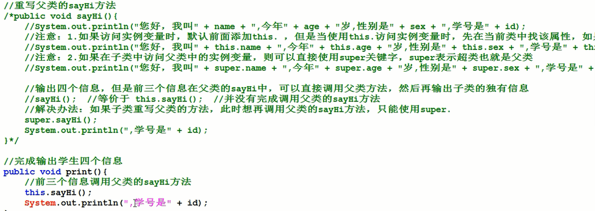
    - super 只能在子类中使用，可以访问父类中的实例变量、实例方法、还可以访问父类的构造方法
        - super();必须放在构造方法的第一行
        -
            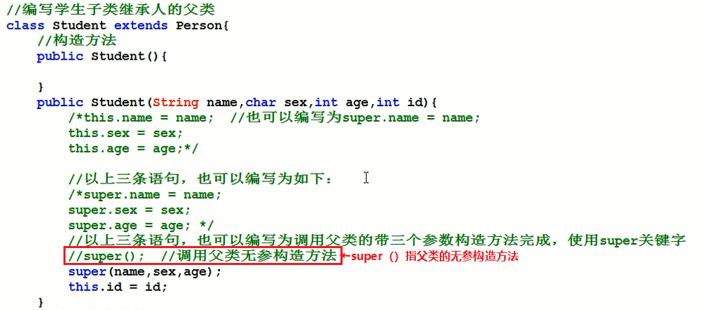

**10-2**

**当实例化子类时父类做了什么**

- 先执行父类的构造方法，然后再执行子类的相匹配构造方法
    - 如果子类构造方法中没有指明则默认调用父类无参构造方法

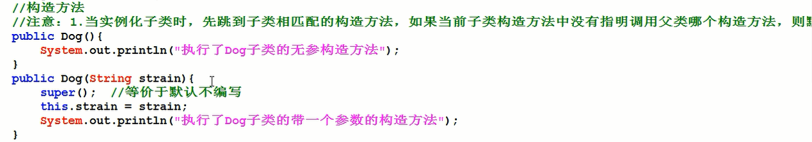

- 如果子类构造方法中指明调用父类哪个构造方法，则先执行父类相匹配的构造方法，然后再执行子类相匹配构造方法
    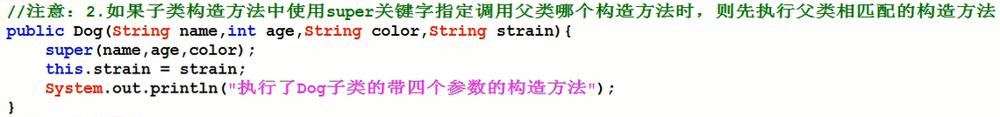
    - 建议：当手动编写构造方法时，先编写无参构造方法，再编写所需要的构造方法。
        - 原因：如果手动写带参构造，系统就不会创建隐式无参构造，在派生子类的构造方法未指明父类构造方法时，会调用父类的无参构造，出现编译错误
    1.  **多态**
    - 多态的语法格式：
        - 父类类名 引用名称 = new 子类类名();
        - 当是多态时，该引用名称只能访问父类中的属性和方法，但是优先访问子类重写以后的方法
        -
            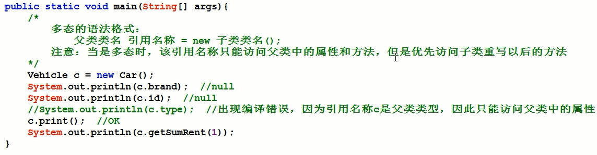
        - 多态：将多个对象调用同一个方法，得到不同的结果
        - 满足多态的条件：
            - 子类必须继承父类
            - 子类重写父类的方法
            - 父类类名 引用名称 = new 子类类名();

**10-4**

**多态好处**

减少代码的冗余性

-
    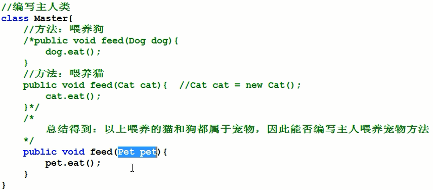

-
    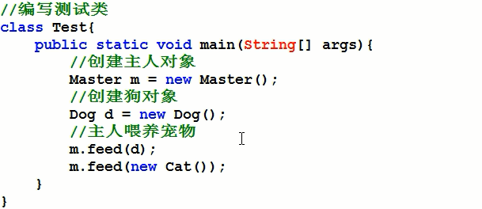

**10-5**

**多态中的两种类型转换**

- 向上转型，也叫做自动类型转换，构成多态
    - 父类类型 引用名称 = new 子类类名();
    - 当是多态时，该引用名称只能访问父类中的属性和方法，但是优先访问子类重写以后的方法
- 向下转型，也叫做强制类型转换
    - 当是多态时，并且访问子类独有的属性或方法时，则必须进行向下转型
    - 当进行向下转型时，建议先进行判断，当合法则在转为对应的类型，则使用 instanceof 关键字，否则可能会出现类型转换异常 java.lang.ClassCastException（运行时会报错）
    -
        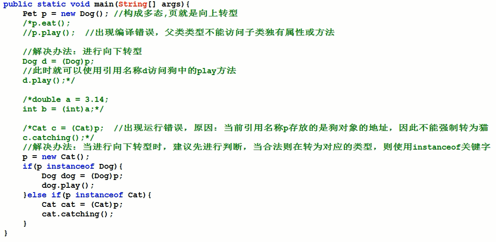
    **10-6**

**递归**

- 递归：方法自己调用自己，必须保证有出口
- 案例：使用递归完成，计算 n!
    -
        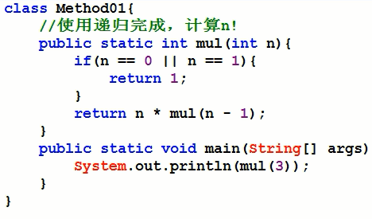
    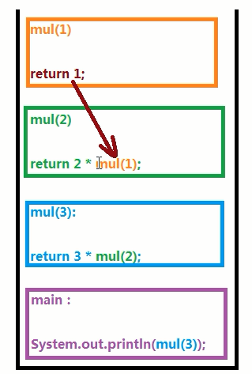