# Java 进阶

2019 年 7 月 19 日 21:55

学习方法

课上:
认真听讲
困了站起来听
适当的做笔记

课下:
总结
读代码, 看明白这段代码的作用, 为什么这样写, 分析输出结果是怎么产生的
写代码, 模仿, 尝试

切忌:
一直看视频

# 第一章 面向对象

**1.1**

**包**

在 Java 中, 使用包来管理类. 就像在资源管理器中使用文件夹管理文件一样.

在同一个包中, 类名不能重名, 在不同包中类名可以相同

我们这一阶段涉及的包:

java.lang                   Java 语言的基础包, 系统会自动导入

java.util                   工具类

java.io                   输入输出相关的类

java.text                   文本处理相关的类

java.net                   网络相关的类

java.math                   数学相关的类

**1.1.1**

**包的定义**

| package com.bjpowernode.chapter01.packages.p1;<br />/*<br />1) 使用 package 关键字定义包, package 定义包的语句必须作为源文件的第一条语句<br />2) 包名的命名规则:<br />公司域名的倒序.项目名.模块名.子模块名<br />包名一般情况下所有字母都小写<br />3) 编译<br />javac -d .   Test01.java<br />javac 的-d 参数可以指定生成字节码文件的位置(目录)<br />小点.代表当前目录<br />编译后,系统会在当前目录生成与包名对应的文件夹,把字节码文件存储到该文件夹中<br />4) 运行<br />>java com.bjpowernode.chapter01.packages.p1.Test01<br />java 命令后面跟完整类名<br />5) 包名.类名就是完整类名,即<br />com.bjpowernode.chapter01.packages.p1.Test01 是一个完整类名<br />Test01 称为简易类名<br />*/<br />class Test01 {<br />public static void main(String[] args)     {<br />System.out.println("Hello World!");<br />}<br />} |
| ------------------------------------------------------------------------------------------------------------------------------------------------------------------------------------------------------------------------------------------------------------------------------------------------------------------------------------------------------------------------------------------------------------------------------------------------------------------------------------------------------------------------------------------------------------------------------------------------------------------------------------------------------------------------------------------------------------------------------------------------------------------------------------------------------------------------ |
|                                                                                                                                                                                                                                                                                                                                                                                                                                                                                                                                                                                                                                                                                                                                                                                                                          |

**1.1.2**

**使用其他包的类**

package com.bjpowernode.chapter01.packages.p2;

/*

需求:

在当前包中, 使用 p3 包中的 MyUtil 类,调用它的静态方法

前提:

被使用的类必须定义为 public 修饰的公 共类

使用方式:

1)直接使用完整类名

2)先通过 import 导入被使用的类,再通过简易类名访问

*/

import com.bjpowernode.chapter01.packages.p3.MyUtil;       //是把被使用的类导入到当前文件中

class Test02{

public static void main(String[] args)     {

System.out.println("在 p2 包中调用 p3 包中的 MyUtil 类的静态方法");

//1)直接通过完整类名调用

com.bjpowernode.chapter01.packages.p3.MyUtil.sm();

//2)先把其他包中的类导入,再使用简易类名调用

MyUtil.sm();

}

}

|package com.bjpowernode.chapter01.packages.p2;<br />/*<br />需求:<br />在当前包中, 使用 p3 包中的 MyUtil 类,调用它的静态方法<br />前提:<br />被使用的类必须定义为 public 修饰的公 共类<br />使用方式:<br />1)直接使用完整类名<br />2)先通过 import 导入被使用的类,再通过简易类名访问<br />*/<br />import com.bjpowernode.chapter01.packages.p3.MyUtil;       //是把被使用的类导入到当前文件中<br />class Test02{<br />public static void main(String[] args)     {<br />System.out.println("在 p2 包中调用 p3 包中的 MyUtil 类的静态方法");<br />//1)直接通过完整类名调用<br />com.bjpowernode.chapter01.packages.p3.MyUtil.sm();<br />//2)先把其他包中的类导入,再使用简易类名调用<br />MyUtil.sm();<br />}<br />}|

|package com.bjpowernode.chapter01.packages.p3;<br />public class MyUtil {<br />public static void sm()   {<br />System.out.println("我是 p3 包中 MyUtil 类的静态方法 sm");<br />}<br />}|

**1.2 Eclipse**

**1.2.1**

**准备工作**

1)下载 Eclipse

Eclipse neon           JDK8

Eclipse Oxygen       JDK9

Eclipse Photon       JDK10

2) 安装

不需要安装, 只要解压缩即可

3) 检查 JDK 版本是否 JDK8

java -version

4) 查看是否安装了公共的 JRE

在安装目录 C: \Program Files\Java 中查看,除了 jdk 目录外,是否还有 jre 目录

如果有 jre 目录,表示安装了公共的 JRE, 建议重新安装 JDK, 不安装公共的 JRE

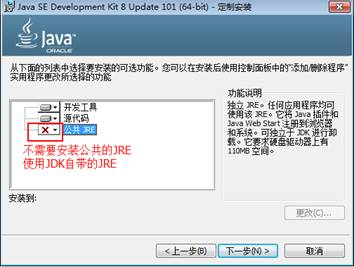

5) 查看是否配置了 classpath 环境变量

set classpath

查看是否配置 classpath,如果已经配置, 建议你删除该环境变量.

**1.2.2 Eclipse**

**的基本配置**

1) 设置工作区目录

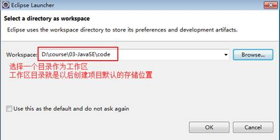

2) 切换 JavaSE 透视图

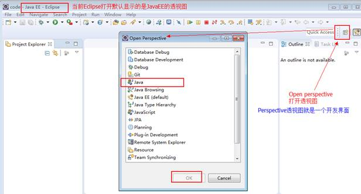

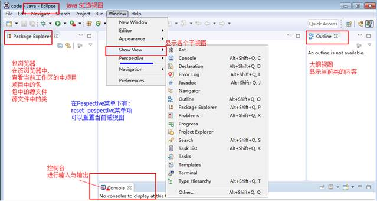

**1.2.3**

**项目创建与运行**

1) 创建项目

在 Eclipse 环境中, 需要把类放在项目中才能运行

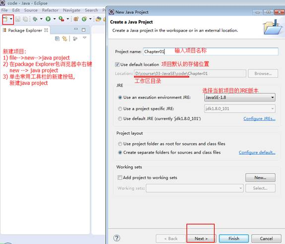

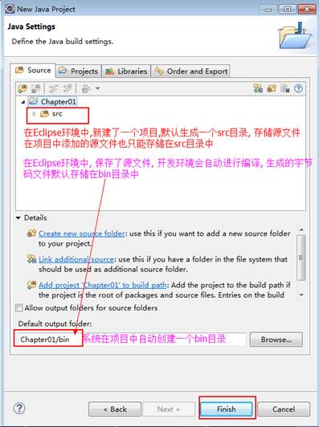

2) 在项目中添加类

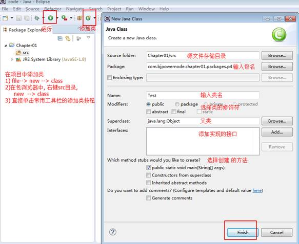

3) 运行程序

runà run

单击常用工具栏的运行按钮

在编辑区中,右键, run as -> java application

Ctrl + F11           运行程序的快捷键

**1.2.4 Eclipse**

**首选项常用设置**

1) 设置字号

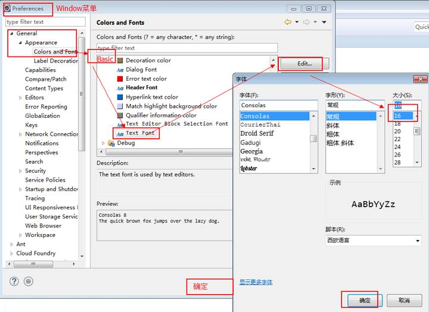

2) 设置智能提示

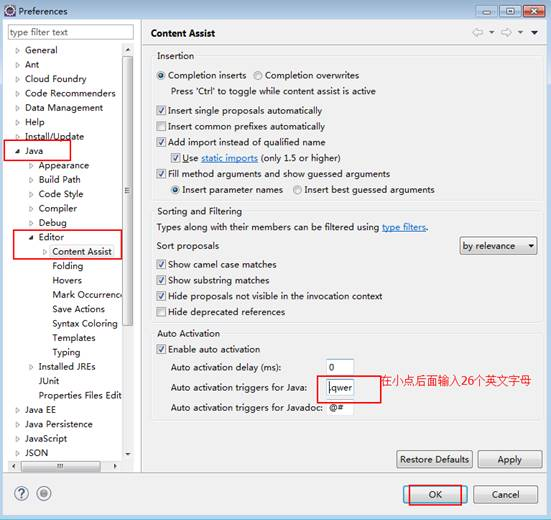

3) 设置工作区 编码格式

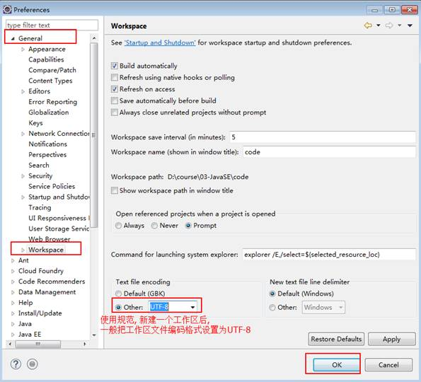

**1.2.5**

**在项目中添加已有的类**

1) 直接把.java 源文件复制到 src 目录中对应的包下

2) 把源码复制到 Src 目录中,系统会创建对应的包与源文件

在项目中添加已有的源文件,可能出现乱码, 出现乱码的原因是, 源文件保存时使用的编码格式与当前工作区使用的编码格式不兼容

ANSI 编码不是一种具体的文件编码, 在中文 Windows 操作系统中 ANSI 是默认的中文编码 GBK, 如果是日文操作系统,ANSI 编码就是日文的一种默认编码.

打开文件, 另存为, 选择文件的编码格式与当前工作区的编码格式一致(UTF-8).重新复制粘贴 到当前项目中

**1.2.6**

**在工作区中导入已有的项目**

选择 fileà import

在包浏览器中右键, import

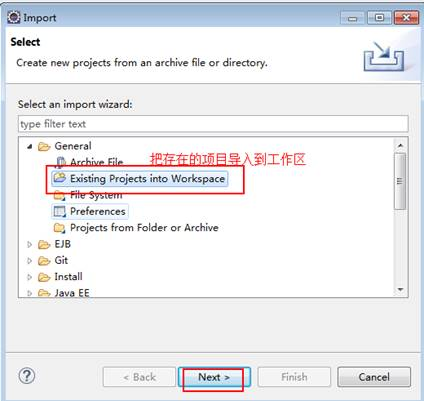

可能会出现命名冲突

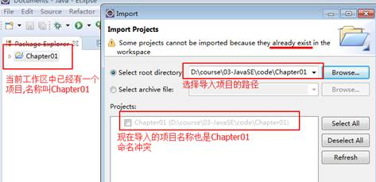

如果工作区中已存在导入的项目名称 ,可以修改工作区中的项目名称

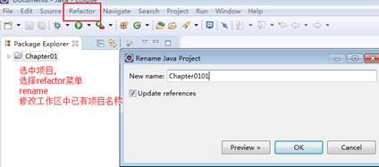

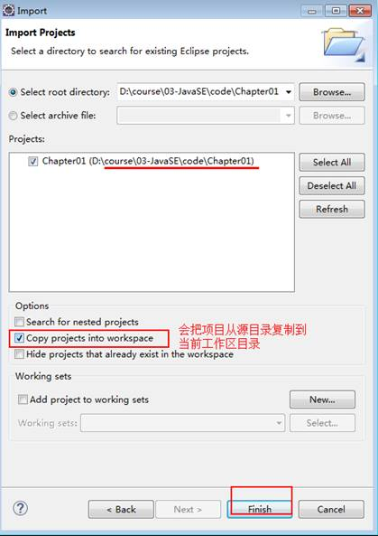

注意:

导入的项目,可能会出现乱码, 建议修改工作区的文件编码去适配项目的编码

**1.3**

**访问权限**

**1.3.1**

**类的访问权限**

类的访问权限: 公共类 和非公共类

使用 public 修饰的类就是公共类,

公共类的应用场景:

如果这个类想在其他包中使用,需要定义为公共类; 如果这个类没有使用 public 修饰,这个类只能在当前包中使用

**1.3.2**

**类成员的访问权限**

| 访问权限             | 当前类 | 当前包 | 不在当前包中的派生类(子类) | 其他包 |
| -------------------- | ------ | ------ | -------------------------- | ------ |
| 私有的 private       | 可以   | 不     | 不                         | 不     |
| 默认的没有权限修饰符 | 可以   | 可以   | 不                         | 不     |
| 受保护的 protected   | 可以   | 可以   | 可以                       | 不     |
| 公共的 public        | 可以   | 可以   | 可以                       | 可以   |
|                      |        |        |                            |        |

访问权限遵循权限最小化原则

想在任意位置都可以访问就定义为 public 公共的

在当前类和派生类中可以直接访问就定义为 protected 受保护的

代码: com.bjpowernode.chapter01.privilage.p3/ com.bjpowernode.chapter01.privilage.p4

**1.4 Object**

Object 类是 Java 中所有类的根父类, Java 中的类要么直接继承 Object, 要么间接继承 Object 类

Java 中类的继承是可传递的, Object 类中定义的方法,所有的类都能继承到


1.  toString()

作用是把对象转换为字符串

应用场景: System.out.println( obj ) 打印 obj 对象时, 会调用对象的 toString()方法

当打印对象时,想显示对象的各个字段值, 需要重写 toString()

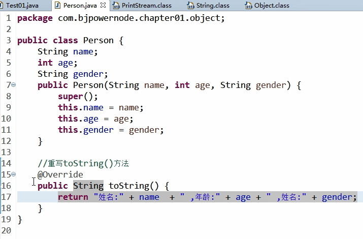

1.  equals()

使用关系 运算符 == 判断两个变量是否相等, 如果两个变量相等,说明这两个变量引用堆中的同一个对象

如果想要判断堆中两个对象的内容(即各个成员变量的值)是否一样 ,需要重写 equals()方法, 根据哈希约定, 如果两个对象的 equals()相等, 那么这两个对象的 hashCode()也应该相等,即在重写 equals()方法的同时,也要重写 hashCode()

1.  定义实体类
    1.  一般把所有字段都私有化，提供公共的 getter（）/setter（）方法对字段进行访问
    2.  一般只提供无参构造
    3.  一般需要重写 tostring（），equals（）/hashCode（）

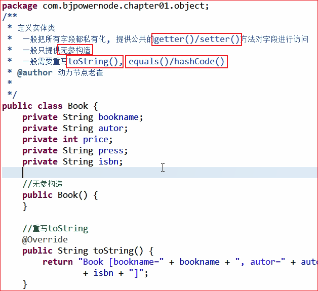

1.  常用快捷键

| Alt + /               | 智能提示                       |
| --------------------- | ------------------------------ |
| Ctrl + 1              | 快速修复                       |
|                       |                                |
| Ctrl + W              | 关闭当前窗口                   |
| Ctrl + Shift + W      | 关闭所有窗口                   |
|                       |                                |
| Ctrl + S              | 保存                           |
| Ctrl + Shift + S      | 保存所有                       |
|                       |                                |
| Ctrl + /              | 单行/取消注释                  |
| Ctrl + Shift + /      | 块注释                         |
| Ctrl + Shift + \      | 取消块注释                     |
| Ctrl + Shift + F      | 代码格式化(自动对齐)           |
| Ctrl + Shift + O      | 自动导入所有需要的类           |
|                       |                                |
| Shift + Enter         | 在当前行的下面产生空行         |
| Ctrl + Alt + 向下箭头 | 复制一行                       |
| Alt + 向下/向上箭头   | 移动一行                       |
| Ctrl + D              | 删除一行                       |
|                       |                                |
| Alt + Shift + R       | 重命名                         |
| Alt + Shift + M       | 把一段代码抽象为一个方法       |
| Alt + Shift + L       | 把一个表达式赋值给一个局部变量 |
|                       |                                |
| Ctrl + Shift + T      | 打开 类型                      |
| Ctrl + O              | 显示类成员                     |
|                       |                                |
| Ctrl + F11            | 运行程序                       |
| F11                   | 调试程序                       |
| Ctrl + Shift + B      | 添加/取消断点                  |

小结:

1)理解包的作用, 掌握包的定义, 掌握如何使用其他包中的类

2)Eclipse 的使用(重点), 学会创建项目, 在项目中添加类, 运行程序, 在项目中添加已有的类, 在工作区中添加已有的项目, 解决可能出现的乱码问题, Eclipse 的基本设置(编码,字号,智能提示…)

3)记住类的两个访问权限, 理解类成员的四个访问权限及他们的使用范围

4) Object 类的特点, 了解 clone() / finalize() / getClass() / notify() / wait()

理解 toString()的作用 , 应用场景 , 如何用

理解 equals()作用, 如何用

了解根据哈希约定, 两个对象 equals()相等,这两个对象的 hashCode 也应该相等, 即需要同时重写 equals()/hashCode()

5)认识程序调试

程序调试是为查看程序的运行过程, 查看在程序运行过程中各个变量的取值

如何调试?

练习:

1.  定义一个宠物类, 宠物会卖萌; 定义小狗/小猫/小猪等类,继承宠物类, 重写卖萌方法; 定义主人类, 主人可以给宠物喂食, 喂食时宠物就卖萌
2.  定义一个计算机类, 包括若干的字段, 重写 toString()/ equals()…., 定义测试类, 打印计算机对象, 判断两个计算机对象是否相同
3.  编程程序, 从键盘上输入年月日, 打印该日期对应这一年的第几天. 如

输入 :

2018   1   5

输出:

2018-1-5 是 2018 年的第 5 天

输入 :

2018 2   5

输出:

2018-2-5 是 2018 年的第 36 天

输入 :

2018   3   5

输出:

2018-3-5 是 2018 年的第 64 天

**1.5 final**

**关键字**

final 是一个关键字, 可以修饰类, 修饰字段,修饰方法,修饰局部变量,修饰形参

final 修饰类表示最终类, 不能被继承

final 修饰字段,必须显示初始化, 不能再修改, 一般 final 与 static 同时修饰某个字段,所有字母都大写,称为 final 常量

final 修饰方法,不能被子类覆盖(重写), 能被子类继承

final 修饰局部变量, 一旦初始化就不能再修改, 注意 final 修饰引用类型变量, 是指这个引用类型变量不能再指向其他对象,可以修饰它的字段

final 修饰方法形参, 在方法体中不能修改 final 形参的值

**1.6**

**抽象类**

1) 对一组对象进行更高层级抽象时, 形成现抽象的类, 就可以定义为抽象类

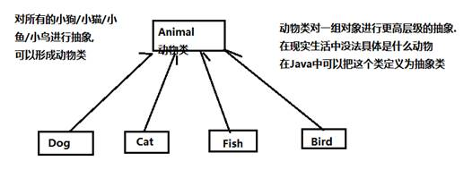

2)含有抽象方法的类必须定义为抽象类

1.  为什么定义抽象类?

对事物进行进一步抽象可以形成抽象类, 如动物类,交通工具类,食品类

含有抽象方法的类必须定义为抽象类

1.  如何定义抽象类

使用 abstract 修饰的类

1.  为什么定义抽象方法?

当一个类的某个操作无法具体实现时,这个操作可以定义为抽象方法

使用 abstract 修饰方法, 只有方法的声明, 没有方法体

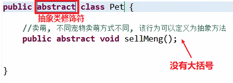

1.  如何使用抽象类

抽象类一般作为其他类的父类存在

子类继承了抽象类, 子类需要重写抽象类中所有的抽象方法, 如果子类没有重写所有的抽象方法,子类也需要定义为抽象类

注意:

抽象类中不一定含有抽象方法

1.  抽象类也是一种引用数据类型，定义变量
2.  Java 数据类型包括基本类型与引用类型，其中引用类型包括：类，接口，数组，枚举
3.  抽象类不能实例化对象, 需要赋值子类对象（多态）
4.  抽象类的引用可以赋值匿名内部类对象
5.  报错  Cannot instantiate the type Animal 不能实例化
6.  抽象类可以赋值匿名内部类对象

Anima l = new Animal（{

}；

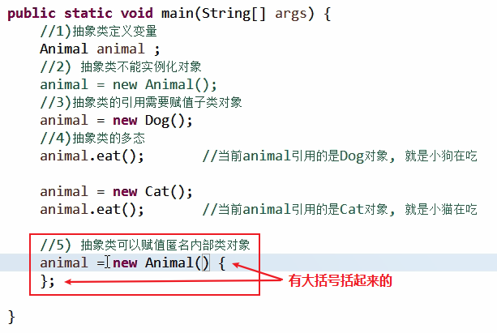

1.  abstract 与 final 可以共存? 不能

**1.7**

**接口**

**1.7.1**

**定义与实现**

电脑上的接口有哪些?

USB 接口, 耳机接口, 电源接口, VGA 接口, 网线接口, HDMI 高清接口..

不同型号的电脑上的接口也有不同

所有的 USB 插头的设备不是同一家厂商生产的,

电脑通过这些接口连接更多的外设,扩展了电脑的功能

Java 中的接口就是功能的封装, 用来扩展类的功能

接口也可以理解为一组操作规范,或者是一个协议

如何定义接口?

[修饰符] interface 接口名 {

功能,用方法表示, 接口中的方法默认使用 public abstract 修饰

}

如何使用接口?

class 类 implements 接口 {

重写接口中抽象方法

}

**1.7.2**

**接口说明**

1) 接口内容:接口中方法默认使用 public abstract 修饰, 接口中还可以定义 public static final 常量 , public static 方法, public default 方法

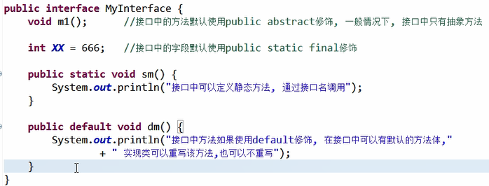

2)类实现了接口,需要重写接口的抽象方法, 如果没有重写接口中所有的抽象方法,实现类需要定义为抽象类

3)接口是一种引用数据类型, 可以定义变量, 但是接口不能实例化对象, 接口引用需要赋值实现类对象, 或者接口的匿名内部类对象

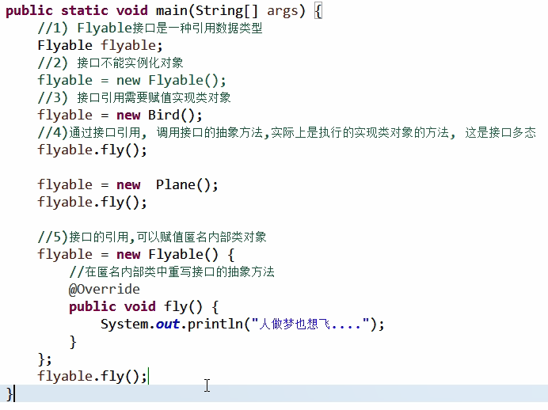

4)接口多态, 接口引用调用接口中抽象方法,实际上执行的是实现类对象的方法. 接口存在就是为实现多态的.

5)一个类可以同时实现多个接口, 需要重写所有接口的所有抽象方法

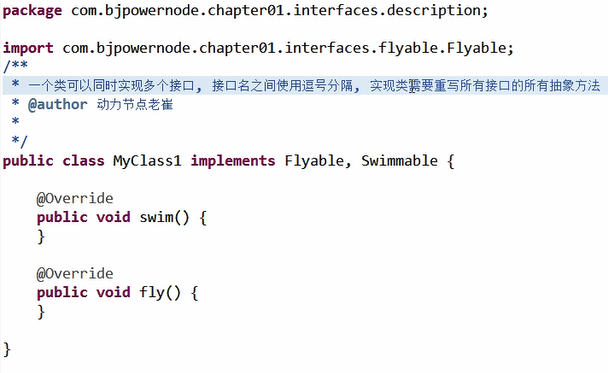

6)接口也支持继承,并且接口支持多继承

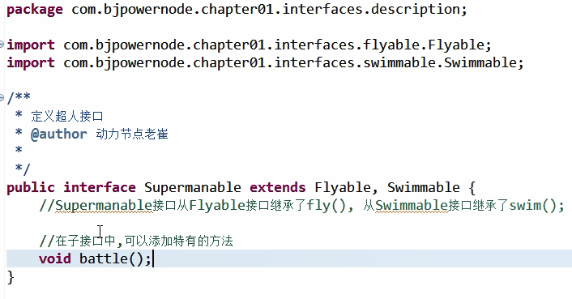

**1.7.3**

**接口与抽象类的异同点**

相同点:

1)都可以定义抽象方法

2)都不能实例化对象

3)定义的抽象方法都需要被重写

4)都可以定义 public static 方法, public static final 常量

不同点:

1)意义不同

抽象类是对事物更高层级的抽象

接口是对功能的封装

2)定义方式不同

抽象类用 abstract class 定义

接口用 interface 定义

3)内容不同

抽象类中除了抽象方法外,还可以定义构造方法等普通类中定义的所有成员

接口除了抽象方法等这四个内容外, 不能定义构造方法等内容

4)使用方式不同

抽象类需要被子类 extends 继承

接口需要被实现类 implements 实现

5)类只支持单继承, 接口支持多继承

6)应用场景不同

一般情况下, 对类进行功能的扩展,优先选择接口

除了扩展功能外, 还需要保存不同的数据,只能选择抽象类; 抽象类的抽象方法需要子类重写, 抽象类还可以约束所有的子类都具有相同的功能.

**1.7.4**

**接口的应用**

1)使用接口用来封装功能(操作)

如在 Flyable 接口中封装了 fly()飞行功能, 在 Swimmable 接口中封装 swim()游泳功能

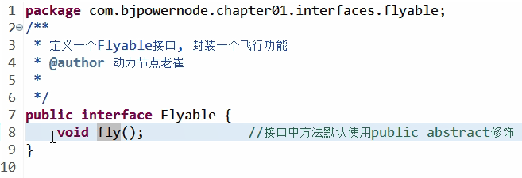

2)接口可以定义一组操作规范

如开发某个项目时, 在相似模块中有一些操作是相同的, 可以把这一组相同的操作封装在一个接口中,就相当于通过接口定义了一个操作规范

**1.7.5**

**提倡面向接口的编程**

1)接口使用比较灵活,一个类在继承父类的同时,可以实现多个接口

描述打工的学生

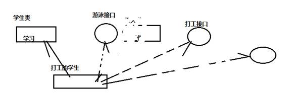

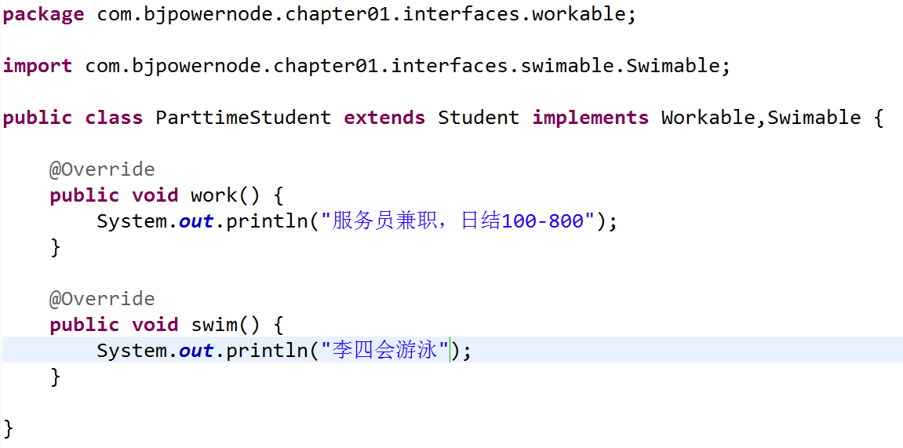

练习:

描述带橡皮的铅笔

2) 接口比较容易扩展, 接口引用可以赋值各种实现类对象,经常把接口引用作为方法形参,在调用方法时,可以传递各种实现类对象

3) 接口可以使项目分层

分析项目不分层的弊端

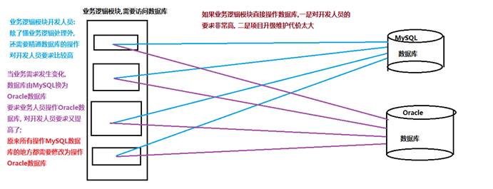

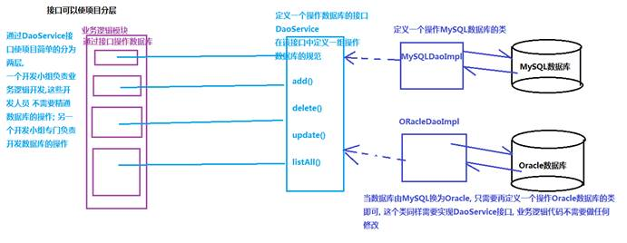

小结:

1.  记住 final 关键修饰类,字段,方法,局部变量,形参分别有什么特点
2.  理解为什么定义抽象类? 对事物进行更高层级的抽象就会形成抽象类;含有抽象方法的类必须定义为抽象类
3.  如何定义抽象类?   使用 abstract 修饰类
4.  为什么定义抽象方法? 如何定义抽象方法?
5.  记住抽象类特点
6.  理解接口是什么 ? 功能的封装, 也可以理解为一组操作规范
7.  掌握如何定义接口, 如何使用接口
8.  记住接口的特点
9.  理解接口与抽象类的异同点
10. 记住接口的应用,记住为什么提倡面向接口编程

练习 1 :

定义平面图形类, 有求面积,求周长的操作, 这两个操作在不同图形中有不同实现

定义矩形类继承平面图形类

定义圆形类继承平面图形类

定义测试类, 定义一个方法, 可以打印任意平面图形的面积与周长, 在 main 方法中测试打印矩形与圆形的面积与周长

练习 2:

打印机可以打印内容, 不同种类的打印机的打印方式不同

人可以使用针式打印机/喷墨打印机/激光打印机来打印内容

练习 3:

定义一个 USB 接口, 封装 connect()连接功能,和 disconnect()断开连接功能

再定义鼠标类/键盘类实现 USB 接口

再定义 Computer 计算机类, 有连接 USB 设置的操作

再定义测试类

练习 4:

定义一打打折的接口, 封装一个折扣操作, 可以根据原价计算 折扣之后 的价格

定义一个不打折的类实现打折接口,

定义一个八折实现类实现打折接口

再定义按比例返现的 类实现打折接口

定义一个商品类, 该类有商品名称,原价,打折方式等几个字段,定义一个方法,打印商品折扣之后的价格

练习 5 :

定义一个 Movable 移动接口, 封装一个 move()移动操作

定义 NoLegs 类实现 Movable 接口, 重写抽象方法,没有腿的移动方式

定义 TwoLegs 类实现 Movable 接口, 使用两条腿的移动方式

定义 TwoLegs 类实现 Movable 接口, 使用四条腿的移动方式

定义一个动物类, 该类有一个移动方式属性, 有移动的操作(使用该动物的移动方式进行移动)

定义小狗类继承动物类, 定义蛇类继承动物类, 定义人类继承动物类

测试,小狗使用四条腿走路, 人使用两条腿走路, 蛇没有腿也能移动

**1.8**

**类与类之间的关系**

**视频**

**186**

**集**

**_**

**类与类之间的关系**

1)泛化(继承)

一个类继承另外一个类, 一个接口继承其他接口

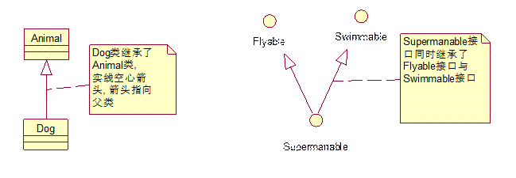

2) 实现

一个类实现接口

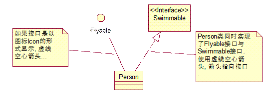

3)依赖

一个 A 类的方法返回值类型,方法参数类型或者是局部变量类型是另外一个 B 类,称 A 类依赖 B 类

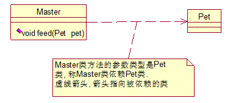

4)关联

如果 A 类使用 B 类定义了成员变量,称 A 类关联 B 类

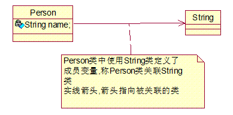

5)聚合

聚合是关联的一种, 如果一个类 A 是由若干的 B 类组成的并且不能决定 B 的生命周期,称 A 类为聚合类

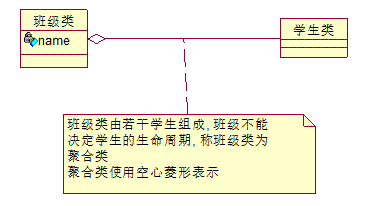

6)组合

组合是关联的一种, 如果一个类 A 是由若干的 B 类组成,并且可以决定 B 的生命周期,称 A 类为组合类

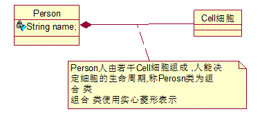

is a, 子类 is a 父类, 是继承关系, 也只有两个类符合 is a 关系时才能使用继承

like a, 类 like a 接口, 是实现关系,

has a, A 类 has a B, 关联关系

 [类与类的关系（关联，组合，聚合，依赖） - wdjxxl 的博客 - CSDN 博客](onenote:%E7%9F%A5%E8%AF%86%E7%82%B9%E5%89%AA%E8%BE%91%E5%AD%98%E6%94%BE.one#%E7%B1%BB%E4%B8%8E%E7%B1%BB%E7%9A%84%E5%85%B3%E7%B3%BB%EF%BC%88%E5%85%B3%E8%81%94%EF%BC%8C%E7%BB%84%E5%90%88%EF%BC%8C%E8%81%9A%E5%90%88%EF%BC%8C%E4%BE%9D%E8%B5%96%EF%BC%89%20-%20wdjxxl%E7%9A%84%E5%8D%9A%E5%AE%A2%20-%20CSDN%E5%8D%9A%E5%AE%A2&section-id={E9AD3268-AF34-4CA1-AF2C-63D682135ECF}&page-id={E086EF15-32EE-42AA-AC29-DD41F225E946}&end&base-path=https://d.docs.live.net/ec6f295088dd84ec/%E6%96%87%E6%A1%A3/%E5%AD%A6%E4%B9%A0%E7%AC%94%E8%AE%B0)

# 第二章 异常

**2.1**

**异常**

**概述**

异常就是程序运行过程中出现了不正常现象导致程序中断

在 Java 中, 把各种异常现象进行了抽象形成了异常类

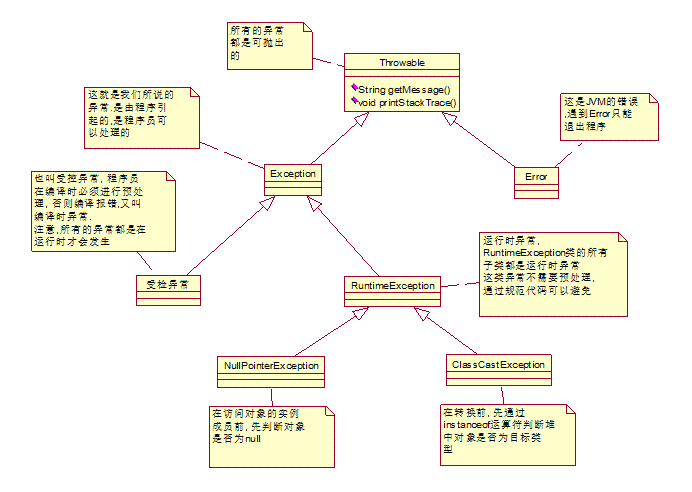

**2-2**

**异常处理**

运行时异常不需要预处理,通过规范的代码可以避免

受检异常必须预处理, 否则编译报错, 有两种预处理方式 :

1.  捕获处理
2.  抛出处理

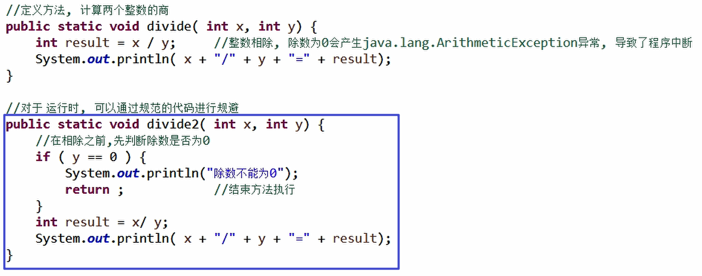

**2.2.1**

**异常捕获处理**

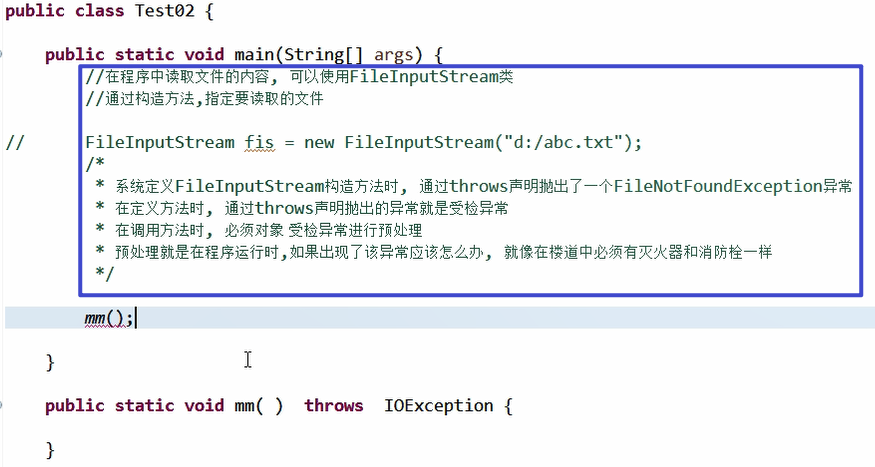

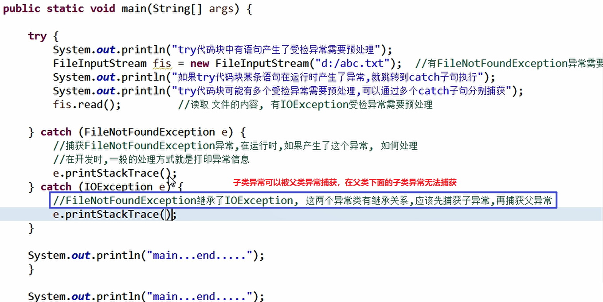

try{

对可能产生异常的代码进行检视

如果 try 代码块的某条语句产生了异常, 就立即跳转到 catch 子句执行,try 代码块后面的代码不再执行

try 代码块可能会有多个受检异常需要预处理, 可以通过多个 catch 子句分别捕获

}catch( 异常类型 1   e1){

捕获异常类型 1 的异常,进行处理

在开发阶段, 一般的处理方式要么获得异常信息,要么打印异常栈跟踪信息

e1.printStackTrace();

在部署后, 如果有异常,一般把异常信息打印到日志文件中

} catch( 异常类型 2   e1){

捕获异常类型 2 的异常,进行处理

如果捕获的异常类型有继承关系, 应该先捕获子异常再捕获父异常; 如果没有继承关系, catch 子句没有先后顺序

}finally{

不管是否产生了异常,finally 子句总是会执行

一般情况下,会在 finally 子句中释放系统资源

}

如:

try{

同学抽烟

扔烟头,引起纸团着火

打火机爆炸引起被包着火

宿舍着火

}catch(抽烟引起纸团着火   e ){

用脚踩

}catch( 被包着火 e2){

使用灭火器

}catch( 宿舍着火 ){

119

}

final/finalize/finally 的区别

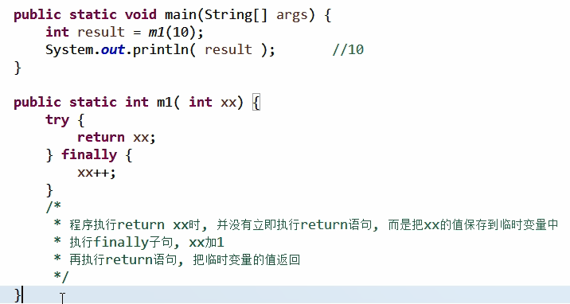

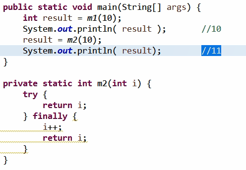

**2.2.2**

**throws**

**抛出处理**

在定义方法时, 如果方法体中有 受检异常需要预处理, 可以捕获处理,也可以抛出处理.

谁调用这个方法,谁负责处理该 异常,

在定义方法时,把异常抛出就是为了提醒方法的使用者,有异常需要预处理

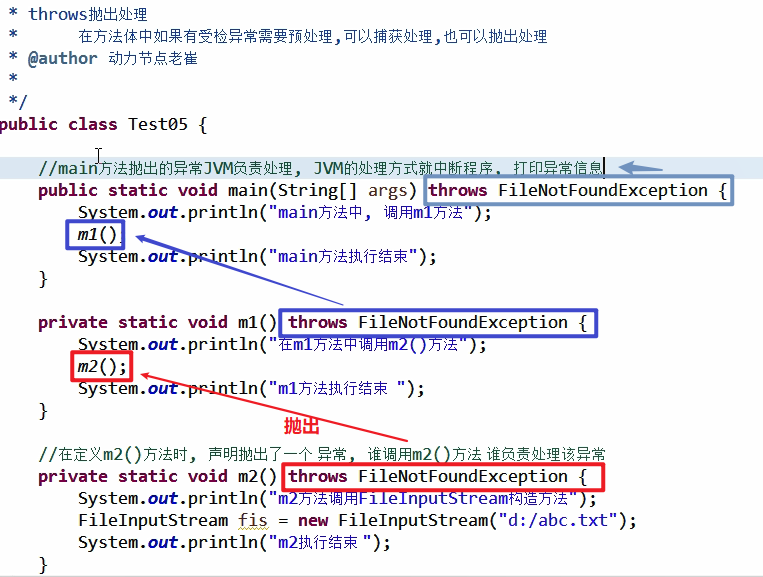

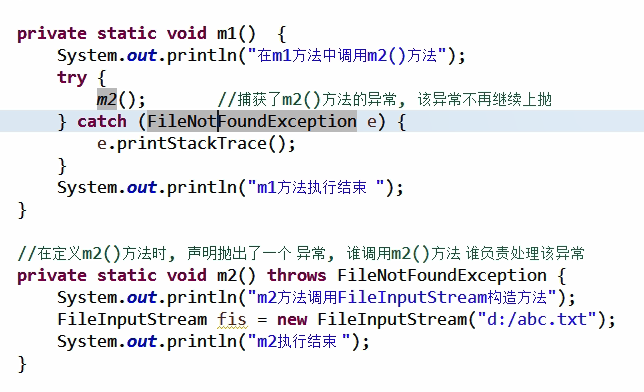

在处理异常时, 是选择捕获处理还是抛出处理??

1)一般情况下, 在调用其他方法时, 如果被调用的方法有受检异常需要预处理, 选择捕获处理

2)在定义方法时, 如果方法体中有受检异常需要预处理,可以选择捕获 ,也可以选择抛出处理; 如果方法体中通过 throw 语句抛出了一个异常对象,所在的方法应该使用 throws 声明该异常

**2.3**

**方法覆盖中的异常处理**

方法覆盖(重写)规则:

1.  方法签名必须相同, 方法名与参数列表就是方法签名
2.  方法的返回值类型可以相同 , 子类方法的返回值类型可以是父类方法返回值类型的子类型
3.  子类方法的访问权限可以更宽泛(更大),
    1.  如果父类方法使用 public 修饰,子类方法只能是 public 修饰
    2.  如果父类方法使用 protected 修饰,子类方法可以是 protected/public 修饰
4.  子类方法的异常要比父类方法的异常更小,
    1.  如果父类方法没有抛出异常,子类重写后也不能抛出异常
    2.  如果父类方法抛出了异常,子类方法可以抛出相同的异常,也可以抛出父类异常的子异常,也可以不抛出异常
5.
    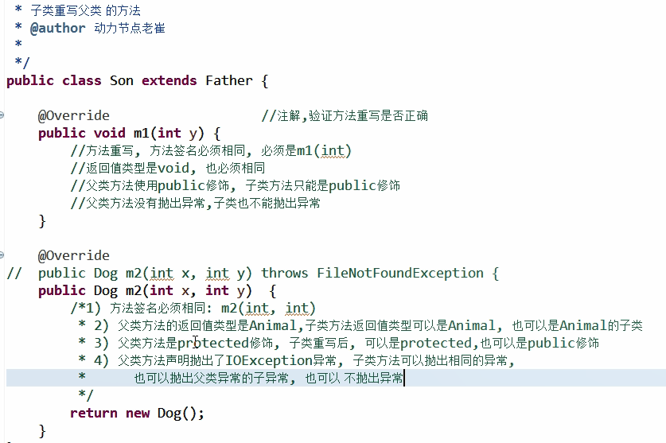

**2.4**

**异常在开发中应用**

自定义异常

1)定义一个类继承 Exception

2)在自定义异常类中提供两个构造方法

3)在需要的位置通过 throw 抛出异常对象

4)throw 所在的方法通过 throws 声明该异常

5)调用方法时,需要对受检异常预处理

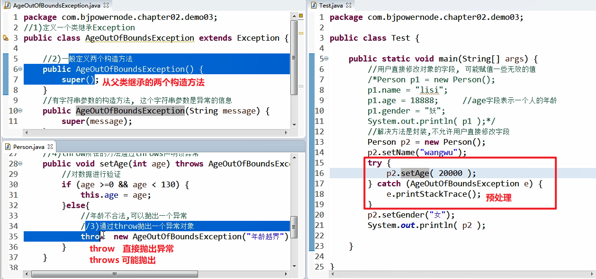

throw 和 throws 的区别:

1、throws 出现在方法函数头；而 throw 出现在函数体。

2、throws 表示出现异常的一种可能性，并不一定会发生这些异常；throw 则是抛出了异常，执行 throw 则一定抛出了某种异常。

3、两者都是消极处理异常的方式（这里的消极并不是说这种方式不好），只是抛出或者可能抛出异常，但是不会由函数去处理异常，真正的处理异常由函数的上层调用处理。

# 第三章 数组

**3.1**

**一维数组的定义与访问**

保存一个数据可以定义一个变量, 如果保存 100 个数据呢??可以使用数组

数组用来保存同一类型若干数据的容器

如何定义数组?

数据类型 [] 数组名 = new 数据类型[数组的长度];

说明:

1.  数据类型就是数组中存储元素的数据类型
2.  方括弧就是定义的是数组
3.  数组名其实就是一个变量名, 保存数组的引用(数组的起始地址)
4.  new 运算符会在堆中分配一块连续的存储空间, 把这块连续存储空间的引用(起始地址)保存到数组名中
5.  数组本质上就是堆中一块连续的存储空间

如:

int [] data = new int[5];

定义一个数组,这个数组可以存储 5 个 int 类型的数据,数组名是 data

如何访问数组?

通过索引值访问数组的元素

定义一数组之后 ,系统为每个元素指定一个索引值, 索引值是从 0 开始的,即数组 data 的 5 个元素分别是:

data[0] , data[1], data[2] , data[3] , data[4]

为什么通过索引值可以访问数组的元素??

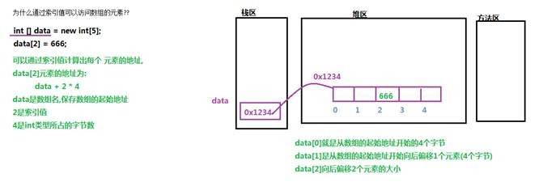

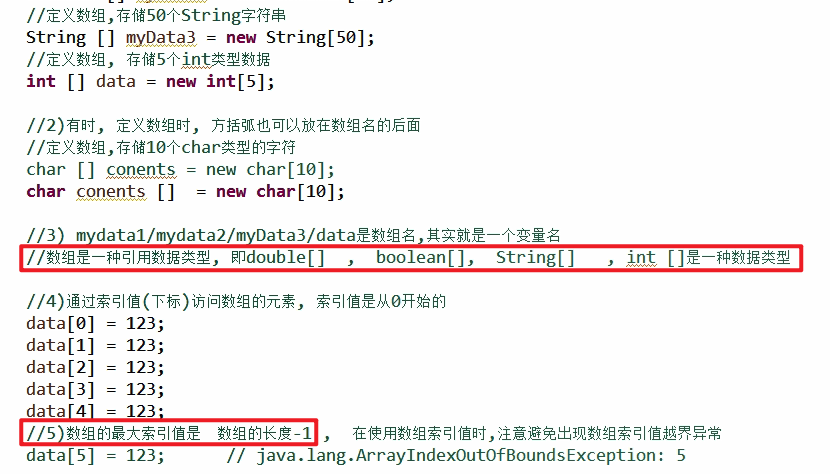

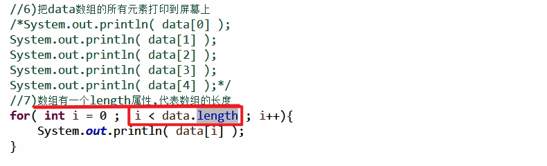

**3.2**

**数组的遍历**

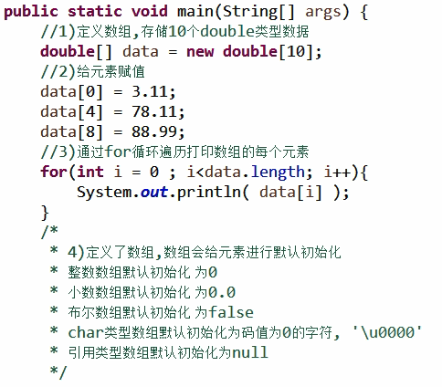

静态初始化：

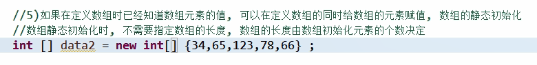

也可以写成 int [ ] data2 = {34,65,123,78,66} ;

静态初始化时，不能在 [ ] 中写数字，会编译错误

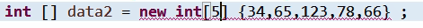

foreach 循环

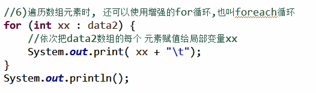

int [] data = new int[]{45,675,78,23};

for( int i = 0 ; i < data.length; i++){

System.out.print( data[i] + “\t”);

}

System.out.println();

也可以使用 foreach 循环

for( int xx : data ){

System.out.print( xx + “\t”);

}

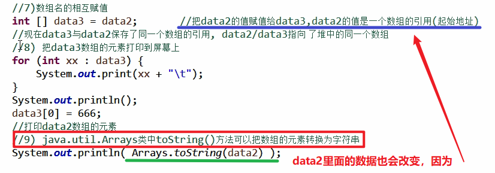

小结:

1.  记住类与类之间的几种关系, 尽量能画出关系图
2.  知道异常是什么

掌握异常的类结构, 能够画出异常类的结构图

掌握异常处理的两种方式, 知道如何选择异常的处理方式?

理解方法覆盖的规则

掌握自定义异常的方法

3)数组的作用是什么

掌握如何定义数组 ?

如何访问数组的元素

掌握遍历数组的元素

练习 1:

定义一个 User 类, 有用户名和密码两个字段, 要求用户名长度必须大于 6 个字符,否则抛出用户名不合法的异常

练习 2:

定义一个存储 10 个 int 类型数据的数组, 从键盘上输入 10 个整数给数组的元素赋值

把数组的元素打印到屏幕上, 要求 for 循环/foreach 循环

找出数组中最大值元素的下标,打印出来

**3.3**

**数组是一种引用数据类型**

数组可以作为方法的返回值类型, 也可以作为方法的参数类型

数组作为方法参数时, 在方法体中修改形参数组元素值,实际上也是修改实参数组元素值; 在方法体中对形参数组重新赋值,形参数组指向了新的数组.

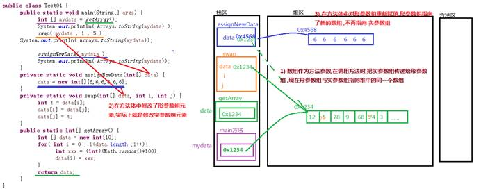

**3.4**

**可变长参数**

定义一个方法,可以接受任意个数据, 可以使用可变长参数

定义:

方法名( 参数类型 参数名 ,   类型 … 参数 )

说明:

1.  一个方法最多有一个可变长参数
2.  可变长参数只能放在参数列表的最后
3.  在方法体中, 把可变长参数当作数组使用即可

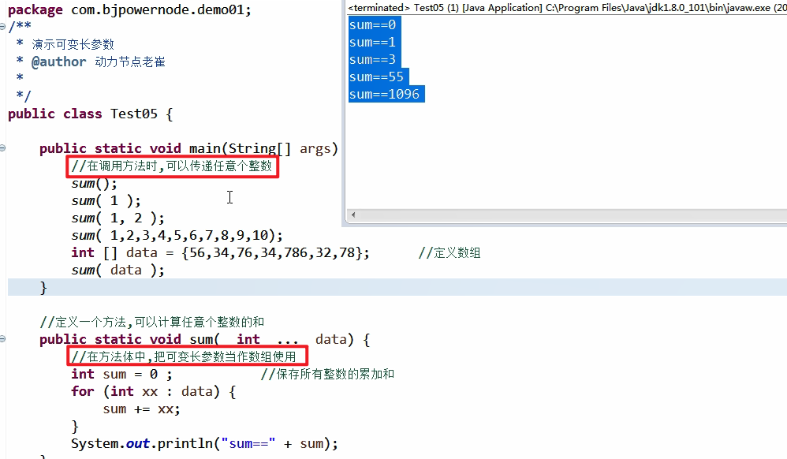

//感觉可变参数直接变成数组了

**3.5**

**数组扩容**

当定义了数组之后 ,数组的长度就确定了,即数组存储元素的个数就确定了, 如果想要在数组中保存更多的数据, 就需要对数组进行扩容.

数组扩容:

1.  定义一个更大的数组
2.  把原来数组的内容复制到新的数组中
3.  让数组名指向新的数组

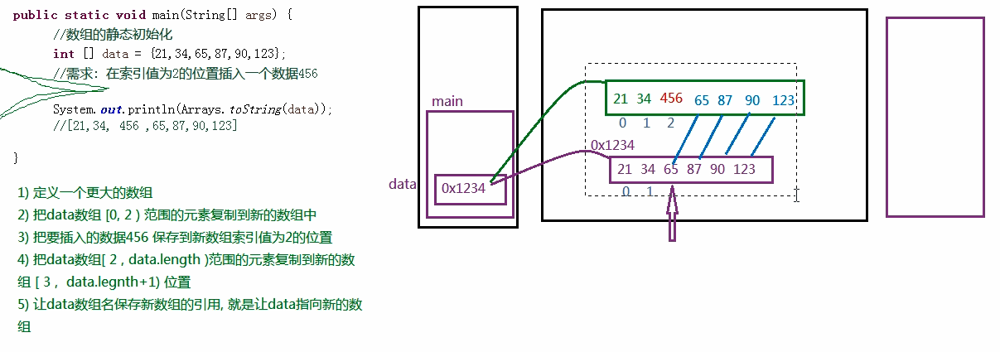

第二种方法

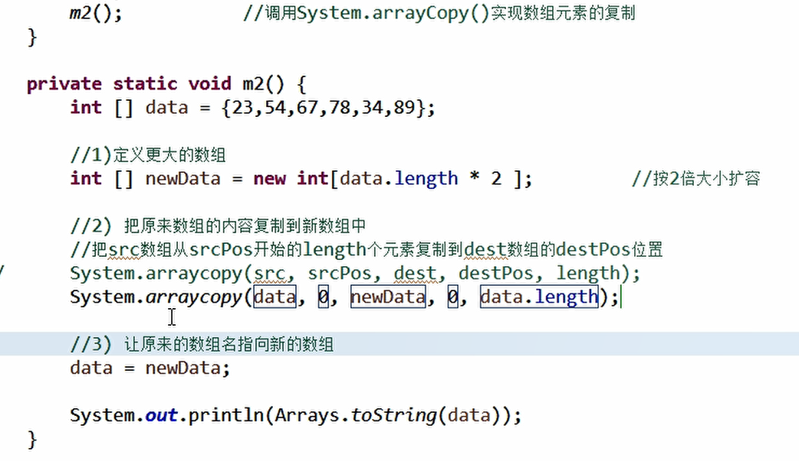

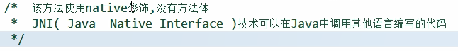

第 3 种方法

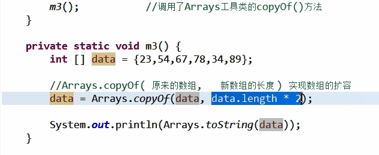

**3.6**

**数组的特点**

优点:

数组可以通过索引值(下标)可以实现数组元素的随机访问

缺点:

向数组中添加元素/删除元素时,效率比较低

应用场景:

以查询访问为主, 很少进行添加/删除时,选择数组存储这些数据

**3.7**

**对象数组**

数组中存储的是引用类型数据,就是对象数组

对象数组的元素实际上存储的是对象的引用

演示:购物车

**3.8**

**二维数组**

二维数组的每个元素又是一个数组

数组的数组就是二维数组

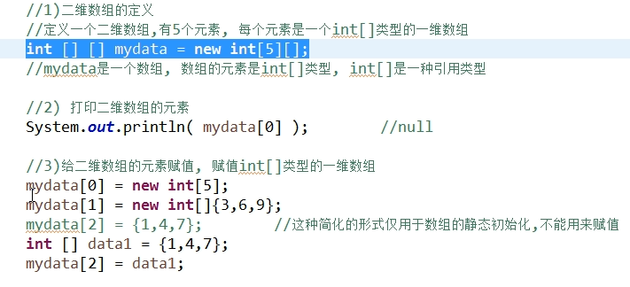

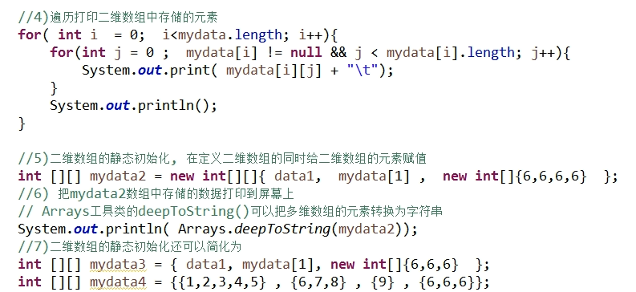

**3.9 Arrays**

**工具类**


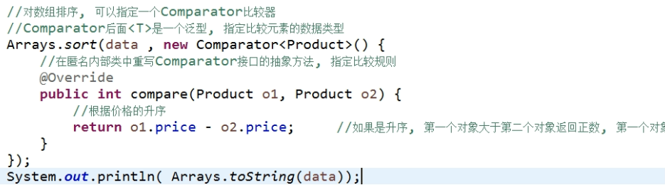

**3.10**

**数组的几个算法**

**3.10.1**

**冒泡排序算法**

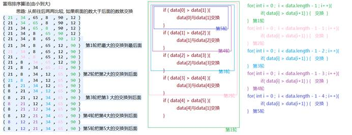

**3.10.2**

**选择排序算法**

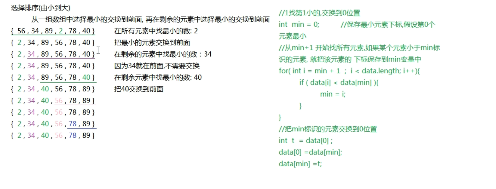

**3.10.3**

**二分查找算法**

小结:

1.  数组是一个引用类型, 可以作为方法的返回值类型,也可以作为方法的参数类型, 注意数组是方法参数类型时, 修改形参数组的元素, 给形参数组重新赋值
2.  掌握可变长参数如何定义, 如何使用
3.  掌握数组扩容的方法
4.  理解数组的特点
5.  学会对象数组的创建与遍历
6.  学会二维数组的创建与遍历
7.  学会 Arrays 工具类的常用方法: toString(), copyOf() , sort(), binarySeach()
8.  了解冒泡排序的原理, 在面试前掌握算法的实现

练习 1:

定义一个方法, 实现对形参数组的逆序

练习 2:

定义一个方法, 返回一个长度为 10 的整数数组, 对数组的元素进行随机的初始化 100 内的正整数, 要求数组中的元素不重复

练习 3:

定义一个用户类 User,包括用户名和密码两个字段

定义一个用户管理类 UserManager, 定义一个数组保存用户信息, 定义一个方法 add(User)向数组中添加一个用户, 定义方法 usernameExist(String)判断用户名是否存在, 定义方法 userExist(User)判断用户是否存在

定义测试类, 提示用户选择操作: 1 用户注册, 2 用户登录,3 退出程序. 如果用户选择 1 表示注册, 提示输入用户名, 判断用户名是否存在,如果存在提示用户重新输入, 提示用户输入密码, 根据用户名和密码创建 user 对象添加到数组中; 如果用户选择 2 表示登录, 提示输入用户名和密码, 判断用户是否存在;

练习 4:

定义一个 Attackable 攻击接口,封装 attach()攻击的行为

定义一个 Movable 接口, 封装 move()移动的行为

定义一个 Weapon 武器类, 武器是可攻击的,但是不同的武器攻击方式不同

定义一个 Tank 类继承 Weapon, 坦克是可移动的

定义一个 Flighter 战斗机类继承 Weapon, 战斗机也是可移动的

定义一个 Missile 导弹类继承 Weapon, 导弹不能移动

定义一个 Army 军队类, 军队有武器库, 使用数组来保存若干的武器模拟武器库; 向武器库中添加武器, 从武器库中删除武器, 给所有的武器下达攻击指令, 给能移动的武器下达移动指令.

# 第四章 常用类

**4.1**

**与字符串相关的类**

**4.1.1 String**

**类**

java.lang.String 类表示字符串的类

1.  如何创建 String 对象(构造方法)
2.  常用方法


1.  正则表达式
2.  字符串判等
3.  String 字符串对象不可变

**4.1.2 StringBuilder/StringBuffer**

**类**

可变的字符串

如果频繁进行字符串连接,使用 StringBuilder/StringBuffer

这两个类量常用方法是: append()

**4.2**

**包装类**

在 java 中, 系统为每一个基本类型都提供 了 一个对应的包装类型

| 基本类型 | 包装类    |
| -------- | --------- |
| byte     | Byte      |
| short    | Short     |
| int      | Integer   |
| long     | Long      |
| float    | Float     |
| double   | Double    |
| char     | Character |
| boolean  | Boolean   |

为什么提供包装类?? 为了编程方便

包装类在 java.lang 包中

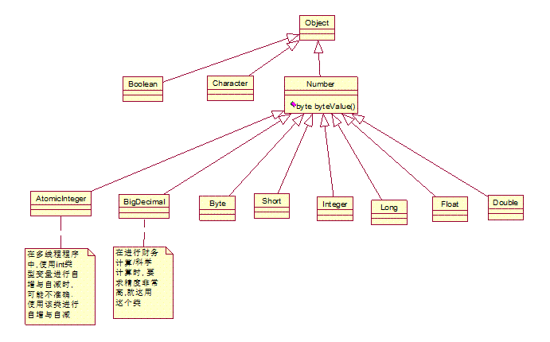

Atomiclnteger

在多线程程序中，使用 int 类型变量进行自增与自减时，可能不准确.使用该类进行自增与自减

BigDecimal

在进行财务计算/科学计算时，要求精度非常高，就这用这个类

包装类对象的创建(构造方法)

包装类的基本操作

装箱与拆箱

总结:

1)熟练掌握 String 对象创建的各种方式

2) 熟练掌握 String 的常用操作

3) 理解字符串判等,   ==   equals()   字符串字面量保存在常量池中

4)理解 String 对象是不可变的

5)记住 StringBuilder/StringBuffer 是可变 的字符串, 常用的操作是 append()

6)记住系统为每个基本类型提供的对应包装类, 理解为什么提供包装类

7) 学会创建包装类对象, 掌握包装类的基本操作

8) 理解装箱与拆箱, -128~127 之间整数装箱采用享元模式

练习 1:

验证用户输入的密码必须包括字母/数字, 要求密码的长度大于 6 个字符

练习 2:

根据身份证号, 判断人的出生日期, 判断人的性别(第 17 位)

练习 3:

有一个字符串 " lisi, 18,男;wangwu,20,女;feifei,28,女;yanmingjie,34,男";根据字符串中人的信息创建 Person 对象, 添加到数组中.

1.  创建 Person 类
2.  创建一个存储 Person 对象的数组
3.  把字符串中的信息分离出来
4.  遍历数组中的信息, 创建 Person 对象, 添加到数组中

练习 4:

int/Integer/String 之间的相互转换

**4.3**

**日期类**

java.util.Date 类

java.text.SimpleDateFormat 对日期格式化

**4.4**

**数学类**

java.lang.Math

java.math.BigDecimal

java.util.Random

# 第五章 集合

**5.1 Collection**

**集合概述**

集合是用来存储引用类型数据的容器

集合主要有两大类:

Collection 集合: 存取数据时是单个存取,

Map 集合: 是按<键,值>对的形式存取数据, <”lisi”,18> <”feifei”, 28>

java.util.Collection 集合框架

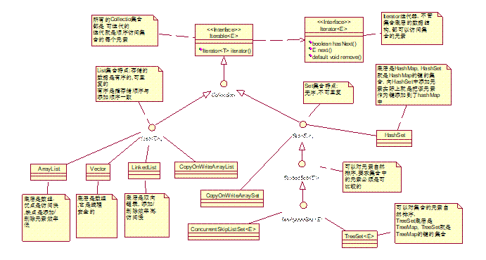

**5.2 Collection**


**5.3 List**

**集合**

List 特点: 有序,可重复

List 集合为每个元素指定了一个索引值, 主要增加了针对索引值的操作

练习:

定义一个 List 集合, 存储 Employee 员工信息

向集合中添加以下加工:

<lisi, 18,5800>

<wangwu, 28,9000>

<zhaoliu, 38,8800>

<yanmingjie, 35,10000>

在 wangwu 工人前面插入一个员工<feifei, 28,6666>

删除 zhaoliu

迭代遍历所有的员工信息

**5.4 ArrayList**

**与**

**Vector**

- 1) 底层都是数组, Vector 是线程安全的, Arraylist 不是线程安全的

- 2) 初始化容量: 10

- 3) ArrayList 扩容: 1.5 倍速, Vector 扩容: 2 倍

**5.5 LinkedList**

底层是双向链表

**5.5.1**

**单向链表**

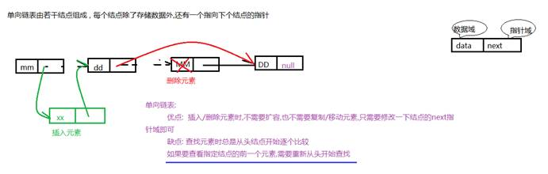

**5.5.2**

**双向链表**

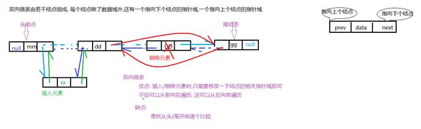

**5.5.3 LinkedList**

**新增的方法**

增加了针对头与尾的操作

| void | [addFirstaddFirst-E-) ( E( e)把元素e添加到列表的头部 |
| ---- | ---------------------------------------------------- |
| void | [addLastaddLast-E-) ( E( e) 把元素e添加到最后        |
| E(   | [getFirstgetFirst--) () 返回第一个元素               |
| E(   | [getLastgetLast--) () 返回最后一个元素               |
| E(   | [removeFirstremoveFirst--) () 删除第一个元素         |
| E(   | [removeLastremoveLast--) () 删除最后一个元素         |
| E    | [peekpeek--) () 返回第一个元素                       |

有时, 使用 LinkedList 模拟栈, 栈的特点:后进先出

| void | [pushpush-E-) ( E( e) 模拟压栈, 把元素e添加列表的头部 |
| ---- | ----------------------------------------------------- |
| E(   | [poppop--) () 模拟出栈, 把列表的第一个元素删除        |

使用 offer(e), poll()模拟队列, 队列特点: 先进先出,

| boolean | [offeroffer-E-) ( E( e) 模拟入队, 把元素e添加到列表的尾部 |
| ------- | --------------------------------------------------------- |
| E(      | [pollpoll--) () 模拟出队, 把列表的第一个元素删除          |

**5.6 Set**

**集合**

特点:无序,不可重复

- HashSet

- 1) HashSet 底层是 HashMap

- 2) 向 hashset 中添加元素,实际上是把该元素作为键添加到底层的 HashMap 中

- 3) HashSet 就是 HashMap 键的集合

- TreeSet

- 1) TreeSet 实现了 SortedSet 接口, 可以对元素自然排序, 要求集合中的元素必须是可比较的

- (1)在创建 TreeSet 时,可以指定 Comparator 比较器

- (2)没有指定 Comparator 比较器, 要求元素的类实现 Comparable 接口

- 2) TreeSet 底层是 TreeMap

- 向 TreeSet 添加元素,实际上是把该元素作为键添加到了底层的 TreeMap 中

- TreeSet 实际上就是 TreeMap 键的集合

小结:

1.  掌握创建 Date 日期对象, 对 Date 日期进行格式化, 把日期字符串转换为 Date 对象
2.  了解 Math 类定义了三角函数, 知道 BigDecimal 类可以进行精确的计算, 能够使用 Random 类生成随机数
3.  能够画出 Collection 集合框架结构图, 记住每个集合的特点
4.  掌握 Collection 集合的基本操作: 添加, 删除, 判断是否存在, 迭代遍历/删除
5.  掌握 List 集合特点, 增加了针对索引值的操作
6.  记住 ArrayList, Vector 与 LinkedList 的特点
7.  了解单向链表/双向链表的结构
8.  记住 LinkedList 增加针对第一个元素/最后一个元素的操作
9.  记住 Set 集合特点, HashSet 集合特点, TreeSet 集合特点

练习 1:

总结 Collection 各个集合的应用场景

练习 2:

把购物车改为使用集合存储产品

练习 3:

有字符串:”01,勇哥,100;02,杜哥,95;03,明哥,90;04,菲菲,5;05,杨哥,60”

1.  把字符串中的学生信息分离出来,

01,勇哥,100

02,杜哥,95

…….

这些数据分别是学号, 姓名,成绩

1.  创建 List 集合, 根据分离出来的学生信息创建学生对象, 添加到 List 集合中
2.  通过迭代分别打印集合中的学生信息
3.  判断集合中是否存在 姓名为”明哥”的学生
4.  对集合中的学生按成绩降序排序
5.  通过循环打印集合中的学生信息
6.  删除姓名为”明哥”的学生
7.  通过 foreach 循环打印集合中学生的信息

练习 4:

1) 创建 Product 产品类, 包括名称, 价格, 数量三个字段

2)创建 TreeSet 集合, 存储 Product 产品,默认按价格升序排序, 向集合中添加一些 Product 对象

3)对 TreeSet 集合中的产品根据数量降序再次排序

**5.7 Collection**

**小结**

Collection 存储数据时是单个存储的,只能存储引用类型数据

add() , remove() , contains() , iterator()

----List 集合

有序, 可重复

为每个元素指定了一个索引值,

add(index, o), remove(index),   get(index), sort(Comparator)

--------ArrayList

--------Vector

底层是数组, 访问快, 添加/删除慢

初始化容量: 10

扩容: ArrayList 是 1.5 倍, Vector 是 2 倍

Vector 是线程安全的, ArrayList 不是线程安全的

--------LinkedList

底层是双向链表, 添加/删除效率高, 访问慢

******************List 集合如何选择

ArrayList 应用于以查询访问为主,很少进行添加/删除操作

LinkedList 应用于 频繁的进行添加/删除操作的情况

----Set 集合

无序, 不可重复

--------HashSet

底层是 HashMap

HashSet 就是 Hashmap 键的集合

--------TreeSet

底层是 TreeMap

TreeSet 就是 TreeMap 的键 的集合

TreeSet 实现了 SortedSet 接口, 可以对元素自然排序, 要求元素必须是可比较的

1.  创建 TreeSet 时指定 Comparator 比较器
2.  如果没有指定 Comparator 比较器, 元素的类要实现 Comparable 接口

*************如何选择 HashSet 还是 TreeSet

如果不需要进行排序选择 HashSet

如果需要根据某个字段排序,选择 TreeSet

===================注意

List 集合与 HashSet 集合中判断是否同一个元素, 需要调用对象的 equals()方法, 元素的类需要重写 equals()方法

TreeSet 集合判断是否同一个元素,根据 Comparator/Comparable 的比较结果是否为 0 判断,如果比较结果为 0 就认为是同一个元素

**5.8**

**泛型**

泛型就是把数据类型作为参数传递
```java
在 Comparable<T>/ Comparator<T>接口中 通过泛型指定比较元素的数据类型

在 Collection<T>集合中,通过泛型指定存储元素的数据类型
```
泛型的好处是:

在编译时可以进行数据类型的检查

注意,在集合泛型中, 在定义集合时泛型才有作用:

```java
Collection<String> collection = new ArrayList<>();
```

约束 collection 集合中只有存储 String 字符串, 在赋值时,ArrayList 后面的泛型不需要写, 如果要写也要和前面的泛型一样
```java
Collection   collection22 = new ArrayList<String> ();
```
如果前面定义集合时,没有泛型约束,而在赋值时指定了 ArrayList 泛型为 String, 不管用. collection22 集合可以存储任意的对象

**5.9 Collections**

**工具类**

java.util.Collections 工具类提供了一些对 Collection 集合进行操作的方法

Collections 工具类中有一组操作: synchronizedXXX(XXX)可以把 XXX 集合由不是线程安全的集合转换为线程安全的集合:

```java
Collection<T> synchronizedCollection(Collection<T> c)

static <T> List<T> synchronizedList(List<T> list)

static <K,V> Map<K,V> synchronizedMap(Map<K,V> m)

static <T> Set<T> synchronizedSet(Set<T> s)
```

但是, 我们现在开发多线程程序,基本不再使用这些方法, 而是直接使用 java.util.concurrent 包中线程安全的集合类, 如：线程安全的 List 集合: copyonWriteArrayList,. 线程安全的 Set 集合: copyOnWriteArraySet, concurrentSkipListSet

**5.10 Map**

**概述**

Map 是按<键,值>对的形式存储数据的

java.util.Map 集合框架:

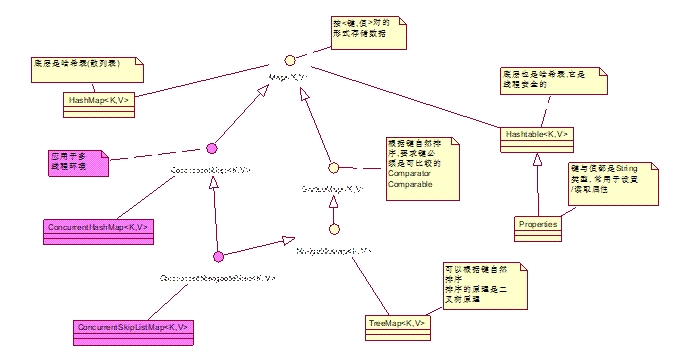

**5.11 Map**

**的基本操作**

**5.12 HashMap**

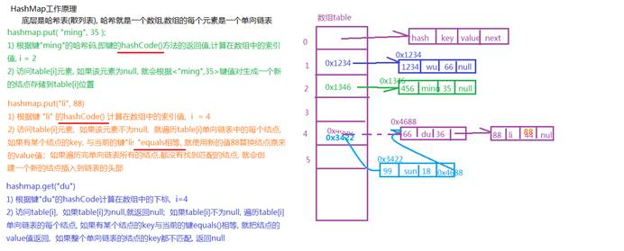

HashMap 底层是哈希表(散列表), 哈希表就是一个数组,数组的每个元素是一个单向链表; 在 put( k, v )添加键值对时, 先根据键的 hashCode 计算数组的索引值(下标), 访问数组元素, 如果该元素为 null, 创建一个新的结点保存到数组元素中; 如果数组元素不为 null, 遍历单向链表的各个结点, 如果有某个结点的 key 与当前的键 equals 相等, 就使用新的值 v 替换结点原来的 value 值, 如果整个链表中所有结点的 key 都不匹配, 就创建一个新的结点插入到链表的头部.

**5.13 HashTable**

- HashTable

    1) 底层都是哈希表(散列表), 但是 HashTable 是线程安全的, HashMap 不是线程安全的
    2) HashMap 的父类是 AbstractMap, HashTable 的父类是 Dictionary
    3) HashMap 默认的初始化容量: 16 , HashTable 默认初始化容量: 11
    4) 加载因子: 0.75 , 当<键,值>对的数量 大于   数组的容量(哈希桶的容量) * 加载因子时 , 数组要扩容
    5) HashMap 扩容默认: 2 倍大小;   HashTable 扩容: 2 倍 + 1
    6) HashMap 的键与值都可以为 null, HashTable 的键与值都不能为 null
    7) HashMap 在创建时, 可以指定一个初始化容量, 系统会调整为 2 的幂次方, 为了快速计算出数组的下标

- HashTable 也可以指定初始化容量, 系统不调整

**5.14 Properties**

Properties 继承了 HashTable, 键与值都是 String

经常用于设置/读取系统属性, setPropertty(属性名, 属性值) , getProperty(属性名)

使用 Properties 读取配置文件

**5.15 TreeMap**

1) TreeMap 实现了 SortedMap, 可以根据键自然排序, 排序原理是二叉树原理


2) TreeMap 的键必须是可比较的

指定 Comparator 比较器

如果没有 Comparator 比较器, 元素的类实现 Comparable 接口

**5-16 Map**

**小结**

Map 按<键,值>对形式存储数据

put( k ,v)   containsKey(k)   containsValue(v)   get(k)   remove(k)

keyset()   values()   entrySet()

---- HashMap

工作原理

----HashTable

与 HashMap 的异同点

--------Properties

键与值都是 String 字符串

设置/读取系统属性值

----TreeMap

可以根据键自然排序

************************如何选择?

如果不需要根据键排序就选择 HashMap

如果需要根据键排序,就选择 TreeMap

==================注意:

HashMap 中的键需要重写 equals()/hashCode()方法

TreeMap 中的键是根据 Comparator/Comparable 的比较结果是否为 0 来判断是否相同

小结:

1.  知道泛型是什么 , 泛型的优点
2.  了解 Collections 工具类有一组 synchronizedXXX()可以把不是线程安全的集合转换为线程安全的集合
3.  能够画出 Map 集合的结构图
4.  掌握 Map 的基本操作
5.  理解 HashMap 的工作原理
6.  记住 HashTable 与 HashMap 的异同点
7.  学会使用 Properties 读取配置文件的属性
8.  了解 TreeMap 键的排序采用二叉树原理
9.  明确 TreeMap 中的键必须是可比较的, 要么指定 Comparator 比较器, 如果没有 Comparator 比较器, 键要实现 Comparable 接口

练习 1:

用户登录, 用户管理类使用 Map 保存<用户名,密码>

练习 2:

/** 把 下面的数据定义一个集合保存起来

- [{"time":"2018-08-23 09:58:40",

- "ftime":"2018-08-23 09:58:40",

- "context":"华伟家园东门头房快递服务中心妈妈驿站已发出自提短信,请上门自提,联系电话 17662528999",

- "location": null},

- {"time":"2018-08-23 09:57:40",

- "ftime":"2018-08-23 09:57:40",

- "context":"快件已到达华伟家园东门头房快递服务中心妈妈驿站,联系电话 17662528999",

- "location": null},

- ......

- ]

*

*/

# 第六章 IO 流

**1.1 概述**

流是有起点和终点的有序字节序列

流的分类:

输入流/输出流, 是当前程序为参照点, 程序从外面读数据这是输入流, 把程序的数据保存到外面是输出流

字节流/字符流, 如果是以字节为单位处理流中的数据就是字节流, 如果是以字符为单位处理流中的数据就是字符流

节点流/处理流, 如果直接从设备(数据源)上读写数据就是节点流, 处理流是对节点流的包装

在程序中从文件里读写数据需要使用 IO 流. Java 定义了相关的流类,在 java.io 包中,如果这个类是以 Stream 单词结尾就是字节流类, 如果是以 Reader 结尾就是字符输入流, 以 Writer 单词结尾就是字符输出流

**1-2 FileInputStream/FileOutputStream**

以字节为单位读写文件内容

**1-3 FileReader/FileWriter**

以字符为单位读写文件内容

只能读写文本文件, 并且要求文本文件的编码格式与当前环境编码格式兼容

**1-4 InputStreamReader/OutputStreamWriter**

当文本文件编码与当前环境编码不兼容时, 使用这个转换流

InputStreamReader 把字节流以指定的编码转换为字符流

OutputStreamWriter 可以把字符转换为指定格式的字节流

**1-5 BufferedReader/BufferedWriter**


**1-6 ObjectInputStream/ObjectOutputStream**

对象序列化:

把对象转换为 01 二进制序列就是对象序列化

对象反序列化

把一组 01 二进制序列转换为对象

注意:

对象序列化/反序列化前提是对象的类要实现 Serializable 接口,该接口是一个标志性接口,没有任何方法

ObjectOutputStream 类 可以把对象序列化,把序列化后二进制保存到文件中

ObjectInputStream 类可以从文件读取 01 序列,把 这组 01 序列转换为对象(反序列化)

一般情况下, 类实现了 Serializable 接口后, 手动的添加一个序列化版本号字段:

private static final long serialversionUID = 2332956456465L;

**1-7 PrintStream/PrintWriter**

打印字节流/打印字符流

**1-8 File**

**类**

读取文件内容使用 IO 流, 操作文件/文件夹使用 File 类, 如创建/遍历/删除文件夹, 查看文件的相关属性等操作

小结:

1.  记住流的概念及分类
2.  掌握 FileInputStream/FileOutputStream 字节流实现文件读写
3.  能够使用 FileInputStream/FileOutputStream 字节流类实现文件复制, 异常处理, 手动/自动关闭流
4.  掌握 FileReader/FileWriter 字符流类的使用
5.  能够使用 FileReader/FileWriter 字符流类实现文本文件的复制,异常处理,手动/自动关闭流
6.  初步掌握转换流的使用
7.  了解缓冲流的工作原理
8.  掌握对象序列化/反序列化
9.  了解打印流
10. 了解 File 类

# 第七章 线程

**7-1**

**线程概述**

进程

进程就是操作系统运行的一个程序

线程

线程就是进程的一个执行单元,一条执行路径

如启动 360 安全卫士就是打开一个进程, 它的电脑体检/木马查杀/系统清理等就是这个进程的几个执行单元, 每个执行单元就是一个线程

迅雷就是一个进程, 可以同时下载多部电影, 每一部电影的下载就是一条执行路径,就是迅雷进程的一个线程

一个进程至少有一个线程, 如果进程有多个线程,则它就是多线程应用程序

每个线程都有独立的栈空间

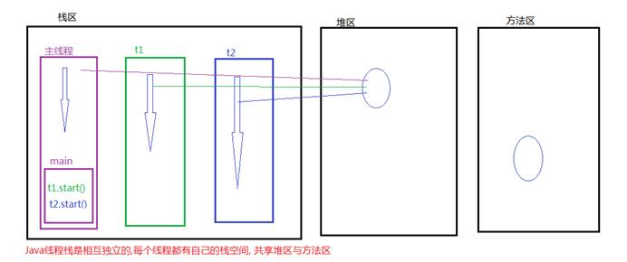

主线程

JVM 启动主线程,主线程运行 main 方法

用户线程

开启的新的线程, 也称子线程

守护线程

守护线程是为其他线程提供服务的线程,不能独立运行,当 JVM 中只有守护线程时,JVM 会退出.   垃圾回收器就是一个守护线程

**7-2**

**创建线程的方式**

创建线程依赖 java.lang.Thread 类, Thread 就是一个线程类

**7.2.1**

**继承**

**Thread**

class SubThread   extends   Thread{

public void run (){

子线程要执行的代码

}

}

SubThread t1 = new SubThread();

t1.start();

**7.2.2**

**实现**

**Runnable**

**接口**

class Prime1 implements Runnable{

public void run(){

用户线程执行的代码

}

}

Thread t2 = new Thread( new   Prime1() );

t2. start()

**7.2.3**

**实现**

**Callable**

**接口**
```java
class Prime2 implements   Calllable<Integer> {

public Integer call()   throws   Exception{

子线程执行的代码

return   xxx;

}

}

FutureTask<Integer> task = new FutureTask<>( new Prime2() );

Thread t3 = new Thread( task );

t3.start();

可以获得子线程返回的结果

task.get()
```

**7-3**

**线程的常用操作**


**7-4**

**线程的生命周期**

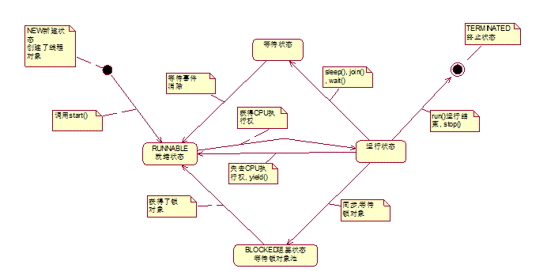

**7-5**

**线程调度**

**7.5.1**

**优先级**

线程优先级越高, 获得 CPU 执行权的机率越大

取值范围: 1 ~ 10

默认值: 5

setPriority() / getPriority()

**7.5.2**

**睡眠**

Thread.sleep( millis )

静态方法,由类名调用

睡眠的单位是毫秒

有受检异常需要预处理

sleep()方法所在的线程睡眠

**7.5.3**

**中断**

t1.interrupt()

一般情况下,是把处于睡眠/等待中的线程给中断

**7.5.4**

**线程合并**

t1.join() 在当前线程中加入 t1 线程, 当前线程转为等待状态, 等到 t1 执行完后当前线程转为就绪状态

**7.5.5**

**让步**

Thread.yield(), 把运行的线程转为就绪状态,重新抢 CPU 执行权

**7.5.6**

**线程终止**

t1.stop(),   已过时

一般通过修改线程标志的方式让线程运行结束

**7.6**

**线程同步**

1.  线程安全问题

当多个线程同时操作堆区或者方法区的某个数据时, 可能会出现数据不一致 的现象, 称为线程安全问题

2 出现线程安全问题怎么办?

每个线程都 访问自己的局部变量

如果多个线程必须同时操作实例变量/静态变量时, 可以采用线程同步技术

3 线程同步技术解决什么问题?

当一个线程在操作期间,不允许其他的线程加入

某一段代码在某一时刻只能由一个线程执行

4 如何同步?

语法:

synchronized( 锁对象 ) {

同步代码块

}

工作原理:

1.  线程要执行同步代码块, 必须先获得锁对象
2.  任意对象都可以作为锁对象, 每个对象有一个内置锁
3.  某一时刻, 锁对象最多只能被一个线程持有
4.  如果线程获得了锁对象后,会一直持有, 直到执行完同步代码块后才释放

场景描述: 假设有线程 A 和线程 B 两个线程都想要执行同步代码块

1.  线程 A 获得 CPU 执行权, 获得了锁对象后, 开始执行同步代码块
2.  线程 A 在执行同步代码块期间, CPU 执行权被线程 B 抢走了, 线程 A 转为就绪状态
3.  线程 B 获得 CPU 执行权, 也想要执行同步代码块, 必须先获得锁对象, 现在锁对象被线程 A 持有, 线程 B 转到等待锁对象池中进行阻塞
4.  线程 A 重新获得 CPU 执行权, 执行完同步代码块后释放锁对象
5.  等待锁对象池中的线程 B 获得了锁对象,转为就绪状态

5 同步代码块

同步代码块想要实现同步,必须使用同一个锁对象

只要使用了同一个 锁对象的同步代码块就可以实现同步

经常定义一个常量 对象作为锁对象

有时使用 this 对象作为锁对象

有时也使用当前类的运行时类对象作为锁对象, 如 Test07.class, 有人称它为类锁

6 同步方法

直接使用 synchronized 修饰的方法, 把整个方法体都作为同步代码块

修饰实例方法, 默认的锁对象是 this 对象

修饰静态方法, 默认的锁对象是当前类的运行时类, 如 Test07.class

7 死锁

在线程同步时, 由于获得锁对象的顺序不一致导致线程出现相互等待的情况,称为死锁

如何避免出现死锁?

保证获得 锁对象的顺序一致即可

小结:

1.  理解线程的相关概念: 进程, 线程, 主线程, 用户线程, 守护线程
2.  知道创建线程的三种方式, 掌握其中的两种: 继承 Thread 类, 实现 Runnable 接口
3.  了解线程的基本操作,   掌握以下方法的使用:

Thread.currentThread()

getName()

Thread.sleep()

通过标志终止线程的方法

1.  能够画出线程的状态图(线程生命周期)
2.  掌握线程同步技术

什么是线程安全问题?

出现线程安全问题怎么办??

理解线程同步技术解决什么问题?

如何同步?

同步代码块的特点, 常用的锁对象有哪些?

同步方法

死锁

**7.7**

**生产者消费者设计模式**

设计模式就是别人总结的一套解决方案,这大解决方案被大多数人熟知与认可.

生产者消费者设计模式解决了数据的平衡问题

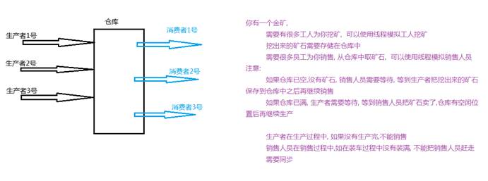

练习:

创建两个线程, 一个线程打印奇数,一个线程打印偶数,实现交替打印

**7.8 Timer**

练习:

创建两个线程, 一个线程打印 100 个数, 另一个线程打印 10 个数,实现交替打印

线程 1:1

线程 1:2

……

线程 1:100

线程 2:101

……

线程 2:110

线程 1:111

线程 1:112

……

线程 1:210

线程 2:211

……

线程 2:220

# 第八章 反射

**8.1**

**概述**

反射就是根据字节码文件, 反射类的信息,字段,方法,构造方法等类的内容, 根据字节码文件创建对象, 调用方法的技术

反射的基础 是 Class 对象

把一组小狗可以抽象为 Dog 类, 把一组小猪抽象类 Pig 类, 把一组人抽象为 Person 类, 把 Dog/Pig/Person/String/System 等所有的类抽象为 Class 类, Class 类描述所有的类的共同特征

如何获得 Class 对象?

1.  每个类都有 class 属性,
2.  每个对象都有 getClass()方法
3.  Class.forName( 完整类名 )

**8.2**

**反射类的信息**

java.lang.reflect 包中有反射相关的类

class1.getModifiers()       返回类的修饰符

class1.getName()           返回完整类名

class1.getSimpleName()       简易类名

class1.getSuperClass()       父类

class1.getInterfaces()       接口

**8.3**

**访问字段**

class1.getField( 字段名 ) 返回指定名称的公共字段

class1.getDeclaredField(字段名)     返回指定名称的字段

class1.newInstance()       创建实例

field.set( 实例名, 字段值)         设置字段的值

field.get( 实例名 ) 返回字段的值

**8.4**

**调用方法**

class1.getMethod( 方法名, 方法的参数类型列表)   反射方法

method.invoke( 实例名, 方法的实参列表)

**8.5 IO+Properties+Reflect**

有时会把类名保存到配置文件中, 通过 Properties 读取配置文件的类名 , 通过反射创建对象

# 第九章 Socket 编程

1)开发网络程序, 需要知道对方计算机的 IP 地址, 端口号, 通讯协议

2)现在网络采用的是 TCP/IP 传输协议簇

TCP ,面向连接的可靠的传输控制协议, 类似于打电话, 三次握手机制

UDP, 用户数据报协议, 类似于对讲机

B/S, Browser 浏览器/Server 服务器

```java
import java.io.BufferedReader;
import java.io.IOException;
import java.io.InputStreamReader;
import java.io.OutputStreamWriter;
import java.net.ServerSocket;
import java.net.Socket;
public class ChatServer {
public static void main(String[] args) throws IOException {
// 创建服务器器端, 注册当前程序的端口号
ServerSocket server = new ServerSocket(9090);
// 接受客户端的连接，产⽣生⼀一个Socket
Socket socket = server.accept();
// 获取Socket的输⼊入流, 就是通过这个输入流获得客户端发送给服务器的数据
BufferedReader socketReader = new BufferedReader(new InputStreamReader(socket.getInputStream()));
// 获取Socket的输出流, 就是通过该输出流, 服务器把数据发送给客户端
OutputStreamWriter socketOut = new OutputStreamWriter(socket.getOutputStream());
// 获取键盘的输⼊入流,通过该输入流读取键盘上输入的数据
BufferedReader keyboardReader = new BufferedReader(new InputStreamReader(System.in));
// 不断读取客户端数据
String line = null;
while ((line = socketReader.readLine()) != null) {
System.out.println("客户端：" + line);
System.out.print("我说：");
line = keyboardReader.readLine();
socketOut.write(line + "\n");
socketOut.flush();
}
// 关闭
server.close();
}
}
```

```java
import java.net.InetAddress;
import java.net.Socket;
import java.io.InputStreamReader;
import java.io.OutputStreamWriter;
import java.io.BufferedReader;
import java.io.IOException;
public class ChatClient {
public static void main(String[] args) throws IOException {
// 建立TCP客户端与服务器的连接, 指定服务器的IP地址与程序对应的端口号
//       Socket socket = new Socket(InetAddress.getLocalHost(), 9090);
byte[] addr = {-64 ,-88, -115, 2};       //把192.168.141.2 IP地址转换为字节
InetAddress address = InetAddress.getByAddress(addr) ;
Socket socket = new Socket(address, 9090);
// 获取Socket输出流对象, 通过该流把数据发送给服务器
OutputStreamWriter socketOut = new OutputStreamWriter(socket.getOutputStream());
// 获取Socket输入流对象, 通过该流获得服务器发送给客户端的数据
BufferedReader socketReader = new BufferedReader(new InputStreamReader(socket.getInputStream()));
// 获取键盘输入流对象，读取数据
BufferedReader keyboardReader = new BufferedReader(new InputStreamReader(System.in));
String line = null;
System.out.print("我说：");
while ((line = keyboardReader.readLine()) != null) {
socketOut.write(line + "\n");
// 刷新
socketOut.flush();
// 读取服务器端返回的数据
line = socketReader.readLine();
System.out.println("服务器：" + line);
System.out.print("我说：");
}
socket.close();
}
}
```

小结:

1)努力掌握生产者消费者设计模式

2)初步学会使用 Timer 定时器类

3)理解反射(功能)是什么

4)掌握创建 Class 对象的方式

5)掌握如何反射类的父类, 接口

6)掌握通过反射访问字段, 先创建实例

7)掌握通过反射调用方法

8)了解 Socket 编程,

练习:

通过反射技术调用 String 类的 equals(Object)方法

已使用 Microsoft OneNote 2016 创建。