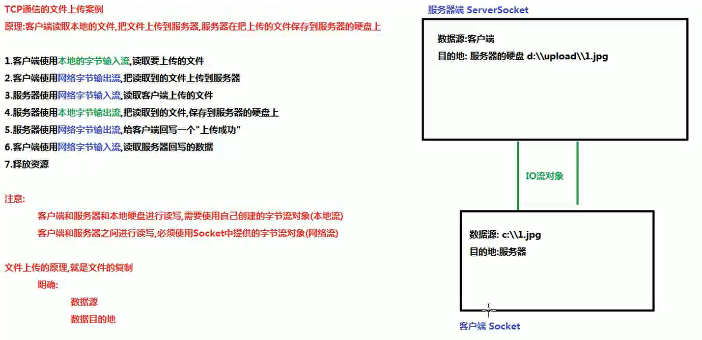
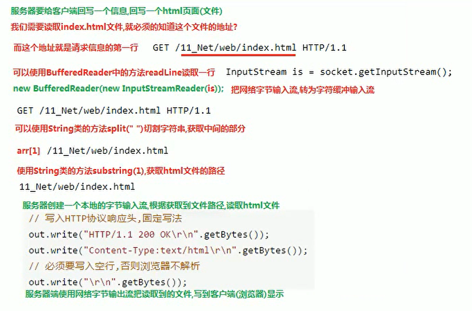
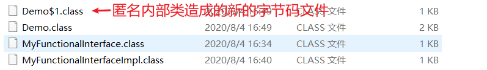

# Java 高级

**作者：** 胡鑫治

# 异常体系

java.lang.Throwable 是，所有异常跟错误的超类

        java.lang.Error 非常严重的错误，不能处理

java.lang.Exception 通过实现设计，可以避免

        RuntimeException:运行期异常

自定义异常类

自定义异常类：

    java 提供的异常类，不够我们使用，需要自己定义一些异常类

格式：

    public class XXXExcepiton extends Exception l RuntimeException{

        添加一个空参数的构造方法

        添加一个带异常信息的构造方法

    }

注意：

1.  自定义异常类一般都是以 Exception 结尾，说明该类是一个异常类

2.  自定义异常类，必须的继承 Exception 或者 RuntimeException 继承 Exception：那么自定义的异常类就是一个编译期异常，如果方法内部抛出了编译期异常，就必须处理这个异常，要么 throws，要么 try...catch 继承 RuntimeException：那么自定义的异常类就是一个运行期异常，无需处理，交给虚拟机处理（中断处理）

public class RegisterException extends Exception{<br />  //添加一个空参数的构造方法<br />    public Registerexception(){<br />      super（）;<br />    }<br />  /*添加一个带异常信息的构造方法查看源码发现，所有的异常类都会有一个带异常信息的构造方法，方法内部会调用父类带异常信息的构造方法，让父类来处理这个异常信息*/<br />     public RegisterException(String message){<br />    super（message）<br />    ;<br />  }<br />}

# 多线程

并发与并行

你吃饭吃到一半，电话来了，你一直到吃完了以后才去接，这就说明你不支持并发也不支持并行。你吃饭吃到一半，电话来了，你停了下来接了电话，接完后继续吃饭，这说明你支持并发。你吃饭吃到一半，电话来了，你一边打电话一边吃饭，这说明你支持并行。并发的关键是你有处理多个任务的能力，不一定要同时。并行的关键是你有同时处理多个任务的能力。所以我认为它们最关键的点就是：是否是『同时』。

进程概念

- 进程：是指一个内存中运行的应用程序，每个进程都有一个独立的内存空间，一个应用程序可以同时运行多个进程；进程也是程序的一次执行过程，是系统运行程序的基本单位；系统运行一个程序即是一个进程从创建、运行到消亡的过程。
- 线程：线程是进程中的一个执行单元，负责当前进程中程序的执行，一个进程中至少有一个线程。一个进程中是可以有多个线程的，这个应用程序也可以称之为多线程程序。简而言之：一个程序运行后至少有一个进程，一个进程中可以包含多个线程

线程调度

- 分时调度

所有线程轮流使用 CPU 的使用权，平均分配每个线程占用 CPU 的时间。

- 抢占式调度

优先让优先级高的线程使用 CPU，如果线程的优先级相同，那么会随机选择一个（线程随机性），Java 使用的为抢占式调度。

- 设置线程的优先级

Thread-创建多线程的方法

1.  继承 Thread 类类

`//1)定义继承 Thread`

<br />public class SubThread extends Thread {<br />    //2)重写 run()方法，run()方法体中的代码就是子线程要执行的代码<br />    @Override<br />    public void run() {<br />        for (int i = 1; i < 101; i++) {<br />            System.out.println("sub thread : " + i);<br />        }<br />    }<br />}

1.  实现 Runnable 接口

//1)定义 Runnable<br />public class Prime implements Runnable {<br />  //2）重写 run（）方法，run 方法体就是用户线程执行的代码@Overridepublic void run() {//在子线程，打印 100 行字符串 for (int i = 1; i < 101; i++) {System.out.println("sub thread : " + i);}}}<br />

1.  匿名内部类

Thread t1 = new Thread(new Runnable() {<br />            @Override<br />            public void run() {<br />                for (int i = 0; i < 100; i++) {<br />                    System.out.println(Thread.currentThread().getName() + "-->" + i);<br />                }<br />            }<br />        }, "t1");<br />        //通过构造方法指定线程名称<br />        t1.start();


# 网络编程

网络协议

- UDP 用户数据报协议（UDP，User Datagram Protocol）服务器不确认收到，不可靠

优点是延迟低

- TCP 传输控制协议（Transmission Control Protocol，）是 TCP 通信：面向连接的通信，客户端和服务器端必须的经过 3 次握手，建立逻辑连接，才能通信（安全）

命令行查看

`ipconfig`

`ping`


端口号

逻辑端口，无法直接看到

由两个字节组成，取值范围在 0-65535 之间

1024 之前的端口号不能使用，被系统分配给已知的网络软件

网络软件的端口号不能重复

常用的端口号

1.  80 端口网络端口 www.baidu.com:80 正确的网址 www.baidu.com:70 错误的网址打不开

2.  数据库 mysql：3306 oracle：1521

3.  Tomcat 服务器：8080

TCP 通信

通信的步骤

服务器端先启动

服务器端不会主动的请求客户端

必须使用客户端请求服务器端

客户端和服务端就会建立一个逻辑连接

而这个连接中包含一个对象

这个对象就是 I0 对象

客户端和服务器端就可以使用

IO 对象进行通信

通信的数据不仅仅是字符

所以 IO 对象是字节流对象

服务器端必须明确两件事情：

1.  多个客户端同时和服务器进行交互，服务器必须明确和哪个客户端进行的交互在服务器端有一个方法，叫 accept 客户端获取到请求的客户端对象

2.  多个客户端同时和服务器进行交互，就需要使用多个 IO 流对象

    服务器是没有 10 流的，服务器可以获取到请求的客户端对象 Socket 使用每个客户端 Socket 中提供的 IO 流和客户端进行交互

        服务器使用客户端的字节输入流读取客户端发送的数据

        服务器使用客户端的字节输出流给客户端回写数据

    简单记：服务器使用客户端的流和客户端交互

java 实现 TCPClient 和 TCPServer

文件上传案例的客户端



客户端代码

public class TCPClient { public static void main(String[] args) throws IOException { <br />  //1.创建一个客户端对象 Socket，构造方法绑定服务器的 IP 地址和端口号        <br />  Socket socket=new Socket("127.0.0.1",8888);        <br />  //2.使用 Socket 对象中的方法 getOutputStream()获取网络字节输出流 Output stream 对象        <br />  OutputStream os =socket.getOutputStream();        <br />  //3.使用网络字节输出流 Output Stream 对象中的方法 write，给服务器发送数据        <br />  os.write("你好服务器".getBytes());        <br />  //4.使用 Socket 对象中的方法 get Inputstream（）获取网络字节输入流 InputStream 对象        <br />  InputStream is=socket.getInputStream();        <br />  //5.使用网络字节输入流 InputStream 对象中的方法 read，读取服务器回写的数据        <br />  byte[] bytes=new byte[1024];//一次性读 1024 个字节，返回读取字符个数       <br />  int len=is.read(bytes);<br />  System.out.println(new String(bytes,0,len));        <br />  //6.释放资源（Socket）       <br />  socket.close();    <br />}<br />}

服务端代码

public class TCPServer { public static void main(String[] args) throws IOException { <br />  //1.创建服务器 Serversocket 对象和系统要指定的端口号 <br />  ServerSocket server =new ServerSocket(8888); <br />  //2.使用 ServerSocket 对象中的方法 accept，获取到请求的客户端对象 Socket<br />  Socket socket =server.accept(); <br />  //3.使用 Socket 对象中的方法 get Inputstream（）获取网络字节输入流 Input Stream 对象 <br />  InputStream is= socket.getInputStream(); <br />  //4.使用网络字节输入流 Inputstream 对象中的方法 read，读取客户端发送的数据 <br />  byte[] bytes=new byte[1024];//一次性读 1024 个字节，返回读取字符个数<br />  int len=is.read(bytes); System.

*out*

.println(new String(bytes,0,len)); <br />  //5.使用 Socket 对象中的方法 getoutputstream（）获取网络字节输出流 Output stream 对象 <br />  OutputStream os=socket.getOutputStream(); <br />  //6.使用网络字节输出流 Output Stream 对象中的方法 write，给客户端回写数据 <br />  os.write("收到谢谢".getBytes());<br />  //7.释放资源（Socket，ServerSocket） <br />  socket.close(); server.close(); }}

模拟 B/S 服务器

Java 开启 TCPServer，socket 开始监听，端口号：8080

输入网址：

 [http://127.0.0.1:8080/itcast/net/web/18160217.html](http://127.0.0.1:8080/itcast/net/web/18160217.html)

TCPServer 读取客户端的请求信息

GET /itcast/net/web/18160217.html HTTP/1.1<br />Host: 127.0.0.1:8080<br />Connection: keep-alive<br />Upgrade-Insecure-Requests: 1<br />User-Agent: Mozilla/5.0 (Windows NT 10.0; WOW64) AppleWebKit/537.36 (KHTML, like Gecko) Chrome/80.0.3987.163 Safari/537.36<br />Sec-Fetch-Dest: document<br />Accept: text/html,application/xhtml+xml,application/xml;q=0.9,image/webp,image/apng,*/*;q=0.8,application/signed-exchange;v=b3;q=0.9<br />Accept-Encoding: gzip, deflate, br<br />Accept-Language: zh-CN,zh;q=0.9,en-US;q=0.8,en;q=0.7,ja;q=0.6



# 函数式接口

函数式接口在 Java 中是指：

**有且仅有一个抽象方法的接口**

函数式接口，即适用于函数式编程场景的接口。而 Java 中的函数式编程体现就是 Lambda，所以函数式接口就是可以适用于 Lambda 使用的接口。只有确保接口中有且仅有一个抽象方法，Java 中的 Lambda 才能顺利地进行推导。

Lambda 表示式

函数式接口的语法糖，需要用注解

@functionalInterface

标注，在方法中作为接口类型的参数，参数写在括号里，{}里重写接口的抽象方法

//调用 show 方法，方法的参数是一个函数式接口，所以我们可以 Lambda 表达式<br />

*show*

(()->{<br />  System.

*out*

.println("使用 lambda 表达式重写接口的抽象方法"); });

与匿名内部类的区别



匿名内部类会造成新的字节码文件，在 idea 中并不显示；而 Lambda 不会

Lambda 的特点：延迟加载

只有被调用才会被执行

*showLog*

(1,( )->{     //返回一个拼接好的字符串 <br />  return msg1+msg2+msg3;<br />});

那么 msg1，msg2 和 msg3 变量的作用范围在哪里

作为参数和返回值，作为一个接口对象

常用的函数式接口

Supplier

```java
java.util.function.Supplier<T>接口仅包含一个无参的方法：T get（）。用来获取一个泛型参数指定类型的对象数据。
```

*Consumer*

*Consumer 接口中包含抽象方法 void accept（T t），意为消费一个指定泛型的数据。*