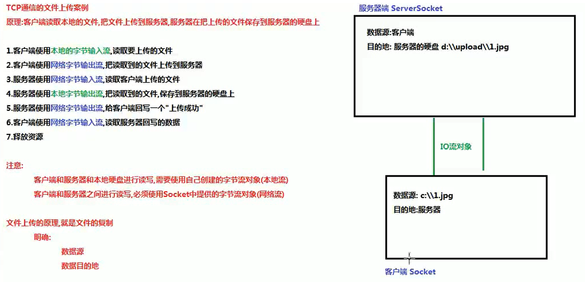

## 网络协议
* UDP 用户数据报协议（UDP，User Datagram Protocol）服务器不确认收到，不可靠
	* 优点是延迟低
* TCP 传输控制协议（Transmission Control Protocol，）是TCP通信：面向连接的通信，客户端和服务器端必须的经过3次握手，建立逻辑连接，才能通信（安全）
### 命令行查看

`ipconfig`
`ping`

### 端口号

逻辑端口，无法直接看到
由两个字节组成，取值范围在0-65535之间
1024之前的端口号不能使用，被系统分配给已知的网络软件
网络软件的端口号不能重复

##### 常用的端口号
1. 80端口网络端口 www.baidu.com:80 正确的网址 www.baidu.com:70 错误的网址打不开
2. 数据库 mysql：3306 oracle：1521
3. Tomcat服务器：8080
## TCP通信

#### 通信的步骤
服务器端先启动
服务器端不会主动的请求客户端
必须使用客户端请求服务器端
客户端和服务端就会建立一个逻辑连接
而这个连接中包含一个对象
这个对象就是I0对象
客户端和服务器端就可以使用
IO对象进行通信
通信的数据不仅仅是字符
所以IO对象是字节流对象

#### 服务器端必须明确两件事情：
1. 多个客户端同时和服务器进行交互，服务器必须明确和哪个客户端进行的交互在服务器端有一个方法，叫accept客户端获取到请求的客户端对象
2. 多个客户端同时和服务器进行交互，就需要使用多个IO流对象
	服务器是没有10流的，服务器可以获取到请求的客户端对象Socket使用每个客户端Socket中提供的IO流和客户端进行交互
		服务器使用客户端的字节输入流读取客户端发送的数据
		服务器使用客户端的字节输出流给客户端回写数据
	简单记：服务器使用客户端的流和客户端交互
	
#### java实现TCPClient和TCPServer
##### 文件上传案例的客户端
