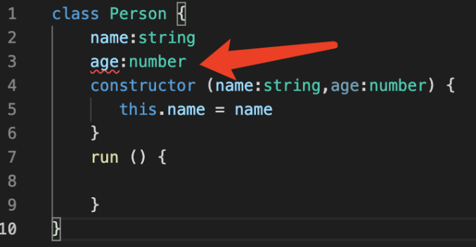

ES6 提供了更接近传统语言的写法，引入了 Class（类）这个概念，作为对象的模板。通过 class 关键字，可以定义类。基本上，ES6 的 class 可以看作只是一个语法糖，它的绝大部分功能，ES5 都可以做到，新的 class 写法只是让对象原型的写法更加清晰、更像面向对象编程的语法而已。上面的代码用 ES6 的“类”改写，就是下面这样。

> 更像 Java 的语法

```TypeScript
//定义类
class Person {
    constructor () { //构造函数
 
    }
    run () {
        
    }
}
```

## 1. TS 定义类
在 TypeScript 是不允许直接在 constructor 定义变量的 需要在 constructor 上面先声明


这样引发了第二个问题你如果了定义了变量不用 也会报错 通常是给个默认值 或者 进行赋值

## 2. 类的修饰符

### 总共有三个 public private protected
公开，私有，保护
### static 静态属性
静态方法只能调用静态属性

## 抽象类
跟 java 一模一样