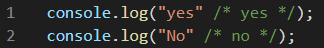
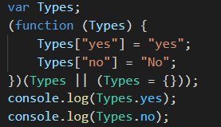

在javaScript中是没有枚举的概念的TS帮我们定义了枚举这个类型

## 使用枚举 通过enum关键字定义我们的枚举

```TypeScript
enum Types{
   Red = 0,
   Green = 1,
   BLue = 2
}
//默认就是从0开始的 可以不写值
```

增长枚举
如上，我们定义了一个数字枚举， Red使用初始化为 `1`。 其余的成员会从 `1`开始自动增长。 换句话说， Type.`Red`的值为 `1`， `Green`为 `2`， `Blue`为 `3`。


## const枚举
let  和 var 都是不允许的声明只能使用const

大多数情况下，枚举是十分有效的方案。 然而在某些情况下需求很严格。 为了避免在额外生成的代码上的开销和额外的非直接的对枚举成员的访问，我们可以使用 const枚举。 常量枚举通过在枚举上使用 const修饰符来定义

const 声明的枚举会被编译成常量

普通声明的枚举编译完后是个对象

```ts
const enum Types{
   No = "No",
   Yes = 1,
}
```

Const 声明编译之后，变成常量

普通声明编译之后，变成对象



# 反向映射

它包含了正向映射（ `name` -> `value`）和反向映射（ `value` -> `name`）

数字可以

要注意的是 _不会_ 为==字符串==枚举成员生成反向映射。