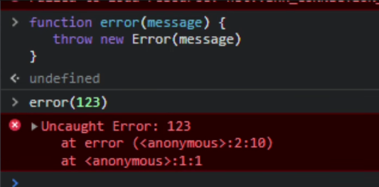

TypeScript 将使用 never 类型来表示不应该存在的状态(很抽象是不是)

> ==统一规范：后来者，必须按前辈的逻辑套路强制做事，否则报错==
> 由于任何类型都不能赋值给 `never` 类型的变量，所以 `switch` 当存在进入 `default` 分支的可能性时，TS 的类型检查会及时帮我们发现这个问题

## 定义

```ts
type bbb = string & number
//bbb类型推断为 never ，因为不可能有变量同时为字符串和数字类型
```

```ts
// 返回never的函数必须存在无法达到的终点
 
// 因为必定抛出异常，所以 error 将不会有返回值
function error(message: string): never {
    throw new Error(message);
}
 
// 因为存在死循环，所以 loop 将不会有返回值
function loop(): never {
    while (true) {
    }
}
```



## never 类型的一个应用场景
```ts
interface A {
  type: "foo" //属性
}

interface B {
  type: "bar"
}
type All = A | B;
function handleValue(val: All) {
  switch (val.type) {
    case 'foo':
      break;
    case 'bar':
      break
    default:
      //兜底逻辑 一般是不会进入这儿如果进来了就是程序异常了

      const exhaustiveCheck: never = val;
      break
  }
}

```

比如新来了一个同事他新增了一个 C 接口，我们必须手动找到所有 switch 代码并处理，否则将有可能引入 BUG 。

而且这将是一个“隐蔽型”的 BUG，如果回归面不够广，很难发现此类 BUG。

那 TS 有没有办法帮助我们在类型检查阶段发现这个问题呢？

```ts
interface A {
    type: "foo"
}
 
interface B {
    type: "bar"
}
interface C {
    type: "bizz"
}
type All = A | B | C;
function handleValue(val: All) {
    switch (val.type) {
        case 'foo':
            break;
        case 'bar':
            break
        default:
            //兜底逻辑 一般是不会进入这儿如果进来了就是程序异常了
 
            const exhaustiveCheck: never = val;
            break
    }
}
```

**由于任何类型都不能赋值给 `never` 类型的变量，所以当存在进入 `default` 分支的可能性时，TS 的类型检查会及时帮我们发现这个问题**

==统一规范：后来者，必须按前辈的逻辑套路强制做事，否则报错==