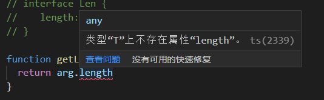

泛型 在 TypeScript 是很重要的东西 例如 vue3 是用 ts 编写的 里面用到了非常多的泛型

ok:我们看一个小例子

## 函数泛型

我写了两个函数一个是数字类型的函数，另一个是字符串类型的函数,其实就是类型不同，

实现的功能是一样的，这时候我们就可以使用泛型来优化

泛型优化

语法为函数名字后面跟一个<参数名> 参数名可以随便写 例如我这儿写了 T

当我们使用这个函数的时候把参数的类型传进去就可以了 （也就是动态类型）
```ts
function Add<T>(a: T, b: T): Array<T>  {
    return [a,b]
}
 
Add<number>(1,2)
Add<string>('1','2')
```

我们也可以使用不同的泛型参数名，只要在数量上和使用方式上能对应上就可以。
```ts
function Sub<T, U>(a: T,b: U): Array<T | U> {
    const params: Array<T | U> = [a,b]
    return params
}

Sub<Boolean,number>(false,1)
```

## 泛型约束

我们期望在一个泛型的变量上面，获取其 `length` 参数，但是，有的数据类型是没有 `length` 属性的

```ts
function getLegnth<T>(arg:T) {
  return arg.length
}
```


这时候我们就可以使用泛型约束

于是，我们就得对使用的泛型进行约束，我们约束其为具有 `length` 属性的类型，这里我们会用到 `interface`,代码如下

```ts
interface Len {
   length:number
}
 
function getLegnth<T extends Len>(arg:T) {
  return arg.length
}
 
getLegnth<string>('123')
```

## 使用 keyof 约束对象

其中使用了 TS 泛型和泛型约束。
首先定义了 `T 类型` 并使用 `extends` 关键字继承 object 类型的子类型，
然后使用 `keyof` 操作符获取 T 类型的所有键，它的返回类型是 联合类型，
最后利用 `extends` 关键字约束 K 类型必须为 `keyof T` 联合类型的子类型

```ts
function prop<T, K extends keyof T>(obj: T, key: K) {
   return obj[key]
}

let o = { a: 1, b: 2, c: 3 }

prop(o, 'a') 
prop(o, 'd') //此时就会报错发现找不到
```

## 泛型类

声明方法跟函数类似名称后面定义<类型>

使用的时候确定类型 `new Sub<number>()`

```ts
class Sub<T>{
    attr: T[] = [];
    add (a:T):T[] {
        return [a]
   }
}

let s = new Sub<number>()
s.attr = [1,2,3]
s.add(123)

let str = new Sub<string>()
str.attr = ['1','2','3']
str.add('123')
```