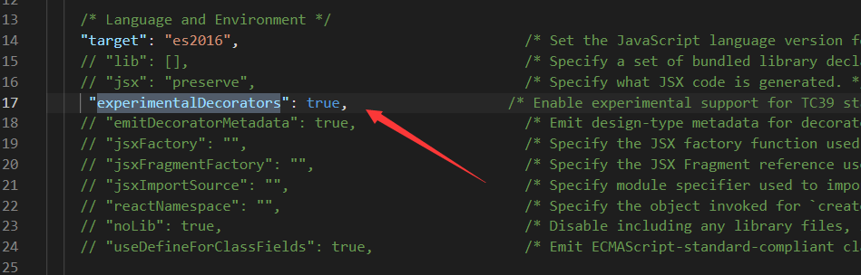

## Decorator  装饰器 是一项实验性特性

在未来的版本中可能会发生改变

它们不仅增加了代码的可读性，清晰地表达了意图，而且提供一种方便的手段，增加或修改类的功能

==类似 Java 注解==

若要启用实验性的装饰器特性，你必须在命令行或 `tsconfig.json` 里启用编译器选项


一共有四种

```ts
declare type ClassDecorator = <TFunction extends Function>(target: TFunction) => TFunction | void;

declare type PropertyDecorator = (target: Object, propertyKey: string | symbol) => void;

declare type MethodDecorator = <T>(target: Object, propertyKey: string | symbol, descriptor: TypedPropertyDescriptor<T>) => TypedPropertyDescriptor<T> | void;

declare type ParameterDecorator = (target: Object, propertyKey: string | symbol, parameterIndex: number) => void;
```


## ClassDecorator 类装饰器

_装饰器_ 是一种特殊类型的声明，它能够被附加到[类声明](https://www.tslang.cn/docs/handbook/decorators.html#class-decorators "类声明")，[方法](https://www.tslang.cn/docs/handbook/decorators.html#method-decorators "方法")， [访问符](https://www.tslang.cn/docs/handbook/decorators.html#accessor-decorators "访问符")，[属性](https://www.tslang.cn/docs/handbook/decorators.html#property-decorators "属性")或[参数](https://www.tslang.cn/docs/handbook/decorators.html#parameter-decorators "参数")上。

首先定义一个类

```ts
class A {
    constructor() {

    }
}
```

定义一个类装饰器函数   他会把 ClassA 的构造函数传入你的 watcher 函数当做第一个参数

```ts
const watcher: ClassDecorator = (target: Function) => {
    target.prototype.getParams = <T>(params: T):T => { //给目标类增加一个函数
        return params
    }
}
```

使用的时候 直接通过 `@函数名` 使用

```ts
@watcher
class A {
    constructor() {

    }
}
```

### 向下兼容

这种方式也可以

```ts
watcher(A)
```

验证

```ts
const a = new A();
console.log((a as any).getParams('123'));
```

## 装饰器工厂（可以传参数）

其实也就是一个 高阶函数   外层的函数接受值 里层的函数最终接受类的构造函数

```ts
const watcher = (name: string): ClassDecorator => {
    return (target: Function) => { //高阶函数，返回 类装饰器函数
        target.prototype.getParams = <T>(params: T): T => {
            return params
        }
        target.prototype.getOptions = (): string => {
            return name
        }
    }
}

@watcher('name')
class A {
    constructor() {

    }
}

const a = new A();
console.log((a as any).getParams('123'));
```

## 装饰器组合

就是可以使用多个装饰器

```ts
@watcher2('name2')
@watcher('name')
class A {
    constructor() {

    }
}
```


## MethodDecorator 方法装饰器

返回三个参数

1.  对于静态成员来说是类的构造函数，对于实例成员是类的原型对象。
2.  成员的名字。
3.  成员的 _属性描述符_ 。

```ts
[
  {},
  'setParasm',
  {
    value: [Function: setParasm],
    writable: true,
    enumerable: false,
    configurable: true
  }
]
```

```ts
const met:MethodDecorator = (...args) => {
    console.log(args);
}

class A {
    constructor() {

    }
    @met
    getName ():string {
        return '小满'
    }
}

const a = new A();
```

## PropertyDecorator 属性装饰器

返回两个参数

1.  对于静态成员来说是类的构造函数，对于实例成员是类的原型对象。
2.  属性的名字。

`[ {}, 'name', undefined ]`

```ts
const met:PropertyDecorator = (...args) => {
    console.log(args);
}

class A {
    @met
    name:string
    constructor() {

    }

}

const a = new A();
```

## ParameterDecorator 参数装饰器

返回三个参数

1.  对于静态成员来说是类的构造函数，对于实例成员是类的原型对象。
2.  成员的名字。
3.  参数在函数参数列表中的索引。

`[ {}, 'setParasm', 0 ]`

```ts
const met:ParameterDecorator = (...args) => {
    console.log(args);
}

class A {
    constructor() {

    }
    setParasm (@met name:string = '213') {

    }
}

const a = new A();
```