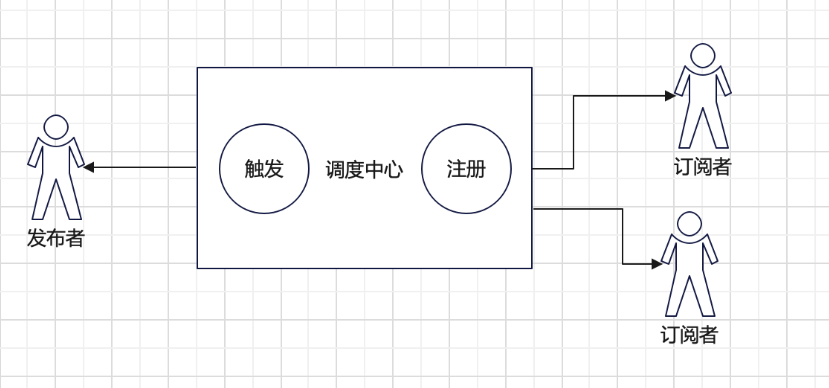

## 概述
什么是发布订阅模式，其实小伙伴已经用到了发布订阅模式例如 `addEventListener`，`Vue evnetBus`

都属于 发布订阅模式

简单来说就是 你要和 大傻 二傻 三傻打球，大傻带球，二傻带水，三傻带球衣。全都准备完成后开始打球。

与观察者模式相比，多了一个调度中心，则更多的是一种跨应用的模式(cross-application pattern)，比如我们常用的消息中间件

## 思维导图
首先 需要定义三个角色 发布者 订阅者 调度者


## 具体代码

on订阅/监听

emit 发布/注册

once 只执行一次

off解除绑定

```ts
interface EventFace {
    on: (name: string, callback: Function) => void,
    emit: (name: string, ...args: Array<any>) => void,
    off: (name: string, fn: Function) => void,
    once: (name: string, fn: Function) => void
}
 
interface List {
    [key: string]: Array<Function>,
}
class Dispatch implements EventFace {
    list: List
    constructor() {
        this.list = {}
    }
    on(name: string, callback: Function) {
        const callbackList: Array<Function> = this.list[name] || [];
        callbackList.push(callback)
        this.list[name] = callbackList
    }
    emit(name: string, ...args: Array<any>) {
        let evnetName = this.list[name]
        if (evnetName) {
            evnetName.forEach(fn => {
                fn.apply(this, args)
            })
        } else {
            console.error('该事件未监听');
        }
    }
    off(name: string, fn: Function) {
        let evnetName = this.list[name]
        if (evnetName && fn) {
            let index = evnetName.findIndex(fns => fns === fn)
            evnetName.splice(index, 1)
        } else {
            console.error('该事件未监听');
        }
    }
    once(name: string, fn: Function) {
        let decor = (...args: Array<any>) => {
            fn.apply(this, args)
            this.off(name, decor)
        }
        this.on(name, decor)
    }
}
const o = new Dispatch()
 
 
o.on('abc', (...arg: Array<any>) => {
    console.log(arg, 1);
})
 
o.once('abc', (...arg: Array<any>) => {
    console.log(arg, 'once');
})
// let fn = (...arg: Array<any>) => {
//     console.log(arg, 2);
// }
// o.on('abc', fn)
// o.on('ddd', (aaaa: string) => {
//     console.log(aaaa);
// })
//o.off('abc', fn)
 
o.emit('abc', 1, true, '小满')
 
o.emit('abc', 2, true, '小满')
 
// o.emit('ddd', 'addddddddd')
```