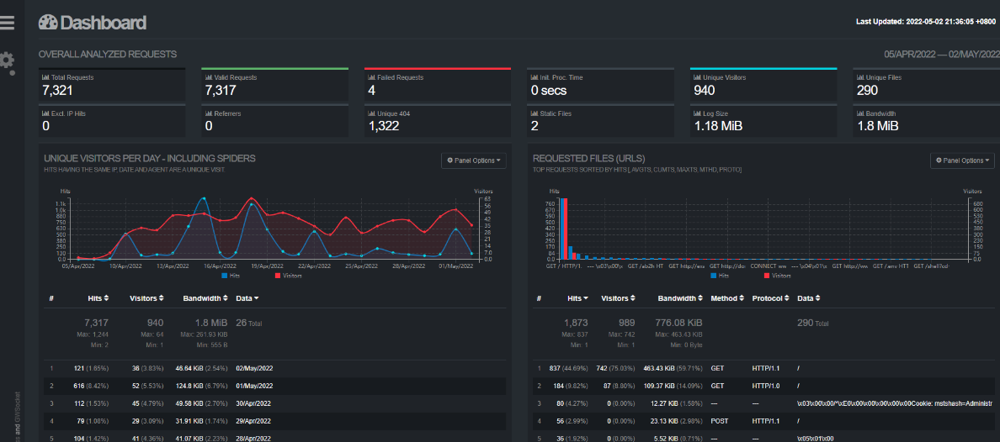
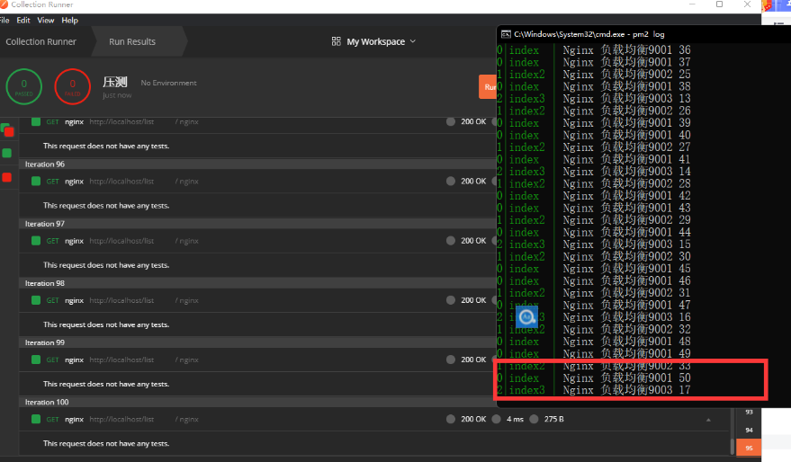

目录

- [Nginx 常用命令](#Nginx%20常用命令)
- [Nginx 配置文件](#Nginx%20配置文件)
- [反向代理](#反向代理)
- [日志分析](#日志分析)
- [负载均衡 upstream](#负载均衡%20upstream)

## Nginx 常用命令

### 0.安装 nginx

```sh
sudo apt install nginx
```

### 1.查看 nginx 版本号

nginx -v

###  2.启动 nginx

直接执行 nginx 即可

### 3.停止 nginx

```vbnet
nginx -s stop
```

Stop 是立即停止

```undefined
nginx -s quit
```

Quit 是一个优雅的关闭方式，Nginx 在退出前完成已经接受的请求处理

### 4.重载 nginx 配置文件

```undefined
nginx -s reload
```

### 5 查看 nginx 进程

```
ps -ef | grep nginx
```

```sh
root       49550       1  0 19:37 ?        00:00:00 nginx: master process /usr/sbin/nginx -g daemon on; master_process on;
www-data   49551   49550  0 19:37 ?        00:00:00 nginx: worker process
www-data   49552   49550  0 19:37 ?        00:00:00 nginx: worker process
root       51468   19545  0 20:14 pts/0    00:00:00 grep --color=auto nginx
```

`ps -ef`

输出标准格式的 linux 进程 命令

`grep nginx`

`grep命令` 是查找，是一种强大的文本搜索工具 我们这儿是查找 nginx

# Nginx 配置文件

## 1.如何查找 nginx 配置文件

`nginx -t` 检查配置文件是否有语法错误

```
nginx: the configuration file /etc/nginx/nginx.conf syntax is ok
nginx: configuration file /etc/nginx/nginx.conf test is successful
```

## 2.打开配置文件

`vim /etc/nginx/nginx.conf`

Nginx 的主配置文件是 nginx.conf，这个配置文件一共由三部分组成，分别为全局块、events 块和 http 块。

在 http 块中，又包含 http 全局块、多个 server 块。

每个 server 块中，可以包含 server 全局块和多个 location 块。在同一配置块中嵌套的配置块，各个之间不存在次序关系

### 1.全局块

全局块是默认配置文件从开始到 events 块之间的一部分内容，主要设置一些影响 Nginx 服务器整体运行的配置指令，因此，这些指令的作用域是 Nginx 服务器全局。

- `user [user] [group]` 指定可以运行 nginx 服务的用户和用户组，只能在全局块配置 user 指令在 Windows 上不生效，如果你制定具体用户和用户组会报警告
- `worker_processes` nginx 进程数量 worker_processes 比如设置为 2 nginx 将会开启一个 master 进程和 2 两个 worker 进程
- `pid` logs/nginx.pid 存放 pid 文件
- `error_log` logs/error.log; 全局错误日志类型 debug info warn error 存放地址

### 2.events 块

events 块涉及的指令主要影响 Nginx 服务器与用户的网络连接。常用到的设置包括是否开启对多 worker process 下的网络连接进行序列化，是否允许同时接收多个网络连接，选取哪种事件驱动模型处理连接请求，每个 worker process 可以同时支持的最大连接数等

- `accept_mutex` 默认开启-开启之后 nginx 的多个 worker 将会以串行的方式来处理，只会有一个 worker 将会被唤起，其他的 worker 继续睡眠，如果不开启将会造成惊群效应多个 worker 全部唤起不过只有一个 Worker 能获取新连接，其它的 Worker 会重新进入休眠状态

- `worker_connections` 单个进程最大连接数（最大连接数=连接数+进程数）

### 3.http 块

http 块是 Nginx 服务器配置中的重要部分，代理、缓存和日志定义等绝大多数的功能和第三方模块的配置都可以放在这个模块中。

- `include` 指令，用于引入其他的配置文件
- `default_type` 如果 Web 程序没设置，Nginx 也没对应文件的扩展名，就用 Nginx 里默认的 default_type 定义的处理方式。`default_type application/octet-stream; #nginx` 默认文件类型
- `log_format` 指令，用于定义日志格式，此指令只能在 http 块中进行配置
- `sendfile` 简单来说就是启用 `sendfile()` 系统调用来替换 `read()` 和 `write()`调用，减少系统上下文切换从而提高性能，当 nginx 是静态文件服务器时，能极大提高 nginx 的性能表现
- `keepalive_timeout` HTTP 有一个 KeepAlive 模式，它告诉 webserver 在处理完一个请求后保持这个 TCP 连接的打开状态。若接收到来自客户端的其它请求，服务端会利用这个未被关闭的连接，而不需要再建立一个连接。
- `gzip` 开启 Gzip 压缩功能， 可以使网站的 css、js 、xml、html 文件在传输时进行压缩，提高访问速度, 进而优化 Nginx 性能

### 4.server 块

每一个 http 块都可以包含多个 server 块，而每个 server 块就相当于一台虚拟主机，它内部可有多台主机联合提供服务，一起对外提供在逻辑上关系密切的一组服务

listen 指令的配置非常灵活，可以单独制定 ip，单独指定端口或者同时指定 ip 和端口

```python
listen 127.0.0.1:8000;  #只监听来自127.0.0.1这个IP，请求8000端口的请求
listen 127.0.0.1; #只监听来自127.0.0.1这个IP，请求80端口的请求（不指定端口，默认80）
listen 9999; #监听来自所有IP，请求9999端口的请求
listen *:9999; #和上面效果一样
listen localhost:8000; #和第一种效果一致
```

server_name nginx 允许一个虚拟主机有一个或多个名字，也可以使用通配符`*`来设置虚拟主机的名字 支持 ip 域名 通配符 正则等

```
server_name  localhost;
```

### 5.location 块

每个 server 块中可以包含多个 location 块。在整个 Nginx 配置文档中起着重要的作用，而且 Nginx 服务器在许多功能上的灵活性往往在 location 指令的配置中体现出来

location 指令可以分为以下 3 类：

- 前缀字符串匹配
- 正则表达式匹配
- 用于内部跳转的命名 location

**前缀字符串匹配**

- 精确匹配 =
- 前缀匹配 ^~（立刻停止后续的正则搜索）
- 按文件中顺序的正则匹配 ~或~\*
- 匹配不带任何修饰的前缀匹配。

**location root**

root 指定目录的上级目录，并且该上级目录要含有 locatoin 指定名称的同名目录。

```sh
location /img/ {
	root /var/www/image;
}
```

若按照这种配置的话，则访问 `/img/` 目录下的文件时，nginx 会去 `/var/www/image/img/` 目录下找文件

# 反向代理

[nginx news](http://nginx.org/ "nginx news")

反向代理中的常用指令：

```
proxy_pass
proxy_set_header
```

proxy_pass

该指令用来设置被代理服务器地址，可以是主机名称、IP 地址加端口号形式。

### 案例 1 代理到哔哩哔哩

```config
location / {
   root   html;
   index  index.html index.htm;
   proxy_pass http://bilibili.com;
}
```

访问/就会被转到哔哩哔哩

## `proxy_set_header`

该指令可以更改 Nginx 服务器接收到的客户端请求的请求头信息，然后将新的请求头发送给代理的服务器

`proxy_set_header X-Real-IP $remote_addr;`
`proxy_set_header X-Real-Port $remote_port;`
`proxy_set_header X-Forwarded-For $proxy_add_x_forwarded_for;`

三个 `header` 分别表示：
`X-Real-IP` 客户端或上一级代理 ip
`X-Real-Port` 客户端或上一级端口
`X-Forwarded-For` 包含了客户端和各级代理 ip 的完整 ip 链路

其中 X-Real-IP 是必需的，后两项选填。当只存在一级 nginx 代理的时候 X-Real-IP 和 X-Forwarded-For 是一致的，而当存在多级代理的时候，X-Forwarded-For 就变成了如下形式

`$remote_addr` 是前一节点的 IP，并不一定是用户的真实 IP。

# 日志分析

## GoAccess

GoAccess 是一款开源、实时，运行在命令行终端下的 web 日志分析工具。该工具提供快速、多样的 HTTP 状态统计，可以令管理员不再纠结于统计各类数据，和繁杂的指令以及一大堆管道/正则表达式说 byebye

1.安装

```sh
wget http://tar.goaccess.io/goaccess-1.2.tar.gz
tar -xzvf goaccess-1.2.tar.gz
cd goaccess-1.2/
./configure
make
make install
```

操作手册

[GoAccess - 中文站 - 可视化 Web 日志分析工具](https://www.goaccess.cc/?mod=man "GoAccess - 中文站 - 可视化 Web 日志分析工具")

开启实时 HTML 报告分析（webSocket）

```sh
goaccess access.log -a -o ../html/report.html --real-time-html --log-format=COMBINED
```



# 负载均衡 upstream

基本语法
upstream 的基本语法如下，一个 upstream 需要设置一个名称，这个名称可以在 server 里面当作 proxy 主机使用。

在 `http` 模块下，与 `server` 同级

```js
    upstream  node {
        server 127.0.0.1:9001;
        server 127.0.0.1:9002;
        server 127.0.0.1:9003;
    }
```

```js
    location / {
        proxy_pass http://node;
    }
```

### 1.默认状态是按照轮询的方式去做负载的

### 2.权重 weight

```js
    upstream  node {
        server 127.0.0.1:9001 weight=3;
        server 127.0.0.1:9002 weight=2;
        server 127.0.0.1:9003 weight=1;
    }
```

权重越大服务器承载的并发就越高


### 3.fail_timeout backup

`fail_timeout` 是故障等待超时时间

`backup` 是备用服务器参数，可以为一个 `upstream` 设置一个 `backup` 的 server，在生产 server 全部都出问题之后，可以自动切换到备用 server 上，为回复服务争取时间

```js
    upstream  node {

        server 127.0.0.1:9001 fail_timeout=60;

        server 127.0.0.1:9002 fail_timeout=20;

        server 127.0.0.1:9003 backup;

    }
```
