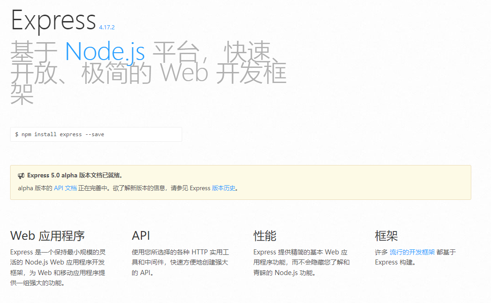
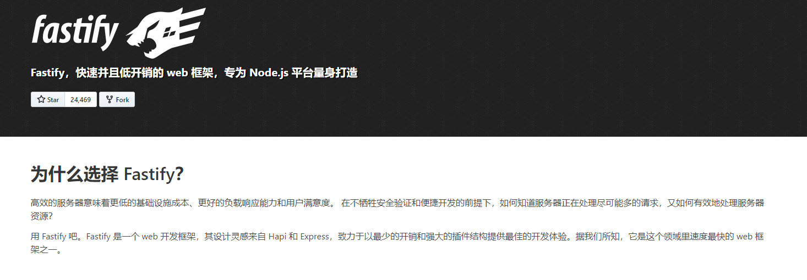

[视频课程 小满 nest js 系列\_哔哩哔哩\_bilibili](https://www.bilibili.com/video/BV1NG41187Bs?spm_id_from=333.999.0.0 "视频课程  小满nest js 系列_哔哩哔哩_bilibili")

Nestjs 是一个用于构建高效可扩展的一个基于 Node js 服务端 应用程序开发框架

并且完全支持 typeScript 结合了 AOP 面向切面的编程方式

nestjs 还是一个 spring MVC 的风格 其中有依赖注入 IOC 控制反转 都是借鉴了 Angualr

nestjs 的底层代码运用了 express 和 Fastify 在他们的基础上提供了一定程度的抽象，同时也将其 API 直接暴露给开发人员。这样可以轻松使用每个平台的无数第三方模块

nest js 英文官网  [NestJS - A progressive Node.js framework](https://nestjs.com/ "NestJS - A progressive Node.js framework")

nestjs 中文网   [NestJS 简介 | NestJS 中文文档 | NestJS 中文网](https://nestjs.bootcss.com/ "NestJS 简介 | NestJS 中文文档 | NestJS 中文网")

nestjs 中文网 2  [Nest.js 中文文档](https://docs.nestjs.cn/ "Nest.js 中文文档")

## nestjs 内置框架 express 默认 express

能够快速构建服务端应用程序，且学习成本非常低，容易上手

express 文档[Express - 基于 Node.js 平台的 web 应用开发框架 - Express 中文文档 | Express 中文网](https://www.expressjs.com.cn/ "Express - 基于 Node.js 平台的 web 应用开发框架 - Express 中文文档 | Express 中文网")

## nestjs 唯二内置框架 Fastify

- 高性能： 据我们所知，Fastify 是这一领域中最快的 web 框架之一，另外，取决于代码的复杂性，Fastify 最多可以处理每秒 3 万次的请求。
- 可扩展： Fastify 通过其提供的钩子（hook）、插件和装饰器（decorator）提供完整的可扩展性。
- 基于 Schema： 即使这不是强制性的，我们仍建议使用 JSON Schema 来做路由（route）验证及输出内容的序列化，Fastify 在内部将 schema 编译为高效的函数并执行。
- 日志： 日志是非常重要且代价高昂的。我们选择了最好的日志记录程序来尽量消除这一成本，这就是 Pino!
- 对开发人员友好： 框架的使用很友好，帮助开发人员处理日常工作，并且不牺牲性能和安全性。
- 支持 TypeScript： 我们努力维护一个 TypeScript 类型声明文件，以便支持不断成长的 TypeScript 社区。

## 总结

1. 从示例可看出 SpringBoot 和 NestJS 的 TypeScript 版本很相似,所以很多人称 NestJS 是 Node 版的 Spring；
2. 开发同样的功能,二者的代码量相当；
3. 选择使用哪个框架主要看业务需求,如果业务是 I/O 任务为主, 建议使用 NestJS, 而且目前 TypeScript 是写后端的最佳选择。