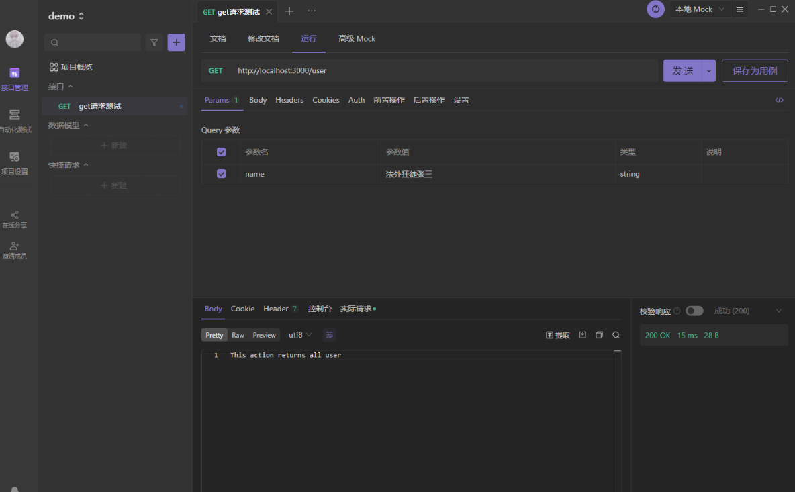

1## Controller Request （获取前端传过来的参数）

nestjs 提供了方法参数装饰器 用来帮助我们快速获取参数 如下

调试工具可以使用 postMan ApiFox 等

下载地址  [Apifox - API 文档、调试、Mock、测试一体化协作平台 - 接口文档工具，接口自动化测试工具，接口 Mock 工具，API 文档工具，API Mock 工具，API 自动化测试工具](https://www.apifox.cn/?utm_source=baidu_sem1 "Apifox - API 文档、调试、Mock、测试一体化协作平台 -      接口文档工具，接口自动化测试工具，接口Mock工具，API文档工具，API      Mock工具，API自动化测试工具")



### 1.获取 get 请求传参

可以使用 Request 装饰器 或者 Query 装饰器 跟 express 完全一样

```js
import { Controller, Get, Post, Body, Patch, Param, Delete, Version, Request, Query } from '@nestjs/common';
import { UserService } from './user.service';
import { CreateUserDto } from './dto/create-user.dto';
import { UpdateUserDto } from './dto/update-user.dto';

@Controller('user')
export class UserController {
  constructor(private readonly userService: UserService) { }

  @Get()
  find(@Query() query) {
    console.log(query)
    return { code: 200 }
  }
}
```

也可以使用 Query 直接获取 不需要在通过 req.query 了

### 2.post 获取参数

可以使用 Request 装饰器 或者 Body 装饰器 跟 express 完全一样

```js
import { Controller, Get, Post, Body, Patch, Param, Delete, Version, Request, Query } from '@nestjs/common';
import { UserService } from './user.service';
import { CreateUserDto } from './dto/create-user.dto';
import { UpdateUserDto } from './dto/update-user.dto';

@Controller('user')
export class UserController {
  constructor(private readonly userService: UserService) { }

  @Get()
  find(@Query() query) {
    console.log(query)
    return { code: 200 }
  }

  @Post()
  create (@Body() body) {

    console.log(body)

    return {
       code:200
    }
  }
}
```

### 3.动态路由

可以使用 Request 装饰器 或者 Param 装饰器 跟 express 完全一样

```js
import { Controller, Get, Post, Body, Patch, Param, Delete, Version, Request, Query } from '@nestjs/common';
import { UserService } from './user.service';
import { CreateUserDto } from './dto/create-user.dto';
import { UpdateUserDto } from './dto/update-user.dto';

@Controller('user')
export class UserController {
  constructor(private readonly userService: UserService) { }

  @Get()
  find(@Query() query) {
    console.log(query)
    return { code: 200 }
  }

  @Post()
  create (@Body('name') body) {

    console.log(body)

    return {
       code:200
    }
  }

  @Get(':id')
  findId (@Param() param) {

    console.log(param)

    return {
       code:200
    }
  }
}
```

### 4.读取 header 信息

我在调试工具随便加了一个 cookie

```js
import { Controller, Get, Post, Body, Patch, Param, Delete, Version, Request, Query, Ip, Header, Headers } from '@nestjs/common';
import { UserService } from './user.service';
import { CreateUserDto } from './dto/create-user.dto';
import { UpdateUserDto } from './dto/update-user.dto';

@Controller('user')
export class UserController {
  constructor(private readonly userService: UserService) { }

  @Get()
  find(@Query() query) {
    console.log(query)
    return { code: 200 }
  }

  @Post()
  create (@Body('name') body) {

    console.log(body)

    return {
       code:200
    }
  }

  @Get(':id')
  findId (@Headers() header) {

    console.log(header)

    return {
       code:200
    }
  }
}
```

### 5.状态码

使用 HttpCode 装饰器 控制接口返回的状态码

```js
import { Controller, Get, Post, Body, Patch, Param, Delete, Version, Request, Query, Ip, Header, Headers, HttpCode } from '@nestjs/common';
import { UserService } from './user.service';
import { CreateUserDto } from './dto/create-user.dto';
import { UpdateUserDto } from './dto/update-user.dto';

@Controller('user')
export class UserController {
  constructor(private readonly userService: UserService) { }

  @Get()
  find(@Query() query) {
    console.log(query)
    return { code: 200 }
  }

  @Post()
  create (@Body('name') body) {

    console.log(body)

    return {
       code:200
    }
  }

  @Get(':id')
  @HttpCode(500)
  findId (@Headers() header) {
    return {
       code:500
    }
  }
}
```