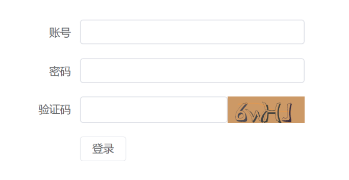
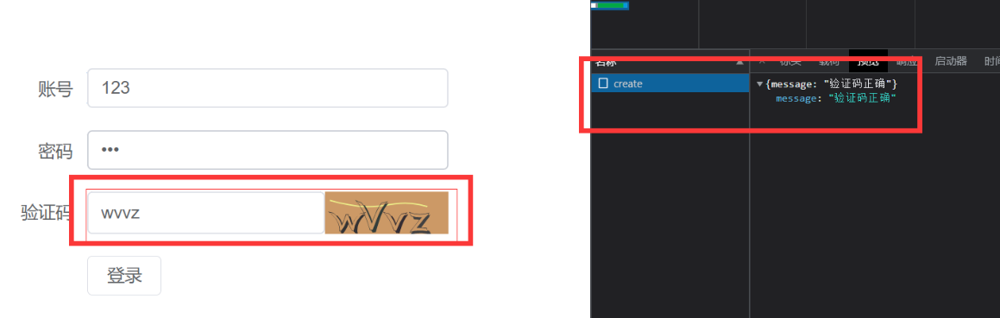

# 验证码案例  

## 前端

###  `vue3` 、 `ts` 、 `element-plus` 、 `fetch`

安装 element

```
npm install element-plus -S
```

然后简单的绘制页面

```vue
<template>
     <div class="wraps">
          <el-form :label-position="labelPosition" label-width="100px" :model="formLabelAlign" style="max-width: 460px">
               <el-form-item label="账号">
                    <el-input v-model="formLabelAlign.name" />
               </el-form-item>
               <el-form-item label="密码">
                    <el-input type="password" v-model="formLabelAlign.password" />
               </el-form-item>
               <el-form-item label="验证码">
                    <div style="display:flex">
                         <el-input  v-model="formLabelAlign.code" />
                         
                    </div>
               </el-form-item>
               <el-form-item>
                    <el-button @click="submit">登录</el-button>
               </el-form-item>
          </el-form>
     </div>
</template>

<script setup lang='ts'>
import { onMounted, reactive, ref } from 'vue';

const codeUrl = ref<string>('/api/user/code')

const resetCode = () => codeUrl.value = codeUrl.value + '?' + Math.random()

const labelPosition = ref<string>('right')

const formLabelAlign = reactive({
     name: "",
     password: "",
     code: ""
})

const submit = async () => {
     await fetch('/api/user/create', {
          method: "POST",
          body: JSON.stringify(formLabelAlign),
          headers: {
               'content-type': 'application/json'
          }
     }).then(res => res.json())
}


</script>

<style>
* {
     padding: 0;
     margin: 0;
}

.wraps {
     display: flex;
     justify-content: center;
     align-items: center;
     height: inherit;
}

html,
body,
#app {
     height: 100%;
}
</style>
```



跨域我用了本地 dev 解决的
vite.config.ts

```js
import { defineConfig } from 'vite'
import vue from '@vitejs/plugin-vue'

// https://vitejs.dev/config/
export default defineConfig({
  plugins: [vue()],
  server: {
    port: 3001,
    proxy: {
      '/api': {
        target: 'http://localhost:3000/',
        changeOrigin: true,
        rewrite: path => path.replace(/^\/api/, ''),
      }
    }
  }
})

```

## 后端 nestjs 

### 验证码插件  svgCaptcha

```coffeescript
npm install svg-captcha -S
```

```ts
import { Controller, Get, Post, Body, Param, Request, Query, Headers, HttpCode, Res, Req } from '@nestjs/common';
import { UserService } from './user.service';
import { CreateUserDto } from './dto/create-user.dto';
import { UpdateUserDto } from './dto/update-user.dto';
import * as svgCaptcha from 'svg-captcha';
@Controller('user')
export class UserController {
  constructor(private readonly userService: UserService) { }
  @Get('code')
  createCaptcha(@Req() req, @Res() res) {
    const captcha = svgCaptcha.create({
      size: 4,//生成几个验证码
      fontSize: 50, //文字大小
      width: 100,  //宽度
      height: 34,  //高度
      background: '#cc9966',  //背景颜色
    })
    req.session.code = captcha.text //存储验证码记录到session
    res.type('image/svg+xml')
    res.send(captcha.data)
  }

  @Post('create')
  createUser(@Req() req, @Body() body) {
    console.log(req.session.code, body)
    if (req.session.code.toLocaleLowerCase() === body?.code?.toLocaleLowerCase()) {
      return {
        message: "验证码正确"
      }
    } else {
      return {
        message: "验证码错误"
      }
    }

  }
}
```

