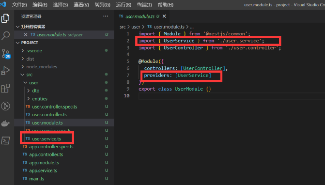
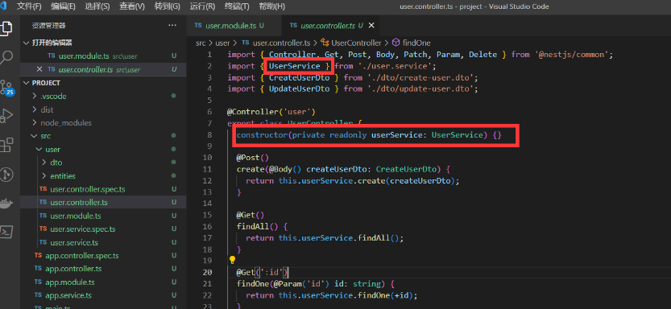
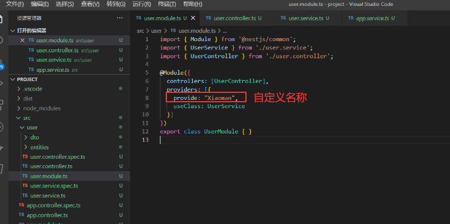
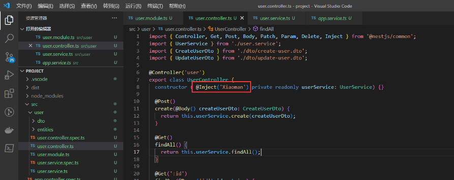
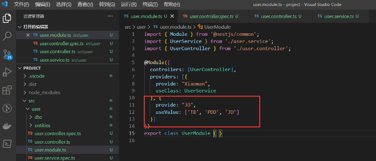
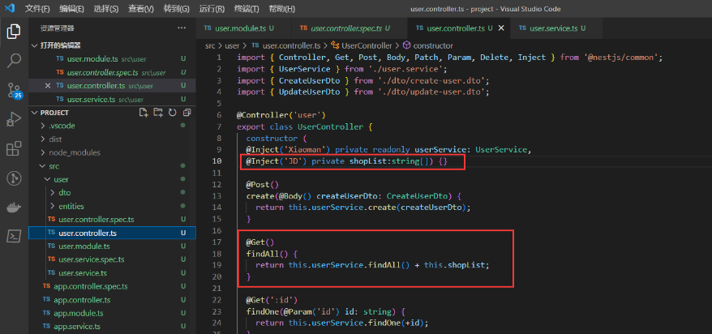
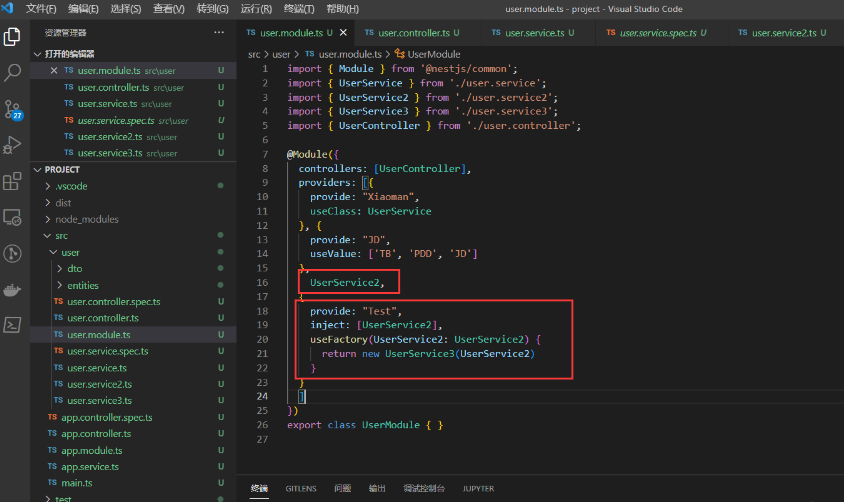
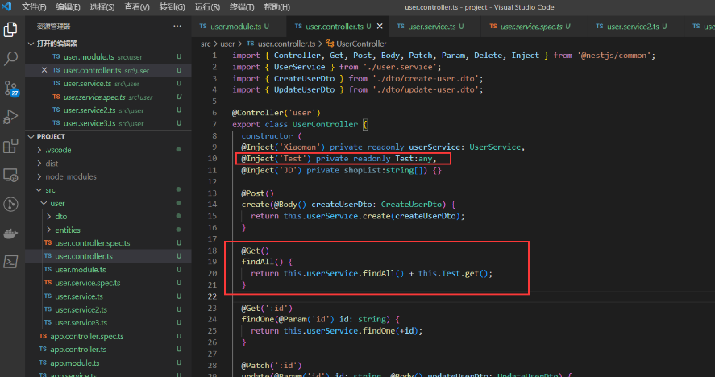
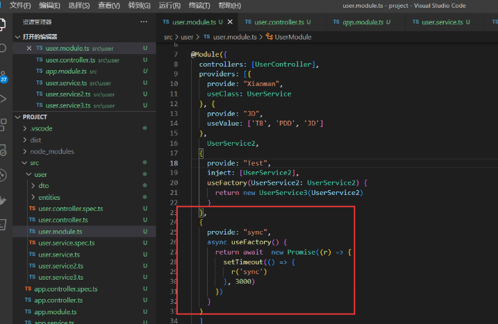

# Providers

`Providers` 是 Nest 的一个基本概念。许多基本的 Nest 类可能被视为 provider - service, repository, factory, helper 等等。 他们都可以通过 constructor 注入依赖关系。 这意味着对象可以彼此创建各种关系，并且“连接”对象实例的功能在很大程度上可以委托给 Nest 运行时系统。 Provider 只是一个用 `@Injectable()` 装饰器注释的类。

[10.a-注入依赖关系](10.a-注入依赖关系.md)

## 1.基本用法

module 引入 service 在 providers 注入


在 Controller 就可以使用注入好的 service 了



## 2.service 第二种用法(自定义名称)

第一种用法就是一个语法糖

其实他的全称是这样的

```ts
import { Module } from '@nestjs/common';
import { UserService } from './user.service';
import { UserController } from './user.controller';

@Module({
  controllers: [UserController],
  providers: [{
    provide: "Xiaoman",
    useClass: UserService
  }]
})
export class UserModule { }
```



自定义名称之后 需要用对应的 `Inject` 取 不然会找不到的


## 3.自定义注入值

通过 useValue

```ts
import { Module } from '@nestjs/common';
import { UserService } from './user.service';
import { UserController } from './user.controller';

@Module({
  controllers: [UserController],
  providers: [{
    provide: "Xiaoman",
    useClass: UserService
  }, {
    provide: "JD",
    useValue: ['TB', 'PDD', 'JD']
  }]
})
export class UserModule { }
```





## 4.工厂模式

如果服务 之间有相互的依赖 或者逻辑处理 可以使用  `useFactory`

```ts
import { Module } from '@nestjs/common';
import { UserService } from './user.service';
import { UserService2 } from './user.service2';
import { UserService3 } from './user.service3';
import { UserController } from './user.controller';

@Module({
  controllers: [UserController],
  providers: [{
    provide: "Xiaoman",
    useClass: UserService
  }, {
    provide: "JD",
    useValue: ['TB', 'PDD', 'JD']
  },
    UserService2,
  {
    provide: "Test",
    inject: [UserService2],
    useFactory(UserService2: UserService2) {
      return new UserService3(UserService2)
    }
  }
  ]
})
export class UserModule { }
```





## 5.异步模式

useFactory 返回一个 promise 或者其他异步操作

```TypeScript
import { Module } from '@nestjs/common';
import { UserService } from './user.service';
import { UserService2 } from './user.service2';
import { UserService3 } from './user.service3';
import { UserController } from './user.controller';

@Module({
  controllers: [UserController],
  providers: [{
    provide: "Xiaoman",
    useClass: UserService
  }, {
    provide: "JD",
    useValue: ['TB', 'PDD', 'JD']
  },
    UserService2,
  {
    provide: "Test",
    inject: [UserService2],
    useFactory(UserService2: UserService2) {
      return new UserService3(UserService2)
    }
  },
  {
    provide: "sync",
    async useFactory() {
      return await  new Promise((r) => {
        setTimeout(() => {
          r('sync')
        }, 3000)
      })
    }
  }
  ]
})
export class UserModule { }
```

