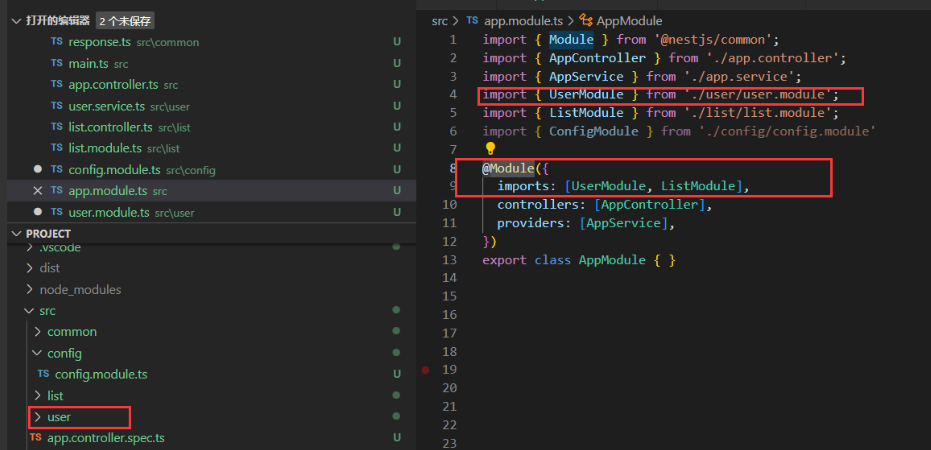
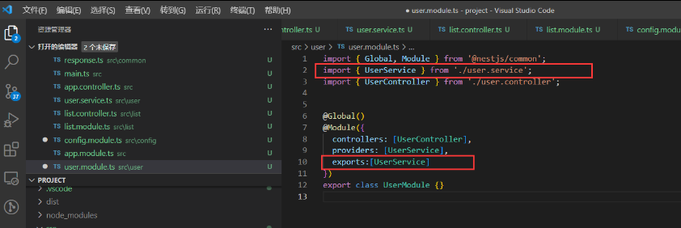
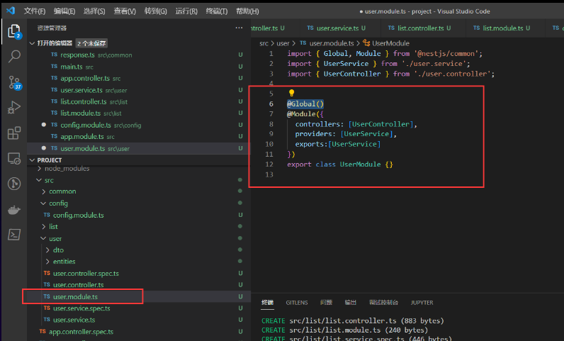
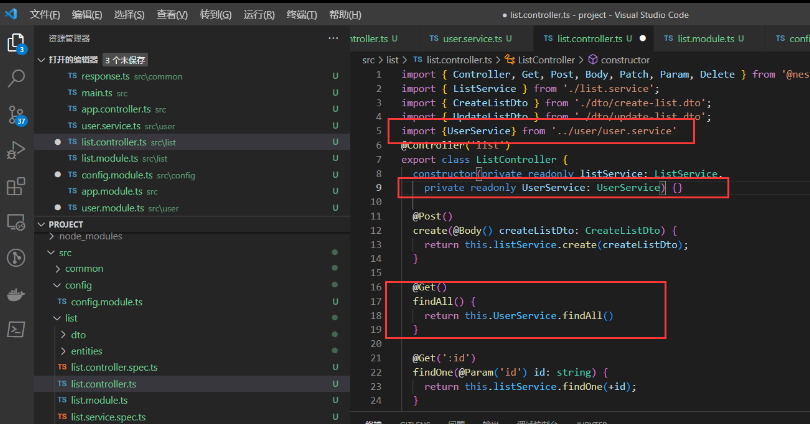
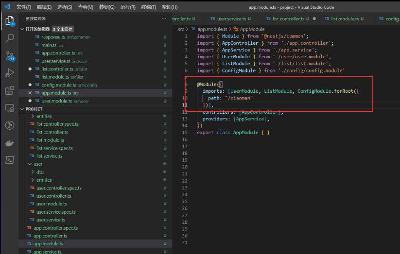

# 模块@Module

每个 Nest 应用程序至少有一个模块，即根模块。根模块是 Nest 开始安排应用程序树的地方。
事实上，根模块可能是应用程序中唯一的模块，特别是当应用程序很小时，但是对于大型程序来说这是没有意义的。
在大多数情况下，您将拥有多个模块，每个模块都有一组紧密相关的功能

### 1.基本用法

当我们使用 nest g res user 创建一个 CURD 模板的时候 nestjs 会自动帮我们引入模块



### 2.共享模块

例如 user 的 Service 想暴露给 其他模块使用就可以使用 exports 导出该服务



由于 App.modules 已经引入过该模块 就可以直接使用 user 模块的 Service


### 3.全局模块

@Global()

我们给 user 模块添加  @Global() 他便注册为全局模块


在 list 模块使用无须在 module  import 导入


### 4.动态模块

动态模块主要就是为了给模块传递参数 可以给该模块添加一个静态方法 用来接受参数


```ts
import { Module, DynamicModule, Global } from '@nestjs/common'


interface Options {
    path: string
}

@Global()
@Module({
})
export class ConfigModule {
    static forRoot(options: Options): DynamicModule {
        return {
            module: ConfigModule,
            providers: [
                {
                    provide: "Config",
                    useValue: { baseApi: "/api" + options.path }
                }
            ],
            exports: [
                {
                    provide: "Config",
                    useValue: { baseApi: "/api" + options.path }
                }
            ]
        }
    }
}
```



