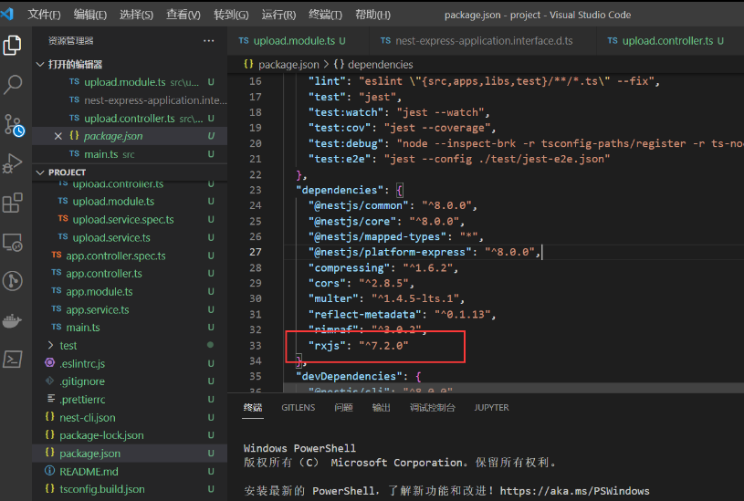

**为什么要介绍 RxJs 应为 在 Nestjs 已经内置了 RxJs 无需安装 并且 Nestjs 也会有一些基于 Rxjs 提供的 API**

 声明式编程和命令式编程的比较


> [!NOTE] 个人理解
> 把要执行的事件放入 `subscriber.next` 中，会不断执行下去，`observable` 能观察到执行到下一个事件了




Rxjs 中文文档[Observable | RxJS 中文文档](https://cn.rx.js.org/class/es6/Observable.js~Observable.html "Observable | RxJS 中文文档")

RxJs 使用的是 `观察者模式`，用来 编写异步队列 和 事件处理（后台用不到，前端可以操作 dom）。

- `Observable` 可观察的物件
- `Subscription` 监听 Observable
- `Operators` 纯函数可以处理管道的数据 如 map filter concat reduce 等

## 案例 1 订阅和通知

==类似于迭代器== `next` 发出通知 ，`complete` 通知完成

`subscribe` 订阅 `observable` 发出的通知 也就是一个观察者


```ts
import { Observable } from "rxjs";

//类似于迭代器 next 发出通知  complete通知完成
const observable = new Observable(subscriber=>{
    subscriber.next(1)
    subscriber.next(2)
    subscriber.next(3)

    setTimeout(()=>{
        subscriber.next(4)
        subscriber.complete()
    },1000)
})

observable.subscribe({
    next:(value)=>{
       console.log(value)
    }
})
```

## 案例 2 pipe 管道

interval 五百毫秒执行一次
pipe 就是 管道的意思 管道里面也是可以去掉接口的支持处理异步数据 去处理数据
这儿展示了 `map`  和 `filter` 跟数组的方法是一样的  
最后 通过观察者 subscribe 接受回调

```ts
import { Observable, interval, take } from "rxjs";
import { map, filter,reduce,find,findIndex } from 'rxjs/operators'


const subs = interval(500).pipe(map(v => ({ num: v })), filter(v => (v.num % 2 == 0))).subscribe((e) => {
    console.log(e)
    if (e.num == 10) {
        subs.unsubscribe()
    }
})
```

## 案例 3

Rxjs 也可以处理事件 不过我们在 Nestjs 里面就不用操作 DOM 了 你如果 Angular 或则 Vue 框架看可以使用 fromEvent

```ts
import { Observable, interval, take,of,retry,fromEvent } from "rxjs";
import { map, filter,reduce,find,findIndex } from 'rxjs/operators'

const dom = fromEvent(document,'click').pipe(map(e=>e.target))
dom.subscribe((e)=>{

})
```