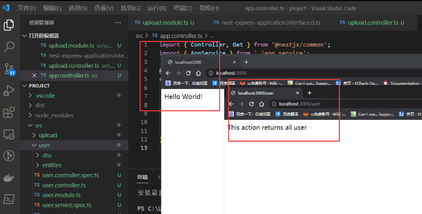

## 拦截器

拦截器具有一系列有用的功能，这些功能受面向切面编程（AOP）技术的启发。它们可以：

- 在函数执行之前/之后绑定额外的逻辑
- 转换从函数返回的结果
- 转换从函数抛出的异常
- 扩展基本函数行为
- 根据所选条件完全重写函数 (例如, 缓存目的)

## 简单拦截器案例-规范返回给前端格式

我们现在没有给我们的 Nestjs 规范返回给前端的格式现在比较乱


我们想给他返回一个标准的 json 格式 就要给我们的数据做一个全局 format

```json
{
  data, //数据
  status:0,
  message:"成功",
  success:true
}
```

src 下 新建 common 文件夹 创建 response.ts

## Nest Js 配合 Rxjs 格式化数据

```js
import { Injectable, NestInterceptor, CallHandler } from '@nestjs/common'
import { map } from 'rxjs/operators'
import {Observable} from 'rxjs'


interface data<T>{
    data:T
}

@Injectable()
export class ComResponse<T = any> implements NestInterceptor {
    intercept(context, next: CallHandler):Observable<data<T>> {
        return next.handle().pipe(map(data => {
            return {
               data,
               status:0,
               success:true,
               message:"牛逼"
            }
        }))
    }
}
```

### 在main.ts 注册

```js
//全局依赖注入，需要实例化（）
app.useGlobalInterceptors(new ComResponse())
```