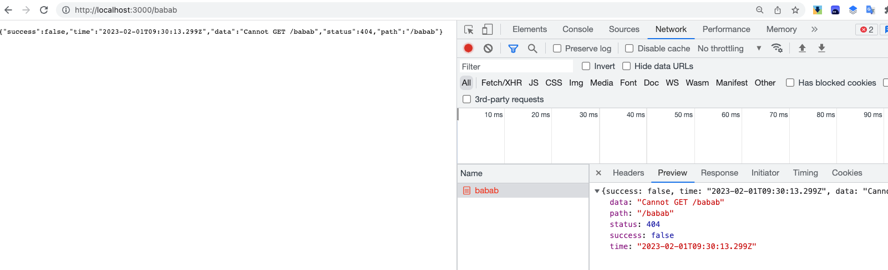

上一章我们讲了全局响应拦截，这一章我们来讲一下全局异常拦截器

## 全局异常拦截器

src/common 下面新建 `filter.ts`

让我们创建一个异常过滤器，它负责捕获作为 `HttpException` 类实例的异常，并为它们设置自定义响应逻辑。为此，我们需要访问底层平台 `Request` 和 `Response`。我们将访问 `Request` 对象，以便提取原始 `url` 并将其包含在日志信息中。我们将使用 `Response.json()` 方法，使用 `Response` 对象直接控制发送的响应。

```ts

import { ExceptionFilter, Catch, ArgumentsHost,HttpException } from '@nestjs/common'

import {Request,Response} from 'express'

@Catch(HttpException)
export class HttpFilter implements ExceptionFilter {
    catch(exception:HttpException, host: ArgumentsHost) {
        const ctx = host.switchToHttp()
        const request = ctx.getRequest<Request>()
        const response = ctx.getResponse<Response>()

        const status = exception.getStatus()

        response.status(status).json({
           data:exception.message,
           time:new Date().getTime(),
           success:false,
           path:request.url,
           status
        })
    }
}
```

### 注册全局异常过滤器

```vbscript
app.useGlobalFilters(new HttpFilter())
```

