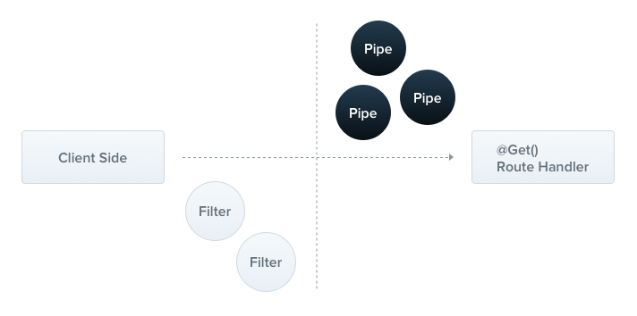

# 管道

可以做两件事

1. 转换，可以将前端传入的数据转成成我们需要的数据
2. 验证 类似于前端的 rules 配置验证规则

我们先来讲一下转换 Nestjs 提供了八个内置转换 API

- ValidationPipe
- ParseIntPipe
- ParseFloatPipe
- ParseBoolPipe
- ParseArrayPipe
- ParseUUIDPipe
- ParseEnumPipe
- DefaultValuePipe

## 案例 1 我们接受的动态参数希望是一个 number 类型 现在是 string

```ts
 @Get(':id')
  findOne(@Param('id', ParseIntPipe) id: number) {
    console.log(typeof id, '=====>');
    //number =====>
    return this.pService.findOne(+id);
  }
```

##   案例 2 验证 UUID

安装 uuid

```sh
npm install uuid -S

npm install @types/uuid -D
```

生成一个 uuid

```ts
import * as uuid from 'uuid';

console.log(uuid.v4());
```

`/p/e2f02423-9348-4e84-9a40-0f5002c2b5eb`

```ts
 @Get(':id')
  findOne(@Param('id', ParseUUIDPipe) id: string) {
    return this.pService.findOne(+id);
  }
```

现在访问 `@Get(':id')` 必须满足 uuid 的规则，否则访问不通过