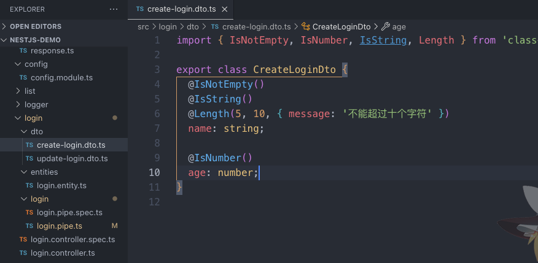
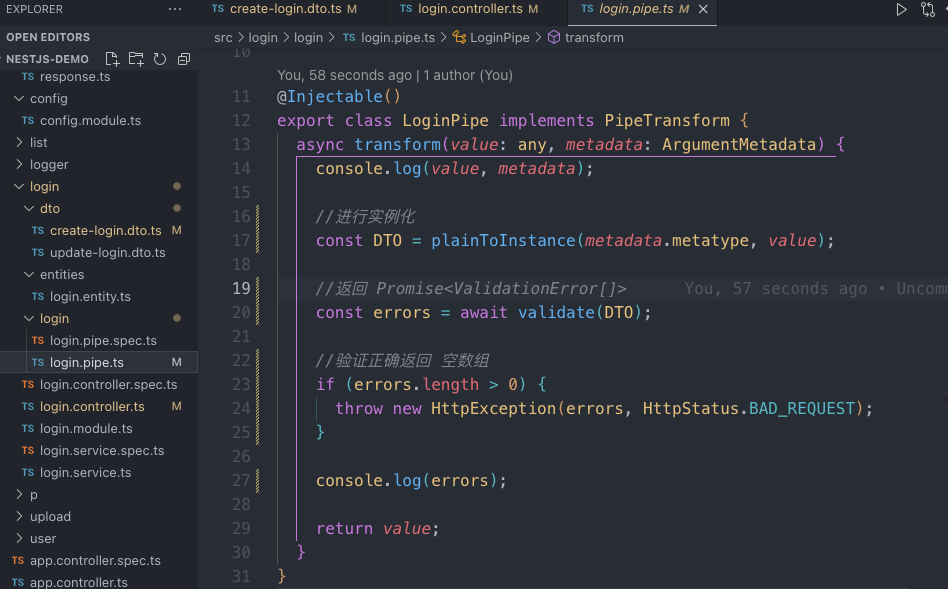

[19.a-DTO](19.a-DTO.md)

## 安装验证器，自定义

```sh
npm i --save class-validator class-transformer
```

### 配置 DTO 验证选项

```ts
import { IsNotEmpty, IsNumber, IsString, Length } from 'class-validator';

export class CreateLoginDto {
  @IsNotEmpty()
  @IsString()
  //配置选项，message 为报错信息
  @Length(5, 10, { message: '不能超过十个字符' })
  name: string;

  @IsNumber()
  age: number;
}
```



### controller 使用管道 和定义类型

```ts
@Post()
create(@Body('name', LoginPipe) createLoginDto: CreateLoginDto) {
    return this.loginService.create(createLoginDto);
  }
```


### 实现验证transform

value 就是 前端传过来的数据 metaData 就是元数据 通过 metatype 可以去实例化这个类
```ts
import {
  ArgumentMetadata,
  HttpException,
  HttpStatus,
  Injectable,
  PipeTransform,
} from '@nestjs/common';
import { plainToInstance } from 'class-transformer';
import { validate } from 'class-validator';

@Injectable()
export class LoginPipe implements PipeTransform {
  async transform(value: any, metadata: ArgumentMetadata) {
    console.log(value, metadata);

    //进行实例化
    const DTO = plainToInstance(metadata.metatype, value);

    //返回 Promise<ValidationError[]>
    const errors = await validate(DTO);

    //验证正确返回 空数组
    if (errors.length > 0) {
      throw new HttpException(errors, HttpStatus.BAD_REQUEST);
    }

    console.log(errors);

    return value;
  }
}

```



## 使用自带的全局管道验证

`nestjs` 自带集成了，因为都需要
第一步 [配置 DTO 验证选项](#配置%20DTO%20验证选项) 还是需要

```ts
app.useGlobalPipes(new ValidationPipe());
```

后面两部可以省