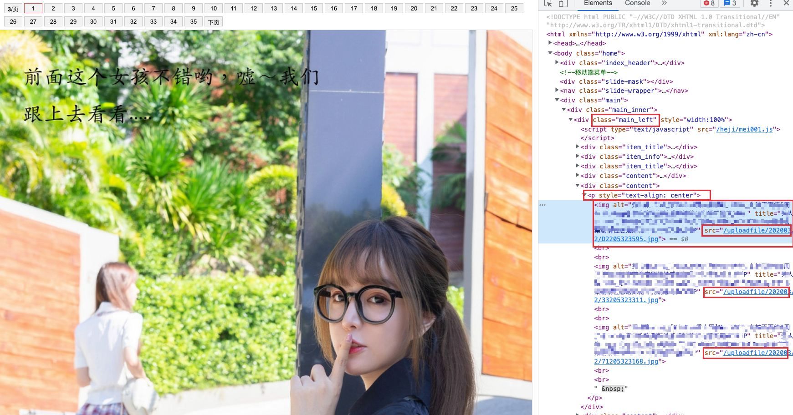
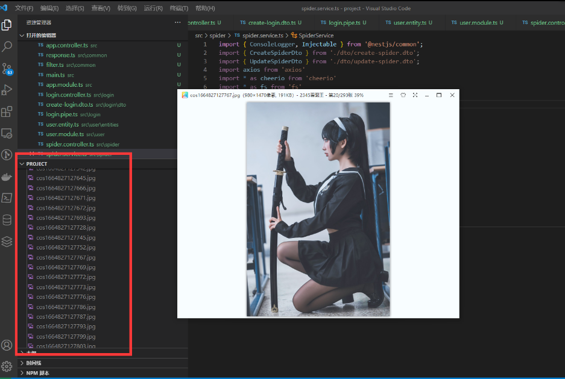

> 其实爬虫是一个对计算机综合能力要求比较高的技术活。

首先是要对网络协议尤其是 http 协议有基本的了解, 能够分析网站的数据请求响应。学会使用一些工具，简单的情况使用 chrome devtools 的 network 面板就够了

# 本案例采用 cheerio 和 axios

- `cheerio`: 是 `jquery` 核心功能的一个快速灵活而又简洁的实现，主要是为了用在服务器端需要对 `DOM` 进行操作的地方，让你在服务器端和 html 愉快的玩耍。
- `axios` 网络请求库可以发送 http 请求

## 第一步 分析该网页

发现图片是在 `class="main_left"` 下面的 `<p>` 标签，下面的 `` 标签，用 `cheerio` 获取 `DOM` 元素


```ts
const getCosPlay = async () => {
  const body = await axios({
    url: `https://www.xiurenba.cc/XiuRen/5595${index ? '_' + index : ''}.html`,
    method: 'get',
  }).then(async (res) => res.data);

  //jquery 的方式处理dom，加载页面
  const $ = cheerio.load(body);
  //在 class="main_left" 下面的 <p> 标签，下面的  标签，获取 src 的属性
    $('.main_left p img').each(function () {
      urls.push(baseUrl + $(this).attr('src'));
    });
  }
};
return urls;
}
```

## 第二步 递归读取所有图片

需要获得下一页地址，这个网页顺序有规律，是`xx，xx_1，xx_2`，所以只要获取一共有多少页就可以，再拼接 url 拿到了第一页的数据

```ts
    const baseUrl = 'xxxxxxxxxxxxxxxxxxxxxxx'
    const next = '下一页'
    let index = 0;
    const urls: string[] = []
    const getCosPlay = async () => {
      console.log(index)
      await axios.get(`xxxxxxxxxxxxxx/Cosplay/Cosplay10772${index ? '_'+index : ''}.html`).then(async res => {
        //console.log(res.data)
        const $ = cheerio.load(res.data)
        const page = $('.article-content .pagination a').map(function () {
          return $(this).text()
        }).toArray()
        if (page.includes(next)) {
          $('.article-content p img').each(function () {
            console.log($(this).attr('src'))
            urls.push(baseUrl + $(this).attr('src'))
          })
          index++
          await getCosPlay()
        }
      })
    }
    await getCosPlay()
    console.log(urls)
```

## 第三步 写入本地

```ts
  writeFile(urls: string[]) {
    urls.forEach(async url => {
      const buffer = await axios.get(url, { responseType: "arraybuffer" }).then(res=>res.data)
      const ws = fs.createWriteStream(path.join(__dirname, '../cos' + new Date().getTime() + '.jpg'))
      ws.write(buffer)
    })
  }
```



## 完整代码

spider.ts

```ts
import { Injectable } from '@nestjs/common';
import axios from 'axios';
import { CreateSpiderDto } from './dto/create-spider.dto';
import { UpdateSpiderDto } from './dto/update-spider.dto';
import https from 'https';
import * as cheerio from 'cheerio';
import fs from 'fs';
import path from 'path';

@Injectable()
export class SpiderService {
  async findAll() {
    const baseUrl = 'https://www.xiurenba.cc';
    const urls: string[] = [];
    const nextText = '下页';
    let index = 0;

    const getCosPlay = async () => {
      const body = await axios({
        url: `https://www.xiurenba.cc/XiuRen/5595${
          index ? '_' + index : ''
        }.html`,
        method: 'get',
        proxy: {
          host: '127.0.0.1',
          port: 7890,
          protocol: 'http',
        },
      }).then(async (res) => res.data);

      //用jquiry 的方式处理dom
      const $ = cheerio.load(body);

      console.log('第' + index + '页, 有', $('.main_left p img').length, '张');

      //页面一般有两个导航栏，只要第一个
      const page = $('.page').eq(0).find('a');
      //获取页面的页数
      const pageArray = page
        .map(function () {
          return $(this).text();
        })
        .toArray();

      //递归，如果还有下一页，继续访问页面
      if (pageArray.includes(nextText)) {
        $('.main_left p img').each(function () {
          urls.push(baseUrl + $(this).attr('src'));
        });
        index++;
        await getCosPlay();
      }
    };
    await getCosPlay();
    console.log(urls);
    this.writeFile(urls);
    return urls;
  }
  writeFile(urls: string[]) {
    urls.forEach(async (url) => {
      const buffer = await axios({
        url: url,
        method: 'get',
        proxy: {
          host: '127.0.0.1',
          port: 7890,
          protocol: 'http',
        },
        responseType: 'arraybuffer',
      }).then((res) => res.data);
      const ws = fs.createWriteStream(
        path.join(__dirname, '../cos' + new Date().getTime() + '.jpg'),
      );
      ws.write(buffer);
    });
  }
}

```