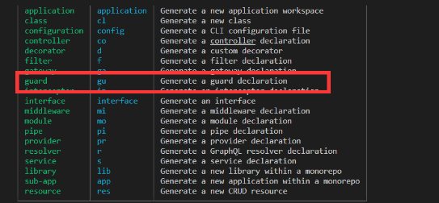

# 守卫（guard）

守卫有一个单独的责任。它们根据运行时出现的某些条件（例如权限，角色，访问控制列表等）来确定给定的请求是否由路由处理程序处理。

这通常称为授权。在传统的 Express 应用程序中，通常由中间件处理授权(以及认证)。

中间件是身份验证的良好选择，因为诸如 token 验证或添加属性到 request 对象上与特定路由(及其元数据)没有强关联。

> [!tips]
> 守卫在每个中间件之后执行，但在任何拦截器或管道之前执行。

## 创建一个守卫

```sh
nest g gu [name]
```



守卫要求实现函数   给定参数 context**执行上下文**  要求返回布尔值

```ts
import { CanActivate, ExecutionContext, Injectable } from '@nestjs/common';
import { Observable } from 'rxjs';
import { Reflector } from '@nestjs/core';
import type { Request } from 'express';

@Injectable()
export class RoleGuard implements CanActivate {
  constructor(private Reflector: Reflector) {}
  canActivate(
    context: ExecutionContext,
  ): boolean | Promise<boolean> | Observable<boolean> {
    const admin = this.Reflector.get<string[]>('role', context.getHandler());
    return true;
  }
}

```

## Controller 使用守卫

### 使用 UseGuards  控制守卫

```ts
import { Controller, Get, Post, Body, Patch, Param, Delete ,UseGuards} from '@nestjs/common';

@Controller('guard')
@UseGuards(RoleGuard)
xxxxx
```

### 全局守卫

```js
app.useGlobalGuards(new RoleGuard())
```

### 针对角色控制守卫

SetMetadata 装饰器

第一个参数为 key，第二个参数自定义我们的例子是数组存放的权限

```ts
@Get()
//guard 通过反射获得这个 键值对 的内容
@SetMetadata('role', ['admin'])
findAll() {
return this.guardService.findAll();
}
```

guard  使用   Reflector 反射读取 setMetaData 的值 去做判断这边例子是从 url 判断有没有 admin 权限

```ts
import { CanActivate, ExecutionContext, Injectable } from '@nestjs/common';
import { Observable } from 'rxjs';
import { Reflector } from '@nestjs/core';
import type { Request } from 'express';

@Injectable()
export class RoleGuard implements CanActivate {
  constructor(private Reflector: Reflector) {}
  canActivate(
    context: ExecutionContext,
  ): boolean | Promise<boolean> | Observable<boolean> {
    const admin = this.Reflector.get<string[]>('role', context.getHandler());

    //简易判断
    const req = context.switchToHttp().getRequest<Request>();

    console.log('经过了守卫', req.query.role);

    if (admin.includes(req.query.role as string)) {
      return true;
    } else {
      return false;
    }
  }
}

```