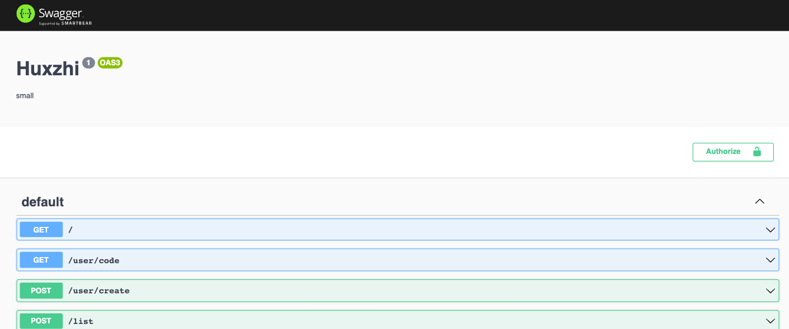
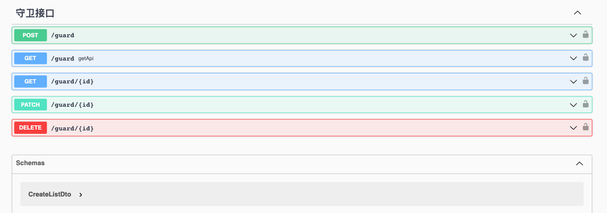
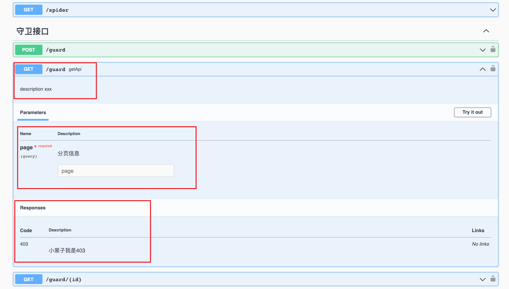
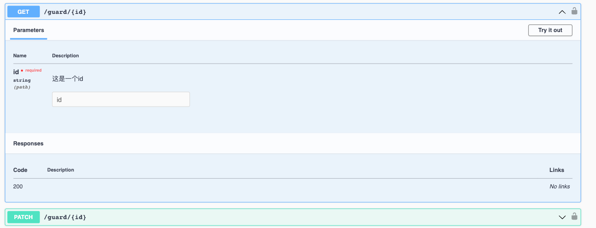
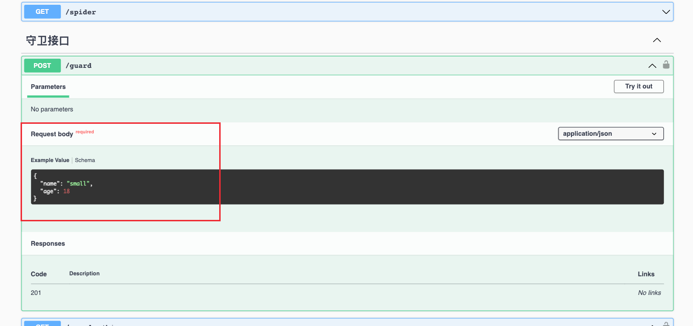
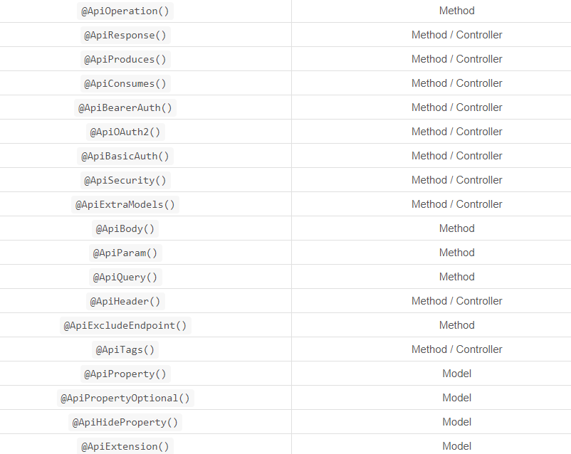

# swagger

用于提供给前端接口文档

安装命令如下

```sh
npm install  @nestjs/swagger swagger-ui-express
```

在 main.ts 注册 swagger

```ts
async function bootstrap() {
  const app = await NestFactory.create<NestExpressApplication>(AppModule);
  const options = new DocumentBuilder().setTitle('小满接口文档').setDescription('描述，。。。').setVersion('1').build()
  const document = SwaggerModule.createDocument(app,options)
  SwaggerModule.setup('/api-docs',app,document)
  await app.listen(3000);
}
bootstrap();
```

## 在 main.ts 注册 swagger

```ts
  //swagger
  const options = new DocumentBuilder()
    .addBearerAuth() //添加 jwt 认证
    .setTitle('xm')
    .setDescription('small')
    .setVersion('1')
    .build();

  const document = SwaggerModule.createDocument(app, options);
  SwaggerModule.setup('/api-docs', app, document);
```



## 可以使用 ApiTags 添加分组

```ts
@Controller('guard')
//对接口分组
@ApiTags('守卫接口')
export class GuardController {
  constructor(private readonly guardService: GuardService) {}
}
```



## ApiOperation 接口描述

## ApiQuery 修饰 get

## ApiResponse 自定义返回信息

```ts
  @ApiOperation({ summary: 'getApi', description: 'description xxx' })
  //添加参数信息
  @ApiQuery({ name: 'page', description: '分页信息' })
  @ApiResponse({ status: 403, description: '小黑子我是403' })
  findAll(@ReqUrl('123') url: string) {
    console.log(url, 'url');

    return this.guardService.findAll();
  }
```



## ApiParam 动态参数描述

跟 `ApiQuery` 类似

```ts
  @Get(':id')
  //描述动态参数
  @ApiParam({
    name: 'id',
    description: ' 这是一个id',
    required: true,
    type: String,
  })
  findOne(@Param('id') id: string) {
    return this.guardService.findOne(+id);
  }
```



## ApiProperty 定义 Post

一般用在 dto

```ts
import { ApiProperty } from '@nestjs/swagger';

export class CreateGuardDto {
  @ApiProperty({ example: 'small', enum: ['big', 'small'] })
  name: string;
  @ApiProperty({ example: 18 })
  age: 18;
}

```



## ApiBearerAuth jwt token

main.ts

```ts
 const options = new DocumentBuilder()
    .addBearerAuth() //添加 jwt 认证
    .build();
```

GuardController

```ts

@Controller('guard')
//可以自动添加token，jwt
@ApiBearerAuth()
export class GuardController {
    //...
}
```

## 其他装饰器

所有可用的OpenAPI装饰器都有一个 Api 前缀,可以清楚地区分核心装饰器。以下是导出的装饰器的完整列表,以及可以应用装饰器的级别的名称。




```java
@Api： 用于类，标识这个类是swagger的资源
@ApiIgnore： 用于类，忽略该 Controller，指不对当前类做扫描
@ApiOperation： 用于方法，描述 Controller类中的 method接口
@ApiParam： 用于参数，单个参数描述，与 @ApiImplicitParam不同的是，他是写在参数左侧的。如（ @ApiParam(name="username",value="用户名")Stringusername）
@ApiModel： 用于类，表示对类进行说明，用于参数用实体类接收
@ApiProperty：用于方法，字段，表示对model属性的说明或者数据操作更改
@ApiImplicitParam： 用于方法，表示单独的请求参数
@ApiImplicitParams： 用于方法，包含多个 @ApiImplicitParam
@ApiResponse： 用于方法，描述单个出参信息
@ApiResponses： 用于方法，包含多个@ApiResponse
@ApiError： 用于方法，接口错误所返回的信息
```