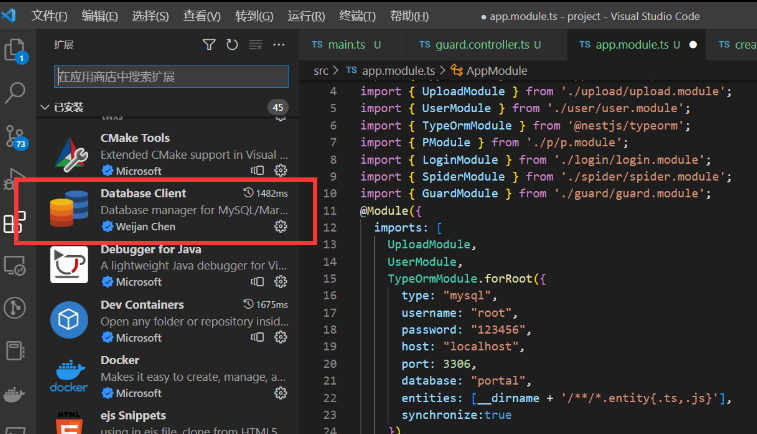

Nestjs 集成数据库，由于企业用的 Mysql 居多 我们就用 Nestjs 连接 Mysql

## 1.安装 mysql (mysql-server)

Ubuntu 20.04 安装 mysql 8 并开启远程登录 - 掘金
https://cubox.pro/share/fVv43q

```
sudo apt-get install mysql-server # 中途需要选择一下y
```

个人配置 Mysql 8.0

## 2.ORM 框架（typeOrm）

typeOrm 是 TypeScript 中最成熟的对象关系映射器( ORM )。因为它是用 TypeScript 编写的，所以可以很好地与 Nest 框架集成

### 安装依赖

```
npm install --save @nestjs/typeorm typeorm mysql2
```

### 可视化工具

如果使用的是 vsCode 安装数据库可视化工具


### 在 app.module.ts 注册

[24.a-配置信息](24.a-配置信息.md) 将数据库配置信息保存在 `.env.development`

```ts
@Module({
  imports: [
    TypeOrmModule.forRoot({
      type: "mysql", //数据库类型
      username: "root", //账号
      password: "123456", //密码
      host: "localhost", //host
      port: 3306, //
      database: "portal", //库名
      entities: [__dirname + '/**/*.entity{.ts,.js}'], //实体文件
      synchronize:true, //synchronize字段代表是否自动将实体类同步到数据库
      retryDelay:500, //重试连接数据库间隔
      retryAttempts:10,//重试连接数据库的次数
      autoLoadEntities:true, //如果为true,将自动加载实体 forFeature()方法注册的每个实体都将自动添加到配置对象的实体数组中
    }),
  ]
})
```

### 定义实体

src/test/entities/test.entity.ts

```ts
import { Entity, Column, PrimaryGeneratedColumn } from 'typeorm';
@Entity()
export class Test {
  @PrimaryGeneratedColumn()
  id: number;
  @Column()
  name: string;
  @Column()
  password: string;
  @Column()
  age: number;
}

```

### 关联实体

```ts
import { Module } from '@nestjs/common';
import { TestService } from './test.service';
import { TestController } from './test.controller';
import { Test } from './entities/test.entity';
import { TypeOrmModule } from '@nestjs/typeorm';
@Module({
  imports: [TypeOrmModule.forFeature([Test])],
  controllers: [TestController],
  providers: [TestService],
})
export class TestModule {}

```

