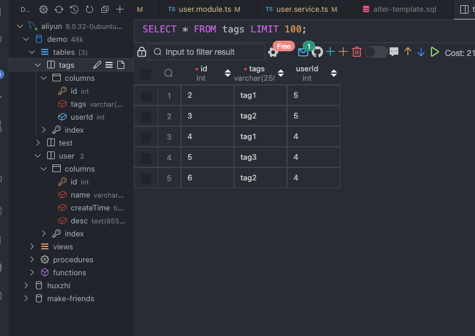
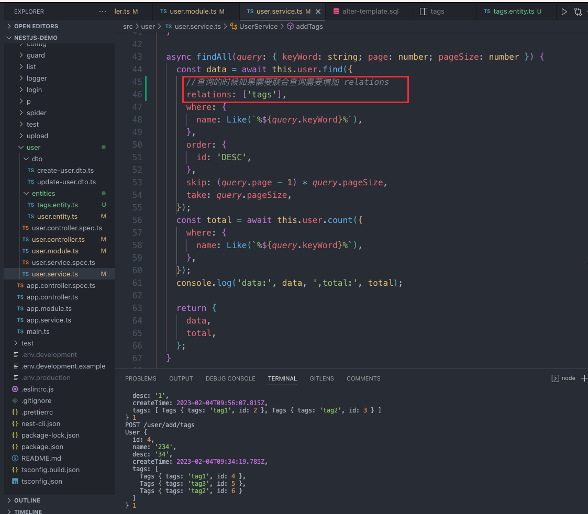

在我们开始的过程中，肯定不会把数据存在一个表里面，我们会进行分表，把数据分开存，然后通过关联关系，联合查询。

typeOrm 文档  [一对一 | TypeORM 中文文档](https://typeorm.biunav.com/zh/one-to-one-relations.html "一对一 | TypeORM 中文文档")
## 前端代码
前端代码还是复用上一章的 增加了一个添加 Tag

```vue
<template>
    <div class="wraps">
        <div>
            <el-input v-model="search.keyWord" style="width:300px;"></el-input>
            <el-button @click="init" style="margin-left:10px;">搜索</el-button>
            <el-button @click="openDialog" type="primary" style="margin-left:10px;">添加</el-button>
        </div>
        <el-table border :data="tableData" style="width: 100%;margin-top: 30px;">
            <el-table-column prop="name" label="名字" />
            <el-table-column prop="desc" label="描述" />

            <el-table-column prop="id" label="id" />
            <el-table-column>
                <template #default="scope">
                    <el-button @click="edit(scope.row)">编辑</el-button>
                    <el-button @click="deleteRow(scope.row)">删除</el-button>
                    <el-button @click="(isShowTag = true,row = scope.row)">添加tag</el-button>
                </template>
            </el-table-column>
        </el-table>
        <el-pagination @current-change="change" style="float:right;margin-top:10px;" background
            layout="prev, pager, next" :total="total" />
    </div>

    <el-dialog v-model="dialogVisible" title="弹框" width="50%">
        <el-form :model="form">
            <el-form-item prop="name" label="名称">
                <el-input v-model="form.name" placeholder="名称" />
            </el-form-item>
            <el-form-item prop="desc" label="描述">
                <el-input v-model="form.desc" placeholder="描述">
                </el-input>
            </el-form-item>
        </el-form>
        <template #footer>
            <span class="dialog-footer">
                <el-button @click="close">关闭</el-button>
                <el-button type="primary" @click="save">
                    保存
                </el-button>
            </span>
        </template>
    </el-dialog>
    <el-dialog v-model="isShowTag" title="添加tag">
        <el-select style="width:100%" v-model="tags" multiple>
            <el-option value="tag1">tag1</el-option>
            <el-option value="tag2">tag2</el-option>
            <el-option value="tag3">tag3</el-option>
        </el-select>
        <template #footer>
            <el-button @click="addTa" type="primary">确定</el-button>
        </template>

    </el-dialog>
</template>

<script setup lang='ts'>
import { ref, reactive } from 'vue'
import type { FormInstance } from 'element-plus'
import { addUser, updateUser, delUser, getList, addTags } from '@/server'
const isShowTag = ref<boolean>(false)
const tags = ref<string[]>([])
const total = ref<number>(0)
const row = ref<{
    id?: number,
    name?: string,
    desc?: string,
    createTime?: Date
}>({})
const addTa = async () => {
    const res = await addTags({
        tags: tags.value,
        userId: row.value.id
    })
    isShowTag.value = false;
    tags.value = [];
}
//搜索框
const search = reactive({
    keyWord: "",
    page: 1,
    pageSize: 10
})
//表单
const form = reactive({
    name: "",
    desc: "",
    id: 0
})
//清空数据
const resetForm = reactive({ ...form })
//表格数据
const tableData = ref([])
//弹框开关
const dialogVisible = ref<boolean>(false)
const openDialog = () => {
    dialogVisible.value = true;
    Object.assign(form, resetForm)
}
//初始化表格数据
const init = async () => {
    const list = await getList(search)
    tableData.value = list?.data ?? [];
    total.value = list?.total ?? 0
}
init()
const change = (page) => {
    search.page = page;
    init()
}
//保存 和修改 表格数据
const save = async () => {
    if (form.id) {
        await updateUser(form)
    } else {
        await addUser(form)
    }

    close()
    init()
}
//删除表格数据
const deleteRow = async (row) => {
    await delUser({ id: row.id })
    init()
}
//获取 详情
const edit = (row: any) => {
    dialogVisible.value = true;
    Object.assign(form, row)
}
//关闭弹框
const close = () => {
    dialogVisible.value = false;
}
</script>

<style  lang='less'>
* {
    padding: 0;
    margin: 0;
}

html,
body {
    background: #ccc;
}

.wraps {

    height: 100vh;
    padding: 30px;
}
</style>
```


新增了一个接口

```ts
import axios from 'axios'

axios.defaults.baseURL = 'http://localhost:3000'

export const addUser = (data) => axios.post('/user',data).then(res => res.data)

export const getList = (data) => axios.get('/user',{params:data}).then(res => res.data)

export const delUser = (data) => axios.delete(`/user/${data.id}`).then(res => res.data)

export const updateUser = (data) => axios.patch(`/user/${data.id}`,data).then(res => res.data)
//添加tag
export const addTags = (data) => axios.post(`/user/add/tags`,data).then(res => res.data)
```

## 后端 Nestjs

1.新建一个 tags.entity.ts

定义 Tags 的数据表

```ts
import { Column, Entity, PrimaryGeneratedColumn, BeforeInsert, CreateDateColumn, Generated, OneToOne, JoinColumn, ManyToOne } from 'typeorm'
import { User } from './user.entity'
@Entity()
export class Tags {
    @PrimaryGeneratedColumn()
    id: number

    @Column()
    tags:string

    @ManyToOne(()=>User,(user)=>user.tags)
    @JoinColumn()
    user:User

}
```

Modal 需要关联 tag 表

```ts
import { Module } from '@nestjs/common';
import { UserService } from './user.service';
import { UserController } from './user.controller';
import {TypeOrmModule} from '@nestjs/typeorm'
import { User } from './entities/user.entity';
import { Tags } from './entities/tags.entity';
// import { example } from './entities/tags.entity';
@Module({
  imports:[TypeOrmModule.forFeature([User,Tags])],
  controllers: [UserController],
  providers: [UserService]
})
export class UserModule {}
```

然后 user 表跟 tags 表进行关联

```ts
import { Column, Entity, PrimaryGeneratedColumn, BeforeInsert, CreateDateColumn, Generated, OneToOne, JoinColumn, OneToMany } from 'typeorm'
import { Tags } from './tags.entity'
@Entity()
export class User {
  @PrimaryGeneratedColumn()
  id: number

  @Column({ type: "varchar", length: 255 })
  name: string


  @Column({ type: "text" })
  desc: string

  @Generated('uuid')
  uuid: string

  @CreateDateColumn({ type: "timestamp" })
  createTime: Date

  @OneToMany(() => Tags, (tags) => tags.user)
  tags:Tags[]
  // example: example
}
```

##  OneToMany 和  ManyToOne

这儿我们解释一下   OneToMany 和  ManyToOne 的用法

对于用户来说一个用户可以拥有多个 tag 他们的关系是一对多  **OneToMany**

对于 tag 来说他们是多个 tag 指定单个用户 所以是   **ManyToOne**

OneToMany 接受两个参数

第一个参数是个函数返回关联的类 所以在 user 表关联 tag

第二个参数 创建双向关系

ManyToOne 用法一样

```
@OneToMany(() => Tags, (tags) => tags.user)
```

保存该关系

沿用上一章的代码增加 Controller 增加 addTags

```ts
import { Controller, Get, Post, Body, Patch, Param, Delete, Query } from '@nestjs/common';
import { UserService } from './user.service';
import { CreateUserDto } from './dto/create-user.dto';
import { UpdateUserDto } from './dto/update-user.dto';

@Controller('user')
export class UserController {
  constructor(private readonly userService: UserService) {}

  @Post('/add/tags')
  addTags (@Body() params:{tags:string[],userId:number}) {
    return this.userService.addTags(params)
  }

  @Post()
  create(@Body() createUserDto: CreateUserDto) {
    return this.userService.create(createUserDto);
  }

  @Get()
  findAll(@Query() query:{keyWord:string,page:number,pageSize:number}) {
    return this.userService.findAll(query);
  }


  @Patch(':id')
  update(@Param('id') id: string, @Body() updateUserDto: UpdateUserDto) {
    return this.userService.update(+id, updateUserDto);
  }

  @Delete(':id')
  remove(@Param('id') id: string) {
    return this.userService.remove(+id);
  }
}
```

service 增加 addTags 方法

```ts
import { Injectable } from '@nestjs/common';
import { CreateUserDto } from './dto/create-user.dto';
import { UpdateUserDto } from './dto/update-user.dto';
import { Repository, Like } from 'typeorm';
import { InjectRepository } from '@nestjs/typeorm';
import { User } from './entities/user.entity';
import { Tags } from './entities/tags.entity';
// import { example } from './entities/tags.entity';
@Injectable()
export class UserService {
  constructor(
  @InjectRepository(User) private readonly user: Repository<User>,
  @InjectRepository(Tags) private readonly tag: Repository<Tags>
  ) { }

//通过前端传入的userId 查到当前id 的用户信息，然后拿到前端传入的tags [tag1,tag2,tag3]
// 进行遍历 给tag实例进行赋值 然后调用保存方法添加tag 添加完之后 通过 tagList 保存该tag类
// 最后把tagList 赋给 user类的tags属性 然后重新调用save 进行更新

  async addTags (params:{tags:string[],userId:number}) {
    const userInfo = await this.user.findOne({where:{id:params.userId}})
    const tagList:Tags[] = []
    for (let i = 0;i<params.tags.length;i++) {
       let T =  new Tags()
       T.tags = params.tags[i];
       await this.tag.save(T)
       tagList.push(T)
    }
    userInfo.tags = tagList;
    console.log(userInfo,1)
    return this.user.save(userInfo)
  }

  async create(createUserDto: CreateUserDto) {
    const data = new User()
    // const ex = new example()
    data.name = createUserDto.name
    data.desc = createUserDto.desc
    // await this.example.save(ex)
    return this.user.save(data)
  }

  async findAll(query: { keyWord: string, page: number, pageSize: number }) {
    const data = await this.user.find({
      //查询的时候如果需要联合查询需要增加 relations
      relations:['tags'],
      where: {
        name: Like(`%${query.keyWord}%`)
      },
      order:{
        id:"DESC",
      },
      skip: (query.page - 1) * query.pageSize,
      take: query.pageSize
    })
    const total = await this.user.count({
      where: {
        name: Like(`%${query.keyWord}%`)
      },
    })
    return {
      data,
      total
    }
  }

  update(id: number, updateUserDto: UpdateUserDto) {
    return this.user.update(id, updateUserDto)
  }

  remove(id: number) {
    return this.user.delete(id)
  }
}
```




### 联合查询需要增加    relations

如果需要联合查询需要增加    relations 注意看上面的代码
