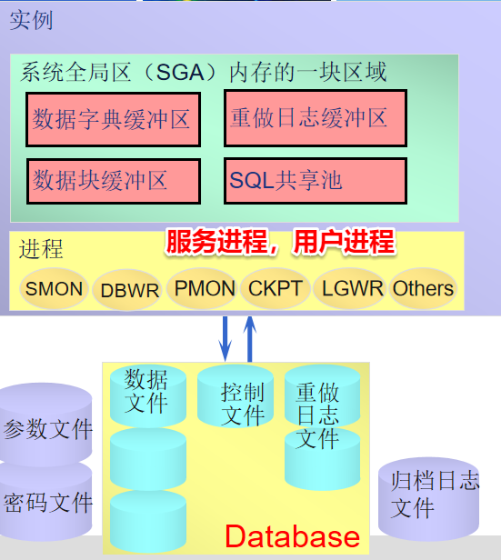
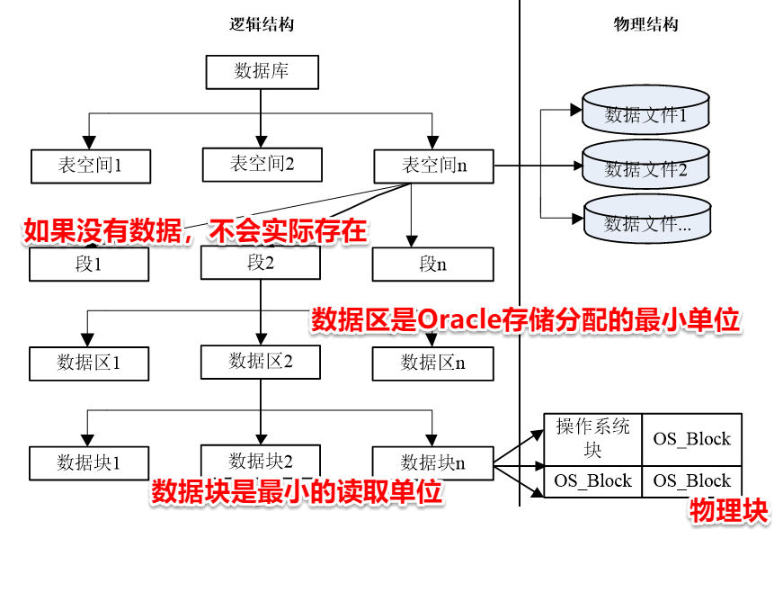
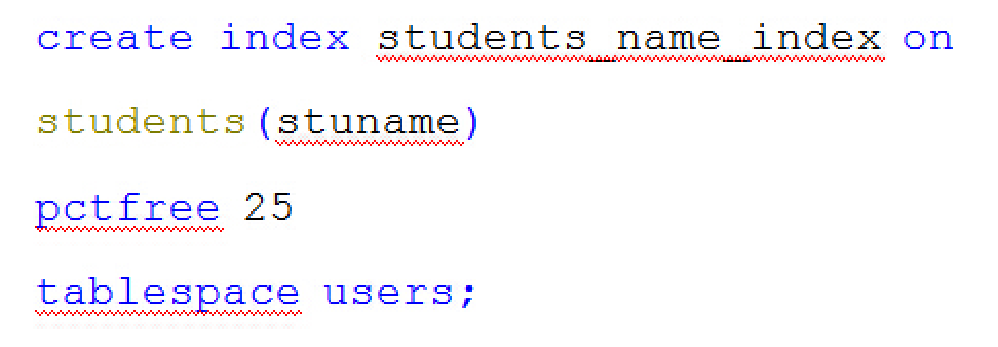
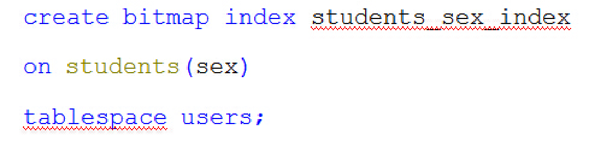
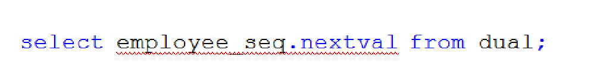
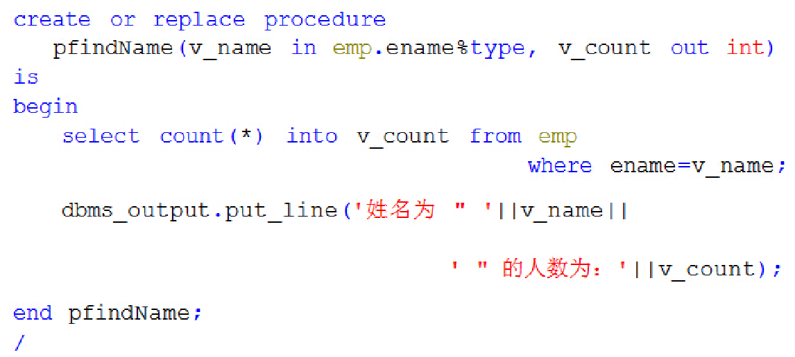
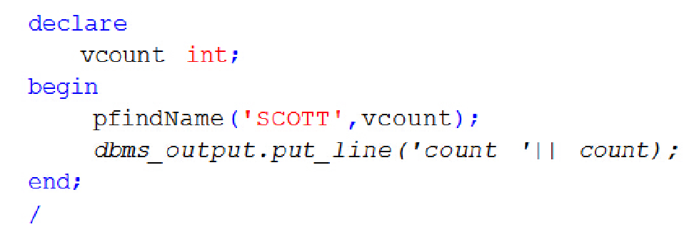

# oracle 期末复习总结

1.监听器、net服务名的特点、作用。

监听程序与Net服务名的关系是怎样的？

TNSListener为结尾

监听程序配置在

**服务器**

端，负责监视客户端的连接请求；Net服务名配置在客户端，用于向其他工具提供连接信息的配置。

2.列举3个oracle创建数据库之后， 自动预创建的用户的用户名，及他们角色，登陆方式。

a) 普通用户:   scott， 密码tiger  (练习常用)   Normal

b) 普通管理员 ：system

c) 超级管理员：  sys  sysdba

3.模式的概念，模式与用户的关系。

- 用户（user） user在Oracle中的主要是用于身份验证，权限分配的一个标识。在连接数据库和操作数据库对象时就是通过用户进行身份和权限的验证。
- 模式（schema） Oracle中的schema是若干个数据库对象的集合，用于管理数据库中的各种对象，这里的对象包括：表、视图、存过、序列、索引等等。一个schema下包括若干个表、视图、存过等对象。

4. orade体系结构

数据库Database

实例 Instance

一个数据库可以被多个实例装载和打开；

一个实例在其生存期内只能装载和打开一个数据库。

启动实例装载、打开数据库

5.启动数据库、关闭数据库命令

- Oracle数据库实例的启动过程分为3步骤，分别是**启动实例、加载数据库、打开数据库**

STARTUP [nomount | mount | open | force] [resetrict] [pfile=filename]

nomount : 启动实例不加载数据库。通常创建新数据库或重建控制文件时使用。

mount: 启动实例、加载数据库并保持数据库的关闭状态。通常数据库维护时使用。

open : 默认选项。3步骤都做。常用。

force： 终止实例并重新启动数据库。

resetrict：以受限制的会话方式启动数据库，通常用于备份。

pfile: 指定启动实例时锁使用的文本参数文件。Oracle数据库实例在启动时必须读取一个初始化参数文件，以从中获得配置信息。若没有指定，则查找默认配置文件。

- 关闭数据库实例也分为3个步骤，分别是**关闭数据库、卸载数据库、关闭Oracle实例**。

SHUTDOWN [normal | transactional | immediate | abort]

normal：阻止任何用户建立新的连接。等待当前所有正在连接的用户主动断开连接。当所有用户断开连接后，立即关闭数据库。

transactional：阻止用户建立新连接和开始新事务。等待所有活动事务提交后再断开用户连接。当所有的活动事务提交完毕、所有的用户都断开连接后，将关闭数据库。

immediate: 阻止用户建立新连接和开始新事务。将未提交的活动事务回退。关闭数据库。

abort：阻止用户建立新连接和开始新事务。取消未提交的活动事务，而不是回退。立即终止正在执行的任何sql语句。关闭数据库。有一定的强制性和破坏性。

6.归档命令

1. shutdown immediate 关闭数据库
2. startup mount 启动实例，加载数据库（没有打开数据库）
3. archive log list 查看当前归档模式
4. alter database archivelog 设置归档模式
5. altar database open 打开数据局

7.表空间概念的理解

数据文件和日志文件是数据库中最关键的文件。它们是数据存储的地方。每一个数据库至少有一个与之相关的数据文件，通常情况下不仅仅一个，有非常多。

表空间就是一个用于管理数据文件的逻辑容器，它是与数据文件相关联的，一个表空间至少要有一个数据文件与之关联。

8.创建数据表、约束

1. 创建一个图书表BOOK，其字段定义如下。指定该表放在test表空间中。

| 字段名称 | 数据类型   | 长度                   |          |
| -------- | ---------- | ---------------------- | -------- |
| ID       | 整数       |                        | 主键     |
| NAME     | 变长字符串 | 50字节                 | 不能为空 |
| ISBN     | 定长字符串 | 30字符                 | 唯一     |
| OP_DATE  | 日期       |                        |          |
| PRICE    | 数值       | 长度7 小数点后1位 | 默认为0  |

写出该SQL脚本。

create table BOOK(  	ID int PRIMARY KEY,   	NAME varchar2(50 byte) NOT NULL,   	ISBN char(30 char) UNIQUE,   	OP_DATE date,   	PRICE number(7,1) default 0 )TABLESPACE test;

1. 生成一个借阅表Borrow，使用默认表空间。

| 字段名称   | 数据类型 | 长度 |                                  |
| ---------- | -------- | ---- | -------------------------------- |
| ID         | 整数     |      | 主键                             |
| BookID     | 整数     |      | 外键，引用BOOK表PROJID。级联删除 |
| START_DATE | 日期     |      | START_DATE默认为系统当前时间     |
| END_DATE   | 日期     |      | END_DATE不能比START_DATE早       |

写出该SQL脚本。

create table Borrow (   ID int PRIMARY KEY,   BookID int REFERENCES BOOK on delete caseade,   START_DATE  date default sysdate,   END_DATE date ,   check( END_DATE >= START_DATE ) );

9. dual表的使用

因为oracle的查询语句必须满足select ….from…结构，from 后必须有一个表名，

dual表可以用作这个强制的虚表

10.增删改查命令的使用

- 插入数据：

INSERT INTO 表名 

[(column_name [,column_name2]…)] 

VALUES (express1,[,express2]…)

- 更新数据

UPDATE 表名

SET 列名 = 列值

          [,列名 = 列值…] 

[WHERE 过滤条件]

- 删除数据

DELETE FROM 表名  [WHERE 条件]

11. truncate命令的使用，与delete命令的区别

TRANCATE   table   表名  

   [REUSE STORAGE|DROP STORAGE]

truncate  table employee; --删除全表的记录

**与delete 的区别**

：

delete  删除数据时，oracle会产生回滚记录，可以用rollback语句来撤销。 Truncate 不产生回滚记录。

删除全表记录truncate比delete要快，但是无法使用rollback语句撤销。 

删除后是否保留记录所占用的空间，默认DROP.

**REUSE:**

删除后保留所占用的空间， 

**DROP：**

表示删除后立即回收记录占用的空间。

12.分页查询

SELECT * FROM  (      SELECT list.*, rownum as RNUM FROM      (          业务select语句 )  list WHERE ROWNUM <=    &&size*&&page ) WHERE RNUM >&size*(&page-1)    替换变量： &    生命周期：输入值单次引用有效 &&  生命周期：输入值整个会话有效

13.索引的概念、使用注意事项

**索引: **

是建立在数据表的列之上的数据库对象。

**作用**

就像图书目录一样，可以帮助用户快速查找需要的数据，提高SQL查询语句的速度。

**目录的内容：**

关键值---页码的对应关系

**索引的内容： **

（索引）列键值 --- 其记录行的物理地址Rowid的对应关系

**使用注意事项：**

没有索引时，查询数据需要全表扫描：

**索引加快了查询速度，减慢了增、删、改的速度**

在Oracle系统中，对索引的应用和维护是自动完成的。

当用户执行了INSERT、UPDATE、DELETE操作后，系统自动更新索引列表。

当用户执行SELECT、UPDATE、DELETE操作时，系统自动选择合适的索引来优化操作。

14.素引的创建

- 创建**B树索引**

在students表的stuname列上创建索引，放在表空间users, 预留25%的空间。

pctfree 指定为将来insert操作所预留的空闲空间，如果将来在表上执行大量insert操作，那么应该设置较大的pctfree

- 在students表性别列上创建**位图索引**

15.序列的创建，序列的使用。

对于序列，有两个重要的属性——

**currval和nextval**

。其中currval用于获得序列的当前值，而nextval则用于获得序列的下一个值。每次调用nextval，都会使序列的当前值增加单位步长（默认步长为1）。

需要注意的是，在序列创建之后，应该首先使用seq.nextval，然后才能够使用seq.currval。

16.创建存储过程，完成指定功能。

17.调用存储过程

pl/sql编程调用

18.触发器的概念、特点。

一种特殊的存储过程，它在执行方式上不同于一般的存储过程。触发器是通过事件触发后由系统自动调用的。

**特点：**

在结构上，触发器非常类似于存储过程，都是实现特殊的功能而执行的代码块。触发器的主要部分是代码块，在某些条件成立时，代码块被自动执行。

触发器不允许用户显式传递参数，不能够返回参数值

也不允许用户调用触发器，触发器只能由Oracle在合适的时机自动调用，类似于面向切面编程中的拦截器。可以在动作执行之前或者执行之后，自定义操作

19.触发器的创建

For each row :行级触发器，对每一行数据进行操作时都会引起该触发器的运行。如果未指定该条件，则表示创建语句级触发器，无论数据操作影响了多少行，触发器都只会执行一次。

Tri_event, 触发事件比如，insert, update, delete, create, alter, drop..多个之间用or

Tri_condition: 只有当该表达式的值为true时，遇到触发事件才会自动执行触发器，否则即使遇到触发事件也不会执行触发器

create [or replace] trigger tri_name

	[before | after | instead of] tri_event

	on table_name | view_name | user_name | db_name

   [for each row] [when tri_condition]

begin

	plsql_sentences;

end tri_name;

create or replace trigger 名字 	before insert on dept     	for each row      begin      	select seq_1.nextval into :new.id from dual    end；

20.用户的创建、授权

**创建用户 create user**

CREATE USER AUTHOR IDENTIFIED BY “密码” quota unlimited on 表空间 profile ‘概要文件名’ ;

**授权操作使用GRANT命令：**

grant sys_privi | role to user | role | public

[with admin option]

撤销权限：

revoke sys_privi | role from user | role | public

