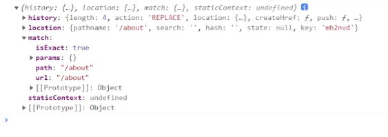

# 02c-Route 组件

route 组件是路由的映射组件，通过该组件将 url 地址和 React 组件进行映射，映射后当 url 地址变为指定地址时指定的组件就会显示，否则不显示。

```
<Route path="/home" component={Home} />
<Route path="/about" component={About} />
```

上例中，路径`/home`和`<Home/>`组件进行了映射，路径`/about`和`<About/>`组件进行了映射。当访问`http://localhost:3000/about`时，about 组件会自动渲染显示，访问`http://localhost:3000/home`时，home 组件会自动渲染显示。

Route 组件可以设置以下几个属性

1.  path 用来设置要映射的路径，可以是一个字符串或字符串数组。字符串用来匹配单个路径，数组可以匹配多个路径。
2.  exact 用来设置路由地址是否完整匹配，它需要一个布尔值，默认为 false，就像上边的情况。如果设置为 true，那么只有地址和 path 完全一致时，组件才会挂载。
3.  strict 布尔值，默认值为 false。false 时，会匹配到以`/`结尾的路径。比如：path 设置为`/home`默认情况下`/home/`也会导致组件挂载。设置为 true 时，以`/`结尾的路径不会被匹配。
4.  component
5.  render
6.  children
7.  location
8.  sensitive

## 4.component

component 用来指定路由匹配后被挂载的组件
component 需要直接传递组件的类

```jsx
//App.js
<Route path="/about" component={About}/>
```

和标签体指定组件不同，如果通过 component 属性指定组件，React Router 会自动向组件中传递三个参数 `match`、`location` 和 `history`。

```js
//About.js
const About = (props) => {
    console.log(props);
}
```



### match

对象，表示请求匹配的路径信息，其中包含四个属性：

1.  param —— 请求参数
2.  isExact —— 布尔值，请求路径是否完整匹配
3.  path —— 请求路径的规则
4.  url —— 匹配到的 url 地址

### location

对象，表示浏览器地址栏的信息，请求完整路径、查询字符串等，可能具有的属性：

1.  pathname —— 请求的路径
2.  search —— 查询字符串
3.  hash —— hash 字符串
4.  state —— 历史记录中的状态对象，可以用来在跳转时传递数据

### history

对象，用来读取和操作浏览器的历史记录（页面跳转）等功能，属性：

1.  length —— 历史记录的数量
2.  action —— 当前历史记录的状态，pop（前进、后退、新记录创建、索引发生变化）；push（新记录添加）；replace（历史记录被替换）
3.  location —— location 对象
4.  push() —— 添加新的历史记录，主动控制页面跳转
5.  replace() —— 替换历史记录
6.  go() —— 跳转到指定记录
7.  goBack() —— 回退
8.  goForward() —— 前进
9.  block() —— 用来阻止用户跳转行为，可以用 Prompt 组件代替

```js
props.history.replace({
    pathname:'/student/2',
    // 记录在 location 中的状态对象，可以用来在跳转时传递数据
    state:{name:'哈哈'}
});
```

## 5.render

传参数方便

render 也可以用了指定要挂载的组件
render 需要一个回调函数作为参数，回调函数的返回值会最终被挂载
==render 不会自动传递三个属性==

```jsx
//与 component 相同
<Route path="/student/:id" render={(routePros)=>{
 return <Student {...routePros}/>
}}/>
```

## 6.children

children 也可以用来指定被挂载的组件
用法有两种：

1. 和 render 类似，传递回调函数
   - 当 children 设置一个回调函数时，该组件无论路径是否匹配都会挂载
2. 可以传递组件

下面这几种形式都可以

```jsx
//回调函数形式
<Route path="/student/:id" children={(routeProps)=> <Student {...routeProps}/>}/>

//传递组件形式
<Route path="/student/:id" children={<Student/>}/>

//传递组件
<Route path="/student/:id">
    <Student/>
</Route>*/}

//表达式形式
<Route path="/student/:id">
    {routeProps => <Student {...routeProps}/>}
</Route>
```

## 通过钩子函数来获取

除了可以通过 props 获取三个对象外，也可以通过钩子函数来获取

student.js

```js
const match = useRouteMatch();
const location = useLocation();
const history = useHistory();
const {id} = useParams();

const stu = STU_DATA.find(item => item.id === +id);
```