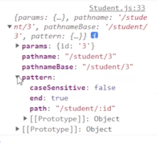

## Route 组件

Route 作用和版本 5 的一样，只是变得更简单了，没有了那么多复杂的属性，并且 ==Route 组件必须放到 Routes 中== ，当浏览器的地址发生变化时，会自动对 Routes 中的所有 Route 进行匹配，匹配到的则显示，其余 Route 则不再继续匹配。可以将 Route 当成是一个类似于 if 语句的东西，路径（path）匹配则其中的组件便会被渲染。

1.  path —— 要匹配的路径
2.  element —— 路径匹配后挂载的组件，直接传 JSX
3.  index —— 布尔值，路由是否作为默认组件显示

## 部分钩子函数

1.  useLocation —— 获取地址信息的钩子
2.  useNavigate —— 获取 Navigate 对象的钩子
    1. 获取一个用于条件页面的函数
    2. 使用 `nav('/about', {replace: true});` 使用 replace 不会产生新的记录
3.  useParams —— 获取请求参数
4.  useMatch —— 检查路径是否匹配某个路由，匹配则返回一个对象，`{params, pathname, patten, ...}`，不匹配返回 `null`
    1. 

```jsx
import React from 'react';
import {useLocation, useParams, useMatch, useNavigate} from "react-router-dom";

const STU_DATA = [
    {
        id:1,
        name:'刘备'
    },
    ...
];

const Student = () => {
    // 可以使用useParams()来获取参数
    const {id} = useParams();

    const location = useLocation();// 获取当前的地址信息

    // 如果路径匹配，则返回一个对象，不匹配则返回null
    //const match = useMatch("/student/:id");// 用来检查当前url是否匹配某个路由

    // useNavigate获取一个用于条件页面的函数
    const nav = useNavigate();


    const stu = STU_DATA.find(item => item.id === +id);

    const clickHandler = () =>{
        // nav('/about'); // 使用push，会产生历史记录
        nav('/about', {replace: true}); // 使用replace 不会产生新的记录
    };

    return (
        <div>
            <button onClick={clickHandler}>点我一下</button>
            <h2>{stu.id} --- {stu.name}</h2>
        </div>
    );
};

export default Student;

```