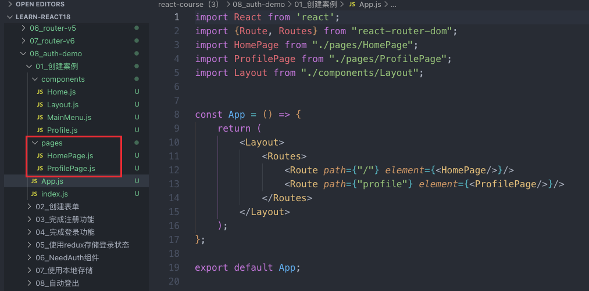

# 01-auth-demo 权限案例

## url 地址和页面进行映射

当页面由多个组件进行组成之后，设置一个新的总的入口，pages 文件夹，每一个页面需要的组件在这里配置

在 app 当中映射的时候，我就不映射 home 组件了，我直接映射这个 home 配置，也就是说当我们的这个访问根目录的时候，我就不再去显示 home 组件，而是显示后面配置组件，等于我们给后外边又多套了一层，但把我们项目结构变得更加的应该再清晰了，

## 主要步骤

利用 [48-RTK-Query](../React18/48-RTK-Query.md) RTKQ 向服务器发送请求，这里使用了 [Strapi](../React18/43a-Strapi-无头内容管理系统.md) 自带的操作，[1a-登录注册界面和请求](1a-登录注册界面和请求.md)

使用 redux 保存状态信息，[1b-使用 redux 保存状态信息](1b-使用redux保存状态信息.md)

没有对应权限的不能访问页面，使用重定向 `<Navigate>`  [1c-NeedAuth](1c-NeedAuth.md)

将数据同时存储到本地存储中 `localStorage` [1d-本地存储](1d-本地存储.md)

设置定时函数执行 `setTimeout` [1e-自动登出](1e-自动登出.md)