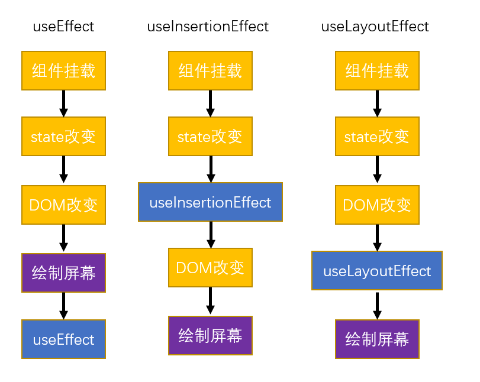
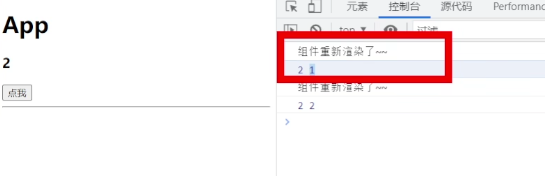

# 2-hook-demo

关于 React 中的钩子函数，我们已经非常熟悉了。钩子函数的功能非常的强大，而它的使用又十分简单。关于钩子函数的使用，我们只需记住两点：

1.  ==钩子只能直接在 React 组件和自定义钩子中使用==
2.  钩子不能在嵌套函数或其他语句（if、switch、white、for 等）中使用

## React 中自带的钩子函数

1.  useState
2.  useEffect
3.  useContext
4.  useReducer
5.  useCallback
6.  useRef
7.  useMemo
8.  useImperativeHandle
9.  useLayoutEffect
10. useDebugValue（18.0 新增）
11. useDeferredValue（18.0 新增）
12. useTransition（18.0 新增）
13. useId（18.0 新增）
14. useSyncExternalStore（18.0 新增）
15. useInsertionEffect（18.0 新增）

## UseMemo

useMemo 和 useCallback 十分相似，==useCallback 用来缓存函数对象，useMemo 用来缓存函数的执行结果==。在组件中，会有一些函数具有十分的复杂的逻辑，执行速度比较慢。闭了避免这些执行速度慢的函数返回执行，可以通过 useMemo 来缓存它们的执行结果，像是这样：

```jsx
const result = useMemo(()=>{
    return 复杂逻辑函数();
},[依赖项])

//举例
const someEle = useMemo(()=>{
    return <Some a={a} b={b}/>;
}, [a, b]);
```

组件也是函数，也可以缓存组件，

useMemo 中的函数会在依赖项发生变化时执行，注意！是执行，这点和 useCallback 不同，useCallback 是创建。执行后返回执行结果，如果依赖项不发生变化，则一直会返回上次的结果，不会再执行函数。这样一来就避免复杂逻辑的重复执行。

## useImperativeHandle

让父元素可以操作子元素方法，

- 子组件向外部暴露
  - React.forwardRef() 指定组件向外部暴露的 ref
  - useImperativeHandle 指定组件向外部暴露的 ref 的操作方法
- 父组件使用子组件暴露的操作方法

  ```jsx
  const ref = useRef();
  const clickHandler = () => {
      ref.current.xxx();//内部组件暴露的方法
  };

  return <div>
      <MyButton ref={ref}/>
  </div>;
  ```

### React.forwardRef() 可以用来指定组件向外部暴露的 ref

`useRef()` 无法直接去获取 react 组件的 dom 对象，
因为一个 react 组件中可能含有多个 dom 对象
React 也不知道要给你谁，可以用 `React.forwardRef()` 可以用来指定组件向外部暴露的 ref

在 React 中可以通过 forwardRef 来指定要暴露给外部组件的 ref：

```jsx
const MyButton = forwardRef((props, ref) => {
    return <button ref={ref}>自定义按钮</button>
});
```

上例中，MyButton 组件将 button 的 ref 作为组件的 ref 向外部暴露，其他组件在使用 MyButton 时，就可以通过 ref 属性访问：

```jsx
<MyButton ref={btnRef}/>
```

可以把 整个 DOM 对象 暴露出来，缺点是不可控，希望可以只暴露操作方法，受限制去操作

### useImperativeHandle 减少组件对 DOM 对象的直接操作

通过 `useImperativeHandle` 可以手动的指定 ref 要暴露的对象，比如可以修改 MyButton 组件如下：

```jsx
const MyButton = forwardRef((props, ref) => {

    useImperativeHandle(ref,()=> {
        return {
            name:'孙悟空'
        };
    });

    return <button>自定义按钮</button>
});
```

useImperativeHandle 的第二个参数是一个函数，函数的返回值会自动赋值给 ref（current 属性）。上例中，我们将返回值为 `{name:'孙悟空'}` ，当然返回孙悟空没有什么意义。实际开发中，我们可以将一些操作方法定义到对象中，这样可以有效的减少组件对 DOM 对象的直接操作。

```jsx
const MyButton = forwardRef((props, ref) => {

    const btnRef = useRef();
    // useImperativeHandle 可以用来指定ref返回的值
    useImperativeHandle(ref,()=> {
        // 回调函数的返回值，会成为ref的值
        return {
            setDisabled(){
                btnRef.current.disabled = true;
            }
        };
    });

    return <button ref={btnRef}>自定义按钮</button>
});

//App.js
const App = () => {

    const btnRef = useRef();

    const clickHandler = () => {
        btnRef.current.setDisabled();
    };

    return <div>
        <MyButton ref={btnRef}/>
        <button onClick={clickHandler}>点击</button>
    </div>;
};
```

## UseLayoutEffect

useLayoutEffect 的方法签名和 useEffect 一样，功能也类似。不同点在于，useLayoutEffect 的执行时机要早于 useEffect，它会在 DOM 改变后调用。在老版本的 React 中它和 useEffect 的区别比较好演示，React18 中，useEffect 的运行方式有所变化，所以二者区别不好演示。

useLayoutEffect 使用场景不多，实际开发中，在 effect 中需要修改元素样式，且使用 useEffect 会出现闪烁现象时可以使用 useLayoutEffect 进行替换。


### uselnsertionEffect 如何解决并发渲染的问题

为了解决这个问题，React 团队引入了`useInsertionEffect` Hook。它与`useLayoutEffect` Hook 非常相似，但它不能访问 DOM 节点的引用。

这意味着它只能用于插入样式规则。它的主要用途是插入全局 DOM 节点，如`<style>` ，或 SVG `<defs>` 。由于这只与生成标签的客户端有关，Hook 不会在服务器上运行。

## UseDebugValue

用来给自定义钩子设置标签，标签会在 React 开发工具中显示，用来调试自定义钩子，不常用。

调用 hook 很多次的时候，需要进行 区分 使用

## UseDeferredValue

useDeferredValue 用来设置一个延迟的 state，比如我们创建一个 state，并使用 useDeferredValue 获取延迟值：

useDeferredValue 需要一个state的作为参数，会为该state创建一个延迟值
当设置了延迟值后，每次state修改时都会触发两次重新的渲染
这两次执行对于其他的部分没有区别，但是延迟值两次执行的值是不同的
第一次执行时 延迟值是state的旧值， 第二次执行时，延迟值是state的新值
延迟值，总是会比原版的state，慢一步更新

```jsx
const [queryStr, setQueryStr] = useState('');
const deferredQueryStr = useDeferredValue(queryStr);
```

上边的代码中 queryStr 就是一个常规的 state，deferredQueryStr 就是 queryStr 的延迟值。设置延迟值后每次调用 setState 后都会触发两次组件的重新渲染。第一次时，deferredQueryStr 的值是 queryStr 修改前的值（旧值），第二次才是修改后的值（新值）。换句话，延迟值相较于 state 来说总会慢一步更新。




延迟值可以用在这样一个场景，一个 state 需要在多个组件中使用。一个组件的渲染比较快，而另一个组件的渲染比较慢。这样我们可以为该 state 创建一个延迟值，渲染快的组件使用正常的 state 优先显示。渲染慢的组件使用延迟值，慢一步渲染。当然必须结合 React.memo 或 useMemo 才能真正的发挥出它的作用。

## UseTransition


当我们在组件中修改 state 时，会遇到复杂一些的 state，当修改这些 state 时，甚至会阻塞到整个应用的运行，为了降低这种 state 的影响，React 为我们提供了 useTransition，通过 useTransition 可以降低 setState 的优先级。

```jsx
const [isPending, startTransition] = useTransition();
```

useTransition 会返回一个数组，数组中有两个元素，第一个元素是 isPending，它是一个变量用来记录 transition 是否在执行中。第二个元素是 startTransition，它是一个函数，可以将 setState 在其回调函数中调用，这样 setState 方法会被标记为 transition 并不会立即执行，而是在其他优先级更高的方法执行完毕，才会执行。

除了 useTransition 外，React 还直接为为我们提供了一个 startTransition 函数，在不需要使用 isPending 时，可以直接使用 startTransition 也可以达到相同的效果。

```jsx
// startTransition 的回调函数中设置setState会其他的setState生效后才执行
startTransition(()=>{
    setFilterWord2(e.target.value);
});
```

## UseId

生成唯一 id，使用于需要唯一 id 的场景，但不适用于列表的 key。