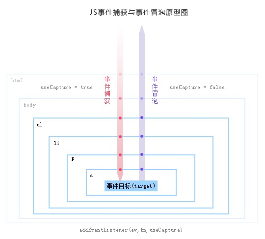

# 什么是事件委托？

- 事件委托又称事件代理。是指将自身的事件委托给上级处理。即：子级将事件委托给父级来处理。
- 实现原理：是基于 [Event Flow](https://juejin.cn/post/7101667955284393992 "https://juejin.cn/post/7101667955284393992") 中的事件冒泡。当子级成为事件的起源的时候，就会通过事件传播一级一级向上进行冒泡。然后父级监听到该事件后就进行相应的逻辑处理。
- 应用场景：主要是用在原生 js 中的 dom 的增删改。比如在一个列表中，你需要进行新增行或者删除行。又或者在一个列表中你需要获取选中的行的数据。一般的实现思路是在列表中的每个子级绑定一个方法。该方法如果是获取信息，那就可以直接获取。如果是删除，那就需要获取父级的 dom，然后调用 removeChild 方法来删除节点。这种方法，假如列表中有一万个节点，那么就会注册一万个相同的事件句柄。这显然是不合理的，并且对性能也不太友好。
- 针对上面频繁创建事件句柄该怎么处理呢？这个时间就用到了事件代理。如果我们把列表中的每个子节点的事件都取消。只给父级绑定一个事件。然后当子节点触发事件后，通过事件冒泡触发父级节点注册的事件，最后执行。此时无论子节点有一万个还是十万个哪怕千万个，也只创建了一个事件句柄。对性能友好。