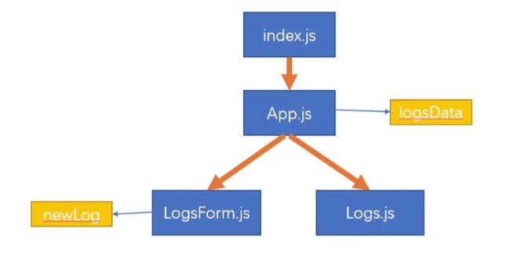

# 24-数据展示

## state 的提升

当遇到一个数据需要被多个组件使用时，我们可以将数据放入到这些组件共同的祖先元素中，这样就可以使得多个组件都能方便的访问到这个数据

logsDate 用来存储学习的日志，

- 这个数据除了当前组件 Logs 需要使用外，LogsForm 也需要使用


## 子组件向父组件传递数据

父组件传递一个 props 的 回调函数，子组件调用 父组件的 props 的回调函数

### 父组件

```jsx
// 定义一个函数
const saveLogHandler = (newLog) => {
    // 向新的日志中添加id，这里不合适，应该是数据库生成的
    newLog.id = Date.now() + '';

    // console.log('App.js -->',newLog);

    // 将新的数据添加到数组中，
    // 不会触发重新渲染，需要 state
    // logsData.push(newLog);

    // key 的作用，只会渲染新的元素
    setLogsData([newLog, ...logsData]);

};

return <div className="app">
    {/*引入LogsFrom*/}
    <LogsForm onSaveLog={saveLogHandler}/>
    <Logs logsData={logsData}/>
</div>;
```

### 子组件

```jsx
// 当表单提交时，汇总表单中的数据
const formSubmitHandler = (e) => {
    // 取消表单的默认行为
    e.preventDefault();
    // 获取表单项中的数据日期、内容、时长
    // 将数据拼装为一个对象
    const newLog = {
        date: new Date(inputDate),
        desc: inputDesc,
        time: +inputTime
    };

    // 当要添加新的日志时，调用父组件传递过来的函数
    props.onSaveLog(newLog);

    // 清空表单项
    setInputDate('');
    setInputDesc('');
    setInputTime('');
};
```