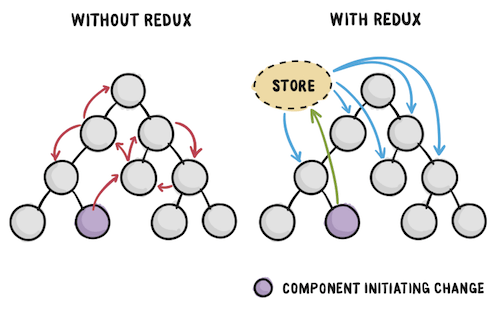

# 46-Redux

A Predictable State Container for JS Apps 是 Redux 官方对于 Redux 的描述，这句话可以这样翻译“一个专为 JS 应用设计的可预期的状态容器”，简单来说 Redux 是一个可预测的状态容器

==Redux 可以理解为是 reducer 和 context 的结合体==，使用 Redux 即可管理复杂的 state，又可以在不同的组件间方便的共享传递 state。

## 状态（State）

[state](18-useState响应式变量.md) 直译过来就是状态。state 不过就是一个变量，一个用来记录（组件）状态的变量。组件可以根据不同的状态值切换为不同的显示，比如，用户登录和没登录看到页面应该是不同的，那么用户的登录与否就应该是一个状态。再比如，数据加载与否，显示的界面也应该不同，那么数据本身就是一个状态。换句话说，状态控制了页面的如何显示。

## 容器（Container）

容器当然是用来装东西的，状态容器即用来存储状态的容器。状态多了，自然需要一个东西来存储，但是容器的功能却不是仅仅能存储状态，它实则是一个状态的管理器，除了存储状态外，它还可以用来对 state 进行查询、修改等所有操作。（编程语言中容器几乎都是这个意思，其作用无非就是对某个东西进行增删改查）

## 可预测（Predictable）

可预测指我们在对 state 进行各种操作时，其结果是一定的。即以相同的顺序对 state 执行相同的操作会得到相同的结果。简单来说，Redux 中对状态所有的操作都封装到了容器内部，外部只能通过调用容器提供的方法来操作 state，而不能直接修改 state。这就意味着外部对 state 的操作都被容器所限制，对 state 的操作都在容器的掌控之中，也就是可预测。

总的来说，**Redux 是一个稳定、安全的状态管理器**。

## 为什么是 Redux？

问：不对啊？React 中不是已经有 state 了吗？为什么还要整出一个 Redux 来作为状态管理器呢？

答：state 应付简单值还可以，如果值比较复杂的话并不是很方便。

问：复杂值可以用 useReducer 嘛！

答：的确可以啊！但无论是 state 还是 useReducer，state 在传递起来还是不方便，自上至下一层一层的传递并不方便啊！

问：那不是还有 context 吗？

答：的确使用 context 可以解决 state 的传递的问题，但依然是简单的数据尚可，如果数据结构过于复杂会使得 context 变得异常的庞大，不方便维护。

==Redux 可以理解为是 reducer 和 context 的结合体==，使用 Redux 即可管理复杂的 state，又可以在不同的组件间方便的共享传递 state。当然，Redux 主要使用场景依然是大型应用，大型应用中状态比较复杂，如果只是使用 reducer 和 context，开发起来并不是那么的便利，此时一个有一个功能强大的状态管理器就变得尤为的重要。

## 使用 Redux

[46a-Redux 使用](46a-Redux使用.md)