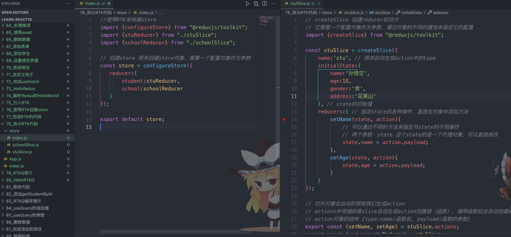

# 47b-拆分RTK

将 stuReducer 和 schoolReducer 拆分出去，结构更清晰了




```js
//使用RTK来构建store
import {configureStore} from "@reduxjs/toolkit";
import {stuReducer} from "./stuSlice";
import {schoolReducer} from "./schoolSlice";

// 创建store 用来创建store对象，需要一个配置对象作为参数
const store = configureStore({
   reducer:{
       student:stuReducer,
       school:schoolReducer
   }
});

export default store;
```