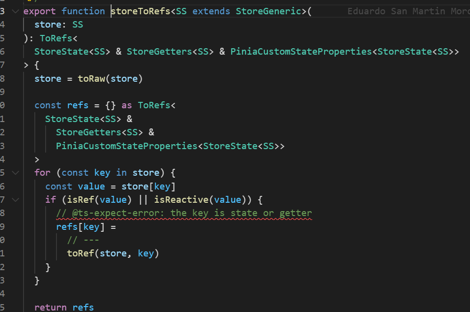

在 Pinia 是不允许直接解构是会失去响应性的

```ts
const Test = useTestStore()  

const { current, name } = Test 

console.log(current, name);
```

差异对比

修改Test current 解构 完之后的数据不会变

而源数据是会变的
```vue
<template>
  <div>origin value {{Test.current}}</div>
  <div>
    pinia:{{ current }}--{{ name }}
    change :
    <button @click="change">change</button>
  </div>
</template>
  
<script setup lang='ts'>
import { useTestStore } from './store'
 
const Test = useTestStore()
 
const change = () => {
   Test.current++
}
 
const { current, name } = Test
 
console.log(current, name);
 
 
</script>
  
<style>
</style>
```

## storeToRefs
解决方案可以使用 storeToRefs

```typescript
import { storeToRefs } from 'pinia'
 
const Test = useTestStore()
 
const { current, name } = storeToRefs(Test)
```

其原理跟toRefs 一样的给里面的数据包裹一层toref

源码 通过toRaw使store变回原始数据防止重复代理

循环store 通过 isRef isReactive 判断 如果是 响应式 对象直接拷贝一份给refs 对象 将其原始对象包裹toRef 使其变为响应式对象

