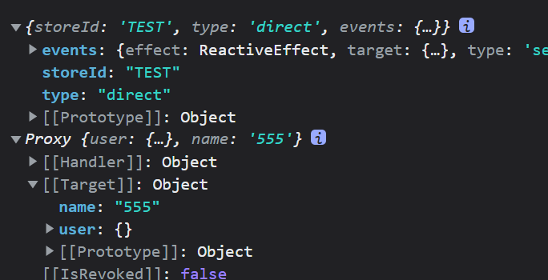
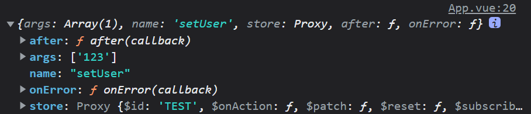

# 1.$reset

重置 `store` 到他的初始状态

```ts
state: () => ({
     user: <Result>{},
     name: "default",
     current:1
}),
```

Vue 例如我把值改变到了 10

```ts
const change = () => {
     Test.current++
}
```

调用`$reset()`;

将会把 `state` 所有值 重置回 原始状态

# 2.订阅 state 的改变

类似于 Vuex 的 abscribe  只要有 `state` 的变化就会走这个函数

```typescript
Test.$subscribe((args,state)=>{   console.log(args,state);   })
```

返回值


第二个参数

如果你的组件卸载之后还想继续调用请设置第二个参数

```typescript
Test.$subscribe((args,state)=>{   console.log(args,state);   },{  detached:true})
```

# 3.订阅 Actions 的调用

只要有 actions 被调用就会走这个函数

```typescript
Test.$onAction((args)=>{   console.log(args);   })
```

