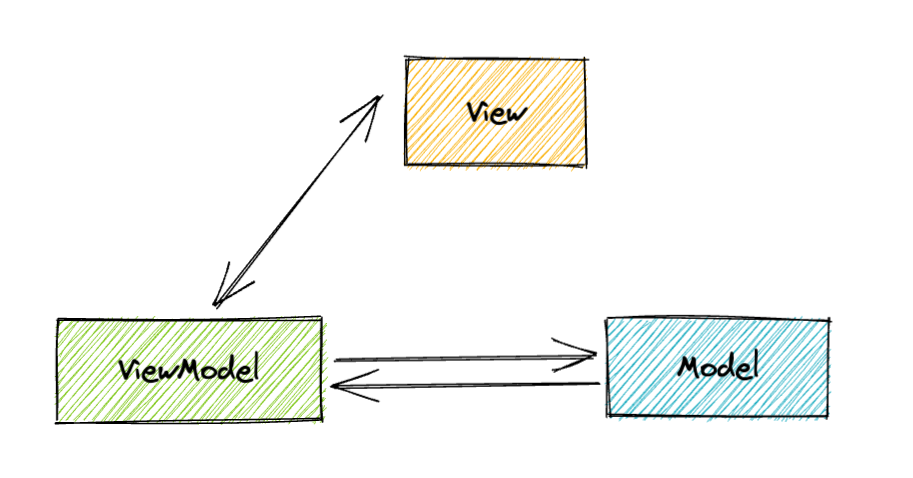
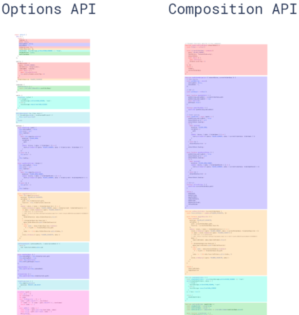
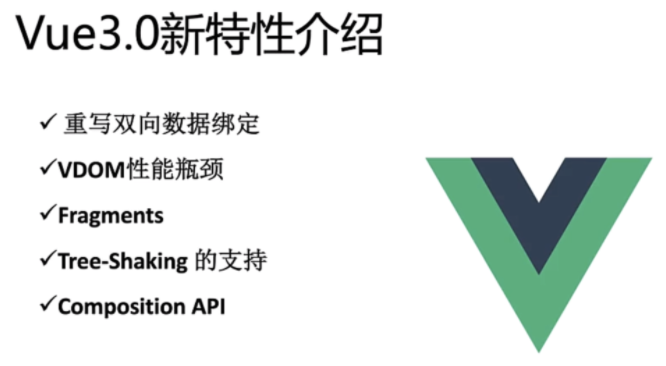
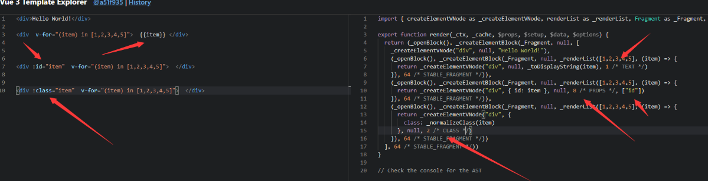

视频教程 Vue3 + vite + Ts + pinia + 实战 + 源码 +全栈_哔哩哔哩_bilibili

# 介绍 vue

Vue (读音 /vjuː/，类似于 view) 是一套用于构建用户界面的渐进式框架。与其它大型框架不同的是，Vue 被设计为可以自底向上逐层应用。Vue 的核心库只关注视图层，不仅易于上手，还便于与第三方库或既有项目整合。另一方面，当与现代化的工具链以及各种支持类库结合使用时，Vue 也完全能够为复杂的单页应用提供驱动。

MVVM（Model-View-ViewModel）架构

- 『View』：视图层（UI 用户界面）
- 『ViewModel』：业务逻辑层（一切 js 可视为业务逻辑）
- 『Model』：数据层（存储数据及对数据的处理如增删改查）



## 回顾 vue2 对比  vue3 

我们看如下图

发现传统的 vue2 逻辑比较分散 可读性差 可维护性差

对比 vue3 逻辑分明 可维护性 高

Options API vs Composition API

`Options API`，即大家常说的选项 API，即以`vue`为后缀的文件，通过定义`methods`，`computed`，`watch`，`data`等属性与方法，共同处理页面逻辑

`Options`代码编写方式，如果是组件状态，则写在`data`属性上，如果是方法，则写在`methods`属性上...
如下图：



# Vue3 新特性介绍



##   重写双向绑定

原来的方法主要是对数组不方便，要重写方法

```ts
vue2
基于Object.defineProperty()实现

vue3 基于Proxy
proxy与Object.defineProperty(obj, prop, desc)方式相比有以下优势：

//丢掉麻烦的备份数据
//省去for in 循环
//可以监听数组变化
//代码更简化
//可以监听动态新增的属性；
//可以监听删除的属性 ；
//可以监听数组的索引和 length 属性；

    let proxyObj = new Proxy(obj,{
        get : function (target,prop) {
            return prop in target ? target[prop] : 0
        },
        set : function (target,prop,value) {
            target[prop] = 888;
        }
    })
```

## Vue3 优化 Vdom

**在 Vue2 中,每次更新 diff,都是全量对比,Vue3 则只对比带有标记的,这样大大减少了非动态内容的对比消耗**

[Vue Template Explorer](https://vue-next-template-explorer.netlify.app/ "Vue Template Explorer")  我们可以通过这个网站看到静态标记



## patch flag 优化静态树

```vue
<span>Hello world!</span>
<span>Hello world!</span>
<span>Hello world!</span>
<span>Hello world!</span>
<span>{{msg}}</span>
<span>Hello world!</span>
<span>Hello world! </span>
```

`Vue3`  编译后的  `Vdom`  是这个样子的

```ts
export function render(_ctx，_cache，$props，$setup，$data，$options){return (_openBlock(),_createBlock(_Fragment,null，[
_createvNode( "span", null,"Hello world ! "),
_createvNode( "span",null，"Hello world! "),
_createvNode( "span"，null，"Hello world! "),
_createvNode( "span", null，"Hello world! "),
_createVNode("span", null，_toDisplaystring(_ctx.msg)，1/* TEXT */)，
_createvNode( "span", null，"Hello world! "),
_createvNode( "span", null，"Hello world! ")]，64/*STABLE_FRAGMENT */))
```

新增了  `patch flag` 标记

```ts
TEXT = 1 // 动态文本节点
CLASS=1<<1,1 // 2//动态class
STYLE=1<<2，// 4 //动态style
PROPS=1<<3,// 8 //动态属性，但不包含类名和样式
FULLPR0PS=1<<4,// 16 //具有动态key属性，当key改变时，需要进行完整的diff比较。
HYDRATE_ EVENTS = 1 << 5，// 32 //带有监听事件的节点
STABLE FRAGMENT = 1 << 6, // 64 //一个不会改变子节点顺序的fragment
KEYED_ FRAGMENT = 1 << 7, // 128 //带有key属性的fragment 或部分子字节有key
UNKEYED FRAGMENT = 1<< 8, // 256 //子节点没有key 的fragment
NEED PATCH = 1 << 9, // 512 //一个节点只会进行非props比较
DYNAMIC_SLOTS = 1 << 10 // 1024 // 动态slot
HOISTED = -1 // 静态节点
BALL = -2
```

我们发现创建动态 dom 元素的时候，Vdom 除了模拟出来了它的基本信息之外，还给它加了一个标记： `1 /* TEXT */`

这个标记就叫做 `patch flag`（补丁标记）

`patch flag` 的强大之处在于，当你的 `diff` 算法走到 `_createBlock` 函数的时候，会忽略所有的静态节点，只对有标记的动态节点进行对比，而且在多层的嵌套下依然有效。

尽管 JavaScript 做 Vdom 的对比已经非常的快，但是 patch flag 的出现还是让 Vue3 的 Vdom 的性能得到了很大的提升，尤其是在针对大组件的时候。

## Vue3 Fragment

vue3 允许我们支持多个根节点

```vue
<template>
  <div>12</div>
  <div>23</div>
</template>
```

同时新增了 Suspense teleport  和   多 v-model 用法

## Vue3 Tree shaking

简单来讲，就是在保持代码运行结果不变的前提下，去除无用的代码

在 Vue2 中，无论我们使用什么功能，它们最终都会出现在生产代码中。主要原因是 Vue 实例在项目中是单例的，捆绑程序无法检测到该对象的哪些属性在代码中被使用到

而 Vue3 源码引入 `tree shaking` 特性，将全局 API 进行分块。如果你不使用其某些功能，它们将不会包含在你的基础包中

就是比如你要用 watch 就是 `import {watch} from 'vue'` 其他的 `computed` 没用到就不会给你打包减少体积

## Vue 3 Composition Api

[[Setup 语法糖]]式编程

例如 ref reactive watch computed toRefs toRaws 我们会在下几个章节详解

而`Compositon API`正是解决上述问题，将某个逻辑关注点相关的代码全都放在一个函数里，这样当需要修改一个功能时，就不再需要在文件中跳来跳去

下面举个简单例子，将处理`count`属性相关的代码放在同一个函数了

用 函数 包裹起来，如 `const A = ()=>{ ... }`

```js
function useCount() {
    let count = ref(10);
    let double = computed(() => {
        return count.value * 2;
    });

    const handleConut = () => {
        count.value = count.value * 2;
    };

    console.log(count);

    return {
        count,
        double,
        handleConut,
    };
}
```