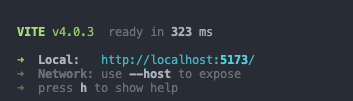
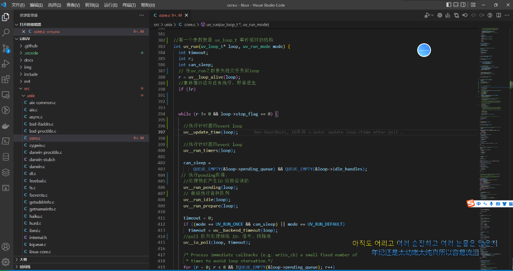

## 1.安装nodejs（建议装14，16，版本稳定）

**装过的同学可以忽略**

[下载 | Node.js 中文网](http://nodejs.cn/download/current/ "下载 | Node.js 中文网")

装完之后会有一个命令叫 npm

可以在终端输入npm -v 来检查是否安装成功


## 2.构建vite项目
官方文档开始 {#getting-started} | Vite中文网

vite 的优势

 冷服务   默认的构建目标浏览器是能 在 script 标签上支持原生 ESM 和 原生 ESM 动态导入

 HMR  速度快到惊人的 模块热更新（HMR）

Rollup打包  它使用 Rollup 打包你的代码，并且它是预配置的 并且支持大部分rollup插件

使用vite初始化一个项目

npm
```sh
npm init vite@latest
```

npm run dev 启动




package json 命令解析

```json
{
  "scripts": {
    "dev": "vite", // 启动开发服务器，别名：`vite dev`，`vite serve`
    "build": "vite build", // 为生产环境构建产物
    "preview": "vite preview" // 本地预览生产构建产物
  }
}
```


## 3.安装Vue cli脚手架 

第二种方式
`npm install @vue/cli -g`

## nodejs 底层原理（非重要）

[Node.js是什么？Node.js简介](http://c.biancheng.net/view/9338.html)

Node.js 主要由 V8、Libuv 和第三方库组成：

1. Libuv：跨平台的异步 IO 库，但它提供的功能不仅仅是 IO，还包括进程、线程、信号、定时器、进程间通信，线程池等。
2. 第三方库：异步 DNS 解析（ cares ）、HTTP 解析器（旧版使用 http_parser，新版使用 llhttp）、HTTP2 解析器（ nghttp2 ）、 解压压缩库( zlib )、加密解密库( openssl )等等。
3. V8：实现 JS 解析、执行和支持自定义拓展，得益于 V8 支持自定义拓展，才有了 Node.js。

你也可以理解成 js应用层  桥C/C++  底层C/C++ 


libuv源码地址[GitHub - libuv/libuv: Cross-platform asynchronous I/O](https://github.com/libuv/libuv "GitHub - libuv/libuv: Cross-platform asynchronous I/O")

libuvC语言源码解析


Node.js 是一个 JavaScript 运行时，它让 JavaScript 脱离了浏览器环境，可以直接在计算机上运行，极大地拓展了 JavaScript 用途。我们应该将 JavaScript 和 Python、Java、Ruby 等其它编程语言同等对待，不能再将它视为一种“小玩意”。  
![](./_images下 JavaScript 和 Node.js 的历史：

-   Netscape 浏览器衍生出了 JavaScript 脚本，赋予网页编程能力；
-   Chrome 浏览器衍生了 V8 引擎，提高了 JavaScript 性能；
-   V8 引擎构建了 Node.js，拓展了 JavaScript 的编程能力；
-   Node.js 衍生了 Libuv 库，给网络开发增加了一款优秀的工具。