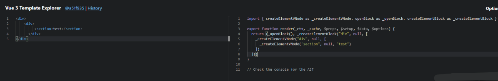
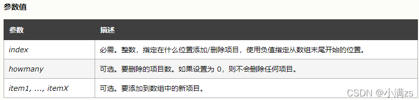
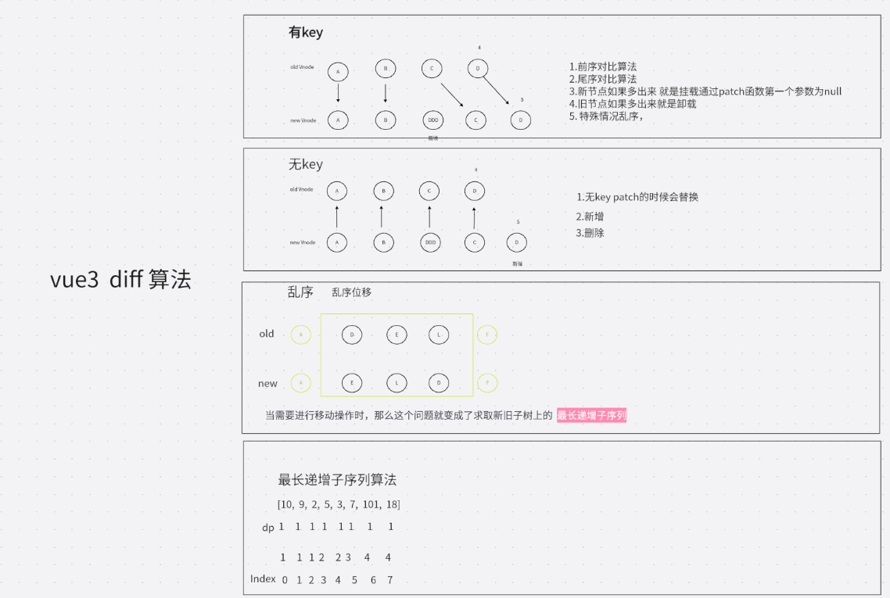

为什么要学习源码

1. 可以提升自己学习更优秀的 API 设计和代码逻辑
2. 面试的时候也会经常问源码相关的东西
3. 更快的掌握 vue 和遇到问题可以定位

# 介绍虚拟 DOM

虚拟 DOM 就是通过 JS 来生成一个 AST 节点树



[Vue Template Explorer](https://vue-next-template-explorer.netlify.app/#eyJzcmMiOiI8ZGl2PlxyXG4gICAgPGRpdj4gXHJcbiAgICAgICAgIDxzZWN0aW9uPnRlc3Q8L3NlY3Rpb24+XHJcbiAgICAgIDwvZGl2PiAgXHJcbjwvZGl2PiIsIm9wdGlvbnMiOnt9fQ== "Vue Template Explorer")

为什么要有虚拟 DOM？

我们可以通过下面的例子

```js
let div = document.createElement('div')
let str = ''
for (const key in div) {
  str += key + ' '
}
console.log(str)
```

> [!example]- 获取所有元素标签
> **所有元素**:: `align title lang translate dir hidden accessKey draggable spellcheck autocapitalize contentEditable enterKeyHint isContentEditable inputMode virtualKeyboardPolicy offsetParent offsetTop offsetLeft offsetWidth offsetHeight innerText outerText onbeforexrselect onabort onbeforeinput onblur oncancel oncanplay oncanplaythrough onchange onclick onclose oncontextlost oncontextmenu oncontextrestored oncuechange ondblclick ondrag ondragend ondragenter ondragleave ondragover ondragstart ondrop ondurationchange onemptied onended onerror onfocus onformdata oninput oninvalid onkeydown onkeypress onkeyup onload onloadeddata onloadedmetadata onloadstart onmousedown onmouseenter onmouseleave onmousemove onmouseout onmouseover onmouseup onmousewheel onpause onplay onplaying onprogress onratechange onreset onresize onscroll onsecuritypolicyviolation onseeked onseeking onselect onslotchange onstalled onsubmit onsuspend ontimeupdate ontoggle onvolumechange onwaiting onwebkitanimationend onwebkitanimationiteration onwebkitanimationstart onwebkittransitionend onwheel onauxclick ongotpointercapture onlostpointercapture onpointerdown onpointermove onpointerrawupdate onpointerup onpointercancel onpointerover onpointerout onpointerenter onpointerleave onselectstart onselectionchange onanimationend onanimationiteration onanimationstart ontransitionrun ontransitionstart ontransitionend ontransitioncancel oncopy oncut onpaste dataset nonce autofocus tabIndex style attributeStyleMap attachInternals blur click focus inert oncontentvisibilityautostatechange onbeforematch namespaceURI prefix localName tagName id className classList slot attributes shadowRoot part assignedSlot innerHTML outerHTML scrollTop scrollLeft scrollWidth scrollHeight clientTop clientLeft clientWidth clientHeight onbeforecopy onbeforecut onbeforepaste onsearch elementTiming onfullscreenchange onfullscreenerror onwebkitfullscreenchange onwebkitfullscreenerror role ariaAtomic ariaAutoComplete ariaBusy ariaBrailleLabel ariaBrailleRoleDescription ariaChecked ariaColCount ariaColIndex ariaColSpan ariaCurrent ariaDescription ariaDisabled ariaExpanded ariaHasPopup ariaHidden ariaInvalid ariaKeyShortcuts ariaLabel ariaLevel ariaLive ariaModal ariaMultiLine ariaMultiSelectable ariaOrientation ariaPlaceholder ariaPosInSet ariaPressed ariaReadOnly ariaRelevant ariaRequired ariaRoleDescription ariaRowCount ariaRowIndex ariaRowSpan ariaSelected ariaSetSize ariaSort ariaValueMax ariaValueMin ariaValueNow ariaValueText children firstElementChild lastElementChild childElementCount previousElementSibling nextElementSibling after animate append attachShadow before closest computedStyleMap getAttribute getAttributeNS getAttributeNames getAttributeNode getAttributeNodeNS getBoundingClientRect getClientRects getElementsByClassName getElementsByTagName getElementsByTagNameNS getInnerHTML hasAttribute hasAttributeNS hasAttributes hasPointerCapture insertAdjacentElement insertAdjacentHTML insertAdjacentText matches prepend querySelector querySelectorAll releasePointerCapture remove removeAttribute removeAttributeNS removeAttributeNode replaceChildren replaceWith requestFullscreen requestPointerLock scroll scrollBy scrollIntoView scrollIntoViewIfNeeded scrollTo setAttribute setAttributeNS setAttributeNode setAttributeNodeNS setPointerCapture toggleAttribute webkitMatchesSelector webkitRequestFullScreen webkitRequestFullscreen checkVisibility getAnimations setHTML nodeType nodeName baseURI isConnected ownerDocument parentNode parentElement childNodes firstChild lastChild previousSibling nextSibling nodeValue textContent ELEMENT_NODE ATTRIBUTE_NODE TEXT_NODE CDATA_SECTION_NODE ENTITY_REFERENCE_NODE ENTITY_NODE PROCESSING_INSTRUCTION_NODE COMMENT_NODE DOCUMENT_NODE DOCUMENT_TYPE_NODE DOCUMENT_FRAGMENT_NODE NOTATION_NODE DOCUMENT_POSITION_DISCONNECTED DOCUMENT_POSITION_PRECEDING DOCUMENT_POSITION_FOLLOWING DOCUMENT_POSITION_CONTAINS DOCUMENT_POSITION_CONTAINED_BY DOCUMENT_POSITION_IMPLEMENTATION_SPECIFIC appendChild cloneNode compareDocumentPosition contains getRootNode hasChildNodes insertBefore isDefaultNamespace isEqualNode isSameNode lookupNamespaceURI lookupPrefix normalize removeChild replaceChild addEventListener dispatchEvent removeEventListener`

所以直接操作 DOM 非常浪费性能

解决方案就是 我们可以用`JS`的计算性能来换取操作`DOM`所消耗的性能，既然我们逃不掉操作`DOM`这道坎,但是我们可以尽可能少的操作`DOM`

`操作JS是非常快的`

# 介绍 Diff 算法

[Vue3](https://so.csdn.net/so/search?q=Vue3&spm=1001.2101.3001.7020)  源码地址  [https://github.com/vuejs/core](https://github.com/vuejs/core "https://github.com/vuejs/core")

详细解说可以观看视频讲解  [小满 zs 的个人空间\_哔哩哔哩\_Bilibili](https://space.bilibili.com/99210573)

```vue
<template>
  <div>
    <div :key="item" v-for="(item) in Arr">{{ item }}</div>
  </div>
</template>

<script setup lang="ts">
const Arr: Array<string> = ['A', 'B', 'C', 'D']
Arr.splice(2,0,'DDD')
</script>

<style>
</style>
```




splice 用法 太贴心了



## vue3 diff 中最长递增子系列（对应索引）

用来可能少的操作 `DOM`

新节点数组在旧节点数组的索引位置，在位置数组中递增就能保证在旧数组中的相对位置的有序性，从而不需要移动，因此递增子序列的最长可以保证移动次数的最少  
或者可以理解为: ==新旧节点数组的`最长公共子系列`，在旧节点数组中除去最长公共子系列的其他节点是需要进行处理（移动、删除）==

vue3 需要的不是子序列长度，也不是最终的子序列数组，而是子序列对应的索引

**代码实现**
```js
// arr: 位置数组；
// 返回位置数组的递增子系列
function getSequence(arr){
 const p = arr.slice() // 拷贝一个数组 p，p[i]记录的是result在arr[i]更新前记录的上一个值,保存当前项对应的前一项的索引
  const result = [0]
  let i, j, u, v, c
  const len = arr.length
  for (i = 0; i < len; i++) {
    const arrI = arr[i]
	// 遍历位置数组
	// 排除等于 0 的情况
    if (arrI !== 0) {
          j = result[result.length - 1]
	  // (1) arrI 比 arr[j]大（当前值大于上次最长子系列的末尾值），直接添加
          if (arr[j] < arrI) {
            p[i] = j // 最后一项与 p 对应的索引进行对应, 保存上一次最长递增子系列的最后一个值的索引
            result.push(i) // result 存储的是长度为 i 的递增子序列最小末尾值的索引集合
            //（最小末尾值：要想得到最长递增子系列，需要子系列增长越慢越好，所以子系列末尾值需要最小）
            continue
	  }

          // (2) arrI <= arr[j] 通过二分查找，找到后替换它；u和v相等时循环停止
          // 定义二分查找区间[u, v]
          u = 0
          v = result.length - 1
          // 开启二分查找
          while (u < v) {
            // 取整得到当前位置
            c = ((u + v) / 2) | 0
            if (arr[result[c]] < arrI) {
              u = c + 1
            } else {
              v = c
            }
          }
        
          // 比较 => 替换, 当前子系列从头找到第一个大于当前值arrI，并替换
          if (arrI < arr[result[u]]) {
            if (u > 0) {
              p[i] = result[u - 1]  // 与p[i] = j作用一致
            }
            result[u] = i // 有可能替换会导致结果不正确，需要一个新数组 p 记录正确的结果
          }
        }
  }
  
  // 前面的逻辑与 leetcode 300 求最长子系列长度相似
  // 下面主要的修正由于贪心算法可能造成的最长递增子系列在原系列中不是正确的顺序
  u = result.length
  v = result[u - 1]
  // 倒叙回溯 用 p 覆盖 result 进而找到最终正确的索引
  while (u-- > 0) {
    result[u] = v
    v = p[v]
  }
  return result
}
```


作者：潇潇箫  
链接：https://juejin.cn/post/6988489193215229982  
来源：稀土掘金  
著作权归作者所有。商业转载请联系作者获得授权，非商业转载请注明出处。