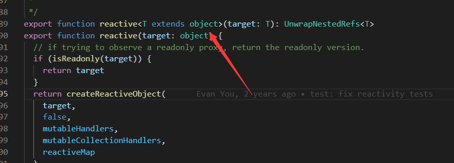

# `reactive`

简单数据类型用 [05-Ref全家桶](05-Ref全家桶.md) 
`用来绑定复杂的数据类型 例如 对象 数组`

reactive 源码约束了我们的类型



object 引用类型

## `ref` 和 `reactive` 的区别

`ref` 支持所有的类型，绑定普通的数据类型 我们可以 使用昨天讲到ref。
你如果用ref去绑定对象 或者 数组 等复杂的数据类型 我们看源码里面其实也是 去调用reactive
`reactive` 引用类型 Array Object Map Set ref 取值 赋值 无需要加.value

`reactive` 是不需要 `.value`

## reactive 基础用法

```ts
import { reactive } from 'vue'
let person = reactive({
   name:"小满"
})
person.name = "大满"
```

数组异步赋值问题

这样赋值页面是不会变化的因为会脱离 响应式
```ts
let person = reactive<number[]>([])
setTimeout(() => {
  person = [1, 2, 3]
  console.log(person);
  
},1000)
```

`reactive` 是 proxy ，不能直接赋值，否则破坏响应式对象的
解决方案 
- 数组 可以使用 push 加解构 
    ```ts
    import { reactive } from 'vue'
    let person = reactive<number[]>([])
    setTimeout(() => {
      const arr = [1, 2, 3]
      person.push(...arr)
      console.log(person);
      
    },1000)
    
    ```
- 包裹一层对象 把数组作为一个属性去解决
    ```ts
    type Person = {
      list?:Array<number>
    }
    let person = reactive<Person>({
       list:[]
    })
    setTimeout(() => {
      const arr = [1, 2, 3]
      person.list = arr;
      console.log(person);
      
    },1000)
    ```

常用来收集表单，数据和视图双向绑定

##  readonly只读属性

```ts
let obj = reactive({name:'小满'})

const read = readonly(obj)
read.name="大满" //不能修改
obj.name="大满" //可以修改
```

会受到原始属性的影响

## shallowReactive

只能对浅层的数据 如果是深层的数据只会改变值 不会改变视图

只到第一个属性

也会受到 reactive 影响

```vue
<template>
  <div>
    <div>{{ state }}</div>
    <button @click="change1">test1</button>
    <button @click="change2">test2</button>
  </div>
</template>
 
 
 
<script setup lang="ts">
import { shallowReactive } from 'vue'
 
 
const obj = {
  a: 1,
  first: {
    b: 2,
    second: {
      c: 3
    }
  }
}
 
const state = shallowReactive(obj)
 
function change1() {
  state.a = 7
}
function change2() {
  state.first.b = 8
  state.first.second.c = 9
  console.log(state);
}
 
 
 
 
</script> 
 
 
<style>
</style>
```