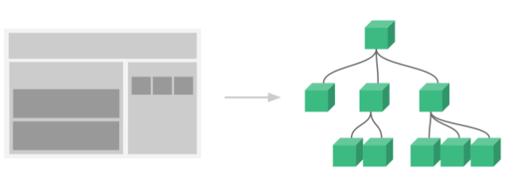
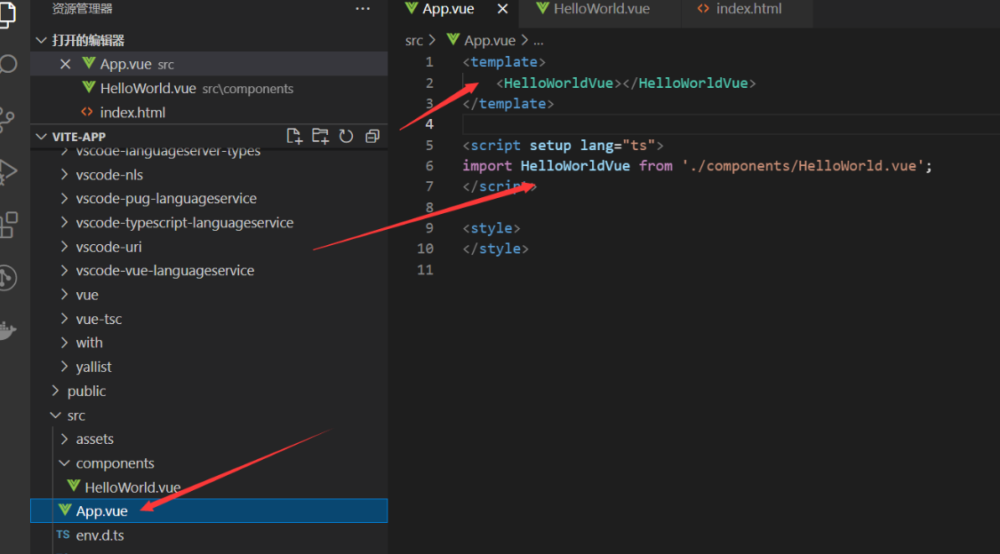
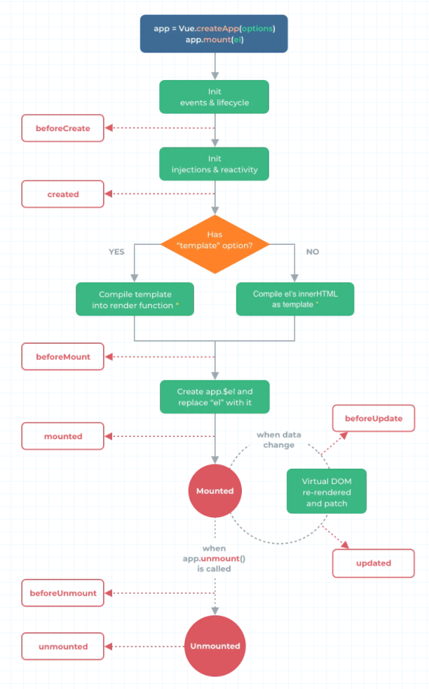

#   组件基础 component

每一个 `.vue` 文件呢都可以充当组件来使用

每一个组件都可以复用

通常一个应用会以一棵嵌套的组件树的形式来组织:

例如，你可能会有页头、侧边栏、内容区等组件，每个组件又包含了其它的像导航链接、博文之类的组件

## 父组件使用

引入子组件 `helloWorld` 然后直接就可以去当标签去使用 （切记组件名称不能与 `html` 元素标签名称一样）

# 组件的生命周期

简单来说就是一个组件从 创建 到 销毁 的过程称为 生命周期

在我们使用 Vue3 组合式 API 是没有  `beforeCreate 和 created 这两个生命周期的`

beforeCreate created [[Setup 语法糖]]模式 是没有这两个生命周期的 setup 去代替

-   onBeforeMount()
    -   在组件 DOM 实际渲染安装之前调用。在这一步中，根元素还不存在。读不到 DOM
-   onMounted()
    -   在组件的第一次渲染后调用，该元素现在可用，允许直接 DOM 访问
-   onBeforeUpdate()
    -   数据更新时调用，发生在虚拟 DOM 打补丁之前。可以卸载一些用不到的数据
-   onUpdated()
    -   DOM 更新后，updated 的方法即会调用。
-   onBeforeUnmount()
    -   在卸载组件实例之前调用。在这个阶段，实例仍然是完全正常的。
-   onUnmounted()
    -   卸载组件实例后调用。调用此钩子时，组件实例的所有指令都被解除绑定，所有事件侦听器都被移除，所有子组件实例被卸载。
-   renderTracked
    -   收集依赖，主要用于调试
-   renderTriggered
    -   触发依赖，主要用于调试