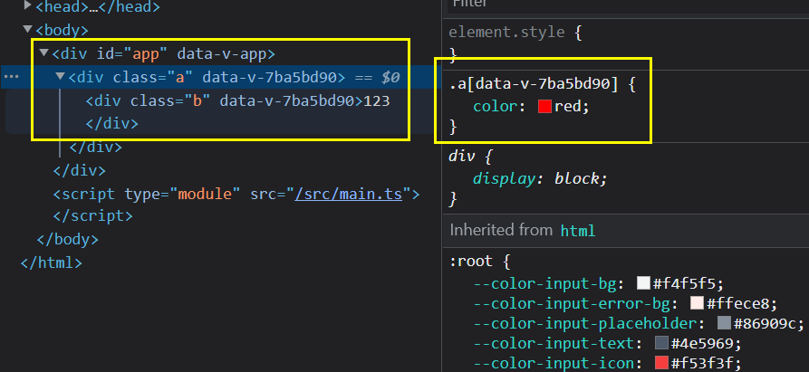

# 概览

## 什么是 less

Less （Leaner Style Sheets 的缩写） 是一门向后兼容的 CSS 扩展语言。这里呈现的是 Less 的官方文档（中文版），包含了 Less 语言以及利用 JavaScript 开发的用于将 Less 样式转换成 CSS 样式的 Less.js 工具。

因为 Less 和 CSS 非常像，因此很容易学习。而且 Less 仅对 CSS 语言增加了少许方便的扩展，这就是 Less 如此易学的原因之一。

官方文档  [Less 快速入门 | Less.js 中文文档 - Less 中文网](https://less.bootcss.com/#%E6%A6%82%E8%A7%88 "Less 快速入门 | Less.js 中文文档 - Less 中文网")

在 vite 中使用 less

`npm install less less-loader -D` 安装即可

在 style 标签注明即可

```html
<style lang="less">

</style>
```

## 什么是 scoped

实现组件的私有化, 当前 style 属性只属于当前模块.

在 DOM 结构中可以发现,vue 通过在 DOM 结构以及 css 样式上加了唯一标记,达到样式私有化,不污染全局的作用,
`[data-v-7ba5bd90]`



 **样式穿透问题学到第三方组件精讲 `::v-deep  >>> /deep/`**